# Cloud Platform & DevOps — 400 Interview Questions and Answers

Generated 2026-08-04. Original, humanized explanations grounded in official documentation.

## Table of contents

1. Linux
2. Networking
3. Docker
4. Kubernetes
5. AWS
6. Terraform
7. Python
8. Apache Airflow and DAGs
9. CI/CD and Git
10. Monitoring and Observability
11. DevSecOps and Security
12. Production Scenarios

---

# Module 1: Linux

This module contains **25 interview questions** written in simple, direct language. Distribution: 9 Beginner, 8 Intermediate, 8 Senior.

Use the **Straight answer** as your 30–60 second response. Add the explanation, production example, and command when the interviewer asks for depth.

## Beginner questions

### LIN001 — Explain Linux filesystem and inodes in simple terms. What problem does it solve?

- **Level:** Beginner
- **Type:** Concept
- **Topic:** Linux filesystem and inodes

**Straight answer**

Linux presents files, devices, and many kernel interfaces through one hierarchical filesystem. An inode stores file metadata and block references; a directory maps names to inode numbers.

**Easy explanation**

In simple terms, this matters because it gives engineers a clear model for the system. In practice: Use df for filesystem capacity, du for directory usage, ls -li for inode identity, and df -i for inode exhaustion. Mount points can hide data beneath them, so compare the device and path before deleting anything.

**Production example / senior context**

A useful production example is to connect the concept to one observable check or command: df -hT; df -i; du -xhd1 /var | sort -h

**Useful command or example**

```bash
df -hT; df -i; du -xhd1 /var | sort -h
```

**Common mistake**

Looking only at free bytes and missing inode exhaustion or deleted-but-open files.

**What makes this a strong interview answer**

Separate application data, logs, and temporary space where failure isolation matters. Monitor both bytes and inodes, define retention, and test how the service behaves when a filesystem becomes read-only or full.

**Likely follow-up:** How would you find disk space held by a deleted file?

**Official reference:** https://man7.org/linux/man-pages/

---

### LIN002 — Explain Users, groups, and permissions in simple terms. What problem does it solve?

- **Level:** Beginner
- **Type:** Concept
- **Topic:** Users, groups, and permissions

**Straight answer**

Linux access checks combine user identity, group membership, mode bits, ACLs, capabilities, and security modules. rwx means different things for files and directories.

**Easy explanation**

In simple terms, this matters because it gives engineers a clear model for the system. In practice: Use id, namei -l, getfacl, and stat to trace permission failures from the root directory to the target. Apply least privilege through groups and service accounts instead of broad chmod 777 changes.

**Production example / senior context**

A useful production example is to connect the concept to one observable check or command: id appuser; namei -l /srv/app/config.yml; getfacl /srv/app/config.yml

**Useful command or example**

```bash
id appuser; namei -l /srv/app/config.yml; getfacl /srv/app/config.yml
```

**Common mistake**

Using chmod 777 as a quick fix, which hides the real ownership or traversal problem.

**What makes this a strong interview answer**

Run services with dedicated non-login users, predictable umask values, read-only paths where possible, and audited sudo rules. Treat permission changes as code and test them during deployment.

**Likely follow-up:** What is the difference between file execute permission and directory execute permission?

**Official reference:** https://man7.org/linux/man-pages/

---

### LIN003 — Explain Processes, signals, and file descriptors in simple terms. What problem does it solve?

- **Level:** Beginner
- **Type:** Concept
- **Topic:** Processes, signals, and file descriptors

**Straight answer**

A process is a running program with its own PID, memory mappings, credentials, environment, and open file descriptors. Signals notify a process of events such as termination or reload.

**Easy explanation**

In simple terms, this matters because it gives engineers a clear model for the system. In practice: Inspect process trees with ps or pstree, open resources with lsof, and limits through /proc or ulimit. Send SIGTERM for graceful shutdown before SIGKILL, because SIGKILL cannot be handled for cleanup.

**Production example / senior context**

A useful production example is to connect the concept to one observable check or command: ps -eo pid,ppid,stat,%cpu,%mem,cmd --sort=-%cpu; lsof -p PID; kill -TERM PID

**Useful command or example**

```bash
ps -eo pid,ppid,stat,%cpu,%mem,cmd --sort=-%cpu; lsof -p PID; kill -TERM PID
```

**Common mistake**

Jumping directly to kill -9 and losing evidence or corrupting in-flight work.

**What makes this a strong interview answer**

Define graceful shutdown timeouts, bound file descriptors, collect core dumps safely, and make the application close sockets and flush work on SIGTERM. Monitor zombie growth and descriptor leaks.

**Likely follow-up:** Why can a process have many threads but only one PID shown by some tools?

**Official reference:** https://man7.org/linux/man-pages/

---

### LIN004 — Explain systemd services and journald in simple terms. What problem does it solve?

- **Level:** Beginner
- **Type:** Concept
- **Topic:** systemd services and journald

**Straight answer**

systemd manages units and their dependencies; service units describe how processes start, stop, restart, and run. journald stores structured logs with unit and boot metadata.

**Easy explanation**

In simple terms, this matters because it gives engineers a clear model for the system. In practice: Use systemctl status, show, list-dependencies, and journalctl -u to see both unit state and logs. After changing a unit file, run daemon-reload and verify the effective configuration with systemctl cat.

**Production example / senior context**

A useful production example is to connect the concept to one observable check or command: systemctl status api.service; journalctl -u api.service -b --since '15 min ago'; systemctl cat api.service

**Useful command or example**

```bash
systemctl status api.service; journalctl -u api.service -b --since '15 min ago'; systemctl cat api.service
```

**Common mistake**

Editing the wrong unit file or forgetting systemctl daemon-reload.

**What makes this a strong interview answer**

Use explicit users, working directories, restart policies, start limits, resource controls, and sandboxing directives. Avoid infinite crash loops and make health checks distinguish process-up from service-ready.

**Likely follow-up:** When would Restart=on-failure be safer than Restart=always?

**Official reference:** https://www.freedesktop.org/software/systemd/man/systemd.html

---

### LIN005 — Explain CPU, memory, and load troubleshooting in simple terms. What problem does it solve?

- **Level:** Beginner
- **Type:** Concept
- **Topic:** CPU, memory, and load troubleshooting

**Straight answer**

CPU usage measures work on processors, while load average counts runnable tasks and tasks stuck in uninterruptible sleep. High load can therefore come from CPU pressure or blocked I/O.

**Easy explanation**

In simple terms, this matters because it gives engineers a clear model for the system. In practice: Start with uptime, top, vmstat, pidstat, and pressure stall information. Correlate CPU run queue, context switches, swap activity, and I/O wait before blaming the application.

**Production example / senior context**

A useful production example is to connect the concept to one observable check or command: uptime; vmstat 1 10; pidstat -dur 1 10; cat /proc/pressure/{cpu,memory,io}

**Useful command or example**

```bash
uptime; vmstat 1 10; pidstat -dur 1 10; cat /proc/pressure/{cpu,memory,io}
```

**Common mistake**

Treating load average as CPU percentage or clearing cache without proving memory pressure.

**What makes this a strong interview answer**

Baseline normal patterns, set limits with headroom, watch saturation rather than only utilization, and preserve per-process evidence during incidents. Use profiling only after confirming the constrained resource.

**Likely follow-up:** How would you distinguish a CPU-bound process from one blocked on disk?

**Official reference:** https://man7.org/linux/man-pages/

---

### LIN006 — Explain Storage, mounts, LVM, and RAID in simple terms. What problem does it solve?

- **Level:** Beginner
- **Type:** Concept
- **Topic:** Storage, mounts, LVM, and RAID

**Straight answer**

Block devices are partitioned or combined, formatted with filesystems, and mounted into the namespace. LVM adds logical allocation and snapshots; RAID trades capacity, performance, and fault tolerance.

**Easy explanation**

In simple terms, this matters because it gives engineers a clear model for the system. In practice: Map the stack with lsblk, findmnt, blkid, pvs/vgs/lvs, and mdadm where applicable. Expand in the correct order: underlying volume, partition or logical volume, then filesystem.

**Production example / senior context**

A useful production example is to connect the concept to one observable check or command: lsblk -f; findmnt; pvs; vgs; lvs -a -o +devices

**Useful command or example**

```bash
lsblk -f; findmnt; pvs; vgs; lvs -a -o +devices
```

**Common mistake**

Growing a disk but not the filesystem, or treating an LVM snapshot as a durable backup.

**What makes this a strong interview answer**

Use redundant storage where the failure model requires it, but remember RAID is not backup. Test restore, monitor SMART and array health, and reserve snapshot capacity to avoid copy-on-write exhaustion.

**Likely follow-up:** What changes when expanding XFS compared with ext4?

**Official reference:** https://man7.org/linux/man-pages/

---

### LIN007 — Explain Linux network troubleshooting in simple terms. What problem does it solve?

- **Level:** Beginner
- **Type:** Concept
- **Topic:** Linux network troubleshooting

**Straight answer**

Linux networking combines interfaces, addresses, routes, neighbor discovery, sockets, firewall rules, and DNS configuration. A connection must pass through each layer in both directions.

**Easy explanation**

In simple terms, this matters because it gives engineers a clear model for the system. In practice: Check ip link/address/route, ss, resolvectl or dig, and nftables before packet capture. Use curl with verbose timing and tcpdump to locate where the handshake or response stops.

**Production example / senior context**

A useful production example is to connect the concept to one observable check or command: ip -br a; ip route; ss -lntup; dig +short example.com; tcpdump -nn -i any host 10.0.0.10

**Useful command or example**

```bash
ip -br a; ip route; ss -lntup; dig +short example.com; tcpdump -nn -i any host 10.0.0.10
```

**Common mistake**

Testing only ping; ICMP success or failure does not prove TCP, DNS, or application health.

**What makes this a strong interview answer**

Keep network configuration declarative, expose connection metrics, standardize packet-capture runbooks, and validate return routes. Preserve timestamps so network and application evidence can be correlated.

**Likely follow-up:** How do SYN-SENT and SYN-RECV states narrow a TCP investigation?

**Official reference:** https://man7.org/linux/man-pages/

---

### LIN008 — Explain Shell automation and scheduling in simple terms. What problem does it solve?

- **Level:** Beginner
- **Type:** Concept
- **Topic:** Shell automation and scheduling

**Straight answer**

Shell scripts combine commands and are ideal for small operational glue, but they inherit quoting, exit-status, environment, and concurrency risks. cron and systemd timers run jobs in minimal environments.

**Easy explanation**

In simple terms, this matters because it gives engineers a clear model for the system. In practice: Use set -euo pipefail carefully, quote expansions, validate inputs, log outcomes, and make repeated runs idempotent. Use shellcheck and explicit PATH values; prevent overlapping jobs with flock when needed.

**Production example / senior context**

A useful production example is to connect the concept to one observable check or command: bash -n script.sh; shellcheck script.sh; flock -n /run/report.lock ./report.sh

**Useful command or example**

```bash
bash -n script.sh; shellcheck script.sh; flock -n /run/report.lock ./report.sh
```

**Common mistake**

Assuming an interactive PATH, leaving variables unquoted, or ignoring a failed command in a pipeline.

**What makes this a strong interview answer**

Prefer version-controlled scripts, structured logs, timeouts, lock files, and clear ownership. Move complex data handling or concurrency to Python instead of growing an untestable shell script.

**Likely follow-up:** When can set -e produce surprising behavior?

**Official reference:** https://man7.org/linux/man-pages/

---

### LIN009 — Explain Namespaces, cgroups, and capabilities in simple terms. What problem does it solve?

- **Level:** Beginner
- **Type:** Concept
- **Topic:** Namespaces, cgroups, and capabilities

**Straight answer**

Namespaces isolate views of resources, cgroups account for and limit resources, and capabilities split root privilege into smaller units. Containers rely heavily on all three.

**Easy explanation**

In simple terms, this matters because it gives engineers a clear model for the system. In practice: Inspect namespaces with lsns and /proc/PID/ns, cgroup membership through /proc/PID/cgroup, and capabilities with capsh or getpcaps. Confirm both configured limits and actual host pressure.

**Production example / senior context**

A useful production example is to connect the concept to one observable check or command: lsns -p PID; cat /proc/PID/cgroup; getpcaps PID; systemd-cgls

**Useful command or example**

```bash
lsns -p PID; cat /proc/PID/cgroup; getpcaps PID; systemd-cgls
```

**Common mistake**

Assuming UID 0 inside a container is harmless or granting CAP_SYS_ADMIN to fix permissions.

**What makes this a strong interview answer**

Run workloads as non-root, drop unused capabilities, use cgroup v2 controls, and understand that isolation is not the same as a virtual-machine security boundary. Patch the host kernel and runtime.

**Likely follow-up:** How do namespaces and cgroups solve different problems?

**Official reference:** https://man7.org/linux/man-pages/man7/namespaces.7.html


## Intermediate questions

### LIN010 — How would you use or troubleshoot Linux filesystem and inodes in a real environment?

- **Level:** Intermediate
- **Type:** Concept
- **Topic:** Linux filesystem and inodes

**Straight answer**

I would first confirm the scope and collect evidence. Use df for filesystem capacity, du for directory usage, ls -li for inode identity, and df -i for inode exhaustion. Mount points can hide data beneath them, so compare the device and path before deleting anything.

**Easy explanation**

Linux presents files, devices, and many kernel interfaces through one hierarchical filesystem. An inode stores file metadata and block references; a directory maps names to inode numbers. The important interview point is to move layer by layer instead of making random changes.

**Production example / senior context**

Separate application data, logs, and temporary space where failure isolation matters. Monitor both bytes and inodes, define retention, and test how the service behaves when a filesystem becomes read-only or full.

**Useful command or example**

```bash
df -hT; df -i; du -xhd1 /var | sort -h
```

**Common mistake**

Looking only at free bytes and missing inode exhaustion or deleted-but-open files.

**What makes this a strong interview answer**

State the safety boundary, the evidence you would preserve, and how you would verify recovery.

**Likely follow-up:** How would you find disk space held by a deleted file?

**Official reference:** https://man7.org/linux/man-pages/

---

### LIN011 — How would you use or troubleshoot Users, groups, and permissions in a real environment?

- **Level:** Intermediate
- **Type:** Concept
- **Topic:** Users, groups, and permissions

**Straight answer**

I would first confirm the scope and collect evidence. Use id, namei -l, getfacl, and stat to trace permission failures from the root directory to the target. Apply least privilege through groups and service accounts instead of broad chmod 777 changes.

**Easy explanation**

Linux access checks combine user identity, group membership, mode bits, ACLs, capabilities, and security modules. rwx means different things for files and directories. The important interview point is to move layer by layer instead of making random changes.

**Production example / senior context**

Run services with dedicated non-login users, predictable umask values, read-only paths where possible, and audited sudo rules. Treat permission changes as code and test them during deployment.

**Useful command or example**

```bash
id appuser; namei -l /srv/app/config.yml; getfacl /srv/app/config.yml
```

**Common mistake**

Using chmod 777 as a quick fix, which hides the real ownership or traversal problem.

**What makes this a strong interview answer**

State the safety boundary, the evidence you would preserve, and how you would verify recovery.

**Likely follow-up:** What is the difference between file execute permission and directory execute permission?

**Official reference:** https://man7.org/linux/man-pages/

---

### LIN012 — How would you use or troubleshoot Processes, signals, and file descriptors in a real environment?

- **Level:** Intermediate
- **Type:** Concept
- **Topic:** Processes, signals, and file descriptors

**Straight answer**

I would first confirm the scope and collect evidence. Inspect process trees with ps or pstree, open resources with lsof, and limits through /proc or ulimit. Send SIGTERM for graceful shutdown before SIGKILL, because SIGKILL cannot be handled for cleanup.

**Easy explanation**

A process is a running program with its own PID, memory mappings, credentials, environment, and open file descriptors. Signals notify a process of events such as termination or reload. The important interview point is to move layer by layer instead of making random changes.

**Production example / senior context**

Define graceful shutdown timeouts, bound file descriptors, collect core dumps safely, and make the application close sockets and flush work on SIGTERM. Monitor zombie growth and descriptor leaks.

**Useful command or example**

```bash
ps -eo pid,ppid,stat,%cpu,%mem,cmd --sort=-%cpu; lsof -p PID; kill -TERM PID
```

**Common mistake**

Jumping directly to kill -9 and losing evidence or corrupting in-flight work.

**What makes this a strong interview answer**

State the safety boundary, the evidence you would preserve, and how you would verify recovery.

**Likely follow-up:** Why can a process have many threads but only one PID shown by some tools?

**Official reference:** https://man7.org/linux/man-pages/

---

### LIN013 — How would you use or troubleshoot systemd services and journald in a real environment?

- **Level:** Intermediate
- **Type:** Concept
- **Topic:** systemd services and journald

**Straight answer**

I would first confirm the scope and collect evidence. Use systemctl status, show, list-dependencies, and journalctl -u to see both unit state and logs. After changing a unit file, run daemon-reload and verify the effective configuration with systemctl cat.

**Easy explanation**

systemd manages units and their dependencies; service units describe how processes start, stop, restart, and run. journald stores structured logs with unit and boot metadata. The important interview point is to move layer by layer instead of making random changes.

**Production example / senior context**

Use explicit users, working directories, restart policies, start limits, resource controls, and sandboxing directives. Avoid infinite crash loops and make health checks distinguish process-up from service-ready.

**Useful command or example**

```bash
systemctl status api.service; journalctl -u api.service -b --since '15 min ago'; systemctl cat api.service
```

**Common mistake**

Editing the wrong unit file or forgetting systemctl daemon-reload.

**What makes this a strong interview answer**

State the safety boundary, the evidence you would preserve, and how you would verify recovery.

**Likely follow-up:** When would Restart=on-failure be safer than Restart=always?

**Official reference:** https://www.freedesktop.org/software/systemd/man/systemd.html

---

### LIN014 — How would you use or troubleshoot CPU, memory, and load troubleshooting in a real environment?

- **Level:** Intermediate
- **Type:** Concept
- **Topic:** CPU, memory, and load troubleshooting

**Straight answer**

I would first confirm the scope and collect evidence. Start with uptime, top, vmstat, pidstat, and pressure stall information. Correlate CPU run queue, context switches, swap activity, and I/O wait before blaming the application.

**Easy explanation**

CPU usage measures work on processors, while load average counts runnable tasks and tasks stuck in uninterruptible sleep. High load can therefore come from CPU pressure or blocked I/O. The important interview point is to move layer by layer instead of making random changes.

**Production example / senior context**

Baseline normal patterns, set limits with headroom, watch saturation rather than only utilization, and preserve per-process evidence during incidents. Use profiling only after confirming the constrained resource.

**Useful command or example**

```bash
uptime; vmstat 1 10; pidstat -dur 1 10; cat /proc/pressure/{cpu,memory,io}
```

**Common mistake**

Treating load average as CPU percentage or clearing cache without proving memory pressure.

**What makes this a strong interview answer**

State the safety boundary, the evidence you would preserve, and how you would verify recovery.

**Likely follow-up:** How would you distinguish a CPU-bound process from one blocked on disk?

**Official reference:** https://man7.org/linux/man-pages/

---

### LIN015 — How would you use or troubleshoot Storage, mounts, LVM, and RAID in a real environment?

- **Level:** Intermediate
- **Type:** Concept
- **Topic:** Storage, mounts, LVM, and RAID

**Straight answer**

I would first confirm the scope and collect evidence. Map the stack with lsblk, findmnt, blkid, pvs/vgs/lvs, and mdadm where applicable. Expand in the correct order: underlying volume, partition or logical volume, then filesystem.

**Easy explanation**

Block devices are partitioned or combined, formatted with filesystems, and mounted into the namespace. LVM adds logical allocation and snapshots; RAID trades capacity, performance, and fault tolerance. The important interview point is to move layer by layer instead of making random changes.

**Production example / senior context**

Use redundant storage where the failure model requires it, but remember RAID is not backup. Test restore, monitor SMART and array health, and reserve snapshot capacity to avoid copy-on-write exhaustion.

**Useful command or example**

```bash
lsblk -f; findmnt; pvs; vgs; lvs -a -o +devices
```

**Common mistake**

Growing a disk but not the filesystem, or treating an LVM snapshot as a durable backup.

**What makes this a strong interview answer**

State the safety boundary, the evidence you would preserve, and how you would verify recovery.

**Likely follow-up:** What changes when expanding XFS compared with ext4?

**Official reference:** https://man7.org/linux/man-pages/

---

### LIN016 — How would you use or troubleshoot Linux network troubleshooting in a real environment?

- **Level:** Intermediate
- **Type:** Concept
- **Topic:** Linux network troubleshooting

**Straight answer**

I would first confirm the scope and collect evidence. Check ip link/address/route, ss, resolvectl or dig, and nftables before packet capture. Use curl with verbose timing and tcpdump to locate where the handshake or response stops.

**Easy explanation**

Linux networking combines interfaces, addresses, routes, neighbor discovery, sockets, firewall rules, and DNS configuration. A connection must pass through each layer in both directions. The important interview point is to move layer by layer instead of making random changes.

**Production example / senior context**

Keep network configuration declarative, expose connection metrics, standardize packet-capture runbooks, and validate return routes. Preserve timestamps so network and application evidence can be correlated.

**Useful command or example**

```bash
ip -br a; ip route; ss -lntup; dig +short example.com; tcpdump -nn -i any host 10.0.0.10
```

**Common mistake**

Testing only ping; ICMP success or failure does not prove TCP, DNS, or application health.

**What makes this a strong interview answer**

State the safety boundary, the evidence you would preserve, and how you would verify recovery.

**Likely follow-up:** How do SYN-SENT and SYN-RECV states narrow a TCP investigation?

**Official reference:** https://man7.org/linux/man-pages/

---

### LIN017 — How would you use or troubleshoot Shell automation and scheduling in a real environment?

- **Level:** Intermediate
- **Type:** Concept
- **Topic:** Shell automation and scheduling

**Straight answer**

I would first confirm the scope and collect evidence. Use set -euo pipefail carefully, quote expansions, validate inputs, log outcomes, and make repeated runs idempotent. Use shellcheck and explicit PATH values; prevent overlapping jobs with flock when needed.

**Easy explanation**

Shell scripts combine commands and are ideal for small operational glue, but they inherit quoting, exit-status, environment, and concurrency risks. cron and systemd timers run jobs in minimal environments. The important interview point is to move layer by layer instead of making random changes.

**Production example / senior context**

Prefer version-controlled scripts, structured logs, timeouts, lock files, and clear ownership. Move complex data handling or concurrency to Python instead of growing an untestable shell script.

**Useful command or example**

```bash
bash -n script.sh; shellcheck script.sh; flock -n /run/report.lock ./report.sh
```

**Common mistake**

Assuming an interactive PATH, leaving variables unquoted, or ignoring a failed command in a pipeline.

**What makes this a strong interview answer**

State the safety boundary, the evidence you would preserve, and how you would verify recovery.

**Likely follow-up:** When can set -e produce surprising behavior?

**Official reference:** https://man7.org/linux/man-pages/


## Senior questions

### LIN018 — As a senior engineer, how would you design and operate Linux filesystem and inodes safely at production scale?

- **Level:** Senior
- **Type:** Concept
- **Topic:** Linux filesystem and inodes

**Straight answer**

My production approach would be: Separate application data, logs, and temporary space where failure isolation matters. Monitor both bytes and inodes, define retention, and test how the service behaves when a filesystem becomes read-only or full.

**Easy explanation**

Linux presents files, devices, and many kernel interfaces through one hierarchical filesystem. An inode stores file metadata and block references; a directory maps names to inode numbers. During design or an incident, I would validate the real system with this operating flow: Use df for filesystem capacity, du for directory usage, ls -li for inode identity, and df -i for inode exhaustion. Mount points can hide data beneath them, so compare the device and path before deleting anything.

**Production example / senior context**

I would define ownership, failure modes, monitoring, rollback or recovery, and measurable acceptance criteria before rollout.

**Useful command or example**

```bash
df -hT; df -i; du -xhd1 /var | sort -h
```

**Common mistake**

Looking only at free bytes and missing inode exhaustion or deleted-but-open files.

**What makes this a strong interview answer**

A senior answer should explain trade-offs, blast radius, security, capacity, observability, and recovery—not only commands.

**Likely follow-up:** How would you find disk space held by a deleted file?

**Official reference:** https://man7.org/linux/man-pages/

---

### LIN019 — As a senior engineer, how would you design and operate Users, groups, and permissions safely at production scale?

- **Level:** Senior
- **Type:** Concept
- **Topic:** Users, groups, and permissions

**Straight answer**

My production approach would be: Run services with dedicated non-login users, predictable umask values, read-only paths where possible, and audited sudo rules. Treat permission changes as code and test them during deployment.

**Easy explanation**

Linux access checks combine user identity, group membership, mode bits, ACLs, capabilities, and security modules. rwx means different things for files and directories. During design or an incident, I would validate the real system with this operating flow: Use id, namei -l, getfacl, and stat to trace permission failures from the root directory to the target. Apply least privilege through groups and service accounts instead of broad chmod 777 changes.

**Production example / senior context**

I would define ownership, failure modes, monitoring, rollback or recovery, and measurable acceptance criteria before rollout.

**Useful command or example**

```bash
id appuser; namei -l /srv/app/config.yml; getfacl /srv/app/config.yml
```

**Common mistake**

Using chmod 777 as a quick fix, which hides the real ownership or traversal problem.

**What makes this a strong interview answer**

A senior answer should explain trade-offs, blast radius, security, capacity, observability, and recovery—not only commands.

**Likely follow-up:** What is the difference between file execute permission and directory execute permission?

**Official reference:** https://man7.org/linux/man-pages/

---

### LIN020 — As a senior engineer, how would you design and operate Processes, signals, and file descriptors safely at production scale?

- **Level:** Senior
- **Type:** Concept
- **Topic:** Processes, signals, and file descriptors

**Straight answer**

My production approach would be: Define graceful shutdown timeouts, bound file descriptors, collect core dumps safely, and make the application close sockets and flush work on SIGTERM. Monitor zombie growth and descriptor leaks.

**Easy explanation**

A process is a running program with its own PID, memory mappings, credentials, environment, and open file descriptors. Signals notify a process of events such as termination or reload. During design or an incident, I would validate the real system with this operating flow: Inspect process trees with ps or pstree, open resources with lsof, and limits through /proc or ulimit. Send SIGTERM for graceful shutdown before SIGKILL, because SIGKILL cannot be handled for cleanup.

**Production example / senior context**

I would define ownership, failure modes, monitoring, rollback or recovery, and measurable acceptance criteria before rollout.

**Useful command or example**

```bash
ps -eo pid,ppid,stat,%cpu,%mem,cmd --sort=-%cpu; lsof -p PID; kill -TERM PID
```

**Common mistake**

Jumping directly to kill -9 and losing evidence or corrupting in-flight work.

**What makes this a strong interview answer**

A senior answer should explain trade-offs, blast radius, security, capacity, observability, and recovery—not only commands.

**Likely follow-up:** Why can a process have many threads but only one PID shown by some tools?

**Official reference:** https://man7.org/linux/man-pages/

---

### LIN021 — As a senior engineer, how would you design and operate systemd services and journald safely at production scale?

- **Level:** Senior
- **Type:** Concept
- **Topic:** systemd services and journald

**Straight answer**

My production approach would be: Use explicit users, working directories, restart policies, start limits, resource controls, and sandboxing directives. Avoid infinite crash loops and make health checks distinguish process-up from service-ready.

**Easy explanation**

systemd manages units and their dependencies; service units describe how processes start, stop, restart, and run. journald stores structured logs with unit and boot metadata. During design or an incident, I would validate the real system with this operating flow: Use systemctl status, show, list-dependencies, and journalctl -u to see both unit state and logs. After changing a unit file, run daemon-reload and verify the effective configuration with systemctl cat.

**Production example / senior context**

I would define ownership, failure modes, monitoring, rollback or recovery, and measurable acceptance criteria before rollout.

**Useful command or example**

```bash
systemctl status api.service; journalctl -u api.service -b --since '15 min ago'; systemctl cat api.service
```

**Common mistake**

Editing the wrong unit file or forgetting systemctl daemon-reload.

**What makes this a strong interview answer**

A senior answer should explain trade-offs, blast radius, security, capacity, observability, and recovery—not only commands.

**Likely follow-up:** When would Restart=on-failure be safer than Restart=always?

**Official reference:** https://www.freedesktop.org/software/systemd/man/systemd.html

---

### LIN022 — As a senior engineer, how would you design and operate CPU, memory, and load troubleshooting safely at production scale?

- **Level:** Senior
- **Type:** Concept
- **Topic:** CPU, memory, and load troubleshooting

**Straight answer**

My production approach would be: Baseline normal patterns, set limits with headroom, watch saturation rather than only utilization, and preserve per-process evidence during incidents. Use profiling only after confirming the constrained resource.

**Easy explanation**

CPU usage measures work on processors, while load average counts runnable tasks and tasks stuck in uninterruptible sleep. High load can therefore come from CPU pressure or blocked I/O. During design or an incident, I would validate the real system with this operating flow: Start with uptime, top, vmstat, pidstat, and pressure stall information. Correlate CPU run queue, context switches, swap activity, and I/O wait before blaming the application.

**Production example / senior context**

I would define ownership, failure modes, monitoring, rollback or recovery, and measurable acceptance criteria before rollout.

**Useful command or example**

```bash
uptime; vmstat 1 10; pidstat -dur 1 10; cat /proc/pressure/{cpu,memory,io}
```

**Common mistake**

Treating load average as CPU percentage or clearing cache without proving memory pressure.

**What makes this a strong interview answer**

A senior answer should explain trade-offs, blast radius, security, capacity, observability, and recovery—not only commands.

**Likely follow-up:** How would you distinguish a CPU-bound process from one blocked on disk?

**Official reference:** https://man7.org/linux/man-pages/

---

### LIN023 — As a senior engineer, how would you design and operate Storage, mounts, LVM, and RAID safely at production scale?

- **Level:** Senior
- **Type:** Concept
- **Topic:** Storage, mounts, LVM, and RAID

**Straight answer**

My production approach would be: Use redundant storage where the failure model requires it, but remember RAID is not backup. Test restore, monitor SMART and array health, and reserve snapshot capacity to avoid copy-on-write exhaustion.

**Easy explanation**

Block devices are partitioned or combined, formatted with filesystems, and mounted into the namespace. LVM adds logical allocation and snapshots; RAID trades capacity, performance, and fault tolerance. During design or an incident, I would validate the real system with this operating flow: Map the stack with lsblk, findmnt, blkid, pvs/vgs/lvs, and mdadm where applicable. Expand in the correct order: underlying volume, partition or logical volume, then filesystem.

**Production example / senior context**

I would define ownership, failure modes, monitoring, rollback or recovery, and measurable acceptance criteria before rollout.

**Useful command or example**

```bash
lsblk -f; findmnt; pvs; vgs; lvs -a -o +devices
```

**Common mistake**

Growing a disk but not the filesystem, or treating an LVM snapshot as a durable backup.

**What makes this a strong interview answer**

A senior answer should explain trade-offs, blast radius, security, capacity, observability, and recovery—not only commands.

**Likely follow-up:** What changes when expanding XFS compared with ext4?

**Official reference:** https://man7.org/linux/man-pages/

---

### LIN024 — As a senior engineer, how would you design and operate Linux network troubleshooting safely at production scale?

- **Level:** Senior
- **Type:** Concept
- **Topic:** Linux network troubleshooting

**Straight answer**

My production approach would be: Keep network configuration declarative, expose connection metrics, standardize packet-capture runbooks, and validate return routes. Preserve timestamps so network and application evidence can be correlated.

**Easy explanation**

Linux networking combines interfaces, addresses, routes, neighbor discovery, sockets, firewall rules, and DNS configuration. A connection must pass through each layer in both directions. During design or an incident, I would validate the real system with this operating flow: Check ip link/address/route, ss, resolvectl or dig, and nftables before packet capture. Use curl with verbose timing and tcpdump to locate where the handshake or response stops.

**Production example / senior context**

I would define ownership, failure modes, monitoring, rollback or recovery, and measurable acceptance criteria before rollout.

**Useful command or example**

```bash
ip -br a; ip route; ss -lntup; dig +short example.com; tcpdump -nn -i any host 10.0.0.10
```

**Common mistake**

Testing only ping; ICMP success or failure does not prove TCP, DNS, or application health.

**What makes this a strong interview answer**

A senior answer should explain trade-offs, blast radius, security, capacity, observability, and recovery—not only commands.

**Likely follow-up:** How do SYN-SENT and SYN-RECV states narrow a TCP investigation?

**Official reference:** https://man7.org/linux/man-pages/

---

### LIN025 — As a senior engineer, how would you design and operate Shell automation and scheduling safely at production scale?

- **Level:** Senior
- **Type:** Concept
- **Topic:** Shell automation and scheduling

**Straight answer**

My production approach would be: Prefer version-controlled scripts, structured logs, timeouts, lock files, and clear ownership. Move complex data handling or concurrency to Python instead of growing an untestable shell script.

**Easy explanation**

Shell scripts combine commands and are ideal for small operational glue, but they inherit quoting, exit-status, environment, and concurrency risks. cron and systemd timers run jobs in minimal environments. During design or an incident, I would validate the real system with this operating flow: Use set -euo pipefail carefully, quote expansions, validate inputs, log outcomes, and make repeated runs idempotent. Use shellcheck and explicit PATH values; prevent overlapping jobs with flock when needed.

**Production example / senior context**

I would define ownership, failure modes, monitoring, rollback or recovery, and measurable acceptance criteria before rollout.

**Useful command or example**

```bash
bash -n script.sh; shellcheck script.sh; flock -n /run/report.lock ./report.sh
```

**Common mistake**

Assuming an interactive PATH, leaving variables unquoted, or ignoring a failed command in a pipeline.

**What makes this a strong interview answer**

A senior answer should explain trade-offs, blast radius, security, capacity, observability, and recovery—not only commands.

**Likely follow-up:** When can set -e produce surprising behavior?

**Official reference:** https://man7.org/linux/man-pages/


---

# Module 2: Networking

This module contains **30 interview questions** written in simple, direct language. Distribution: 10 Beginner, 10 Intermediate, 10 Senior.

Use the **Straight answer** as your 30–60 second response. Add the explanation, production example, and command when the interviewer asks for depth.

## Beginner questions

### NET001 — Explain OSI and TCP/IP models in simple terms. What problem does it solve?

- **Level:** Beginner
- **Type:** Concept
- **Topic:** OSI and TCP/IP models

**Straight answer**

The models separate communication into layers so failures can be reasoned about: link, internet/network, transport, and application. Real protocols cross boundaries, but the model remains a useful troubleshooting map.

**Easy explanation**

In simple terms, this matters because it gives engineers a clear model for the system. In practice: Start at the layer closest to the symptom: link and address, route, transport handshake, TLS, then application response. Record source, destination, protocol, port, and expected path.

**Production example / senior context**

A useful production example is to connect the concept to one observable check or command: ip link; ip route get 10.0.2.10; ss -tn; curl -vk https://service

**Useful command or example**

```bash
ip link; ip route get 10.0.2.10; ss -tn; curl -vk https://service
```

**Common mistake**

Reciting seven layers without connecting them to a real failure.

**What makes this a strong interview answer**

Design observability at multiple layers and avoid ownership gaps between network and application teams. A senior answer explains the end-to-end packet and return path, not only one device.

**Likely follow-up:** At which layers do a load balancer and TLS terminator operate?

**Official reference:** https://www.rfc-editor.org/rfc/rfc9110.html

---

### NET002 — Explain IPv4 addressing, subnetting, and CIDR in simple terms. What problem does it solve?

- **Level:** Beginner
- **Type:** Concept
- **Topic:** IPv4 addressing, subnetting, and CIDR

**Straight answer**

CIDR represents a network prefix and host range, such as 10.0.4.0/24. Subnetting controls address allocation and routing boundaries; usable addresses may be reduced by platform reservations.

**Easy explanation**

In simple terms, this matters because it gives engineers a clear model for the system. In practice: Calculate network, broadcast, mask, and overlap before provisioning. Use ipcalc or a tested library rather than mental arithmetic for production changes.

**Production example / senior context**

A useful production example is to connect the concept to one observable check or command: ipcalc 10.20.4.0/22

**Useful command or example**

```bash
ipcalc 10.20.4.0/22
```

**Common mistake**

Choosing tiny subnets with no scaling room or overlapping VPC and on-premises ranges.

**What makes this a strong interview answer**

Plan non-overlapping address space for accounts, regions, clusters, VPNs, and acquisitions. Reserve growth and document IP address management because renumbering connected systems is costly.

**Likely follow-up:** How many addresses are in /24 and /27 networks, and why may usable counts differ?

**Official reference:** https://www.rfc-editor.org/rfc/rfc4632.html

---

### NET003 — Explain DNS resolution and caching in simple terms. What problem does it solve?

- **Level:** Beginner
- **Type:** Concept
- **Topic:** DNS resolution and caching

**Straight answer**

DNS maps names to records through recursive and authoritative resolution. TTL controls caching, while record types such as A, AAAA, CNAME, MX, TXT, and SRV serve different purposes.

**Easy explanation**

In simple terms, this matters because it gives engineers a clear model for the system. In practice: Use dig with specific resolvers and trace authoritative delegation. Compare NXDOMAIN, SERVFAIL, timeout, and stale-cache behavior; inspect search domains and ndots inside containers.

**Production example / senior context**

A useful production example is to connect the concept to one observable check or command: dig +trace api.example.com; dig @1.1.1.1 api.example.com A; resolvectl status

**Useful command or example**

```bash
dig +trace api.example.com; dig @1.1.1.1 api.example.com A; resolvectl status
```

**Common mistake**

Changing a record and expecting every client to see it immediately despite caches and TTLs.

**What makes this a strong interview answer**

Use health-aware routing cautiously, set TTLs based on change and query volume, protect authoritative zones, and monitor both resolver latency and failure rate. Test negative caching during migrations.

**Likely follow-up:** What happens when a CNAME exists at a zone apex?

**Official reference:** https://www.rfc-editor.org/rfc/rfc1035.html

---

### NET004 — Explain TCP and UDP in simple terms. What problem does it solve?

- **Level:** Beginner
- **Type:** Concept
- **Topic:** TCP and UDP

**Straight answer**

TCP provides a reliable ordered byte stream with connection state, flow control, and congestion control. UDP sends independent datagrams with lower protocol overhead but no delivery or ordering guarantee.

**Easy explanation**

In simple terms, this matters because it gives engineers a clear model for the system. In practice: For TCP, inspect the three-way handshake, retransmissions, windowing, and close states. For UDP, verify both application-level retries and firewall return traffic because there is no handshake.

**Production example / senior context**

A useful production example is to connect the concept to one observable check or command: ss -s; tcpdump -nn 'tcp port 443 or udp port 53'

**Useful command or example**

```bash
ss -s; tcpdump -nn 'tcp port 443 or udp port 53'
```

**Common mistake**

Calling TCP message-based or assuming UDP cannot be reliable when reliability is implemented by the application.

**What makes this a strong interview answer**

Choose based on application semantics, not a claim that UDP is always faster. Define timeouts, retry budgets, idempotency, and backpressure so failures do not become retry storms.

**Likely follow-up:** Why can TCP retransmissions increase latency even when no connection fails?

**Official reference:** https://www.rfc-editor.org/rfc/rfc9293.html

---

### NET005 — Explain HTTP, HTTPS, and TLS in simple terms. What problem does it solve?

- **Level:** Beginner
- **Type:** Concept
- **Topic:** HTTP, HTTPS, and TLS

**Straight answer**

HTTP defines request and response semantics; HTTPS is HTTP protected by TLS. TLS authenticates peers with certificates and negotiates encrypted, integrity-protected sessions.

**Easy explanation**

In simple terms, this matters because it gives engineers a clear model for the system. In practice: Use curl -v, openssl s_client, and server logs to separate DNS, TCP, TLS, HTTP status, and application latency. Verify the full certificate chain, hostname, validity, and client trust store.

**Production example / senior context**

A useful production example is to connect the concept to one observable check or command: curl -vkI https://api.example.com; openssl s_client -connect api.example.com:443 -servername api.example.com

**Useful command or example**

```bash
curl -vkI https://api.example.com; openssl s_client -connect api.example.com:443 -servername api.example.com
```

**Common mistake**

Checking only the leaf certificate date while missing hostname or intermediate-chain failures.

**What makes this a strong interview answer**

Automate certificate issuance and renewal, prefer modern protocol versions and ciphers, protect private keys, and monitor expiry. Decide clearly where TLS terminates and whether traffic is re-encrypted downstream.

**Likely follow-up:** What changes when TLS terminates at a load balancer instead of the application?

**Official reference:** https://www.rfc-editor.org/rfc/rfc8446.html

---

### NET006 — Explain Routing and NAT in simple terms. What problem does it solve?

- **Level:** Beginner
- **Type:** Concept
- **Topic:** Routing and NAT

**Straight answer**

Routing chooses the next hop using the most specific matching prefix. NAT rewrites addresses or ports, commonly allowing private hosts to reach public networks or publishing internal services.

**Easy explanation**

In simple terms, this matters because it gives engineers a clear model for the system. In practice: Trace the forward and return routes, source address, NAT translation, and stateful firewall entries. Asymmetric routing can break stateful devices even when one direction looks correct.

**Production example / senior context**

A useful production example is to connect the concept to one observable check or command: ip route get 8.8.8.8; traceroute -n 8.8.8.8; conntrack -L | head

**Useful command or example**

```bash
ip route get 8.8.8.8; traceroute -n 8.8.8.8; conntrack -L | head
```

**Common mistake**

Adding a route in one direction and forgetting the return path.

**What makes this a strong interview answer**

Prefer explicit route ownership and centralized IP management. Size NAT gateways for connection and throughput needs, distribute failure domains, and avoid using NAT as a substitute for access control.

**Likely follow-up:** How does longest-prefix match choose between /16, /24, and default routes?

**Official reference:** https://www.rfc-editor.org/rfc/rfc2663.html

---

### NET007 — Explain Firewalls, security groups, and ACLs in simple terms. What problem does it solve?

- **Level:** Beginner
- **Type:** Concept
- **Topic:** Firewalls, security groups, and ACLs

**Straight answer**

Packet filters allow or deny traffic by attributes such as address, protocol, port, interface, and connection state. Some controls are stateful; others require explicit return rules.

**Easy explanation**

In simple terms, this matters because it gives engineers a clear model for the system. In practice: Write a traffic matrix first, then inspect rules in evaluation order. Test from the real source and log denies selectively to avoid excessive noise.

**Production example / senior context**

A useful production example is to connect the concept to one observable check or command: nft list ruleset; iptables-save; nc -vz service.example.com 443

**Useful command or example**

```bash
nft list ruleset; iptables-save; nc -vz service.example.com 443
```

**Common mistake**

Opening 0.0.0.0/0 or broad port ranges to make a test pass and never tightening them.

**What makes this a strong interview answer**

Default-deny sensitive zones, keep rules narrow and attributable, expire temporary access, and review shadowed or unused rules. Use layered controls but know which one produced a deny.

**Likely follow-up:** What is the operational difference between stateful and stateless filtering?

**Official reference:** https://www.rfc-editor.org/rfc/rfc9293.html

---

### NET008 — Explain Load balancers and reverse proxies in simple terms. What problem does it solve?

- **Level:** Beginner
- **Type:** Concept
- **Topic:** Load balancers and reverse proxies

**Straight answer**

A load balancer distributes traffic across backends; a reverse proxy represents servers to clients and may terminate TLS, route by content, cache, or enforce policy. Layer 4 and Layer 7 products make different decisions.

**Easy explanation**

In simple terms, this matters because it gives engineers a clear model for the system. In practice: Check listener, target registration, health checks, routing rules, timeout alignment, and backend logs. A healthy process can still fail a health check because of path, host header, security rule, or dependency issues.

**Production example / senior context**

A useful production example is to connect the concept to one observable check or command: curl -H 'Host: api.example.com' http://LB_IP/health; openssl s_client -connect LB:443 -servername api.example.com

**Useful command or example**

```bash
curl -H 'Host: api.example.com' http://LB_IP/health; openssl s_client -connect LB:443 -servername api.example.com
```

**Common mistake**

Making health checks depend on every downstream service, causing a broad outage during one dependency failure.

**What makes this a strong interview answer**

Use multi-zone targets, connection draining, health endpoints with clear semantics, and consistent timeout budgets. Preserve client identity through standard headers only across trusted hops.

**Likely follow-up:** When would an L4 load balancer be preferable to an L7 load balancer?

**Official reference:** https://www.rfc-editor.org/rfc/rfc9110.html

---

### NET009 — Explain MTU, fragmentation, and path MTU in simple terms. What problem does it solve?

- **Level:** Beginner
- **Type:** Concept
- **Topic:** MTU, fragmentation, and path MTU

**Straight answer**

MTU is the largest frame or packet payload a link can carry without fragmentation. Tunnels add headers, so an apparently valid packet can exceed the path MTU and fail or fragment.

**Easy explanation**

In simple terms, this matters because it gives engineers a clear model for the system. In practice: Use ping with do-not-fragment and varying sizes, tracepath, and packet capture. Suspect MTU when small requests work but larger TLS handshakes or data transfers stall.

**Production example / senior context**

A useful production example is to connect the concept to one observable check or command: tracepath service.example.com; ping -M do -s 1472 10.0.0.10

**Useful command or example**

```bash
tracepath service.example.com; ping -M do -s 1472 10.0.0.10
```

**Common mistake**

Blocking all ICMP and creating a path-MTU black hole.

**What makes this a strong interview answer**

Standardize MTU across overlay networks where possible, allow required ICMP messages for path MTU discovery, and account for VPN, VXLAN, or IPsec overhead.

**Likely follow-up:** Why might SSH connect successfully while a large HTTPS response stalls?

**Official reference:** https://www.rfc-editor.org/rfc/rfc9293.html

---

### NET010 — Explain End-to-end packet troubleshooting in simple terms. What problem does it solve?

- **Level:** Beginner
- **Type:** Concept
- **Topic:** End-to-end packet troubleshooting

**Straight answer**

Reliable troubleshooting follows the packet from client process to server process and back, validating name resolution, local socket, route, network controls, transport handshake, TLS, and application response.

**Easy explanation**

In simple terms, this matters because it gives engineers a clear model for the system. In practice: Capture timestamps and evidence at the client, load balancer, node, and server. Compare SYN/SYN-ACK, retransmissions, resets, and response codes instead of randomly changing firewalls.

**Production example / senior context**

A useful production example is to connect the concept to one observable check or command: dig api.example.com; ip route get IP; nc -vz IP 443; curl -sS -w '%{time_connect} %{time_appconnect} %{time_starttransfer}
' -o /dev/null https://api.example.com

**Useful command or example**

```bash
dig api.example.com; ip route get IP; nc -vz IP 443; curl -sS -w '%{time_connect} %{time_appconnect} %{time_starttransfer}
' -o /dev/null https://api.example.com
```

**Common mistake**

Assuming the first visible timeout proves which component is at fault.

**What makes this a strong interview answer**

Create a repeatable runbook with known-good tests and ownership boundaries. During incidents, make one controlled change at a time and retain before/after evidence for the RCA.

**Likely follow-up:** How would you troubleshoot connectivity that fails only from one subnet?

**Official reference:** https://www.rfc-editor.org/rfc/rfc9293.html


## Intermediate questions

### NET011 — How would you use or troubleshoot OSI and TCP/IP models in a real environment?

- **Level:** Intermediate
- **Type:** Concept
- **Topic:** OSI and TCP/IP models

**Straight answer**

I would first confirm the scope and collect evidence. Start at the layer closest to the symptom: link and address, route, transport handshake, TLS, then application response. Record source, destination, protocol, port, and expected path.

**Easy explanation**

The models separate communication into layers so failures can be reasoned about: link, internet/network, transport, and application. Real protocols cross boundaries, but the model remains a useful troubleshooting map. The important interview point is to move layer by layer instead of making random changes.

**Production example / senior context**

Design observability at multiple layers and avoid ownership gaps between network and application teams. A senior answer explains the end-to-end packet and return path, not only one device.

**Useful command or example**

```bash
ip link; ip route get 10.0.2.10; ss -tn; curl -vk https://service
```

**Common mistake**

Reciting seven layers without connecting them to a real failure.

**What makes this a strong interview answer**

State the safety boundary, the evidence you would preserve, and how you would verify recovery.

**Likely follow-up:** At which layers do a load balancer and TLS terminator operate?

**Official reference:** https://www.rfc-editor.org/rfc/rfc9110.html

---

### NET012 — How would you use or troubleshoot IPv4 addressing, subnetting, and CIDR in a real environment?

- **Level:** Intermediate
- **Type:** Concept
- **Topic:** IPv4 addressing, subnetting, and CIDR

**Straight answer**

I would first confirm the scope and collect evidence. Calculate network, broadcast, mask, and overlap before provisioning. Use ipcalc or a tested library rather than mental arithmetic for production changes.

**Easy explanation**

CIDR represents a network prefix and host range, such as 10.0.4.0/24. Subnetting controls address allocation and routing boundaries; usable addresses may be reduced by platform reservations. The important interview point is to move layer by layer instead of making random changes.

**Production example / senior context**

Plan non-overlapping address space for accounts, regions, clusters, VPNs, and acquisitions. Reserve growth and document IP address management because renumbering connected systems is costly.

**Useful command or example**

```bash
ipcalc 10.20.4.0/22
```

**Common mistake**

Choosing tiny subnets with no scaling room or overlapping VPC and on-premises ranges.

**What makes this a strong interview answer**

State the safety boundary, the evidence you would preserve, and how you would verify recovery.

**Likely follow-up:** How many addresses are in /24 and /27 networks, and why may usable counts differ?

**Official reference:** https://www.rfc-editor.org/rfc/rfc4632.html

---

### NET013 — How would you use or troubleshoot DNS resolution and caching in a real environment?

- **Level:** Intermediate
- **Type:** Concept
- **Topic:** DNS resolution and caching

**Straight answer**

I would first confirm the scope and collect evidence. Use dig with specific resolvers and trace authoritative delegation. Compare NXDOMAIN, SERVFAIL, timeout, and stale-cache behavior; inspect search domains and ndots inside containers.

**Easy explanation**

DNS maps names to records through recursive and authoritative resolution. TTL controls caching, while record types such as A, AAAA, CNAME, MX, TXT, and SRV serve different purposes. The important interview point is to move layer by layer instead of making random changes.

**Production example / senior context**

Use health-aware routing cautiously, set TTLs based on change and query volume, protect authoritative zones, and monitor both resolver latency and failure rate. Test negative caching during migrations.

**Useful command or example**

```bash
dig +trace api.example.com; dig @1.1.1.1 api.example.com A; resolvectl status
```

**Common mistake**

Changing a record and expecting every client to see it immediately despite caches and TTLs.

**What makes this a strong interview answer**

State the safety boundary, the evidence you would preserve, and how you would verify recovery.

**Likely follow-up:** What happens when a CNAME exists at a zone apex?

**Official reference:** https://www.rfc-editor.org/rfc/rfc1035.html

---

### NET014 — How would you use or troubleshoot TCP and UDP in a real environment?

- **Level:** Intermediate
- **Type:** Concept
- **Topic:** TCP and UDP

**Straight answer**

I would first confirm the scope and collect evidence. For TCP, inspect the three-way handshake, retransmissions, windowing, and close states. For UDP, verify both application-level retries and firewall return traffic because there is no handshake.

**Easy explanation**

TCP provides a reliable ordered byte stream with connection state, flow control, and congestion control. UDP sends independent datagrams with lower protocol overhead but no delivery or ordering guarantee. The important interview point is to move layer by layer instead of making random changes.

**Production example / senior context**

Choose based on application semantics, not a claim that UDP is always faster. Define timeouts, retry budgets, idempotency, and backpressure so failures do not become retry storms.

**Useful command or example**

```bash
ss -s; tcpdump -nn 'tcp port 443 or udp port 53'
```

**Common mistake**

Calling TCP message-based or assuming UDP cannot be reliable when reliability is implemented by the application.

**What makes this a strong interview answer**

State the safety boundary, the evidence you would preserve, and how you would verify recovery.

**Likely follow-up:** Why can TCP retransmissions increase latency even when no connection fails?

**Official reference:** https://www.rfc-editor.org/rfc/rfc9293.html

---

### NET015 — How would you use or troubleshoot HTTP, HTTPS, and TLS in a real environment?

- **Level:** Intermediate
- **Type:** Concept
- **Topic:** HTTP, HTTPS, and TLS

**Straight answer**

I would first confirm the scope and collect evidence. Use curl -v, openssl s_client, and server logs to separate DNS, TCP, TLS, HTTP status, and application latency. Verify the full certificate chain, hostname, validity, and client trust store.

**Easy explanation**

HTTP defines request and response semantics; HTTPS is HTTP protected by TLS. TLS authenticates peers with certificates and negotiates encrypted, integrity-protected sessions. The important interview point is to move layer by layer instead of making random changes.

**Production example / senior context**

Automate certificate issuance and renewal, prefer modern protocol versions and ciphers, protect private keys, and monitor expiry. Decide clearly where TLS terminates and whether traffic is re-encrypted downstream.

**Useful command or example**

```bash
curl -vkI https://api.example.com; openssl s_client -connect api.example.com:443 -servername api.example.com
```

**Common mistake**

Checking only the leaf certificate date while missing hostname or intermediate-chain failures.

**What makes this a strong interview answer**

State the safety boundary, the evidence you would preserve, and how you would verify recovery.

**Likely follow-up:** What changes when TLS terminates at a load balancer instead of the application?

**Official reference:** https://www.rfc-editor.org/rfc/rfc8446.html

---

### NET016 — How would you use or troubleshoot Routing and NAT in a real environment?

- **Level:** Intermediate
- **Type:** Concept
- **Topic:** Routing and NAT

**Straight answer**

I would first confirm the scope and collect evidence. Trace the forward and return routes, source address, NAT translation, and stateful firewall entries. Asymmetric routing can break stateful devices even when one direction looks correct.

**Easy explanation**

Routing chooses the next hop using the most specific matching prefix. NAT rewrites addresses or ports, commonly allowing private hosts to reach public networks or publishing internal services. The important interview point is to move layer by layer instead of making random changes.

**Production example / senior context**

Prefer explicit route ownership and centralized IP management. Size NAT gateways for connection and throughput needs, distribute failure domains, and avoid using NAT as a substitute for access control.

**Useful command or example**

```bash
ip route get 8.8.8.8; traceroute -n 8.8.8.8; conntrack -L | head
```

**Common mistake**

Adding a route in one direction and forgetting the return path.

**What makes this a strong interview answer**

State the safety boundary, the evidence you would preserve, and how you would verify recovery.

**Likely follow-up:** How does longest-prefix match choose between /16, /24, and default routes?

**Official reference:** https://www.rfc-editor.org/rfc/rfc2663.html

---

### NET017 — How would you use or troubleshoot Firewalls, security groups, and ACLs in a real environment?

- **Level:** Intermediate
- **Type:** Concept
- **Topic:** Firewalls, security groups, and ACLs

**Straight answer**

I would first confirm the scope and collect evidence. Write a traffic matrix first, then inspect rules in evaluation order. Test from the real source and log denies selectively to avoid excessive noise.

**Easy explanation**

Packet filters allow or deny traffic by attributes such as address, protocol, port, interface, and connection state. Some controls are stateful; others require explicit return rules. The important interview point is to move layer by layer instead of making random changes.

**Production example / senior context**

Default-deny sensitive zones, keep rules narrow and attributable, expire temporary access, and review shadowed or unused rules. Use layered controls but know which one produced a deny.

**Useful command or example**

```bash
nft list ruleset; iptables-save; nc -vz service.example.com 443
```

**Common mistake**

Opening 0.0.0.0/0 or broad port ranges to make a test pass and never tightening them.

**What makes this a strong interview answer**

State the safety boundary, the evidence you would preserve, and how you would verify recovery.

**Likely follow-up:** What is the operational difference between stateful and stateless filtering?

**Official reference:** https://www.rfc-editor.org/rfc/rfc9293.html

---

### NET018 — How would you use or troubleshoot Load balancers and reverse proxies in a real environment?

- **Level:** Intermediate
- **Type:** Concept
- **Topic:** Load balancers and reverse proxies

**Straight answer**

I would first confirm the scope and collect evidence. Check listener, target registration, health checks, routing rules, timeout alignment, and backend logs. A healthy process can still fail a health check because of path, host header, security rule, or dependency issues.

**Easy explanation**

A load balancer distributes traffic across backends; a reverse proxy represents servers to clients and may terminate TLS, route by content, cache, or enforce policy. Layer 4 and Layer 7 products make different decisions. The important interview point is to move layer by layer instead of making random changes.

**Production example / senior context**

Use multi-zone targets, connection draining, health endpoints with clear semantics, and consistent timeout budgets. Preserve client identity through standard headers only across trusted hops.

**Useful command or example**

```bash
curl -H 'Host: api.example.com' http://LB_IP/health; openssl s_client -connect LB:443 -servername api.example.com
```

**Common mistake**

Making health checks depend on every downstream service, causing a broad outage during one dependency failure.

**What makes this a strong interview answer**

State the safety boundary, the evidence you would preserve, and how you would verify recovery.

**Likely follow-up:** When would an L4 load balancer be preferable to an L7 load balancer?

**Official reference:** https://www.rfc-editor.org/rfc/rfc9110.html

---

### NET019 — How would you use or troubleshoot MTU, fragmentation, and path MTU in a real environment?

- **Level:** Intermediate
- **Type:** Concept
- **Topic:** MTU, fragmentation, and path MTU

**Straight answer**

I would first confirm the scope and collect evidence. Use ping with do-not-fragment and varying sizes, tracepath, and packet capture. Suspect MTU when small requests work but larger TLS handshakes or data transfers stall.

**Easy explanation**

MTU is the largest frame or packet payload a link can carry without fragmentation. Tunnels add headers, so an apparently valid packet can exceed the path MTU and fail or fragment. The important interview point is to move layer by layer instead of making random changes.

**Production example / senior context**

Standardize MTU across overlay networks where possible, allow required ICMP messages for path MTU discovery, and account for VPN, VXLAN, or IPsec overhead.

**Useful command or example**

```bash
tracepath service.example.com; ping -M do -s 1472 10.0.0.10
```

**Common mistake**

Blocking all ICMP and creating a path-MTU black hole.

**What makes this a strong interview answer**

State the safety boundary, the evidence you would preserve, and how you would verify recovery.

**Likely follow-up:** Why might SSH connect successfully while a large HTTPS response stalls?

**Official reference:** https://www.rfc-editor.org/rfc/rfc9293.html

---

### NET020 — How would you use or troubleshoot End-to-end packet troubleshooting in a real environment?

- **Level:** Intermediate
- **Type:** Concept
- **Topic:** End-to-end packet troubleshooting

**Straight answer**

I would first confirm the scope and collect evidence. Capture timestamps and evidence at the client, load balancer, node, and server. Compare SYN/SYN-ACK, retransmissions, resets, and response codes instead of randomly changing firewalls.

**Easy explanation**

Reliable troubleshooting follows the packet from client process to server process and back, validating name resolution, local socket, route, network controls, transport handshake, TLS, and application response. The important interview point is to move layer by layer instead of making random changes.

**Production example / senior context**

Create a repeatable runbook with known-good tests and ownership boundaries. During incidents, make one controlled change at a time and retain before/after evidence for the RCA.

**Useful command or example**

```bash
dig api.example.com; ip route get IP; nc -vz IP 443; curl -sS -w '%{time_connect} %{time_appconnect} %{time_starttransfer}
' -o /dev/null https://api.example.com
```

**Common mistake**

Assuming the first visible timeout proves which component is at fault.

**What makes this a strong interview answer**

State the safety boundary, the evidence you would preserve, and how you would verify recovery.

**Likely follow-up:** How would you troubleshoot connectivity that fails only from one subnet?

**Official reference:** https://www.rfc-editor.org/rfc/rfc9293.html


## Senior questions

### NET021 — As a senior engineer, how would you design and operate OSI and TCP/IP models safely at production scale?

- **Level:** Senior
- **Type:** Concept
- **Topic:** OSI and TCP/IP models

**Straight answer**

My production approach would be: Design observability at multiple layers and avoid ownership gaps between network and application teams. A senior answer explains the end-to-end packet and return path, not only one device.

**Easy explanation**

The models separate communication into layers so failures can be reasoned about: link, internet/network, transport, and application. Real protocols cross boundaries, but the model remains a useful troubleshooting map. During design or an incident, I would validate the real system with this operating flow: Start at the layer closest to the symptom: link and address, route, transport handshake, TLS, then application response. Record source, destination, protocol, port, and expected path.

**Production example / senior context**

I would define ownership, failure modes, monitoring, rollback or recovery, and measurable acceptance criteria before rollout.

**Useful command or example**

```bash
ip link; ip route get 10.0.2.10; ss -tn; curl -vk https://service
```

**Common mistake**

Reciting seven layers without connecting them to a real failure.

**What makes this a strong interview answer**

A senior answer should explain trade-offs, blast radius, security, capacity, observability, and recovery—not only commands.

**Likely follow-up:** At which layers do a load balancer and TLS terminator operate?

**Official reference:** https://www.rfc-editor.org/rfc/rfc9110.html

---

### NET022 — As a senior engineer, how would you design and operate IPv4 addressing, subnetting, and CIDR safely at production scale?

- **Level:** Senior
- **Type:** Concept
- **Topic:** IPv4 addressing, subnetting, and CIDR

**Straight answer**

My production approach would be: Plan non-overlapping address space for accounts, regions, clusters, VPNs, and acquisitions. Reserve growth and document IP address management because renumbering connected systems is costly.

**Easy explanation**

CIDR represents a network prefix and host range, such as 10.0.4.0/24. Subnetting controls address allocation and routing boundaries; usable addresses may be reduced by platform reservations. During design or an incident, I would validate the real system with this operating flow: Calculate network, broadcast, mask, and overlap before provisioning. Use ipcalc or a tested library rather than mental arithmetic for production changes.

**Production example / senior context**

I would define ownership, failure modes, monitoring, rollback or recovery, and measurable acceptance criteria before rollout.

**Useful command or example**

```bash
ipcalc 10.20.4.0/22
```

**Common mistake**

Choosing tiny subnets with no scaling room or overlapping VPC and on-premises ranges.

**What makes this a strong interview answer**

A senior answer should explain trade-offs, blast radius, security, capacity, observability, and recovery—not only commands.

**Likely follow-up:** How many addresses are in /24 and /27 networks, and why may usable counts differ?

**Official reference:** https://www.rfc-editor.org/rfc/rfc4632.html

---

### NET023 — As a senior engineer, how would you design and operate DNS resolution and caching safely at production scale?

- **Level:** Senior
- **Type:** Concept
- **Topic:** DNS resolution and caching

**Straight answer**

My production approach would be: Use health-aware routing cautiously, set TTLs based on change and query volume, protect authoritative zones, and monitor both resolver latency and failure rate. Test negative caching during migrations.

**Easy explanation**

DNS maps names to records through recursive and authoritative resolution. TTL controls caching, while record types such as A, AAAA, CNAME, MX, TXT, and SRV serve different purposes. During design or an incident, I would validate the real system with this operating flow: Use dig with specific resolvers and trace authoritative delegation. Compare NXDOMAIN, SERVFAIL, timeout, and stale-cache behavior; inspect search domains and ndots inside containers.

**Production example / senior context**

I would define ownership, failure modes, monitoring, rollback or recovery, and measurable acceptance criteria before rollout.

**Useful command or example**

```bash
dig +trace api.example.com; dig @1.1.1.1 api.example.com A; resolvectl status
```

**Common mistake**

Changing a record and expecting every client to see it immediately despite caches and TTLs.

**What makes this a strong interview answer**

A senior answer should explain trade-offs, blast radius, security, capacity, observability, and recovery—not only commands.

**Likely follow-up:** What happens when a CNAME exists at a zone apex?

**Official reference:** https://www.rfc-editor.org/rfc/rfc1035.html

---

### NET024 — As a senior engineer, how would you design and operate TCP and UDP safely at production scale?

- **Level:** Senior
- **Type:** Concept
- **Topic:** TCP and UDP

**Straight answer**

My production approach would be: Choose based on application semantics, not a claim that UDP is always faster. Define timeouts, retry budgets, idempotency, and backpressure so failures do not become retry storms.

**Easy explanation**

TCP provides a reliable ordered byte stream with connection state, flow control, and congestion control. UDP sends independent datagrams with lower protocol overhead but no delivery or ordering guarantee. During design or an incident, I would validate the real system with this operating flow: For TCP, inspect the three-way handshake, retransmissions, windowing, and close states. For UDP, verify both application-level retries and firewall return traffic because there is no handshake.

**Production example / senior context**

I would define ownership, failure modes, monitoring, rollback or recovery, and measurable acceptance criteria before rollout.

**Useful command or example**

```bash
ss -s; tcpdump -nn 'tcp port 443 or udp port 53'
```

**Common mistake**

Calling TCP message-based or assuming UDP cannot be reliable when reliability is implemented by the application.

**What makes this a strong interview answer**

A senior answer should explain trade-offs, blast radius, security, capacity, observability, and recovery—not only commands.

**Likely follow-up:** Why can TCP retransmissions increase latency even when no connection fails?

**Official reference:** https://www.rfc-editor.org/rfc/rfc9293.html

---

### NET025 — As a senior engineer, how would you design and operate HTTP, HTTPS, and TLS safely at production scale?

- **Level:** Senior
- **Type:** Concept
- **Topic:** HTTP, HTTPS, and TLS

**Straight answer**

My production approach would be: Automate certificate issuance and renewal, prefer modern protocol versions and ciphers, protect private keys, and monitor expiry. Decide clearly where TLS terminates and whether traffic is re-encrypted downstream.

**Easy explanation**

HTTP defines request and response semantics; HTTPS is HTTP protected by TLS. TLS authenticates peers with certificates and negotiates encrypted, integrity-protected sessions. During design or an incident, I would validate the real system with this operating flow: Use curl -v, openssl s_client, and server logs to separate DNS, TCP, TLS, HTTP status, and application latency. Verify the full certificate chain, hostname, validity, and client trust store.

**Production example / senior context**

I would define ownership, failure modes, monitoring, rollback or recovery, and measurable acceptance criteria before rollout.

**Useful command or example**

```bash
curl -vkI https://api.example.com; openssl s_client -connect api.example.com:443 -servername api.example.com
```

**Common mistake**

Checking only the leaf certificate date while missing hostname or intermediate-chain failures.

**What makes this a strong interview answer**

A senior answer should explain trade-offs, blast radius, security, capacity, observability, and recovery—not only commands.

**Likely follow-up:** What changes when TLS terminates at a load balancer instead of the application?

**Official reference:** https://www.rfc-editor.org/rfc/rfc8446.html

---

### NET026 — As a senior engineer, how would you design and operate Routing and NAT safely at production scale?

- **Level:** Senior
- **Type:** Concept
- **Topic:** Routing and NAT

**Straight answer**

My production approach would be: Prefer explicit route ownership and centralized IP management. Size NAT gateways for connection and throughput needs, distribute failure domains, and avoid using NAT as a substitute for access control.

**Easy explanation**

Routing chooses the next hop using the most specific matching prefix. NAT rewrites addresses or ports, commonly allowing private hosts to reach public networks or publishing internal services. During design or an incident, I would validate the real system with this operating flow: Trace the forward and return routes, source address, NAT translation, and stateful firewall entries. Asymmetric routing can break stateful devices even when one direction looks correct.

**Production example / senior context**

I would define ownership, failure modes, monitoring, rollback or recovery, and measurable acceptance criteria before rollout.

**Useful command or example**

```bash
ip route get 8.8.8.8; traceroute -n 8.8.8.8; conntrack -L | head
```

**Common mistake**

Adding a route in one direction and forgetting the return path.

**What makes this a strong interview answer**

A senior answer should explain trade-offs, blast radius, security, capacity, observability, and recovery—not only commands.

**Likely follow-up:** How does longest-prefix match choose between /16, /24, and default routes?

**Official reference:** https://www.rfc-editor.org/rfc/rfc2663.html

---

### NET027 — As a senior engineer, how would you design and operate Firewalls, security groups, and ACLs safely at production scale?

- **Level:** Senior
- **Type:** Concept
- **Topic:** Firewalls, security groups, and ACLs

**Straight answer**

My production approach would be: Default-deny sensitive zones, keep rules narrow and attributable, expire temporary access, and review shadowed or unused rules. Use layered controls but know which one produced a deny.

**Easy explanation**

Packet filters allow or deny traffic by attributes such as address, protocol, port, interface, and connection state. Some controls are stateful; others require explicit return rules. During design or an incident, I would validate the real system with this operating flow: Write a traffic matrix first, then inspect rules in evaluation order. Test from the real source and log denies selectively to avoid excessive noise.

**Production example / senior context**

I would define ownership, failure modes, monitoring, rollback or recovery, and measurable acceptance criteria before rollout.

**Useful command or example**

```bash
nft list ruleset; iptables-save; nc -vz service.example.com 443
```

**Common mistake**

Opening 0.0.0.0/0 or broad port ranges to make a test pass and never tightening them.

**What makes this a strong interview answer**

A senior answer should explain trade-offs, blast radius, security, capacity, observability, and recovery—not only commands.

**Likely follow-up:** What is the operational difference between stateful and stateless filtering?

**Official reference:** https://www.rfc-editor.org/rfc/rfc9293.html

---

### NET028 — As a senior engineer, how would you design and operate Load balancers and reverse proxies safely at production scale?

- **Level:** Senior
- **Type:** Concept
- **Topic:** Load balancers and reverse proxies

**Straight answer**

My production approach would be: Use multi-zone targets, connection draining, health endpoints with clear semantics, and consistent timeout budgets. Preserve client identity through standard headers only across trusted hops.

**Easy explanation**

A load balancer distributes traffic across backends; a reverse proxy represents servers to clients and may terminate TLS, route by content, cache, or enforce policy. Layer 4 and Layer 7 products make different decisions. During design or an incident, I would validate the real system with this operating flow: Check listener, target registration, health checks, routing rules, timeout alignment, and backend logs. A healthy process can still fail a health check because of path, host header, security rule, or dependency issues.

**Production example / senior context**

I would define ownership, failure modes, monitoring, rollback or recovery, and measurable acceptance criteria before rollout.

**Useful command or example**

```bash
curl -H 'Host: api.example.com' http://LB_IP/health; openssl s_client -connect LB:443 -servername api.example.com
```

**Common mistake**

Making health checks depend on every downstream service, causing a broad outage during one dependency failure.

**What makes this a strong interview answer**

A senior answer should explain trade-offs, blast radius, security, capacity, observability, and recovery—not only commands.

**Likely follow-up:** When would an L4 load balancer be preferable to an L7 load balancer?

**Official reference:** https://www.rfc-editor.org/rfc/rfc9110.html

---

### NET029 — As a senior engineer, how would you design and operate MTU, fragmentation, and path MTU safely at production scale?

- **Level:** Senior
- **Type:** Concept
- **Topic:** MTU, fragmentation, and path MTU

**Straight answer**

My production approach would be: Standardize MTU across overlay networks where possible, allow required ICMP messages for path MTU discovery, and account for VPN, VXLAN, or IPsec overhead.

**Easy explanation**

MTU is the largest frame or packet payload a link can carry without fragmentation. Tunnels add headers, so an apparently valid packet can exceed the path MTU and fail or fragment. During design or an incident, I would validate the real system with this operating flow: Use ping with do-not-fragment and varying sizes, tracepath, and packet capture. Suspect MTU when small requests work but larger TLS handshakes or data transfers stall.

**Production example / senior context**

I would define ownership, failure modes, monitoring, rollback or recovery, and measurable acceptance criteria before rollout.

**Useful command or example**

```bash
tracepath service.example.com; ping -M do -s 1472 10.0.0.10
```

**Common mistake**

Blocking all ICMP and creating a path-MTU black hole.

**What makes this a strong interview answer**

A senior answer should explain trade-offs, blast radius, security, capacity, observability, and recovery—not only commands.

**Likely follow-up:** Why might SSH connect successfully while a large HTTPS response stalls?

**Official reference:** https://www.rfc-editor.org/rfc/rfc9293.html

---

### NET030 — As a senior engineer, how would you design and operate End-to-end packet troubleshooting safely at production scale?

- **Level:** Senior
- **Type:** Concept
- **Topic:** End-to-end packet troubleshooting

**Straight answer**

My production approach would be: Create a repeatable runbook with known-good tests and ownership boundaries. During incidents, make one controlled change at a time and retain before/after evidence for the RCA.

**Easy explanation**

Reliable troubleshooting follows the packet from client process to server process and back, validating name resolution, local socket, route, network controls, transport handshake, TLS, and application response. During design or an incident, I would validate the real system with this operating flow: Capture timestamps and evidence at the client, load balancer, node, and server. Compare SYN/SYN-ACK, retransmissions, resets, and response codes instead of randomly changing firewalls.

**Production example / senior context**

I would define ownership, failure modes, monitoring, rollback or recovery, and measurable acceptance criteria before rollout.

**Useful command or example**

```bash
dig api.example.com; ip route get IP; nc -vz IP 443; curl -sS -w '%{time_connect} %{time_appconnect} %{time_starttransfer}
' -o /dev/null https://api.example.com
```

**Common mistake**

Assuming the first visible timeout proves which component is at fault.

**What makes this a strong interview answer**

A senior answer should explain trade-offs, blast radius, security, capacity, observability, and recovery—not only commands.

**Likely follow-up:** How would you troubleshoot connectivity that fails only from one subnet?

**Official reference:** https://www.rfc-editor.org/rfc/rfc9293.html


---

# Module 3: Docker

This module contains **35 interview questions** written in simple, direct language. Distribution: 12 Beginner, 12 Intermediate, 11 Senior.

Use the **Straight answer** as your 30–60 second response. Add the explanation, production example, and command when the interviewer asks for depth.

## Beginner questions

### DOC001 — Explain Images, containers, and layers in simple terms. What problem does it solve?

- **Level:** Beginner
- **Type:** Concept
- **Topic:** Images, containers, and layers

**Straight answer**

An image is an immutable content-addressed template made of filesystem layers and metadata. A container adds a writable layer and runtime isolation around a process.

**Easy explanation**

In simple terms, this matters because it gives engineers a clear model for the system. In practice: Use docker image inspect and docker history to understand metadata and layers; use docker inspect for runtime configuration. Recreate containers from versioned images instead of repairing them manually.

**Production example / senior context**

A useful production example is to connect the concept to one observable check or command: docker image inspect IMAGE; docker history --no-trunc IMAGE; docker inspect CONTAINER

**Useful command or example**

```bash
docker image inspect IMAGE; docker history --no-trunc IMAGE; docker inspect CONTAINER
```

**Common mistake**

Treating a container like a small VM and making untracked changes inside it.

**What makes this a strong interview answer**

Build immutable artifacts once and promote the same digest across environments. Pin trusted base images, record provenance, and remove mutable-server practices from containers.

**Likely follow-up:** Why can two tags point to the same image digest?

**Official reference:** https://docs.docker.com/get-started/docker-overview/

---

### DOC002 — Explain Dockerfile instructions and build context in simple terms. What problem does it solve?

- **Level:** Beginner
- **Type:** Concept
- **Topic:** Dockerfile instructions and build context

**Straight answer**

A Dockerfile describes image construction, while the build context is the set of files available to COPY or ADD. Instruction ordering affects cache reuse and final layers.

**Easy explanation**

In simple terms, this matters because it gives engineers a clear model for the system. In practice: Keep the context small with .dockerignore, copy dependency manifests before source, combine related package steps, and clean caches in the same layer. Prefer COPY over ADD unless ADD behavior is specifically required.

**Production example / senior context**

A useful production example is to connect the concept to one observable check or command: docker build --progress=plain -t app:dev .; docker buildx du

**Useful command or example**

```bash
docker build --progress=plain -t app:dev .; docker buildx du
```

**Common mistake**

Copying the whole repository before dependency installation and invalidating cache on every source change.

**What makes this a strong interview answer**

Use linting, reproducible dependencies, minimal trusted base images, non-root users, and CI builds with provenance. Prevent secrets from entering any layer or build log.

**Likely follow-up:** Why does deleting a secret in a later layer not remove it from image history?

**Official reference:** https://docs.docker.com/build/building/best-practices/

---

### DOC003 — Explain Container lifecycle, logs, and inspection in simple terms. What problem does it solve?

- **Level:** Beginner
- **Type:** Concept
- **Topic:** Container lifecycle, logs, and inspection

**Straight answer**

The container lifecycle follows its main PID. When PID 1 exits, the container stops even if child processes remain or a service was started in the background.

**Easy explanation**

In simple terms, this matters because it gives engineers a clear model for the system. In practice: Use docker ps -a, logs, inspect, stats, top, and events. Read State.ExitCode, OOMKilled, Error, health status, mounts, environment, and restart count before rerunning.

**Production example / senior context**

A useful production example is to connect the concept to one observable check or command: docker ps -a; docker inspect --format '{{json .State}}' CONTAINER; docker logs --since 15m CONTAINER

**Useful command or example**

```bash
docker ps -a; docker inspect --format '{{json .State}}' CONTAINER; docker logs --since 15m CONTAINER
```

**Common mistake**

Starting the application in the background so PID 1 exits immediately.

**What makes this a strong interview answer**

Send logs to stdout/stderr or a managed log driver, implement signal handling, and set restart policies carefully. Preserve stopped containers long enough for evidence when incident response requires it.

**Likely follow-up:** Why does PID 1 need special signal and child-reaping behavior?

**Official reference:** https://docs.docker.com/get-started/docker-overview/

---

### DOC004 — Explain Docker networking and published ports in simple terms. What problem does it solve?

- **Level:** Beginner
- **Type:** Concept
- **Topic:** Docker networking and published ports

**Straight answer**

Containers communicate through network drivers such as bridge, host, overlay, or macvlan. Publishing a port creates host-side forwarding; EXPOSE alone is metadata and does not publish anything.

**Easy explanation**

In simple terms, this matters because it gives engineers a clear model for the system. In practice: Inspect networks, container addresses, DNS names, and host listeners. Test service binding inside the container; an app bound only to 127.0.0.1 is not reachable through the container interface.

**Production example / senior context**

A useful production example is to connect the concept to one observable check or command: docker network inspect NETWORK; docker port CONTAINER; docker exec CONTAINER ss -lntp

**Useful command or example**

```bash
docker network inspect NETWORK; docker port CONTAINER; docker exec CONTAINER ss -lntp
```

**Common mistake**

Confusing EXPOSE with -p, or connecting to localhost when the peer is another container.

**What makes this a strong interview answer**

Use user-defined networks for service discovery, publish only required ports, segment untrusted workloads, and avoid relying on changing container IPs.

**Likely follow-up:** How does Docker DNS differ on the default bridge and a user-defined bridge?

**Official reference:** https://docs.docker.com/engine/network/

---

### DOC005 — Explain Volumes, bind mounts, and persistence in simple terms. What problem does it solve?

- **Level:** Beginner
- **Type:** Concept
- **Topic:** Volumes, bind mounts, and persistence

**Straight answer**

A volume is managed by Docker and persists independently of a container. A bind mount exposes a specific host path, coupling the container to host layout and permissions.

**Easy explanation**

In simple terms, this matters because it gives engineers a clear model for the system. In practice: Inspect mounts and verify ownership using the numeric UID/GID seen by the process. Back up application-consistent data rather than copying live database files blindly.

**Production example / senior context**

A useful production example is to connect the concept to one observable check or command: docker volume ls; docker inspect --format '{{json .Mounts}}' CONTAINER

**Useful command or example**

```bash
docker volume ls; docker inspect --format '{{json .Mounts}}' CONTAINER
```

**Common mistake**

Deleting and recreating a container without confirming where state is stored.

**What makes this a strong interview answer**

Use managed volumes or external storage for durable data, define backup and restore procedures, and mount configuration read-only. Keep ephemeral container files outside durability assumptions.

**Likely follow-up:** When is a bind mount preferable to a named volume?

**Official reference:** https://docs.docker.com/engine/storage/

---

### DOC006 — Explain Docker Compose in simple terms. What problem does it solve?

- **Level:** Beginner
- **Type:** Concept
- **Topic:** Docker Compose

**Straight answer**

Compose declares a multi-container application—services, networks, volumes, configuration, and dependencies—in YAML. It is strong for development and smaller deployments but is not a full cluster scheduler.

**Easy explanation**

In simple terms, this matters because it gives engineers a clear model for the system. In practice: Use docker compose config to view the merged effective model, profiles for optional services, health checks for readiness, and explicit project names when multiple stacks share a host.

**Production example / senior context**

A useful production example is to connect the concept to one observable check or command: docker compose config; docker compose up -d; docker compose ps; docker compose logs -f --tail=100

**Useful command or example**

```bash
docker compose config; docker compose up -d; docker compose ps; docker compose logs -f --tail=100
```

**Common mistake**

Assuming startup order equals application readiness.

**What makes this a strong interview answer**

Keep images immutable, externalize secrets, pin versions, and use production-specific overrides carefully. Do not rely on depends_on as proof that a dependency is ready unless health conditions are configured.

**Likely follow-up:** How would you separate local-development settings from production settings?

**Official reference:** https://docs.docker.com/compose/

---

### DOC007 — Explain Multi-stage builds and BuildKit in simple terms. What problem does it solve?

- **Level:** Beginner
- **Type:** Concept
- **Topic:** Multi-stage builds and BuildKit

**Straight answer**

Multi-stage builds use separate stages for compilation, testing, and the final runtime image. BuildKit adds parallel execution, advanced caching, secret mounts, SSH forwarding, and multi-platform builds.

**Easy explanation**

In simple terms, this matters because it gives engineers a clear model for the system. In practice: Copy only runtime artifacts into the final stage. Use cache mounts for package managers and secret mounts for credentials so secrets are not committed into layers.

**Production example / senior context**

A useful production example is to connect the concept to one observable check or command: DOCKER_BUILDKIT=1 docker build --target runtime -t app:1.0 .; docker buildx build --platform linux/amd64,linux/arm64 .

**Useful command or example**

```bash
DOCKER_BUILDKIT=1 docker build --target runtime -t app:1.0 .; docker buildx build --platform linux/amd64,linux/arm64 .
```

**Common mistake**

Using build ARG or ENV for secrets, which can leak through metadata or history.

**What makes this a strong interview answer**

Produce small, reproducible, signed images with SBOM and provenance attestations. Test the exact runtime stage and keep compiler toolchains out of production images.

**Likely follow-up:** What is the difference between a build cache mount and a layer cache?

**Official reference:** https://docs.docker.com/build/building/best-practices/

---

### DOC008 — Explain Registries, tags, and digests in simple terms. What problem does it solve?

- **Level:** Beginner
- **Type:** Concept
- **Topic:** Registries, tags, and digests

**Straight answer**

A registry stores image manifests and layers. Tags are mutable names, while a digest identifies exact content.

**Easy explanation**

In simple terms, this matters because it gives engineers a clear model for the system. In practice: Authenticate with short-lived credentials, push a versioned tag, resolve its digest, and deploy by digest where strong immutability is required. Verify architecture variants in multi-platform manifests.

**Production example / senior context**

A useful production example is to connect the concept to one observable check or command: docker pull repo/app:1.4; docker image inspect repo/app:1.4 --format '{{index .RepoDigests 0}}'; docker manifest inspect repo/app:1.4

**Useful command or example**

```bash
docker pull repo/app:1.4; docker image inspect repo/app:1.4 --format '{{index .RepoDigests 0}}'; docker manifest inspect repo/app:1.4
```

**Common mistake**

Deploying latest and being unable to prove which bytes ran in production.

**What makes this a strong interview answer**

Use retention policies, vulnerability scanning, signing, provenance, and promotion between trusted repositories. Protect release tags from overwrite.

**Likely follow-up:** How does a manifest list support multi-architecture images?

**Official reference:** https://docs.docker.com/get-started/docker-overview/

---

### DOC009 — Explain Resource limits and cgroups in simple terms. What problem does it solve?

- **Level:** Beginner
- **Type:** Concept
- **Topic:** Resource limits and cgroups

**Straight answer**

Docker maps CPU, memory, PID, and other constraints to Linux cgroups. Limits protect the host, but bad values can cause throttling or OOM termination.

**Easy explanation**

In simple terms, this matters because it gives engineers a clear model for the system. In practice: Compare docker stats and inspect settings with host cgroup metrics. Distinguish memory limit, reservation, swap, CPU shares, quota, and cpuset behavior.

**Production example / senior context**

A useful production example is to connect the concept to one observable check or command: docker stats; docker inspect --format '{{.HostConfig.Memory}} {{.HostConfig.NanoCpus}}' CONTAINER

**Useful command or example**

```bash
docker stats; docker inspect --format '{{.HostConfig.Memory}} {{.HostConfig.NanoCpus}}' CONTAINER
```

**Common mistake**

Setting every limit very low to improve density and creating chronic throttling.

**What makes this a strong interview answer**

Set requests or reservations from measured working sets and limits with safe headroom. Monitor throttling, working set, OOM events, and host contention, not only container utilization.

**Likely follow-up:** What is the difference between CPU shares and a hard CPU quota?

**Official reference:** https://man7.org/linux/man-pages/man7/cgroups.7.html

---

### DOC010 — Explain Container security and least privilege in simple terms. What problem does it solve?

- **Level:** Beginner
- **Type:** Concept
- **Topic:** Container security and least privilege

**Straight answer**

Containers share the host kernel, so security relies on kernel isolation plus runtime configuration. Non-root users, dropped capabilities, read-only filesystems, seccomp, and controlled mounts reduce attack impact.

**Easy explanation**

In simple terms, this matters because it gives engineers a clear model for the system. In practice: Inspect the image user, capabilities, privileged mode, mounts, devices, and security options. Run with --cap-drop=ALL and add back only proven requirements.

**Production example / senior context**

A useful production example is to connect the concept to one observable check or command: docker inspect --format '{{.Config.User}} {{.HostConfig.Privileged}} {{json .HostConfig.CapAdd}}' CONTAINER

**Useful command or example**

```bash
docker inspect --format '{{.Config.User}} {{.HostConfig.Privileged}} {{json .HostConfig.CapAdd}}' CONTAINER
```

**Common mistake**

Using privileged mode or mounting the Docker socket to solve an application requirement.

**What makes this a strong interview answer**

Use patched minimal images, rootless or user namespaces where appropriate, image signing and scanning, runtime policy, and strong separation for hostile multi-tenancy.

**Likely follow-up:** Why is mounting /var/run/docker.sock close to granting host root access?

**Official reference:** https://docs.docker.com/engine/security/

---

### DOC011 — Explain Health checks and restart policies in simple terms. What problem does it solve?

- **Level:** Beginner
- **Type:** Concept
- **Topic:** Health checks and restart policies

**Straight answer**

A health check reports application condition separately from whether the process exists. Restart policies control when Docker starts a stopped container again.

**Easy explanation**

In simple terms, this matters because it gives engineers a clear model for the system. In practice: Make health commands fast, local, and dependency-aware; inspect consecutive failures and start periods. Test the command manually inside the container with the same user and environment.

**Production example / senior context**

A useful production example is to connect the concept to one observable check or command: docker inspect --format '{{json .State.Health}}' CONTAINER; docker events --filter container=CONTAINER

**Useful command or example**

```bash
docker inspect --format '{{json .State.Health}}' CONTAINER; docker events --filter container=CONTAINER
```

**Common mistake**

Using a deep end-to-end health check that restarts every instance during a downstream outage.

**What makes this a strong interview answer**

Define liveness conservatively, readiness at the orchestration layer, and failure budgets that do not amplify dependency outages. Avoid restart loops that erase evidence.

**Likely follow-up:** What should a health check return during application warm-up?

**Official reference:** https://docs.docker.com/get-started/docker-overview/

---

### DOC012 — Explain Image optimization and production troubleshooting in simple terms. What problem does it solve?

- **Level:** Beginner
- **Type:** Concept
- **Topic:** Image optimization and production troubleshooting

**Straight answer**

Image size, layer composition, startup behavior, runtime dependencies, and log growth all affect reliability and delivery speed. Optimization must preserve debuggability and compatibility.

**Easy explanation**

In simple terms, this matters because it gives engineers a clear model for the system. In practice: Measure first with docker history, image analysis, startup timing, stats, inspect, and logs. Remove unnecessary packages, use multi-stage builds, order layers for cache, and retain a controlled debug image when distroless production images are used.

**Production example / senior context**

A useful production example is to connect the concept to one observable check or command: docker history IMAGE; docker system df -v; docker diff CONTAINER; docker stats --no-stream

**Useful command or example**

```bash
docker history IMAGE; docker system df -v; docker diff CONTAINER; docker stats --no-stream
```

**Common mistake**

Choosing Alpine or distroless solely for size without testing libc, certificates, timezone, or debugging requirements.

**What makes this a strong interview answer**

Set size and vulnerability budgets in CI, pin dependencies, scan continuously, test cold starts, and document a debug path that does not mutate production containers.

**Likely follow-up:** How would you debug a distroless container that has no shell?

**Official reference:** https://docs.docker.com/build/building/best-practices/


## Intermediate questions

### DOC013 — How would you use or troubleshoot Images, containers, and layers in a real environment?

- **Level:** Intermediate
- **Type:** Concept
- **Topic:** Images, containers, and layers

**Straight answer**

I would first confirm the scope and collect evidence. Use docker image inspect and docker history to understand metadata and layers; use docker inspect for runtime configuration. Recreate containers from versioned images instead of repairing them manually.

**Easy explanation**

An image is an immutable content-addressed template made of filesystem layers and metadata. A container adds a writable layer and runtime isolation around a process. The important interview point is to move layer by layer instead of making random changes.

**Production example / senior context**

Build immutable artifacts once and promote the same digest across environments. Pin trusted base images, record provenance, and remove mutable-server practices from containers.

**Useful command or example**

```bash
docker image inspect IMAGE; docker history --no-trunc IMAGE; docker inspect CONTAINER
```

**Common mistake**

Treating a container like a small VM and making untracked changes inside it.

**What makes this a strong interview answer**

State the safety boundary, the evidence you would preserve, and how you would verify recovery.

**Likely follow-up:** Why can two tags point to the same image digest?

**Official reference:** https://docs.docker.com/get-started/docker-overview/

---

### DOC014 — How would you use or troubleshoot Dockerfile instructions and build context in a real environment?

- **Level:** Intermediate
- **Type:** Concept
- **Topic:** Dockerfile instructions and build context

**Straight answer**

I would first confirm the scope and collect evidence. Keep the context small with .dockerignore, copy dependency manifests before source, combine related package steps, and clean caches in the same layer. Prefer COPY over ADD unless ADD behavior is specifically required.

**Easy explanation**

A Dockerfile describes image construction, while the build context is the set of files available to COPY or ADD. Instruction ordering affects cache reuse and final layers. The important interview point is to move layer by layer instead of making random changes.

**Production example / senior context**

Use linting, reproducible dependencies, minimal trusted base images, non-root users, and CI builds with provenance. Prevent secrets from entering any layer or build log.

**Useful command or example**

```bash
docker build --progress=plain -t app:dev .; docker buildx du
```

**Common mistake**

Copying the whole repository before dependency installation and invalidating cache on every source change.

**What makes this a strong interview answer**

State the safety boundary, the evidence you would preserve, and how you would verify recovery.

**Likely follow-up:** Why does deleting a secret in a later layer not remove it from image history?

**Official reference:** https://docs.docker.com/build/building/best-practices/

---

### DOC015 — How would you use or troubleshoot Container lifecycle, logs, and inspection in a real environment?

- **Level:** Intermediate
- **Type:** Concept
- **Topic:** Container lifecycle, logs, and inspection

**Straight answer**

I would first confirm the scope and collect evidence. Use docker ps -a, logs, inspect, stats, top, and events. Read State.ExitCode, OOMKilled, Error, health status, mounts, environment, and restart count before rerunning.

**Easy explanation**

The container lifecycle follows its main PID. When PID 1 exits, the container stops even if child processes remain or a service was started in the background. The important interview point is to move layer by layer instead of making random changes.

**Production example / senior context**

Send logs to stdout/stderr or a managed log driver, implement signal handling, and set restart policies carefully. Preserve stopped containers long enough for evidence when incident response requires it.

**Useful command or example**

```bash
docker ps -a; docker inspect --format '{{json .State}}' CONTAINER; docker logs --since 15m CONTAINER
```

**Common mistake**

Starting the application in the background so PID 1 exits immediately.

**What makes this a strong interview answer**

State the safety boundary, the evidence you would preserve, and how you would verify recovery.

**Likely follow-up:** Why does PID 1 need special signal and child-reaping behavior?

**Official reference:** https://docs.docker.com/get-started/docker-overview/

---

### DOC016 — How would you use or troubleshoot Docker networking and published ports in a real environment?

- **Level:** Intermediate
- **Type:** Concept
- **Topic:** Docker networking and published ports

**Straight answer**

I would first confirm the scope and collect evidence. Inspect networks, container addresses, DNS names, and host listeners. Test service binding inside the container; an app bound only to 127.0.0.1 is not reachable through the container interface.

**Easy explanation**

Containers communicate through network drivers such as bridge, host, overlay, or macvlan. Publishing a port creates host-side forwarding; EXPOSE alone is metadata and does not publish anything. The important interview point is to move layer by layer instead of making random changes.

**Production example / senior context**

Use user-defined networks for service discovery, publish only required ports, segment untrusted workloads, and avoid relying on changing container IPs.

**Useful command or example**

```bash
docker network inspect NETWORK; docker port CONTAINER; docker exec CONTAINER ss -lntp
```

**Common mistake**

Confusing EXPOSE with -p, or connecting to localhost when the peer is another container.

**What makes this a strong interview answer**

State the safety boundary, the evidence you would preserve, and how you would verify recovery.

**Likely follow-up:** How does Docker DNS differ on the default bridge and a user-defined bridge?

**Official reference:** https://docs.docker.com/engine/network/

---

### DOC017 — How would you use or troubleshoot Volumes, bind mounts, and persistence in a real environment?

- **Level:** Intermediate
- **Type:** Concept
- **Topic:** Volumes, bind mounts, and persistence

**Straight answer**

I would first confirm the scope and collect evidence. Inspect mounts and verify ownership using the numeric UID/GID seen by the process. Back up application-consistent data rather than copying live database files blindly.

**Easy explanation**

A volume is managed by Docker and persists independently of a container. A bind mount exposes a specific host path, coupling the container to host layout and permissions. The important interview point is to move layer by layer instead of making random changes.

**Production example / senior context**

Use managed volumes or external storage for durable data, define backup and restore procedures, and mount configuration read-only. Keep ephemeral container files outside durability assumptions.

**Useful command or example**

```bash
docker volume ls; docker inspect --format '{{json .Mounts}}' CONTAINER
```

**Common mistake**

Deleting and recreating a container without confirming where state is stored.

**What makes this a strong interview answer**

State the safety boundary, the evidence you would preserve, and how you would verify recovery.

**Likely follow-up:** When is a bind mount preferable to a named volume?

**Official reference:** https://docs.docker.com/engine/storage/

---

### DOC018 — How would you use or troubleshoot Docker Compose in a real environment?

- **Level:** Intermediate
- **Type:** Concept
- **Topic:** Docker Compose

**Straight answer**

I would first confirm the scope and collect evidence. Use docker compose config to view the merged effective model, profiles for optional services, health checks for readiness, and explicit project names when multiple stacks share a host.

**Easy explanation**

Compose declares a multi-container application—services, networks, volumes, configuration, and dependencies—in YAML. It is strong for development and smaller deployments but is not a full cluster scheduler. The important interview point is to move layer by layer instead of making random changes.

**Production example / senior context**

Keep images immutable, externalize secrets, pin versions, and use production-specific overrides carefully. Do not rely on depends_on as proof that a dependency is ready unless health conditions are configured.

**Useful command or example**

```bash
docker compose config; docker compose up -d; docker compose ps; docker compose logs -f --tail=100
```

**Common mistake**

Assuming startup order equals application readiness.

**What makes this a strong interview answer**

State the safety boundary, the evidence you would preserve, and how you would verify recovery.

**Likely follow-up:** How would you separate local-development settings from production settings?

**Official reference:** https://docs.docker.com/compose/

---

### DOC019 — How would you use or troubleshoot Multi-stage builds and BuildKit in a real environment?

- **Level:** Intermediate
- **Type:** Concept
- **Topic:** Multi-stage builds and BuildKit

**Straight answer**

I would first confirm the scope and collect evidence. Copy only runtime artifacts into the final stage. Use cache mounts for package managers and secret mounts for credentials so secrets are not committed into layers.

**Easy explanation**

Multi-stage builds use separate stages for compilation, testing, and the final runtime image. BuildKit adds parallel execution, advanced caching, secret mounts, SSH forwarding, and multi-platform builds. The important interview point is to move layer by layer instead of making random changes.

**Production example / senior context**

Produce small, reproducible, signed images with SBOM and provenance attestations. Test the exact runtime stage and keep compiler toolchains out of production images.

**Useful command or example**

```bash
DOCKER_BUILDKIT=1 docker build --target runtime -t app:1.0 .; docker buildx build --platform linux/amd64,linux/arm64 .
```

**Common mistake**

Using build ARG or ENV for secrets, which can leak through metadata or history.

**What makes this a strong interview answer**

State the safety boundary, the evidence you would preserve, and how you would verify recovery.

**Likely follow-up:** What is the difference between a build cache mount and a layer cache?

**Official reference:** https://docs.docker.com/build/building/best-practices/

---

### DOC020 — How would you use or troubleshoot Registries, tags, and digests in a real environment?

- **Level:** Intermediate
- **Type:** Concept
- **Topic:** Registries, tags, and digests

**Straight answer**

I would first confirm the scope and collect evidence. Authenticate with short-lived credentials, push a versioned tag, resolve its digest, and deploy by digest where strong immutability is required. Verify architecture variants in multi-platform manifests.

**Easy explanation**

A registry stores image manifests and layers. Tags are mutable names, while a digest identifies exact content. The important interview point is to move layer by layer instead of making random changes.

**Production example / senior context**

Use retention policies, vulnerability scanning, signing, provenance, and promotion between trusted repositories. Protect release tags from overwrite.

**Useful command or example**

```bash
docker pull repo/app:1.4; docker image inspect repo/app:1.4 --format '{{index .RepoDigests 0}}'; docker manifest inspect repo/app:1.4
```

**Common mistake**

Deploying latest and being unable to prove which bytes ran in production.

**What makes this a strong interview answer**

State the safety boundary, the evidence you would preserve, and how you would verify recovery.

**Likely follow-up:** How does a manifest list support multi-architecture images?

**Official reference:** https://docs.docker.com/get-started/docker-overview/

---

### DOC021 — How would you use or troubleshoot Resource limits and cgroups in a real environment?

- **Level:** Intermediate
- **Type:** Concept
- **Topic:** Resource limits and cgroups

**Straight answer**

I would first confirm the scope and collect evidence. Compare docker stats and inspect settings with host cgroup metrics. Distinguish memory limit, reservation, swap, CPU shares, quota, and cpuset behavior.

**Easy explanation**

Docker maps CPU, memory, PID, and other constraints to Linux cgroups. Limits protect the host, but bad values can cause throttling or OOM termination. The important interview point is to move layer by layer instead of making random changes.

**Production example / senior context**

Set requests or reservations from measured working sets and limits with safe headroom. Monitor throttling, working set, OOM events, and host contention, not only container utilization.

**Useful command or example**

```bash
docker stats; docker inspect --format '{{.HostConfig.Memory}} {{.HostConfig.NanoCpus}}' CONTAINER
```

**Common mistake**

Setting every limit very low to improve density and creating chronic throttling.

**What makes this a strong interview answer**

State the safety boundary, the evidence you would preserve, and how you would verify recovery.

**Likely follow-up:** What is the difference between CPU shares and a hard CPU quota?

**Official reference:** https://man7.org/linux/man-pages/man7/cgroups.7.html

---

### DOC022 — How would you use or troubleshoot Container security and least privilege in a real environment?

- **Level:** Intermediate
- **Type:** Concept
- **Topic:** Container security and least privilege

**Straight answer**

I would first confirm the scope and collect evidence. Inspect the image user, capabilities, privileged mode, mounts, devices, and security options. Run with --cap-drop=ALL and add back only proven requirements.

**Easy explanation**

Containers share the host kernel, so security relies on kernel isolation plus runtime configuration. Non-root users, dropped capabilities, read-only filesystems, seccomp, and controlled mounts reduce attack impact. The important interview point is to move layer by layer instead of making random changes.

**Production example / senior context**

Use patched minimal images, rootless or user namespaces where appropriate, image signing and scanning, runtime policy, and strong separation for hostile multi-tenancy.

**Useful command or example**

```bash
docker inspect --format '{{.Config.User}} {{.HostConfig.Privileged}} {{json .HostConfig.CapAdd}}' CONTAINER
```

**Common mistake**

Using privileged mode or mounting the Docker socket to solve an application requirement.

**What makes this a strong interview answer**

State the safety boundary, the evidence you would preserve, and how you would verify recovery.

**Likely follow-up:** Why is mounting /var/run/docker.sock close to granting host root access?

**Official reference:** https://docs.docker.com/engine/security/

---

### DOC023 — How would you use or troubleshoot Health checks and restart policies in a real environment?

- **Level:** Intermediate
- **Type:** Concept
- **Topic:** Health checks and restart policies

**Straight answer**

I would first confirm the scope and collect evidence. Make health commands fast, local, and dependency-aware; inspect consecutive failures and start periods. Test the command manually inside the container with the same user and environment.

**Easy explanation**

A health check reports application condition separately from whether the process exists. Restart policies control when Docker starts a stopped container again. The important interview point is to move layer by layer instead of making random changes.

**Production example / senior context**

Define liveness conservatively, readiness at the orchestration layer, and failure budgets that do not amplify dependency outages. Avoid restart loops that erase evidence.

**Useful command or example**

```bash
docker inspect --format '{{json .State.Health}}' CONTAINER; docker events --filter container=CONTAINER
```

**Common mistake**

Using a deep end-to-end health check that restarts every instance during a downstream outage.

**What makes this a strong interview answer**

State the safety boundary, the evidence you would preserve, and how you would verify recovery.

**Likely follow-up:** What should a health check return during application warm-up?

**Official reference:** https://docs.docker.com/get-started/docker-overview/

---

### DOC024 — How would you use or troubleshoot Image optimization and production troubleshooting in a real environment?

- **Level:** Intermediate
- **Type:** Concept
- **Topic:** Image optimization and production troubleshooting

**Straight answer**

I would first confirm the scope and collect evidence. Measure first with docker history, image analysis, startup timing, stats, inspect, and logs. Remove unnecessary packages, use multi-stage builds, order layers for cache, and retain a controlled debug image when distroless production images are used.

**Easy explanation**

Image size, layer composition, startup behavior, runtime dependencies, and log growth all affect reliability and delivery speed. Optimization must preserve debuggability and compatibility. The important interview point is to move layer by layer instead of making random changes.

**Production example / senior context**

Set size and vulnerability budgets in CI, pin dependencies, scan continuously, test cold starts, and document a debug path that does not mutate production containers.

**Useful command or example**

```bash
docker history IMAGE; docker system df -v; docker diff CONTAINER; docker stats --no-stream
```

**Common mistake**

Choosing Alpine or distroless solely for size without testing libc, certificates, timezone, or debugging requirements.

**What makes this a strong interview answer**

State the safety boundary, the evidence you would preserve, and how you would verify recovery.

**Likely follow-up:** How would you debug a distroless container that has no shell?

**Official reference:** https://docs.docker.com/build/building/best-practices/


## Senior questions

### DOC025 — As a senior engineer, how would you design and operate Images, containers, and layers safely at production scale?

- **Level:** Senior
- **Type:** Concept
- **Topic:** Images, containers, and layers

**Straight answer**

My production approach would be: Build immutable artifacts once and promote the same digest across environments. Pin trusted base images, record provenance, and remove mutable-server practices from containers.

**Easy explanation**

An image is an immutable content-addressed template made of filesystem layers and metadata. A container adds a writable layer and runtime isolation around a process. During design or an incident, I would validate the real system with this operating flow: Use docker image inspect and docker history to understand metadata and layers; use docker inspect for runtime configuration. Recreate containers from versioned images instead of repairing them manually.

**Production example / senior context**

I would define ownership, failure modes, monitoring, rollback or recovery, and measurable acceptance criteria before rollout.

**Useful command or example**

```bash
docker image inspect IMAGE; docker history --no-trunc IMAGE; docker inspect CONTAINER
```

**Common mistake**

Treating a container like a small VM and making untracked changes inside it.

**What makes this a strong interview answer**

A senior answer should explain trade-offs, blast radius, security, capacity, observability, and recovery—not only commands.

**Likely follow-up:** Why can two tags point to the same image digest?

**Official reference:** https://docs.docker.com/get-started/docker-overview/

---

### DOC026 — As a senior engineer, how would you design and operate Dockerfile instructions and build context safely at production scale?

- **Level:** Senior
- **Type:** Concept
- **Topic:** Dockerfile instructions and build context

**Straight answer**

My production approach would be: Use linting, reproducible dependencies, minimal trusted base images, non-root users, and CI builds with provenance. Prevent secrets from entering any layer or build log.

**Easy explanation**

A Dockerfile describes image construction, while the build context is the set of files available to COPY or ADD. Instruction ordering affects cache reuse and final layers. During design or an incident, I would validate the real system with this operating flow: Keep the context small with .dockerignore, copy dependency manifests before source, combine related package steps, and clean caches in the same layer. Prefer COPY over ADD unless ADD behavior is specifically required.

**Production example / senior context**

I would define ownership, failure modes, monitoring, rollback or recovery, and measurable acceptance criteria before rollout.

**Useful command or example**

```bash
docker build --progress=plain -t app:dev .; docker buildx du
```

**Common mistake**

Copying the whole repository before dependency installation and invalidating cache on every source change.

**What makes this a strong interview answer**

A senior answer should explain trade-offs, blast radius, security, capacity, observability, and recovery—not only commands.

**Likely follow-up:** Why does deleting a secret in a later layer not remove it from image history?

**Official reference:** https://docs.docker.com/build/building/best-practices/

---

### DOC027 — As a senior engineer, how would you design and operate Container lifecycle, logs, and inspection safely at production scale?

- **Level:** Senior
- **Type:** Concept
- **Topic:** Container lifecycle, logs, and inspection

**Straight answer**

My production approach would be: Send logs to stdout/stderr or a managed log driver, implement signal handling, and set restart policies carefully. Preserve stopped containers long enough for evidence when incident response requires it.

**Easy explanation**

The container lifecycle follows its main PID. When PID 1 exits, the container stops even if child processes remain or a service was started in the background. During design or an incident, I would validate the real system with this operating flow: Use docker ps -a, logs, inspect, stats, top, and events. Read State.ExitCode, OOMKilled, Error, health status, mounts, environment, and restart count before rerunning.

**Production example / senior context**

I would define ownership, failure modes, monitoring, rollback or recovery, and measurable acceptance criteria before rollout.

**Useful command or example**

```bash
docker ps -a; docker inspect --format '{{json .State}}' CONTAINER; docker logs --since 15m CONTAINER
```

**Common mistake**

Starting the application in the background so PID 1 exits immediately.

**What makes this a strong interview answer**

A senior answer should explain trade-offs, blast radius, security, capacity, observability, and recovery—not only commands.

**Likely follow-up:** Why does PID 1 need special signal and child-reaping behavior?

**Official reference:** https://docs.docker.com/get-started/docker-overview/

---

### DOC028 — As a senior engineer, how would you design and operate Docker networking and published ports safely at production scale?

- **Level:** Senior
- **Type:** Concept
- **Topic:** Docker networking and published ports

**Straight answer**

My production approach would be: Use user-defined networks for service discovery, publish only required ports, segment untrusted workloads, and avoid relying on changing container IPs.

**Easy explanation**

Containers communicate through network drivers such as bridge, host, overlay, or macvlan. Publishing a port creates host-side forwarding; EXPOSE alone is metadata and does not publish anything. During design or an incident, I would validate the real system with this operating flow: Inspect networks, container addresses, DNS names, and host listeners. Test service binding inside the container; an app bound only to 127.0.0.1 is not reachable through the container interface.

**Production example / senior context**

I would define ownership, failure modes, monitoring, rollback or recovery, and measurable acceptance criteria before rollout.

**Useful command or example**

```bash
docker network inspect NETWORK; docker port CONTAINER; docker exec CONTAINER ss -lntp
```

**Common mistake**

Confusing EXPOSE with -p, or connecting to localhost when the peer is another container.

**What makes this a strong interview answer**

A senior answer should explain trade-offs, blast radius, security, capacity, observability, and recovery—not only commands.

**Likely follow-up:** How does Docker DNS differ on the default bridge and a user-defined bridge?

**Official reference:** https://docs.docker.com/engine/network/

---

### DOC029 — As a senior engineer, how would you design and operate Volumes, bind mounts, and persistence safely at production scale?

- **Level:** Senior
- **Type:** Concept
- **Topic:** Volumes, bind mounts, and persistence

**Straight answer**

My production approach would be: Use managed volumes or external storage for durable data, define backup and restore procedures, and mount configuration read-only. Keep ephemeral container files outside durability assumptions.

**Easy explanation**

A volume is managed by Docker and persists independently of a container. A bind mount exposes a specific host path, coupling the container to host layout and permissions. During design or an incident, I would validate the real system with this operating flow: Inspect mounts and verify ownership using the numeric UID/GID seen by the process. Back up application-consistent data rather than copying live database files blindly.

**Production example / senior context**

I would define ownership, failure modes, monitoring, rollback or recovery, and measurable acceptance criteria before rollout.

**Useful command or example**

```bash
docker volume ls; docker inspect --format '{{json .Mounts}}' CONTAINER
```

**Common mistake**

Deleting and recreating a container without confirming where state is stored.

**What makes this a strong interview answer**

A senior answer should explain trade-offs, blast radius, security, capacity, observability, and recovery—not only commands.

**Likely follow-up:** When is a bind mount preferable to a named volume?

**Official reference:** https://docs.docker.com/engine/storage/

---

### DOC030 — As a senior engineer, how would you design and operate Docker Compose safely at production scale?

- **Level:** Senior
- **Type:** Concept
- **Topic:** Docker Compose

**Straight answer**

My production approach would be: Keep images immutable, externalize secrets, pin versions, and use production-specific overrides carefully. Do not rely on depends_on as proof that a dependency is ready unless health conditions are configured.

**Easy explanation**

Compose declares a multi-container application—services, networks, volumes, configuration, and dependencies—in YAML. It is strong for development and smaller deployments but is not a full cluster scheduler. During design or an incident, I would validate the real system with this operating flow: Use docker compose config to view the merged effective model, profiles for optional services, health checks for readiness, and explicit project names when multiple stacks share a host.

**Production example / senior context**

I would define ownership, failure modes, monitoring, rollback or recovery, and measurable acceptance criteria before rollout.

**Useful command or example**

```bash
docker compose config; docker compose up -d; docker compose ps; docker compose logs -f --tail=100
```

**Common mistake**

Assuming startup order equals application readiness.

**What makes this a strong interview answer**

A senior answer should explain trade-offs, blast radius, security, capacity, observability, and recovery—not only commands.

**Likely follow-up:** How would you separate local-development settings from production settings?

**Official reference:** https://docs.docker.com/compose/

---

### DOC031 — As a senior engineer, how would you design and operate Multi-stage builds and BuildKit safely at production scale?

- **Level:** Senior
- **Type:** Concept
- **Topic:** Multi-stage builds and BuildKit

**Straight answer**

My production approach would be: Produce small, reproducible, signed images with SBOM and provenance attestations. Test the exact runtime stage and keep compiler toolchains out of production images.

**Easy explanation**

Multi-stage builds use separate stages for compilation, testing, and the final runtime image. BuildKit adds parallel execution, advanced caching, secret mounts, SSH forwarding, and multi-platform builds. During design or an incident, I would validate the real system with this operating flow: Copy only runtime artifacts into the final stage. Use cache mounts for package managers and secret mounts for credentials so secrets are not committed into layers.

**Production example / senior context**

I would define ownership, failure modes, monitoring, rollback or recovery, and measurable acceptance criteria before rollout.

**Useful command or example**

```bash
DOCKER_BUILDKIT=1 docker build --target runtime -t app:1.0 .; docker buildx build --platform linux/amd64,linux/arm64 .
```

**Common mistake**

Using build ARG or ENV for secrets, which can leak through metadata or history.

**What makes this a strong interview answer**

A senior answer should explain trade-offs, blast radius, security, capacity, observability, and recovery—not only commands.

**Likely follow-up:** What is the difference between a build cache mount and a layer cache?

**Official reference:** https://docs.docker.com/build/building/best-practices/

---

### DOC032 — As a senior engineer, how would you design and operate Registries, tags, and digests safely at production scale?

- **Level:** Senior
- **Type:** Concept
- **Topic:** Registries, tags, and digests

**Straight answer**

My production approach would be: Use retention policies, vulnerability scanning, signing, provenance, and promotion between trusted repositories. Protect release tags from overwrite.

**Easy explanation**

A registry stores image manifests and layers. Tags are mutable names, while a digest identifies exact content. During design or an incident, I would validate the real system with this operating flow: Authenticate with short-lived credentials, push a versioned tag, resolve its digest, and deploy by digest where strong immutability is required. Verify architecture variants in multi-platform manifests.

**Production example / senior context**

I would define ownership, failure modes, monitoring, rollback or recovery, and measurable acceptance criteria before rollout.

**Useful command or example**

```bash
docker pull repo/app:1.4; docker image inspect repo/app:1.4 --format '{{index .RepoDigests 0}}'; docker manifest inspect repo/app:1.4
```

**Common mistake**

Deploying latest and being unable to prove which bytes ran in production.

**What makes this a strong interview answer**

A senior answer should explain trade-offs, blast radius, security, capacity, observability, and recovery—not only commands.

**Likely follow-up:** How does a manifest list support multi-architecture images?

**Official reference:** https://docs.docker.com/get-started/docker-overview/

---

### DOC033 — As a senior engineer, how would you design and operate Resource limits and cgroups safely at production scale?

- **Level:** Senior
- **Type:** Concept
- **Topic:** Resource limits and cgroups

**Straight answer**

My production approach would be: Set requests or reservations from measured working sets and limits with safe headroom. Monitor throttling, working set, OOM events, and host contention, not only container utilization.

**Easy explanation**

Docker maps CPU, memory, PID, and other constraints to Linux cgroups. Limits protect the host, but bad values can cause throttling or OOM termination. During design or an incident, I would validate the real system with this operating flow: Compare docker stats and inspect settings with host cgroup metrics. Distinguish memory limit, reservation, swap, CPU shares, quota, and cpuset behavior.

**Production example / senior context**

I would define ownership, failure modes, monitoring, rollback or recovery, and measurable acceptance criteria before rollout.

**Useful command or example**

```bash
docker stats; docker inspect --format '{{.HostConfig.Memory}} {{.HostConfig.NanoCpus}}' CONTAINER
```

**Common mistake**

Setting every limit very low to improve density and creating chronic throttling.

**What makes this a strong interview answer**

A senior answer should explain trade-offs, blast radius, security, capacity, observability, and recovery—not only commands.

**Likely follow-up:** What is the difference between CPU shares and a hard CPU quota?

**Official reference:** https://man7.org/linux/man-pages/man7/cgroups.7.html

---

### DOC034 — As a senior engineer, how would you design and operate Container security and least privilege safely at production scale?

- **Level:** Senior
- **Type:** Concept
- **Topic:** Container security and least privilege

**Straight answer**

My production approach would be: Use patched minimal images, rootless or user namespaces where appropriate, image signing and scanning, runtime policy, and strong separation for hostile multi-tenancy.

**Easy explanation**

Containers share the host kernel, so security relies on kernel isolation plus runtime configuration. Non-root users, dropped capabilities, read-only filesystems, seccomp, and controlled mounts reduce attack impact. During design or an incident, I would validate the real system with this operating flow: Inspect the image user, capabilities, privileged mode, mounts, devices, and security options. Run with --cap-drop=ALL and add back only proven requirements.

**Production example / senior context**

I would define ownership, failure modes, monitoring, rollback or recovery, and measurable acceptance criteria before rollout.

**Useful command or example**

```bash
docker inspect --format '{{.Config.User}} {{.HostConfig.Privileged}} {{json .HostConfig.CapAdd}}' CONTAINER
```

**Common mistake**

Using privileged mode or mounting the Docker socket to solve an application requirement.

**What makes this a strong interview answer**

A senior answer should explain trade-offs, blast radius, security, capacity, observability, and recovery—not only commands.

**Likely follow-up:** Why is mounting /var/run/docker.sock close to granting host root access?

**Official reference:** https://docs.docker.com/engine/security/

---

### DOC035 — As a senior engineer, how would you design and operate Health checks and restart policies safely at production scale?

- **Level:** Senior
- **Type:** Concept
- **Topic:** Health checks and restart policies

**Straight answer**

My production approach would be: Define liveness conservatively, readiness at the orchestration layer, and failure budgets that do not amplify dependency outages. Avoid restart loops that erase evidence.

**Easy explanation**

A health check reports application condition separately from whether the process exists. Restart policies control when Docker starts a stopped container again. During design or an incident, I would validate the real system with this operating flow: Make health commands fast, local, and dependency-aware; inspect consecutive failures and start periods. Test the command manually inside the container with the same user and environment.

**Production example / senior context**

I would define ownership, failure modes, monitoring, rollback or recovery, and measurable acceptance criteria before rollout.

**Useful command or example**

```bash
docker inspect --format '{{json .State.Health}}' CONTAINER; docker events --filter container=CONTAINER
```

**Common mistake**

Using a deep end-to-end health check that restarts every instance during a downstream outage.

**What makes this a strong interview answer**

A senior answer should explain trade-offs, blast radius, security, capacity, observability, and recovery—not only commands.

**Likely follow-up:** What should a health check return during application warm-up?

**Official reference:** https://docs.docker.com/get-started/docker-overview/


---

# Module 4: Kubernetes

This module contains **60 interview questions** written in simple, direct language. Distribution: 20 Beginner, 20 Intermediate, 20 Senior.

Use the **Straight answer** as your 30–60 second response. Add the explanation, production example, and command when the interviewer asks for depth.

## Beginner questions

### K8S001 — Explain Cluster architecture and control plane in simple terms. What problem does it solve?

- **Level:** Beginner
- **Type:** Concept
- **Topic:** Cluster architecture and control plane

**Straight answer**

The API server is the front door, etcd stores desired and observed state, the scheduler assigns unscheduled Pods, and controllers reconcile actual state toward desired state. Kubelets run workloads on nodes.

**Easy explanation**

In simple terms, this matters because it gives engineers a clear model for the system. In practice: Follow an object from kubectl to API admission, etcd, controller reconciliation, scheduling, kubelet, and runtime. Inspect component health, events, leases, and API latency.

**Production example / senior context**

A useful production example is to connect the concept to one observable check or command: kubectl get --raw='/readyz?verbose'; kubectl get events -A --sort-by=.lastTimestamp

**Useful command or example**

```bash
kubectl get --raw='/readyz?verbose'; kubectl get events -A --sort-by=.lastTimestamp
```

**Common mistake**

Describing Kubernetes as a command runner instead of a continuously reconciling control system.

**What makes this a strong interview answer**

Run multiple control-plane instances across failure domains, protect and back up etcd, manage certificates, and control upgrade skew. Monitor reconciliation delay, not only process uptime.

**Likely follow-up:** What happens after a Deployment manifest is accepted by the API server?

**Official reference:** https://kubernetes.io/docs/concepts/

---

### K8S002 — Explain Pods and multi-container patterns in simple terms. What problem does it solve?

- **Level:** Beginner
- **Type:** Concept
- **Topic:** Pods and multi-container patterns

**Straight answer**

A Pod is the smallest deployable Kubernetes unit and contains one or more tightly coupled containers sharing network and configured storage. Containers in a Pod are scheduled and lifecycle-managed together.

**Easy explanation**

In simple terms, this matters because it gives engineers a clear model for the system. In practice: Use init containers for setup, sidecars for supporting functions, and ephemeral containers for debugging. Inspect status, conditions, container states, events, logs, and termination messages.

**Production example / senior context**

A useful production example is to connect the concept to one observable check or command: kubectl describe pod POD; kubectl logs POD -c CONTAINER --previous; kubectl debug -it POD --image=busybox

**Useful command or example**

```bash
kubectl describe pod POD; kubectl logs POD -c CONTAINER --previous; kubectl debug -it POD --image=busybox
```

**Common mistake**

Putting unrelated services in one Pod because they need to communicate.

**What makes this a strong interview answer**

Keep a Pod focused on one application unit, define shutdown ordering and shared-volume ownership, and avoid sidecars that consume unbounded resources or hide critical logic.

**Likely follow-up:** When should two containers share a Pod rather than use separate Deployments?

**Official reference:** https://kubernetes.io/docs/concepts/workloads/

---

### K8S003 — Explain Deployments and ReplicaSets in simple terms. What problem does it solve?

- **Level:** Beginner
- **Type:** Concept
- **Topic:** Deployments and ReplicaSets

**Straight answer**

A Deployment manages ReplicaSets and declarative rolling updates for stateless Pods. ReplicaSets maintain the requested replica count for one Pod template.

**Easy explanation**

In simple terms, this matters because it gives engineers a clear model for the system. In practice: Inspect rollout status, revision history, ReplicaSets, readiness, maxSurge, and maxUnavailable. Pause or roll back only after understanding whether the manifest or application is faulty.

**Production example / senior context**

A useful production example is to connect the concept to one observable check or command: kubectl rollout status deploy/api; kubectl rollout history deploy/api; kubectl rollout undo deploy/api

**Useful command or example**

```bash
kubectl rollout status deploy/api; kubectl rollout history deploy/api; kubectl rollout undo deploy/api
```

**Common mistake**

Changing a mutable image tag and expecting Kubernetes to detect new bytes reliably.

**What makes this a strong interview answer**

Use immutable images, readiness probes, PodDisruptionBudgets, controlled surge, and progressive delivery for high-risk changes. Measure error rate during rollout.

**Likely follow-up:** How do maxSurge and maxUnavailable affect capacity during an update?

**Official reference:** https://kubernetes.io/docs/concepts/workloads/

---

### K8S004 — Explain StatefulSets in simple terms. What problem does it solve?

- **Level:** Beginner
- **Type:** Concept
- **Topic:** StatefulSets

**Straight answer**

A StatefulSet provides stable Pod identities, ordered behavior, and per-Pod persistent storage claims. It does not make an application itself highly available.

**Easy explanation**

In simple terms, this matters because it gives engineers a clear model for the system. In practice: Inspect ordinal-specific Pods, headless Service DNS, PVC binding, update partitions, and application replication health. Replace one member at a time when quorum matters.

**Production example / senior context**

A useful production example is to connect the concept to one observable check or command: kubectl get sts,pod,pvc; kubectl rollout status sts/database; kubectl get endpointslice -l kubernetes.io/service-name=db-headless

**Useful command or example**

```bash
kubectl get sts,pod,pvc; kubectl rollout status sts/database; kubectl get endpointslice -l kubernetes.io/service-name=db-headless
```

**Common mistake**

Assuming stable Pod names are a substitute for database replication and backups.

**What makes this a strong interview answer**

Design quorum, anti-affinity, storage failure domains, backup, restore, and safe upgrades at the application level. Test loss of a node and loss of a zone.

**Likely follow-up:** Why does a StatefulSet commonly use a headless Service?

**Official reference:** https://kubernetes.io/docs/concepts/workloads/

---

### K8S005 — Explain DaemonSets in simple terms. What problem does it solve?

- **Level:** Beginner
- **Type:** Concept
- **Topic:** DaemonSets

**Straight answer**

A DaemonSet runs a Pod on every matching node, commonly for logging, networking, storage, or security agents. Node selectors, taints, and tolerations control placement.

**Easy explanation**

In simple terms, this matters because it gives engineers a clear model for the system. In practice: Check desired/current/ready counts, nodes excluded by selectors or taints, and rollout status. Ensure agent Pods tolerate required system taints without running on unintended nodes.

**Production example / senior context**

A useful production example is to connect the concept to one observable check or command: kubectl get ds -A; kubectl describe ds fluent-bit; kubectl rollout status ds/fluent-bit

**Useful command or example**

```bash
kubectl get ds -A; kubectl describe ds fluent-bit; kubectl rollout status ds/fluent-bit
```

**Common mistake**

Using broad tolerations and accidentally scheduling an agent onto control-plane or special-purpose nodes.

**What makes this a strong interview answer**

Give node agents bounded resources, priority, safe update settings, and compatibility testing across kernel or runtime versions. Prevent an unhealthy DaemonSet rollout from disabling every node.

**Likely follow-up:** How can a DaemonSet rollout reduce cluster-wide risk?

**Official reference:** https://kubernetes.io/docs/concepts/workloads/

---

### K8S006 — Explain Jobs and CronJobs in simple terms. What problem does it solve?

- **Level:** Beginner
- **Type:** Concept
- **Topic:** Jobs and CronJobs

**Straight answer**

A Job runs Pods to completion; a CronJob creates Jobs on a schedule. Completion, retries, concurrency, deadlines, and retention require explicit configuration.

**Easy explanation**

In simple terms, this matters because it gives engineers a clear model for the system. In practice: Inspect Job conditions, failed Pods, backoffLimit, activeDeadlineSeconds, CronJob last schedule time, and missed schedules. Make jobs idempotent because retries can repeat work.

**Production example / senior context**

A useful production example is to connect the concept to one observable check or command: kubectl get cronjob,job,pod; kubectl create job --from=cronjob/nightly nightly-manual

**Useful command or example**

```bash
kubectl get cronjob,job,pod; kubectl create job --from=cronjob/nightly nightly-manual
```

**Common mistake**

Assuming exactly-once execution and creating duplicate billing or data processing on retry.

**What makes this a strong interview answer**

Use concurrencyPolicy, deadlines, bounded history, resource requests, and external idempotency keys. Monitor business completion, not only Pod success.

**Likely follow-up:** What is the difference between Forbid and Replace concurrency policies?

**Official reference:** https://kubernetes.io/docs/concepts/workloads/

---

### K8S007 — Explain Services and cluster DNS in simple terms. What problem does it solve?

- **Level:** Beginner
- **Type:** Concept
- **Topic:** Services and cluster DNS

**Straight answer**

A Service provides a stable virtual endpoint over dynamic Pods selected by labels. EndpointSlices contain ready backends, while cluster DNS publishes service names.

**Easy explanation**

In simple terms, this matters because it gives engineers a clear model for the system. In practice: Compare Service selectors, ports, targetPorts, EndpointSlices, Pod readiness, DNS answers, and kube-proxy or dataplane rules. Test directly from a temporary Pod.

**Production example / senior context**

A useful production example is to connect the concept to one observable check or command: kubectl get svc,endpointslice; kubectl run netshoot --rm -it --image=nicolaka/netshoot -- sh

**Useful command or example**

```bash
kubectl get svc,endpointslice; kubectl run netshoot --rm -it --image=nicolaka/netshoot -- sh
```

**Common mistake**

Debugging the Service before confirming that its selector matches ready Pods.

**What makes this a strong interview answer**

Use named ports, readiness gates, topology-aware routing only when understood, and clear ownership of internal versus external exposure. Monitor endpoint count and connection errors.

**Likely follow-up:** What does a Service without a selector do?

**Official reference:** https://kubernetes.io/docs/concepts/services-networking/

---

### K8S008 — Explain Ingress and Gateway routing in simple terms. What problem does it solve?

- **Level:** Beginner
- **Type:** Concept
- **Topic:** Ingress and Gateway routing

**Straight answer**

Ingress or Gateway API resources describe HTTP/TCP routing, but a controller implements them. Behavior therefore depends on the selected controller and its classes.

**Easy explanation**

In simple terms, this matters because it gives engineers a clear model for the system. In practice: Inspect the resource, class, controller logs, generated load balancer, DNS, TLS Secret, routes, and backend endpoints. Reproduce requests with the correct Host header and SNI.

**Production example / senior context**

A useful production example is to connect the concept to one observable check or command: kubectl describe ingress api; curl -vk -H 'Host: api.example.com' https://LB_IP/health

**Useful command or example**

```bash
kubectl describe ingress api; curl -vk -H 'Host: api.example.com' https://LB_IP/health
```

**Common mistake**

Creating an Ingress resource without installing or selecting a controller.

**What makes this a strong interview answer**

Standardize controllers, policies, TLS ownership, timeouts, body limits, and access logs. Use canary or weighted routing with measurable rollback criteria.

**Likely follow-up:** How do host-based and path-based rules reach a Service?

**Official reference:** https://kubernetes.io/docs/concepts/services-networking/

---

### K8S009 — Explain ConfigMaps and Secrets in simple terms. What problem does it solve?

- **Level:** Beginner
- **Type:** Concept
- **Topic:** ConfigMaps and Secrets

**Straight answer**

ConfigMaps hold non-sensitive configuration; Secrets hold sensitive bytes but are not automatically secure merely because of the object type. Delivery can be through environment variables or mounted files.

**Easy explanation**

In simple terms, this matters because it gives engineers a clear model for the system. In practice: Inspect references, keys, namespace, mount paths, rollout behavior, and RBAC. Remember that environment variables do not update in a running process; mounted data may update but the application must reload it.

**Production example / senior context**

A useful production example is to connect the concept to one observable check or command: kubectl get secret app -o jsonpath='{.data.password}' | base64 -d; kubectl auth can-i get secrets --as=system:serviceaccount:ns:app

**Useful command or example**

```bash
kubectl get secret app -o jsonpath='{.data.password}' | base64 -d; kubectl auth can-i get secrets --as=system:serviceaccount:ns:app
```

**Common mistake**

Assuming base64 encoding is encryption or printing secrets into CI logs.

**What makes this a strong interview answer**

Encrypt Secrets at rest, restrict access, use external secret managers when appropriate, rotate safely, and trigger controlled rollout or reload. Never commit plaintext secrets to Git.

**Likely follow-up:** How would you rotate a database credential without downtime?

**Official reference:** https://kubernetes.io/docs/concepts/security/

---

### K8S010 — Explain Liveness, readiness, and startup probes in simple terms. What problem does it solve?

- **Level:** Beginner
- **Type:** Concept
- **Topic:** Liveness, readiness, and startup probes

**Straight answer**

Readiness controls whether a Pod receives Service traffic, liveness can restart a stuck container, and startup delays liveness/readiness until slow initialization completes.

**Easy explanation**

In simple terms, this matters because it gives engineers a clear model for the system. In practice: Inspect probe configuration, events, container logs, response time, and resource pressure. Execute the same probe from the Pod network and verify timeouts and thresholds.

**Production example / senior context**

A useful production example is to connect the concept to one observable check or command: kubectl describe pod POD; kubectl exec POD -- wget -qO- http://127.0.0.1:8080/health

**Useful command or example**

```bash
kubectl describe pod POD; kubectl exec POD -- wget -qO- http://127.0.0.1:8080/health
```

**Common mistake**

Using the same deep dependency check for liveness and causing restart storms.

**What makes this a strong interview answer**

Use readiness for dependency or warm-up state, liveness for unrecoverable internal deadlock, and startup for long initialization. Keep probes cheap and avoid synchronized traffic spikes.

**Likely follow-up:** What happens to existing connections when readiness becomes false?

**Official reference:** https://kubernetes.io/docs/concepts/workloads/

---

### K8S011 — Explain Requests, limits, QoS, and eviction in simple terms. What problem does it solve?

- **Level:** Beginner
- **Type:** Concept
- **Topic:** Requests, limits, QoS, and eviction

**Straight answer**

Requests guide scheduling and reserve expected capacity; limits cap use. QoS classes influence eviction priority under node pressure, while memory limits can produce container OOM kills.

**Easy explanation**

In simple terms, this matters because it gives engineers a clear model for the system. In practice: Compare requests/limits, actual working set, throttling, OOM events, Pod QoS, node allocatable, and eviction signals. Check both container and node pressure.

**Production example / senior context**

A useful production example is to connect the concept to one observable check or command: kubectl top pod -A; kubectl describe node NODE; kubectl get pod POD -o jsonpath='{.status.qosClass}'

**Useful command or example**

```bash
kubectl top pod -A; kubectl describe node NODE; kubectl get pod POD -o jsonpath='{.status.qosClass}'
```

**Common mistake**

Setting request equal to an unrealistic peak for every Pod or omitting requests entirely.

**What makes this a strong interview answer**

Right-size from percentiles and load tests, leave node headroom, use LimitRanges/quotas, and set critical workload priority carefully. Avoid universal CPU limits without measuring throttling impact.

**Likely follow-up:** How do Guaranteed, Burstable, and BestEffort Pods differ during memory pressure?

**Official reference:** https://kubernetes.io/docs/concepts/

---

### K8S012 — Explain Scheduling, affinity, taints, and topology in simple terms. What problem does it solve?

- **Level:** Beginner
- **Type:** Concept
- **Topic:** Scheduling, affinity, taints, and topology

**Straight answer**

The scheduler filters and scores nodes using resource availability, constraints, affinity, topology spread, taints, and tolerations. Hard rules can make a Pod unschedulable.

**Easy explanation**

In simple terms, this matters because it gives engineers a clear model for the system. In practice: Read Pending Pod events, compare node labels/taints and allocatable resources, and simplify constraints one at a time. A toleration permits but does not force placement.

**Production example / senior context**

A useful production example is to connect the concept to one observable check or command: kubectl describe pod POD; kubectl get nodes --show-labels; kubectl describe node NODE | sed -n '/Taints:/,/Conditions:/p'

**Useful command or example**

```bash
kubectl describe pod POD; kubectl get nodes --show-labels; kubectl describe node NODE | sed -n '/Taints:/,/Conditions:/p'
```

**Common mistake**

Combining hard affinity, tiny node pools, and strict disruption budgets so no placement is possible.

**What makes this a strong interview answer**

Use topology spread and soft anti-affinity for availability, dedicated tainted pools for special hardware or isolation, and labels governed as an API. Test capacity during a zone failure.

**Likely follow-up:** What is the difference between node affinity and Pod anti-affinity?

**Official reference:** https://kubernetes.io/docs/concepts/

---

### K8S013 — Explain Autoscaling: HPA, VPA, and nodes in simple terms. What problem does it solve?

- **Level:** Beginner
- **Type:** Concept
- **Topic:** Autoscaling: HPA, VPA, and nodes

**Straight answer**

HPA changes replica count from metrics, VPA recommends or changes Pod resources, and cluster autoscaling changes node capacity. Their control loops interact.

**Easy explanation**

In simple terms, this matters because it gives engineers a clear model for the system. In practice: Validate metric availability, target calculation, min/max bounds, stabilization, Pod readiness, unschedulable reasons, and cloud capacity. Confirm scale-down does not violate disruption or stateful constraints.

**Production example / senior context**

A useful production example is to connect the concept to one observable check or command: kubectl get hpa; kubectl describe hpa api; kubectl get --raw '/apis/metrics.k8s.io/v1beta1/pods'

**Useful command or example**

```bash
kubectl get hpa; kubectl describe hpa api; kubectl get --raw '/apis/metrics.k8s.io/v1beta1/pods'
```

**Common mistake**

Scaling on a noisy metric without stabilization and creating oscillation.

**What makes this a strong interview answer**

Choose business-relevant metrics, model startup delay, keep headroom, separate rapid Pod scaling from slower node scaling, and avoid conflicting HPA CPU targets with aggressive VPA updates.

**Likely follow-up:** Why can an HPA fail to scale even when CPU is high?

**Official reference:** https://kubernetes.io/docs/concepts/

---

### K8S014 — Explain RBAC and service accounts in simple terms. What problem does it solve?

- **Level:** Beginner
- **Type:** Concept
- **Topic:** RBAC and service accounts

**Straight answer**

RBAC grants verbs on resources through Roles/ClusterRoles and bindings. Service accounts give workloads an identity for API and external integrations.

**Easy explanation**

In simple terms, this matters because it gives engineers a clear model for the system. In practice: Use kubectl auth can-i with the exact identity, namespace, verb, and resource. Trace bindings to roles and distinguish resourceNames, subresources, and non-resource URLs.

**Production example / senior context**

A useful production example is to connect the concept to one observable check or command: kubectl auth can-i create deployments --as=system:serviceaccount:team:deployer -n team; kubectl get rolebinding,clusterrolebinding -A

**Useful command or example**

```bash
kubectl auth can-i create deployments --as=system:serviceaccount:team:deployer -n team; kubectl get rolebinding,clusterrolebinding -A
```

**Common mistake**

Binding a ClusterRole globally when a namespaced RoleBinding would be enough.

**What makes this a strong interview answer**

Apply least privilege, namespace boundaries, short-lived projected tokens, workload identity for cloud access, and periodic access review. Avoid broad cluster-admin bindings.

**Likely follow-up:** Can a RoleBinding reference a ClusterRole, and what scope does that grant?

**Official reference:** https://kubernetes.io/docs/concepts/security/

---

### K8S015 — Explain NetworkPolicy in simple terms. What problem does it solve?

- **Level:** Beginner
- **Type:** Concept
- **Topic:** NetworkPolicy

**Straight answer**

NetworkPolicy describes allowed ingress and egress for selected Pods, but enforcement requires a compatible CNI plugin. Once a Pod is selected for a direction, non-allowed traffic is denied for that direction.

**Easy explanation**

In simple terms, this matters because it gives engineers a clear model for the system. In practice: Confirm the CNI supports policy, check selectors and namespaces, then test DNS, service, and direct Pod paths. Policies are additive, not ordered firewall rules.

**Production example / senior context**

A useful production example is to connect the concept to one observable check or command: kubectl get networkpolicy -A; kubectl describe networkpolicy -n app; kubectl run test --rm -it --image=curlimages/curl -- sh

**Useful command or example**

```bash
kubectl get networkpolicy -A; kubectl describe networkpolicy -n app; kubectl run test --rm -it --image=curlimages/curl -- sh
```

**Common mistake**

Applying default-deny egress without allowing DNS or required external services.

**What makes this a strong interview answer**

Adopt default deny with explicit application flows, include DNS and platform dependencies, and validate policies continuously. Log policy denies when the dataplane supports it.

**Likely follow-up:** How do multiple NetworkPolicies selecting the same Pod combine?

**Official reference:** https://kubernetes.io/docs/concepts/security/

---

### K8S016 — Explain PersistentVolumes, PVCs, StorageClasses, and CSI in simple terms. What problem does it solve?

- **Level:** Beginner
- **Type:** Concept
- **Topic:** PersistentVolumes, PVCs, StorageClasses, and CSI

**Straight answer**

A PVC requests storage, a PV represents provisioned capacity, a StorageClass defines dynamic provisioning, and CSI connects Kubernetes to storage systems.

**Easy explanation**

In simple terms, this matters because it gives engineers a clear model for the system. In practice: For Pending claims, inspect StorageClass, provisioner, access mode, requested size, topology, events, and CSI controller/node logs. For mount failures, check node attachment and filesystem state.

**Production example / senior context**

A useful production example is to connect the concept to one observable check or command: kubectl get pv,pvc,storageclass; kubectl describe pvc DATA; kubectl get csidrivers,csinodes

**Useful command or example**

```bash
kubectl get pv,pvc,storageclass; kubectl describe pvc DATA; kubectl get csidrivers,csinodes
```

**Common mistake**

Assuming a PVC is a backup or that all storage supports ReadWriteMany.

**What makes this a strong interview answer**

Choose storage by latency, durability, access mode, expansion, snapshot, and zone behavior. Test backup/restore and node or zone failure, not only successful provisioning.

**Likely follow-up:** What does WaitForFirstConsumer solve?

**Official reference:** https://kubernetes.io/docs/concepts/storage/

---

### K8S017 — Explain CNI, CSI, and CRI interfaces in simple terms. What problem does it solve?

- **Level:** Beginner
- **Type:** Concept
- **Topic:** CNI, CSI, and CRI interfaces

**Straight answer**

CNI handles Pod networking, CSI handles storage, and CRI connects kubelet to the container runtime. These interfaces let Kubernetes use pluggable implementations.

**Easy explanation**

In simple terms, this matters because it gives engineers a clear model for the system. In practice: Map a symptom to the correct layer: sandbox or image errors to CRI, address/routes/policy to CNI, and attach/mount/provisioning to CSI. Inspect node-level plugin Pods and kubelet logs.

**Production example / senior context**

A useful production example is to connect the concept to one observable check or command: kubectl get pods -n kube-system -o wide; journalctl -u kubelet --since '20 min ago'

**Useful command or example**

```bash
kubectl get pods -n kube-system -o wide; journalctl -u kubelet --since '20 min ago'
```

**Common mistake**

Calling every Pod startup failure a Kubernetes problem without identifying the failing interface.

**What makes this a strong interview answer**

Standardize supported versions, test upgrades with the cluster release, monitor plugin health and latency, and keep a node-recovery path. Treat plugins as critical cluster infrastructure.

**Likely follow-up:** What happens between scheduling a Pod and its containers starting?

**Official reference:** https://kubernetes.io/docs/concepts/

---

### K8S018 — Explain Admission control, security contexts, and policy in simple terms. What problem does it solve?

- **Level:** Beginner
- **Type:** Concept
- **Topic:** Admission control, security contexts, and policy

**Straight answer**

Admission controllers validate or mutate API requests after authentication and authorization. Security contexts control user, group, capabilities, privilege escalation, seccomp, and filesystem behavior.

**Easy explanation**

In simple terms, this matters because it gives engineers a clear model for the system. In practice: Inspect rejected API errors, namespace labels, policy objects, and the final admitted Pod spec. Use server-side dry run to test policy before deployment.

**Production example / senior context**

A useful production example is to connect the concept to one observable check or command: kubectl apply --dry-run=server -f deploy.yaml; kubectl get ns --show-labels; kubectl get validatingadmissionpolicies

**Useful command or example**

```bash
kubectl apply --dry-run=server -f deploy.yaml; kubectl get ns --show-labels; kubectl get validatingadmissionpolicies
```

**Common mistake**

Enforcing a new policy cluster-wide without inventorying existing workloads and exemptions.

**What makes this a strong interview answer**

Enforce Pod Security Standards or policy engines in audit/warn before enforce, exempt narrowly, require non-root and seccomp, and manage policy changes like application releases.

**Likely follow-up:** What is the difference between RBAC authorization and admission validation?

**Official reference:** https://kubernetes.io/docs/concepts/security/

---

### K8S019 — Explain etcd, backups, and control-plane HA in simple terms. What problem does it solve?

- **Level:** Beginner
- **Type:** Concept
- **Topic:** etcd, backups, and control-plane HA

**Straight answer**

etcd is a strongly consistent key-value store holding cluster state. Control-plane availability and recoverability depend on quorum, latency, certificates, and verified snapshots.

**Easy explanation**

In simple terms, this matters because it gives engineers a clear model for the system. In practice: Monitor leader changes, fsync latency, database size, alarms, and API symptoms. Use supported snapshot tools and restore into a documented isolated recovery flow.

**Production example / senior context**

A useful production example is to connect the concept to one observable check or command: ETCDCTL_API=3 etcdctl endpoint status --cluster -w table; etcdctl snapshot save snapshot.db; etcdctl snapshot status snapshot.db

**Useful command or example**

```bash
ETCDCTL_API=3 etcdctl endpoint status --cluster -w table; etcdctl snapshot save snapshot.db; etcdctl snapshot status snapshot.db
```

**Common mistake**

Having backups that have never been restored or placing all members in one failure domain.

**What makes this a strong interview answer**

Use an odd-sized quorum across reliable failure domains, fast storage, encryption, restricted network access, frequent snapshots, and regular restore drills. Never copy live data files casually.

**Likely follow-up:** Why can a five-member etcd cluster tolerate only two failures?

**Official reference:** https://kubernetes.io/docs/tasks/administer-cluster/

---

### K8S020 — Explain Cluster observability and troubleshooting in simple terms. What problem does it solve?

- **Level:** Beginner
- **Type:** Concept
- **Topic:** Cluster observability and troubleshooting

**Straight answer**

Kubernetes troubleshooting combines desired state, events, logs, metrics, traces, and node/runtime evidence. The fastest path is to narrow scope before changing anything.

**Easy explanation**

In simple terms, this matters because it gives engineers a clear model for the system. In practice: Start with namespace and workload status, then describe, events, current/previous logs, endpoints, metrics, node conditions, and control-plane or plugin logs. Build a timeline.

**Production example / senior context**

A useful production example is to connect the concept to one observable check or command: kubectl get all -n NS; kubectl get events -n NS --sort-by=.lastTimestamp; kubectl logs POD --all-containers --previous

**Useful command or example**

```bash
kubectl get all -n NS; kubectl get events -n NS --sort-by=.lastTimestamp; kubectl logs POD --all-containers --previous
```

**Common mistake**

Deleting failing Pods immediately and losing the only termination evidence.

**What makes this a strong interview answer**

Centralize logs and metrics, retain audit evidence, create SLOs for API and workloads, and use runbooks with safe diagnostic commands. Correlate deploy changes with symptom onset.

**Likely follow-up:** What evidence do you collect before restarting a production workload?

**Official reference:** https://kubernetes.io/docs/tasks/debug/


## Intermediate questions

### K8S021 — How would you use or troubleshoot Cluster architecture and control plane in a real environment?

- **Level:** Intermediate
- **Type:** Concept
- **Topic:** Cluster architecture and control plane

**Straight answer**

I would first confirm the scope and collect evidence. Follow an object from kubectl to API admission, etcd, controller reconciliation, scheduling, kubelet, and runtime. Inspect component health, events, leases, and API latency.

**Easy explanation**

The API server is the front door, etcd stores desired and observed state, the scheduler assigns unscheduled Pods, and controllers reconcile actual state toward desired state. Kubelets run workloads on nodes. The important interview point is to move layer by layer instead of making random changes.

**Production example / senior context**

Run multiple control-plane instances across failure domains, protect and back up etcd, manage certificates, and control upgrade skew. Monitor reconciliation delay, not only process uptime.

**Useful command or example**

```bash
kubectl get --raw='/readyz?verbose'; kubectl get events -A --sort-by=.lastTimestamp
```

**Common mistake**

Describing Kubernetes as a command runner instead of a continuously reconciling control system.

**What makes this a strong interview answer**

State the safety boundary, the evidence you would preserve, and how you would verify recovery.

**Likely follow-up:** What happens after a Deployment manifest is accepted by the API server?

**Official reference:** https://kubernetes.io/docs/concepts/

---

### K8S022 — How would you use or troubleshoot Pods and multi-container patterns in a real environment?

- **Level:** Intermediate
- **Type:** Concept
- **Topic:** Pods and multi-container patterns

**Straight answer**

I would first confirm the scope and collect evidence. Use init containers for setup, sidecars for supporting functions, and ephemeral containers for debugging. Inspect status, conditions, container states, events, logs, and termination messages.

**Easy explanation**

A Pod is the smallest deployable Kubernetes unit and contains one or more tightly coupled containers sharing network and configured storage. Containers in a Pod are scheduled and lifecycle-managed together. The important interview point is to move layer by layer instead of making random changes.

**Production example / senior context**

Keep a Pod focused on one application unit, define shutdown ordering and shared-volume ownership, and avoid sidecars that consume unbounded resources or hide critical logic.

**Useful command or example**

```bash
kubectl describe pod POD; kubectl logs POD -c CONTAINER --previous; kubectl debug -it POD --image=busybox
```

**Common mistake**

Putting unrelated services in one Pod because they need to communicate.

**What makes this a strong interview answer**

State the safety boundary, the evidence you would preserve, and how you would verify recovery.

**Likely follow-up:** When should two containers share a Pod rather than use separate Deployments?

**Official reference:** https://kubernetes.io/docs/concepts/workloads/

---

### K8S023 — How would you use or troubleshoot Deployments and ReplicaSets in a real environment?

- **Level:** Intermediate
- **Type:** Concept
- **Topic:** Deployments and ReplicaSets

**Straight answer**

I would first confirm the scope and collect evidence. Inspect rollout status, revision history, ReplicaSets, readiness, maxSurge, and maxUnavailable. Pause or roll back only after understanding whether the manifest or application is faulty.

**Easy explanation**

A Deployment manages ReplicaSets and declarative rolling updates for stateless Pods. ReplicaSets maintain the requested replica count for one Pod template. The important interview point is to move layer by layer instead of making random changes.

**Production example / senior context**

Use immutable images, readiness probes, PodDisruptionBudgets, controlled surge, and progressive delivery for high-risk changes. Measure error rate during rollout.

**Useful command or example**

```bash
kubectl rollout status deploy/api; kubectl rollout history deploy/api; kubectl rollout undo deploy/api
```

**Common mistake**

Changing a mutable image tag and expecting Kubernetes to detect new bytes reliably.

**What makes this a strong interview answer**

State the safety boundary, the evidence you would preserve, and how you would verify recovery.

**Likely follow-up:** How do maxSurge and maxUnavailable affect capacity during an update?

**Official reference:** https://kubernetes.io/docs/concepts/workloads/

---

### K8S024 — How would you use or troubleshoot StatefulSets in a real environment?

- **Level:** Intermediate
- **Type:** Concept
- **Topic:** StatefulSets

**Straight answer**

I would first confirm the scope and collect evidence. Inspect ordinal-specific Pods, headless Service DNS, PVC binding, update partitions, and application replication health. Replace one member at a time when quorum matters.

**Easy explanation**

A StatefulSet provides stable Pod identities, ordered behavior, and per-Pod persistent storage claims. It does not make an application itself highly available. The important interview point is to move layer by layer instead of making random changes.

**Production example / senior context**

Design quorum, anti-affinity, storage failure domains, backup, restore, and safe upgrades at the application level. Test loss of a node and loss of a zone.

**Useful command or example**

```bash
kubectl get sts,pod,pvc; kubectl rollout status sts/database; kubectl get endpointslice -l kubernetes.io/service-name=db-headless
```

**Common mistake**

Assuming stable Pod names are a substitute for database replication and backups.

**What makes this a strong interview answer**

State the safety boundary, the evidence you would preserve, and how you would verify recovery.

**Likely follow-up:** Why does a StatefulSet commonly use a headless Service?

**Official reference:** https://kubernetes.io/docs/concepts/workloads/

---

### K8S025 — How would you use or troubleshoot DaemonSets in a real environment?

- **Level:** Intermediate
- **Type:** Concept
- **Topic:** DaemonSets

**Straight answer**

I would first confirm the scope and collect evidence. Check desired/current/ready counts, nodes excluded by selectors or taints, and rollout status. Ensure agent Pods tolerate required system taints without running on unintended nodes.

**Easy explanation**

A DaemonSet runs a Pod on every matching node, commonly for logging, networking, storage, or security agents. Node selectors, taints, and tolerations control placement. The important interview point is to move layer by layer instead of making random changes.

**Production example / senior context**

Give node agents bounded resources, priority, safe update settings, and compatibility testing across kernel or runtime versions. Prevent an unhealthy DaemonSet rollout from disabling every node.

**Useful command or example**

```bash
kubectl get ds -A; kubectl describe ds fluent-bit; kubectl rollout status ds/fluent-bit
```

**Common mistake**

Using broad tolerations and accidentally scheduling an agent onto control-plane or special-purpose nodes.

**What makes this a strong interview answer**

State the safety boundary, the evidence you would preserve, and how you would verify recovery.

**Likely follow-up:** How can a DaemonSet rollout reduce cluster-wide risk?

**Official reference:** https://kubernetes.io/docs/concepts/workloads/

---

### K8S026 — How would you use or troubleshoot Jobs and CronJobs in a real environment?

- **Level:** Intermediate
- **Type:** Concept
- **Topic:** Jobs and CronJobs

**Straight answer**

I would first confirm the scope and collect evidence. Inspect Job conditions, failed Pods, backoffLimit, activeDeadlineSeconds, CronJob last schedule time, and missed schedules. Make jobs idempotent because retries can repeat work.

**Easy explanation**

A Job runs Pods to completion; a CronJob creates Jobs on a schedule. Completion, retries, concurrency, deadlines, and retention require explicit configuration. The important interview point is to move layer by layer instead of making random changes.

**Production example / senior context**

Use concurrencyPolicy, deadlines, bounded history, resource requests, and external idempotency keys. Monitor business completion, not only Pod success.

**Useful command or example**

```bash
kubectl get cronjob,job,pod; kubectl create job --from=cronjob/nightly nightly-manual
```

**Common mistake**

Assuming exactly-once execution and creating duplicate billing or data processing on retry.

**What makes this a strong interview answer**

State the safety boundary, the evidence you would preserve, and how you would verify recovery.

**Likely follow-up:** What is the difference between Forbid and Replace concurrency policies?

**Official reference:** https://kubernetes.io/docs/concepts/workloads/

---

### K8S027 — How would you use or troubleshoot Services and cluster DNS in a real environment?

- **Level:** Intermediate
- **Type:** Concept
- **Topic:** Services and cluster DNS

**Straight answer**

I would first confirm the scope and collect evidence. Compare Service selectors, ports, targetPorts, EndpointSlices, Pod readiness, DNS answers, and kube-proxy or dataplane rules. Test directly from a temporary Pod.

**Easy explanation**

A Service provides a stable virtual endpoint over dynamic Pods selected by labels. EndpointSlices contain ready backends, while cluster DNS publishes service names. The important interview point is to move layer by layer instead of making random changes.

**Production example / senior context**

Use named ports, readiness gates, topology-aware routing only when understood, and clear ownership of internal versus external exposure. Monitor endpoint count and connection errors.

**Useful command or example**

```bash
kubectl get svc,endpointslice; kubectl run netshoot --rm -it --image=nicolaka/netshoot -- sh
```

**Common mistake**

Debugging the Service before confirming that its selector matches ready Pods.

**What makes this a strong interview answer**

State the safety boundary, the evidence you would preserve, and how you would verify recovery.

**Likely follow-up:** What does a Service without a selector do?

**Official reference:** https://kubernetes.io/docs/concepts/services-networking/

---

### K8S028 — How would you use or troubleshoot Ingress and Gateway routing in a real environment?

- **Level:** Intermediate
- **Type:** Concept
- **Topic:** Ingress and Gateway routing

**Straight answer**

I would first confirm the scope and collect evidence. Inspect the resource, class, controller logs, generated load balancer, DNS, TLS Secret, routes, and backend endpoints. Reproduce requests with the correct Host header and SNI.

**Easy explanation**

Ingress or Gateway API resources describe HTTP/TCP routing, but a controller implements them. Behavior therefore depends on the selected controller and its classes. The important interview point is to move layer by layer instead of making random changes.

**Production example / senior context**

Standardize controllers, policies, TLS ownership, timeouts, body limits, and access logs. Use canary or weighted routing with measurable rollback criteria.

**Useful command or example**

```bash
kubectl describe ingress api; curl -vk -H 'Host: api.example.com' https://LB_IP/health
```

**Common mistake**

Creating an Ingress resource without installing or selecting a controller.

**What makes this a strong interview answer**

State the safety boundary, the evidence you would preserve, and how you would verify recovery.

**Likely follow-up:** How do host-based and path-based rules reach a Service?

**Official reference:** https://kubernetes.io/docs/concepts/services-networking/

---

### K8S029 — How would you use or troubleshoot ConfigMaps and Secrets in a real environment?

- **Level:** Intermediate
- **Type:** Concept
- **Topic:** ConfigMaps and Secrets

**Straight answer**

I would first confirm the scope and collect evidence. Inspect references, keys, namespace, mount paths, rollout behavior, and RBAC. Remember that environment variables do not update in a running process; mounted data may update but the application must reload it.

**Easy explanation**

ConfigMaps hold non-sensitive configuration; Secrets hold sensitive bytes but are not automatically secure merely because of the object type. Delivery can be through environment variables or mounted files. The important interview point is to move layer by layer instead of making random changes.

**Production example / senior context**

Encrypt Secrets at rest, restrict access, use external secret managers when appropriate, rotate safely, and trigger controlled rollout or reload. Never commit plaintext secrets to Git.

**Useful command or example**

```bash
kubectl get secret app -o jsonpath='{.data.password}' | base64 -d; kubectl auth can-i get secrets --as=system:serviceaccount:ns:app
```

**Common mistake**

Assuming base64 encoding is encryption or printing secrets into CI logs.

**What makes this a strong interview answer**

State the safety boundary, the evidence you would preserve, and how you would verify recovery.

**Likely follow-up:** How would you rotate a database credential without downtime?

**Official reference:** https://kubernetes.io/docs/concepts/security/

---

### K8S030 — How would you use or troubleshoot Liveness, readiness, and startup probes in a real environment?

- **Level:** Intermediate
- **Type:** Concept
- **Topic:** Liveness, readiness, and startup probes

**Straight answer**

I would first confirm the scope and collect evidence. Inspect probe configuration, events, container logs, response time, and resource pressure. Execute the same probe from the Pod network and verify timeouts and thresholds.

**Easy explanation**

Readiness controls whether a Pod receives Service traffic, liveness can restart a stuck container, and startup delays liveness/readiness until slow initialization completes. The important interview point is to move layer by layer instead of making random changes.

**Production example / senior context**

Use readiness for dependency or warm-up state, liveness for unrecoverable internal deadlock, and startup for long initialization. Keep probes cheap and avoid synchronized traffic spikes.

**Useful command or example**

```bash
kubectl describe pod POD; kubectl exec POD -- wget -qO- http://127.0.0.1:8080/health
```

**Common mistake**

Using the same deep dependency check for liveness and causing restart storms.

**What makes this a strong interview answer**

State the safety boundary, the evidence you would preserve, and how you would verify recovery.

**Likely follow-up:** What happens to existing connections when readiness becomes false?

**Official reference:** https://kubernetes.io/docs/concepts/workloads/

---

### K8S031 — How would you use or troubleshoot Requests, limits, QoS, and eviction in a real environment?

- **Level:** Intermediate
- **Type:** Concept
- **Topic:** Requests, limits, QoS, and eviction

**Straight answer**

I would first confirm the scope and collect evidence. Compare requests/limits, actual working set, throttling, OOM events, Pod QoS, node allocatable, and eviction signals. Check both container and node pressure.

**Easy explanation**

Requests guide scheduling and reserve expected capacity; limits cap use. QoS classes influence eviction priority under node pressure, while memory limits can produce container OOM kills. The important interview point is to move layer by layer instead of making random changes.

**Production example / senior context**

Right-size from percentiles and load tests, leave node headroom, use LimitRanges/quotas, and set critical workload priority carefully. Avoid universal CPU limits without measuring throttling impact.

**Useful command or example**

```bash
kubectl top pod -A; kubectl describe node NODE; kubectl get pod POD -o jsonpath='{.status.qosClass}'
```

**Common mistake**

Setting request equal to an unrealistic peak for every Pod or omitting requests entirely.

**What makes this a strong interview answer**

State the safety boundary, the evidence you would preserve, and how you would verify recovery.

**Likely follow-up:** How do Guaranteed, Burstable, and BestEffort Pods differ during memory pressure?

**Official reference:** https://kubernetes.io/docs/concepts/

---

### K8S032 — How would you use or troubleshoot Scheduling, affinity, taints, and topology in a real environment?

- **Level:** Intermediate
- **Type:** Concept
- **Topic:** Scheduling, affinity, taints, and topology

**Straight answer**

I would first confirm the scope and collect evidence. Read Pending Pod events, compare node labels/taints and allocatable resources, and simplify constraints one at a time. A toleration permits but does not force placement.

**Easy explanation**

The scheduler filters and scores nodes using resource availability, constraints, affinity, topology spread, taints, and tolerations. Hard rules can make a Pod unschedulable. The important interview point is to move layer by layer instead of making random changes.

**Production example / senior context**

Use topology spread and soft anti-affinity for availability, dedicated tainted pools for special hardware or isolation, and labels governed as an API. Test capacity during a zone failure.

**Useful command or example**

```bash
kubectl describe pod POD; kubectl get nodes --show-labels; kubectl describe node NODE | sed -n '/Taints:/,/Conditions:/p'
```

**Common mistake**

Combining hard affinity, tiny node pools, and strict disruption budgets so no placement is possible.

**What makes this a strong interview answer**

State the safety boundary, the evidence you would preserve, and how you would verify recovery.

**Likely follow-up:** What is the difference between node affinity and Pod anti-affinity?

**Official reference:** https://kubernetes.io/docs/concepts/

---

### K8S033 — How would you use or troubleshoot Autoscaling: HPA, VPA, and nodes in a real environment?

- **Level:** Intermediate
- **Type:** Concept
- **Topic:** Autoscaling: HPA, VPA, and nodes

**Straight answer**

I would first confirm the scope and collect evidence. Validate metric availability, target calculation, min/max bounds, stabilization, Pod readiness, unschedulable reasons, and cloud capacity. Confirm scale-down does not violate disruption or stateful constraints.

**Easy explanation**

HPA changes replica count from metrics, VPA recommends or changes Pod resources, and cluster autoscaling changes node capacity. Their control loops interact. The important interview point is to move layer by layer instead of making random changes.

**Production example / senior context**

Choose business-relevant metrics, model startup delay, keep headroom, separate rapid Pod scaling from slower node scaling, and avoid conflicting HPA CPU targets with aggressive VPA updates.

**Useful command or example**

```bash
kubectl get hpa; kubectl describe hpa api; kubectl get --raw '/apis/metrics.k8s.io/v1beta1/pods'
```

**Common mistake**

Scaling on a noisy metric without stabilization and creating oscillation.

**What makes this a strong interview answer**

State the safety boundary, the evidence you would preserve, and how you would verify recovery.

**Likely follow-up:** Why can an HPA fail to scale even when CPU is high?

**Official reference:** https://kubernetes.io/docs/concepts/

---

### K8S034 — How would you use or troubleshoot RBAC and service accounts in a real environment?

- **Level:** Intermediate
- **Type:** Concept
- **Topic:** RBAC and service accounts

**Straight answer**

I would first confirm the scope and collect evidence. Use kubectl auth can-i with the exact identity, namespace, verb, and resource. Trace bindings to roles and distinguish resourceNames, subresources, and non-resource URLs.

**Easy explanation**

RBAC grants verbs on resources through Roles/ClusterRoles and bindings. Service accounts give workloads an identity for API and external integrations. The important interview point is to move layer by layer instead of making random changes.

**Production example / senior context**

Apply least privilege, namespace boundaries, short-lived projected tokens, workload identity for cloud access, and periodic access review. Avoid broad cluster-admin bindings.

**Useful command or example**

```bash
kubectl auth can-i create deployments --as=system:serviceaccount:team:deployer -n team; kubectl get rolebinding,clusterrolebinding -A
```

**Common mistake**

Binding a ClusterRole globally when a namespaced RoleBinding would be enough.

**What makes this a strong interview answer**

State the safety boundary, the evidence you would preserve, and how you would verify recovery.

**Likely follow-up:** Can a RoleBinding reference a ClusterRole, and what scope does that grant?

**Official reference:** https://kubernetes.io/docs/concepts/security/

---

### K8S035 — How would you use or troubleshoot NetworkPolicy in a real environment?

- **Level:** Intermediate
- **Type:** Concept
- **Topic:** NetworkPolicy

**Straight answer**

I would first confirm the scope and collect evidence. Confirm the CNI supports policy, check selectors and namespaces, then test DNS, service, and direct Pod paths. Policies are additive, not ordered firewall rules.

**Easy explanation**

NetworkPolicy describes allowed ingress and egress for selected Pods, but enforcement requires a compatible CNI plugin. Once a Pod is selected for a direction, non-allowed traffic is denied for that direction. The important interview point is to move layer by layer instead of making random changes.

**Production example / senior context**

Adopt default deny with explicit application flows, include DNS and platform dependencies, and validate policies continuously. Log policy denies when the dataplane supports it.

**Useful command or example**

```bash
kubectl get networkpolicy -A; kubectl describe networkpolicy -n app; kubectl run test --rm -it --image=curlimages/curl -- sh
```

**Common mistake**

Applying default-deny egress without allowing DNS or required external services.

**What makes this a strong interview answer**

State the safety boundary, the evidence you would preserve, and how you would verify recovery.

**Likely follow-up:** How do multiple NetworkPolicies selecting the same Pod combine?

**Official reference:** https://kubernetes.io/docs/concepts/security/

---

### K8S036 — How would you use or troubleshoot PersistentVolumes, PVCs, StorageClasses, and CSI in a real environment?

- **Level:** Intermediate
- **Type:** Concept
- **Topic:** PersistentVolumes, PVCs, StorageClasses, and CSI

**Straight answer**

I would first confirm the scope and collect evidence. For Pending claims, inspect StorageClass, provisioner, access mode, requested size, topology, events, and CSI controller/node logs. For mount failures, check node attachment and filesystem state.

**Easy explanation**

A PVC requests storage, a PV represents provisioned capacity, a StorageClass defines dynamic provisioning, and CSI connects Kubernetes to storage systems. The important interview point is to move layer by layer instead of making random changes.

**Production example / senior context**

Choose storage by latency, durability, access mode, expansion, snapshot, and zone behavior. Test backup/restore and node or zone failure, not only successful provisioning.

**Useful command or example**

```bash
kubectl get pv,pvc,storageclass; kubectl describe pvc DATA; kubectl get csidrivers,csinodes
```

**Common mistake**

Assuming a PVC is a backup or that all storage supports ReadWriteMany.

**What makes this a strong interview answer**

State the safety boundary, the evidence you would preserve, and how you would verify recovery.

**Likely follow-up:** What does WaitForFirstConsumer solve?

**Official reference:** https://kubernetes.io/docs/concepts/storage/

---

### K8S037 — How would you use or troubleshoot CNI, CSI, and CRI interfaces in a real environment?

- **Level:** Intermediate
- **Type:** Concept
- **Topic:** CNI, CSI, and CRI interfaces

**Straight answer**

I would first confirm the scope and collect evidence. Map a symptom to the correct layer: sandbox or image errors to CRI, address/routes/policy to CNI, and attach/mount/provisioning to CSI. Inspect node-level plugin Pods and kubelet logs.

**Easy explanation**

CNI handles Pod networking, CSI handles storage, and CRI connects kubelet to the container runtime. These interfaces let Kubernetes use pluggable implementations. The important interview point is to move layer by layer instead of making random changes.

**Production example / senior context**

Standardize supported versions, test upgrades with the cluster release, monitor plugin health and latency, and keep a node-recovery path. Treat plugins as critical cluster infrastructure.

**Useful command or example**

```bash
kubectl get pods -n kube-system -o wide; journalctl -u kubelet --since '20 min ago'
```

**Common mistake**

Calling every Pod startup failure a Kubernetes problem without identifying the failing interface.

**What makes this a strong interview answer**

State the safety boundary, the evidence you would preserve, and how you would verify recovery.

**Likely follow-up:** What happens between scheduling a Pod and its containers starting?

**Official reference:** https://kubernetes.io/docs/concepts/

---

### K8S038 — How would you use or troubleshoot Admission control, security contexts, and policy in a real environment?

- **Level:** Intermediate
- **Type:** Concept
- **Topic:** Admission control, security contexts, and policy

**Straight answer**

I would first confirm the scope and collect evidence. Inspect rejected API errors, namespace labels, policy objects, and the final admitted Pod spec. Use server-side dry run to test policy before deployment.

**Easy explanation**

Admission controllers validate or mutate API requests after authentication and authorization. Security contexts control user, group, capabilities, privilege escalation, seccomp, and filesystem behavior. The important interview point is to move layer by layer instead of making random changes.

**Production example / senior context**

Enforce Pod Security Standards or policy engines in audit/warn before enforce, exempt narrowly, require non-root and seccomp, and manage policy changes like application releases.

**Useful command or example**

```bash
kubectl apply --dry-run=server -f deploy.yaml; kubectl get ns --show-labels; kubectl get validatingadmissionpolicies
```

**Common mistake**

Enforcing a new policy cluster-wide without inventorying existing workloads and exemptions.

**What makes this a strong interview answer**

State the safety boundary, the evidence you would preserve, and how you would verify recovery.

**Likely follow-up:** What is the difference between RBAC authorization and admission validation?

**Official reference:** https://kubernetes.io/docs/concepts/security/

---

### K8S039 — How would you use or troubleshoot etcd, backups, and control-plane HA in a real environment?

- **Level:** Intermediate
- **Type:** Concept
- **Topic:** etcd, backups, and control-plane HA

**Straight answer**

I would first confirm the scope and collect evidence. Monitor leader changes, fsync latency, database size, alarms, and API symptoms. Use supported snapshot tools and restore into a documented isolated recovery flow.

**Easy explanation**

etcd is a strongly consistent key-value store holding cluster state. Control-plane availability and recoverability depend on quorum, latency, certificates, and verified snapshots. The important interview point is to move layer by layer instead of making random changes.

**Production example / senior context**

Use an odd-sized quorum across reliable failure domains, fast storage, encryption, restricted network access, frequent snapshots, and regular restore drills. Never copy live data files casually.

**Useful command or example**

```bash
ETCDCTL_API=3 etcdctl endpoint status --cluster -w table; etcdctl snapshot save snapshot.db; etcdctl snapshot status snapshot.db
```

**Common mistake**

Having backups that have never been restored or placing all members in one failure domain.

**What makes this a strong interview answer**

State the safety boundary, the evidence you would preserve, and how you would verify recovery.

**Likely follow-up:** Why can a five-member etcd cluster tolerate only two failures?

**Official reference:** https://kubernetes.io/docs/tasks/administer-cluster/

---

### K8S040 — How would you use or troubleshoot Cluster observability and troubleshooting in a real environment?

- **Level:** Intermediate
- **Type:** Concept
- **Topic:** Cluster observability and troubleshooting

**Straight answer**

I would first confirm the scope and collect evidence. Start with namespace and workload status, then describe, events, current/previous logs, endpoints, metrics, node conditions, and control-plane or plugin logs. Build a timeline.

**Easy explanation**

Kubernetes troubleshooting combines desired state, events, logs, metrics, traces, and node/runtime evidence. The fastest path is to narrow scope before changing anything. The important interview point is to move layer by layer instead of making random changes.

**Production example / senior context**

Centralize logs and metrics, retain audit evidence, create SLOs for API and workloads, and use runbooks with safe diagnostic commands. Correlate deploy changes with symptom onset.

**Useful command or example**

```bash
kubectl get all -n NS; kubectl get events -n NS --sort-by=.lastTimestamp; kubectl logs POD --all-containers --previous
```

**Common mistake**

Deleting failing Pods immediately and losing the only termination evidence.

**What makes this a strong interview answer**

State the safety boundary, the evidence you would preserve, and how you would verify recovery.

**Likely follow-up:** What evidence do you collect before restarting a production workload?

**Official reference:** https://kubernetes.io/docs/tasks/debug/


## Senior questions

### K8S041 — As a senior engineer, how would you design and operate Cluster architecture and control plane safely at production scale?

- **Level:** Senior
- **Type:** Concept
- **Topic:** Cluster architecture and control plane

**Straight answer**

My production approach would be: Run multiple control-plane instances across failure domains, protect and back up etcd, manage certificates, and control upgrade skew. Monitor reconciliation delay, not only process uptime.

**Easy explanation**

The API server is the front door, etcd stores desired and observed state, the scheduler assigns unscheduled Pods, and controllers reconcile actual state toward desired state. Kubelets run workloads on nodes. During design or an incident, I would validate the real system with this operating flow: Follow an object from kubectl to API admission, etcd, controller reconciliation, scheduling, kubelet, and runtime. Inspect component health, events, leases, and API latency.

**Production example / senior context**

I would define ownership, failure modes, monitoring, rollback or recovery, and measurable acceptance criteria before rollout.

**Useful command or example**

```bash
kubectl get --raw='/readyz?verbose'; kubectl get events -A --sort-by=.lastTimestamp
```

**Common mistake**

Describing Kubernetes as a command runner instead of a continuously reconciling control system.

**What makes this a strong interview answer**

A senior answer should explain trade-offs, blast radius, security, capacity, observability, and recovery—not only commands.

**Likely follow-up:** What happens after a Deployment manifest is accepted by the API server?

**Official reference:** https://kubernetes.io/docs/concepts/

---

### K8S042 — As a senior engineer, how would you design and operate Pods and multi-container patterns safely at production scale?

- **Level:** Senior
- **Type:** Concept
- **Topic:** Pods and multi-container patterns

**Straight answer**

My production approach would be: Keep a Pod focused on one application unit, define shutdown ordering and shared-volume ownership, and avoid sidecars that consume unbounded resources or hide critical logic.

**Easy explanation**

A Pod is the smallest deployable Kubernetes unit and contains one or more tightly coupled containers sharing network and configured storage. Containers in a Pod are scheduled and lifecycle-managed together. During design or an incident, I would validate the real system with this operating flow: Use init containers for setup, sidecars for supporting functions, and ephemeral containers for debugging. Inspect status, conditions, container states, events, logs, and termination messages.

**Production example / senior context**

I would define ownership, failure modes, monitoring, rollback or recovery, and measurable acceptance criteria before rollout.

**Useful command or example**

```bash
kubectl describe pod POD; kubectl logs POD -c CONTAINER --previous; kubectl debug -it POD --image=busybox
```

**Common mistake**

Putting unrelated services in one Pod because they need to communicate.

**What makes this a strong interview answer**

A senior answer should explain trade-offs, blast radius, security, capacity, observability, and recovery—not only commands.

**Likely follow-up:** When should two containers share a Pod rather than use separate Deployments?

**Official reference:** https://kubernetes.io/docs/concepts/workloads/

---

### K8S043 — As a senior engineer, how would you design and operate Deployments and ReplicaSets safely at production scale?

- **Level:** Senior
- **Type:** Concept
- **Topic:** Deployments and ReplicaSets

**Straight answer**

My production approach would be: Use immutable images, readiness probes, PodDisruptionBudgets, controlled surge, and progressive delivery for high-risk changes. Measure error rate during rollout.

**Easy explanation**

A Deployment manages ReplicaSets and declarative rolling updates for stateless Pods. ReplicaSets maintain the requested replica count for one Pod template. During design or an incident, I would validate the real system with this operating flow: Inspect rollout status, revision history, ReplicaSets, readiness, maxSurge, and maxUnavailable. Pause or roll back only after understanding whether the manifest or application is faulty.

**Production example / senior context**

I would define ownership, failure modes, monitoring, rollback or recovery, and measurable acceptance criteria before rollout.

**Useful command or example**

```bash
kubectl rollout status deploy/api; kubectl rollout history deploy/api; kubectl rollout undo deploy/api
```

**Common mistake**

Changing a mutable image tag and expecting Kubernetes to detect new bytes reliably.

**What makes this a strong interview answer**

A senior answer should explain trade-offs, blast radius, security, capacity, observability, and recovery—not only commands.

**Likely follow-up:** How do maxSurge and maxUnavailable affect capacity during an update?

**Official reference:** https://kubernetes.io/docs/concepts/workloads/

---

### K8S044 — As a senior engineer, how would you design and operate StatefulSets safely at production scale?

- **Level:** Senior
- **Type:** Concept
- **Topic:** StatefulSets

**Straight answer**

My production approach would be: Design quorum, anti-affinity, storage failure domains, backup, restore, and safe upgrades at the application level. Test loss of a node and loss of a zone.

**Easy explanation**

A StatefulSet provides stable Pod identities, ordered behavior, and per-Pod persistent storage claims. It does not make an application itself highly available. During design or an incident, I would validate the real system with this operating flow: Inspect ordinal-specific Pods, headless Service DNS, PVC binding, update partitions, and application replication health. Replace one member at a time when quorum matters.

**Production example / senior context**

I would define ownership, failure modes, monitoring, rollback or recovery, and measurable acceptance criteria before rollout.

**Useful command or example**

```bash
kubectl get sts,pod,pvc; kubectl rollout status sts/database; kubectl get endpointslice -l kubernetes.io/service-name=db-headless
```

**Common mistake**

Assuming stable Pod names are a substitute for database replication and backups.

**What makes this a strong interview answer**

A senior answer should explain trade-offs, blast radius, security, capacity, observability, and recovery—not only commands.

**Likely follow-up:** Why does a StatefulSet commonly use a headless Service?

**Official reference:** https://kubernetes.io/docs/concepts/workloads/

---

### K8S045 — As a senior engineer, how would you design and operate DaemonSets safely at production scale?

- **Level:** Senior
- **Type:** Concept
- **Topic:** DaemonSets

**Straight answer**

My production approach would be: Give node agents bounded resources, priority, safe update settings, and compatibility testing across kernel or runtime versions. Prevent an unhealthy DaemonSet rollout from disabling every node.

**Easy explanation**

A DaemonSet runs a Pod on every matching node, commonly for logging, networking, storage, or security agents. Node selectors, taints, and tolerations control placement. During design or an incident, I would validate the real system with this operating flow: Check desired/current/ready counts, nodes excluded by selectors or taints, and rollout status. Ensure agent Pods tolerate required system taints without running on unintended nodes.

**Production example / senior context**

I would define ownership, failure modes, monitoring, rollback or recovery, and measurable acceptance criteria before rollout.

**Useful command or example**

```bash
kubectl get ds -A; kubectl describe ds fluent-bit; kubectl rollout status ds/fluent-bit
```

**Common mistake**

Using broad tolerations and accidentally scheduling an agent onto control-plane or special-purpose nodes.

**What makes this a strong interview answer**

A senior answer should explain trade-offs, blast radius, security, capacity, observability, and recovery—not only commands.

**Likely follow-up:** How can a DaemonSet rollout reduce cluster-wide risk?

**Official reference:** https://kubernetes.io/docs/concepts/workloads/

---

### K8S046 — As a senior engineer, how would you design and operate Jobs and CronJobs safely at production scale?

- **Level:** Senior
- **Type:** Concept
- **Topic:** Jobs and CronJobs

**Straight answer**

My production approach would be: Use concurrencyPolicy, deadlines, bounded history, resource requests, and external idempotency keys. Monitor business completion, not only Pod success.

**Easy explanation**

A Job runs Pods to completion; a CronJob creates Jobs on a schedule. Completion, retries, concurrency, deadlines, and retention require explicit configuration. During design or an incident, I would validate the real system with this operating flow: Inspect Job conditions, failed Pods, backoffLimit, activeDeadlineSeconds, CronJob last schedule time, and missed schedules. Make jobs idempotent because retries can repeat work.

**Production example / senior context**

I would define ownership, failure modes, monitoring, rollback or recovery, and measurable acceptance criteria before rollout.

**Useful command or example**

```bash
kubectl get cronjob,job,pod; kubectl create job --from=cronjob/nightly nightly-manual
```

**Common mistake**

Assuming exactly-once execution and creating duplicate billing or data processing on retry.

**What makes this a strong interview answer**

A senior answer should explain trade-offs, blast radius, security, capacity, observability, and recovery—not only commands.

**Likely follow-up:** What is the difference between Forbid and Replace concurrency policies?

**Official reference:** https://kubernetes.io/docs/concepts/workloads/

---

### K8S047 — As a senior engineer, how would you design and operate Services and cluster DNS safely at production scale?

- **Level:** Senior
- **Type:** Concept
- **Topic:** Services and cluster DNS

**Straight answer**

My production approach would be: Use named ports, readiness gates, topology-aware routing only when understood, and clear ownership of internal versus external exposure. Monitor endpoint count and connection errors.

**Easy explanation**

A Service provides a stable virtual endpoint over dynamic Pods selected by labels. EndpointSlices contain ready backends, while cluster DNS publishes service names. During design or an incident, I would validate the real system with this operating flow: Compare Service selectors, ports, targetPorts, EndpointSlices, Pod readiness, DNS answers, and kube-proxy or dataplane rules. Test directly from a temporary Pod.

**Production example / senior context**

I would define ownership, failure modes, monitoring, rollback or recovery, and measurable acceptance criteria before rollout.

**Useful command or example**

```bash
kubectl get svc,endpointslice; kubectl run netshoot --rm -it --image=nicolaka/netshoot -- sh
```

**Common mistake**

Debugging the Service before confirming that its selector matches ready Pods.

**What makes this a strong interview answer**

A senior answer should explain trade-offs, blast radius, security, capacity, observability, and recovery—not only commands.

**Likely follow-up:** What does a Service without a selector do?

**Official reference:** https://kubernetes.io/docs/concepts/services-networking/

---

### K8S048 — As a senior engineer, how would you design and operate Ingress and Gateway routing safely at production scale?

- **Level:** Senior
- **Type:** Concept
- **Topic:** Ingress and Gateway routing

**Straight answer**

My production approach would be: Standardize controllers, policies, TLS ownership, timeouts, body limits, and access logs. Use canary or weighted routing with measurable rollback criteria.

**Easy explanation**

Ingress or Gateway API resources describe HTTP/TCP routing, but a controller implements them. Behavior therefore depends on the selected controller and its classes. During design or an incident, I would validate the real system with this operating flow: Inspect the resource, class, controller logs, generated load balancer, DNS, TLS Secret, routes, and backend endpoints. Reproduce requests with the correct Host header and SNI.

**Production example / senior context**

I would define ownership, failure modes, monitoring, rollback or recovery, and measurable acceptance criteria before rollout.

**Useful command or example**

```bash
kubectl describe ingress api; curl -vk -H 'Host: api.example.com' https://LB_IP/health
```

**Common mistake**

Creating an Ingress resource without installing or selecting a controller.

**What makes this a strong interview answer**

A senior answer should explain trade-offs, blast radius, security, capacity, observability, and recovery—not only commands.

**Likely follow-up:** How do host-based and path-based rules reach a Service?

**Official reference:** https://kubernetes.io/docs/concepts/services-networking/

---

### K8S049 — As a senior engineer, how would you design and operate ConfigMaps and Secrets safely at production scale?

- **Level:** Senior
- **Type:** Concept
- **Topic:** ConfigMaps and Secrets

**Straight answer**

My production approach would be: Encrypt Secrets at rest, restrict access, use external secret managers when appropriate, rotate safely, and trigger controlled rollout or reload. Never commit plaintext secrets to Git.

**Easy explanation**

ConfigMaps hold non-sensitive configuration; Secrets hold sensitive bytes but are not automatically secure merely because of the object type. Delivery can be through environment variables or mounted files. During design or an incident, I would validate the real system with this operating flow: Inspect references, keys, namespace, mount paths, rollout behavior, and RBAC. Remember that environment variables do not update in a running process; mounted data may update but the application must reload it.

**Production example / senior context**

I would define ownership, failure modes, monitoring, rollback or recovery, and measurable acceptance criteria before rollout.

**Useful command or example**

```bash
kubectl get secret app -o jsonpath='{.data.password}' | base64 -d; kubectl auth can-i get secrets --as=system:serviceaccount:ns:app
```

**Common mistake**

Assuming base64 encoding is encryption or printing secrets into CI logs.

**What makes this a strong interview answer**

A senior answer should explain trade-offs, blast radius, security, capacity, observability, and recovery—not only commands.

**Likely follow-up:** How would you rotate a database credential without downtime?

**Official reference:** https://kubernetes.io/docs/concepts/security/

---

### K8S050 — As a senior engineer, how would you design and operate Liveness, readiness, and startup probes safely at production scale?

- **Level:** Senior
- **Type:** Concept
- **Topic:** Liveness, readiness, and startup probes

**Straight answer**

My production approach would be: Use readiness for dependency or warm-up state, liveness for unrecoverable internal deadlock, and startup for long initialization. Keep probes cheap and avoid synchronized traffic spikes.

**Easy explanation**

Readiness controls whether a Pod receives Service traffic, liveness can restart a stuck container, and startup delays liveness/readiness until slow initialization completes. During design or an incident, I would validate the real system with this operating flow: Inspect probe configuration, events, container logs, response time, and resource pressure. Execute the same probe from the Pod network and verify timeouts and thresholds.

**Production example / senior context**

I would define ownership, failure modes, monitoring, rollback or recovery, and measurable acceptance criteria before rollout.

**Useful command or example**

```bash
kubectl describe pod POD; kubectl exec POD -- wget -qO- http://127.0.0.1:8080/health
```

**Common mistake**

Using the same deep dependency check for liveness and causing restart storms.

**What makes this a strong interview answer**

A senior answer should explain trade-offs, blast radius, security, capacity, observability, and recovery—not only commands.

**Likely follow-up:** What happens to existing connections when readiness becomes false?

**Official reference:** https://kubernetes.io/docs/concepts/workloads/

---

### K8S051 — As a senior engineer, how would you design and operate Requests, limits, QoS, and eviction safely at production scale?

- **Level:** Senior
- **Type:** Concept
- **Topic:** Requests, limits, QoS, and eviction

**Straight answer**

My production approach would be: Right-size from percentiles and load tests, leave node headroom, use LimitRanges/quotas, and set critical workload priority carefully. Avoid universal CPU limits without measuring throttling impact.

**Easy explanation**

Requests guide scheduling and reserve expected capacity; limits cap use. QoS classes influence eviction priority under node pressure, while memory limits can produce container OOM kills. During design or an incident, I would validate the real system with this operating flow: Compare requests/limits, actual working set, throttling, OOM events, Pod QoS, node allocatable, and eviction signals. Check both container and node pressure.

**Production example / senior context**

I would define ownership, failure modes, monitoring, rollback or recovery, and measurable acceptance criteria before rollout.

**Useful command or example**

```bash
kubectl top pod -A; kubectl describe node NODE; kubectl get pod POD -o jsonpath='{.status.qosClass}'
```

**Common mistake**

Setting request equal to an unrealistic peak for every Pod or omitting requests entirely.

**What makes this a strong interview answer**

A senior answer should explain trade-offs, blast radius, security, capacity, observability, and recovery—not only commands.

**Likely follow-up:** How do Guaranteed, Burstable, and BestEffort Pods differ during memory pressure?

**Official reference:** https://kubernetes.io/docs/concepts/

---

### K8S052 — As a senior engineer, how would you design and operate Scheduling, affinity, taints, and topology safely at production scale?

- **Level:** Senior
- **Type:** Concept
- **Topic:** Scheduling, affinity, taints, and topology

**Straight answer**

My production approach would be: Use topology spread and soft anti-affinity for availability, dedicated tainted pools for special hardware or isolation, and labels governed as an API. Test capacity during a zone failure.

**Easy explanation**

The scheduler filters and scores nodes using resource availability, constraints, affinity, topology spread, taints, and tolerations. Hard rules can make a Pod unschedulable. During design or an incident, I would validate the real system with this operating flow: Read Pending Pod events, compare node labels/taints and allocatable resources, and simplify constraints one at a time. A toleration permits but does not force placement.

**Production example / senior context**

I would define ownership, failure modes, monitoring, rollback or recovery, and measurable acceptance criteria before rollout.

**Useful command or example**

```bash
kubectl describe pod POD; kubectl get nodes --show-labels; kubectl describe node NODE | sed -n '/Taints:/,/Conditions:/p'
```

**Common mistake**

Combining hard affinity, tiny node pools, and strict disruption budgets so no placement is possible.

**What makes this a strong interview answer**

A senior answer should explain trade-offs, blast radius, security, capacity, observability, and recovery—not only commands.

**Likely follow-up:** What is the difference between node affinity and Pod anti-affinity?

**Official reference:** https://kubernetes.io/docs/concepts/

---

### K8S053 — As a senior engineer, how would you design and operate Autoscaling: HPA, VPA, and nodes safely at production scale?

- **Level:** Senior
- **Type:** Concept
- **Topic:** Autoscaling: HPA, VPA, and nodes

**Straight answer**

My production approach would be: Choose business-relevant metrics, model startup delay, keep headroom, separate rapid Pod scaling from slower node scaling, and avoid conflicting HPA CPU targets with aggressive VPA updates.

**Easy explanation**

HPA changes replica count from metrics, VPA recommends or changes Pod resources, and cluster autoscaling changes node capacity. Their control loops interact. During design or an incident, I would validate the real system with this operating flow: Validate metric availability, target calculation, min/max bounds, stabilization, Pod readiness, unschedulable reasons, and cloud capacity. Confirm scale-down does not violate disruption or stateful constraints.

**Production example / senior context**

I would define ownership, failure modes, monitoring, rollback or recovery, and measurable acceptance criteria before rollout.

**Useful command or example**

```bash
kubectl get hpa; kubectl describe hpa api; kubectl get --raw '/apis/metrics.k8s.io/v1beta1/pods'
```

**Common mistake**

Scaling on a noisy metric without stabilization and creating oscillation.

**What makes this a strong interview answer**

A senior answer should explain trade-offs, blast radius, security, capacity, observability, and recovery—not only commands.

**Likely follow-up:** Why can an HPA fail to scale even when CPU is high?

**Official reference:** https://kubernetes.io/docs/concepts/

---

### K8S054 — As a senior engineer, how would you design and operate RBAC and service accounts safely at production scale?

- **Level:** Senior
- **Type:** Concept
- **Topic:** RBAC and service accounts

**Straight answer**

My production approach would be: Apply least privilege, namespace boundaries, short-lived projected tokens, workload identity for cloud access, and periodic access review. Avoid broad cluster-admin bindings.

**Easy explanation**

RBAC grants verbs on resources through Roles/ClusterRoles and bindings. Service accounts give workloads an identity for API and external integrations. During design or an incident, I would validate the real system with this operating flow: Use kubectl auth can-i with the exact identity, namespace, verb, and resource. Trace bindings to roles and distinguish resourceNames, subresources, and non-resource URLs.

**Production example / senior context**

I would define ownership, failure modes, monitoring, rollback or recovery, and measurable acceptance criteria before rollout.

**Useful command or example**

```bash
kubectl auth can-i create deployments --as=system:serviceaccount:team:deployer -n team; kubectl get rolebinding,clusterrolebinding -A
```

**Common mistake**

Binding a ClusterRole globally when a namespaced RoleBinding would be enough.

**What makes this a strong interview answer**

A senior answer should explain trade-offs, blast radius, security, capacity, observability, and recovery—not only commands.

**Likely follow-up:** Can a RoleBinding reference a ClusterRole, and what scope does that grant?

**Official reference:** https://kubernetes.io/docs/concepts/security/

---

### K8S055 — As a senior engineer, how would you design and operate NetworkPolicy safely at production scale?

- **Level:** Senior
- **Type:** Concept
- **Topic:** NetworkPolicy

**Straight answer**

My production approach would be: Adopt default deny with explicit application flows, include DNS and platform dependencies, and validate policies continuously. Log policy denies when the dataplane supports it.

**Easy explanation**

NetworkPolicy describes allowed ingress and egress for selected Pods, but enforcement requires a compatible CNI plugin. Once a Pod is selected for a direction, non-allowed traffic is denied for that direction. During design or an incident, I would validate the real system with this operating flow: Confirm the CNI supports policy, check selectors and namespaces, then test DNS, service, and direct Pod paths. Policies are additive, not ordered firewall rules.

**Production example / senior context**

I would define ownership, failure modes, monitoring, rollback or recovery, and measurable acceptance criteria before rollout.

**Useful command or example**

```bash
kubectl get networkpolicy -A; kubectl describe networkpolicy -n app; kubectl run test --rm -it --image=curlimages/curl -- sh
```

**Common mistake**

Applying default-deny egress without allowing DNS or required external services.

**What makes this a strong interview answer**

A senior answer should explain trade-offs, blast radius, security, capacity, observability, and recovery—not only commands.

**Likely follow-up:** How do multiple NetworkPolicies selecting the same Pod combine?

**Official reference:** https://kubernetes.io/docs/concepts/security/

---

### K8S056 — As a senior engineer, how would you design and operate PersistentVolumes, PVCs, StorageClasses, and CSI safely at production scale?

- **Level:** Senior
- **Type:** Concept
- **Topic:** PersistentVolumes, PVCs, StorageClasses, and CSI

**Straight answer**

My production approach would be: Choose storage by latency, durability, access mode, expansion, snapshot, and zone behavior. Test backup/restore and node or zone failure, not only successful provisioning.

**Easy explanation**

A PVC requests storage, a PV represents provisioned capacity, a StorageClass defines dynamic provisioning, and CSI connects Kubernetes to storage systems. During design or an incident, I would validate the real system with this operating flow: For Pending claims, inspect StorageClass, provisioner, access mode, requested size, topology, events, and CSI controller/node logs. For mount failures, check node attachment and filesystem state.

**Production example / senior context**

I would define ownership, failure modes, monitoring, rollback or recovery, and measurable acceptance criteria before rollout.

**Useful command or example**

```bash
kubectl get pv,pvc,storageclass; kubectl describe pvc DATA; kubectl get csidrivers,csinodes
```

**Common mistake**

Assuming a PVC is a backup or that all storage supports ReadWriteMany.

**What makes this a strong interview answer**

A senior answer should explain trade-offs, blast radius, security, capacity, observability, and recovery—not only commands.

**Likely follow-up:** What does WaitForFirstConsumer solve?

**Official reference:** https://kubernetes.io/docs/concepts/storage/

---

### K8S057 — As a senior engineer, how would you design and operate CNI, CSI, and CRI interfaces safely at production scale?

- **Level:** Senior
- **Type:** Concept
- **Topic:** CNI, CSI, and CRI interfaces

**Straight answer**

My production approach would be: Standardize supported versions, test upgrades with the cluster release, monitor plugin health and latency, and keep a node-recovery path. Treat plugins as critical cluster infrastructure.

**Easy explanation**

CNI handles Pod networking, CSI handles storage, and CRI connects kubelet to the container runtime. These interfaces let Kubernetes use pluggable implementations. During design or an incident, I would validate the real system with this operating flow: Map a symptom to the correct layer: sandbox or image errors to CRI, address/routes/policy to CNI, and attach/mount/provisioning to CSI. Inspect node-level plugin Pods and kubelet logs.

**Production example / senior context**

I would define ownership, failure modes, monitoring, rollback or recovery, and measurable acceptance criteria before rollout.

**Useful command or example**

```bash
kubectl get pods -n kube-system -o wide; journalctl -u kubelet --since '20 min ago'
```

**Common mistake**

Calling every Pod startup failure a Kubernetes problem without identifying the failing interface.

**What makes this a strong interview answer**

A senior answer should explain trade-offs, blast radius, security, capacity, observability, and recovery—not only commands.

**Likely follow-up:** What happens between scheduling a Pod and its containers starting?

**Official reference:** https://kubernetes.io/docs/concepts/

---

### K8S058 — As a senior engineer, how would you design and operate Admission control, security contexts, and policy safely at production scale?

- **Level:** Senior
- **Type:** Concept
- **Topic:** Admission control, security contexts, and policy

**Straight answer**

My production approach would be: Enforce Pod Security Standards or policy engines in audit/warn before enforce, exempt narrowly, require non-root and seccomp, and manage policy changes like application releases.

**Easy explanation**

Admission controllers validate or mutate API requests after authentication and authorization. Security contexts control user, group, capabilities, privilege escalation, seccomp, and filesystem behavior. During design or an incident, I would validate the real system with this operating flow: Inspect rejected API errors, namespace labels, policy objects, and the final admitted Pod spec. Use server-side dry run to test policy before deployment.

**Production example / senior context**

I would define ownership, failure modes, monitoring, rollback or recovery, and measurable acceptance criteria before rollout.

**Useful command or example**

```bash
kubectl apply --dry-run=server -f deploy.yaml; kubectl get ns --show-labels; kubectl get validatingadmissionpolicies
```

**Common mistake**

Enforcing a new policy cluster-wide without inventorying existing workloads and exemptions.

**What makes this a strong interview answer**

A senior answer should explain trade-offs, blast radius, security, capacity, observability, and recovery—not only commands.

**Likely follow-up:** What is the difference between RBAC authorization and admission validation?

**Official reference:** https://kubernetes.io/docs/concepts/security/

---

### K8S059 — As a senior engineer, how would you design and operate etcd, backups, and control-plane HA safely at production scale?

- **Level:** Senior
- **Type:** Concept
- **Topic:** etcd, backups, and control-plane HA

**Straight answer**

My production approach would be: Use an odd-sized quorum across reliable failure domains, fast storage, encryption, restricted network access, frequent snapshots, and regular restore drills. Never copy live data files casually.

**Easy explanation**

etcd is a strongly consistent key-value store holding cluster state. Control-plane availability and recoverability depend on quorum, latency, certificates, and verified snapshots. During design or an incident, I would validate the real system with this operating flow: Monitor leader changes, fsync latency, database size, alarms, and API symptoms. Use supported snapshot tools and restore into a documented isolated recovery flow.

**Production example / senior context**

I would define ownership, failure modes, monitoring, rollback or recovery, and measurable acceptance criteria before rollout.

**Useful command or example**

```bash
ETCDCTL_API=3 etcdctl endpoint status --cluster -w table; etcdctl snapshot save snapshot.db; etcdctl snapshot status snapshot.db
```

**Common mistake**

Having backups that have never been restored or placing all members in one failure domain.

**What makes this a strong interview answer**

A senior answer should explain trade-offs, blast radius, security, capacity, observability, and recovery—not only commands.

**Likely follow-up:** Why can a five-member etcd cluster tolerate only two failures?

**Official reference:** https://kubernetes.io/docs/tasks/administer-cluster/

---

### K8S060 — As a senior engineer, how would you design and operate Cluster observability and troubleshooting safely at production scale?

- **Level:** Senior
- **Type:** Concept
- **Topic:** Cluster observability and troubleshooting

**Straight answer**

My production approach would be: Centralize logs and metrics, retain audit evidence, create SLOs for API and workloads, and use runbooks with safe diagnostic commands. Correlate deploy changes with symptom onset.

**Easy explanation**

Kubernetes troubleshooting combines desired state, events, logs, metrics, traces, and node/runtime evidence. The fastest path is to narrow scope before changing anything. During design or an incident, I would validate the real system with this operating flow: Start with namespace and workload status, then describe, events, current/previous logs, endpoints, metrics, node conditions, and control-plane or plugin logs. Build a timeline.

**Production example / senior context**

I would define ownership, failure modes, monitoring, rollback or recovery, and measurable acceptance criteria before rollout.

**Useful command or example**

```bash
kubectl get all -n NS; kubectl get events -n NS --sort-by=.lastTimestamp; kubectl logs POD --all-containers --previous
```

**Common mistake**

Deleting failing Pods immediately and losing the only termination evidence.

**What makes this a strong interview answer**

A senior answer should explain trade-offs, blast radius, security, capacity, observability, and recovery—not only commands.

**Likely follow-up:** What evidence do you collect before restarting a production workload?

**Official reference:** https://kubernetes.io/docs/tasks/debug/


---

# Module 5: AWS

This module contains **50 interview questions** written in simple, direct language. Distribution: 17 Beginner, 17 Intermediate, 16 Senior.

Use the **Straight answer** as your 30–60 second response. Add the explanation, production example, and command when the interviewer asks for depth.

## Beginner questions

### AWS001 — Explain IAM users, roles, and policy evaluation in simple terms. What problem does it solve?

- **Level:** Beginner
- **Type:** Concept
- **Topic:** IAM users, roles, and policy evaluation

**Straight answer**

IAM authenticates identities and authorizes API actions. Roles provide temporary credentials; policy evaluation combines identity, resource, boundary, session, organization, and explicit-deny rules.

**Easy explanation**

In simple terms, this matters because it gives engineers a clear model for the system. In practice: Use the caller ARN, CloudTrail event, policy simulator, and encoded authorization message where supported. Check action, resource, condition, region, account, trust policy, and permissions boundary.

**Production example / senior context**

A useful production example is to connect the concept to one observable check or command: aws sts get-caller-identity; aws iam simulate-principal-policy --policy-source-arn ARN --action-names s3:GetObject

**Useful command or example**

```bash
aws sts get-caller-identity; aws iam simulate-principal-policy --policy-source-arn ARN --action-names s3:GetObject
```

**Common mistake**

Adding AdministratorAccess instead of identifying the missing action or condition.

**What makes this a strong interview answer**

Federate humans, use workload roles, require MFA for privileged access, minimize long-lived keys, and continuously reduce permissions with evidence. Guard the root user.

**Likely follow-up:** Why can a role trust policy allow assumption while the caller still receives AccessDenied?

**Official reference:** https://docs.aws.amazon.com/IAM/latest/UserGuide/best-practices.html

---

### AWS002 — Explain EC2, launch templates, and Auto Scaling in simple terms. What problem does it solve?

- **Level:** Beginner
- **Type:** Concept
- **Topic:** EC2, launch templates, and Auto Scaling

**Straight answer**

EC2 provides virtual instances; launch templates version configuration and Auto Scaling groups maintain capacity across failure domains based on policies and health.

**Easy explanation**

In simple terms, this matters because it gives engineers a clear model for the system. In practice: Check instance status, system log, user data, IAM profile, security groups, route, and target health. For scaling, inspect desired/min/max capacity, lifecycle hooks, and activity history.

**Production example / senior context**

A useful production example is to connect the concept to one observable check or command: aws ec2 describe-instance-status --include-all-instances; aws autoscaling describe-scaling-activities --auto-scaling-group-name ASG

**Useful command or example**

```bash
aws ec2 describe-instance-status --include-all-instances; aws autoscaling describe-scaling-activities --auto-scaling-group-name ASG
```

**Common mistake**

Using only EC2 status checks when the application is unhealthy behind the load balancer.

**What makes this a strong interview answer**

Use immutable images or reliable bootstrap, multiple AZs, health-based replacement, graceful draining, right-sizing, and mixed purchase models where interruption is acceptable.

**Likely follow-up:** How do lifecycle hooks help a safe scale-in?

**Official reference:** https://docs.aws.amazon.com/AWSEC2/latest/UserGuide/concepts.html

---

### AWS003 — Explain VPCs, subnets, routes, internet and NAT gateways in simple terms. What problem does it solve?

- **Level:** Beginner
- **Type:** Concept
- **Topic:** VPCs, subnets, routes, internet and NAT gateways

**Straight answer**

A VPC is an isolated virtual network. Subnets map to one AZ; route tables direct traffic to local, internet, NAT, transit, peering, VPN, or other targets.

**Easy explanation**

In simple terms, this matters because it gives engineers a clear model for the system. In practice: Trace source subnet route, target route, security controls, DNS, and return path. Public routing requires both an internet-gateway route and a public address; private egress commonly uses NAT.

**Production example / senior context**

A useful production example is to connect the concept to one observable check or command: aws ec2 describe-route-tables --filters Name=association.subnet-id,Values=SUBNET; aws ec2 describe-flow-logs

**Useful command or example**

```bash
aws ec2 describe-route-tables --filters Name=association.subnet-id,Values=SUBNET; aws ec2 describe-flow-logs
```

**Common mistake**

Calling a subnet public only because its instances have public IPs, while its route table lacks an internet-gateway route.

**What makes this a strong interview answer**

Plan non-overlapping CIDRs, separate public/private/data tiers, deploy resilient egress, centralize inspection deliberately, and monitor flow logs and NAT limits.

**Likely follow-up:** What makes a subnet public from a routing perspective?

**Official reference:** https://docs.aws.amazon.com/vpc/latest/userguide/what-is-amazon-vpc.html

---

### AWS004 — Explain Security groups and network ACLs in simple terms. What problem does it solve?

- **Level:** Beginner
- **Type:** Concept
- **Topic:** Security groups and network ACLs

**Straight answer**

Security groups are stateful resource-level filters; network ACLs are stateless subnet-level filters with ordered allow and deny rules. Both can affect a packet path.

**Easy explanation**

In simple terms, this matters because it gives engineers a clear model for the system. In practice: Confirm the rule attached to the actual ENI, source or destination identity, protocol, port, ephemeral return range, and NACL order. Use VPC Flow Logs and Reachability Analyzer.

**Production example / senior context**

A useful production example is to connect the concept to one observable check or command: aws ec2 describe-security-groups --group-ids SG_ID; aws ec2 start-network-insights-analysis --network-insights-path-id PATH

**Useful command or example**

```bash
aws ec2 describe-security-groups --group-ids SG_ID; aws ec2 start-network-insights-analysis --network-insights-path-id PATH
```

**Common mistake**

Forgetting NACL return ports or assuming security groups support explicit deny.

**What makes this a strong interview answer**

Use security-group references inside applications, narrow internet exposure, review unused rules, and keep NACLs simple unless explicit subnet guardrails are required.

**Likely follow-up:** Why does a security-group response not need a separate inbound rule?

**Official reference:** https://docs.aws.amazon.com/vpc/latest/userguide/what-is-amazon-vpc.html

---

### AWS005 — Explain Application and Network Load Balancers in simple terms. What problem does it solve?

- **Level:** Beginner
- **Type:** Concept
- **Topic:** Application and Network Load Balancers

**Straight answer**

ALB operates at HTTP/HTTPS with host/path routing; NLB handles high-performance TCP/UDP/TLS and preserves different connection semantics. Target groups define backends and health.

**Easy explanation**

In simple terms, this matters because it gives engineers a clear model for the system. In practice: Inspect listeners, rules, certificates, target type, target health reason, security groups, backend port, health path, and access logs. Compare load-balancer and application timeouts.

**Production example / senior context**

A useful production example is to connect the concept to one observable check or command: aws elbv2 describe-target-health --target-group-arn ARN; aws elbv2 describe-rules --listener-arn ARN

**Useful command or example**

```bash
aws elbv2 describe-target-health --target-group-arn ARN; aws elbv2 describe-rules --listener-arn ARN
```

**Common mistake**

Changing application ports without updating target group health checks or security groups.

**What makes this a strong interview answer**

Deploy across AZs, use deregistration delay, zonal resilience, suitable health checks, WAF where relevant, and metrics for latency, errors, resets, and unhealthy targets.

**Likely follow-up:** When would NLB be preferable to ALB for Kubernetes or a legacy protocol?

**Official reference:** https://docs.aws.amazon.com/elasticloadbalancing/latest/userguide/what-is-load-balancing.html

---

### AWS006 — Explain Route 53 and CloudFront in simple terms. What problem does it solve?

- **Level:** Beginner
- **Type:** Concept
- **Topic:** Route 53 and CloudFront

**Straight answer**

Route 53 provides authoritative DNS and routing policies; CloudFront caches and serves content through edge locations, with an origin such as S3, ALB, or API Gateway.

**Easy explanation**

In simple terms, this matters because it gives engineers a clear model for the system. In practice: Check authoritative records, alias target, health checks, TTL, resolver cache, distribution status, cache key, origin headers, and certificate region requirements.

**Production example / senior context**

A useful production example is to connect the concept to one observable check or command: aws route53 list-resource-record-sets --hosted-zone-id ZONE; aws cloudfront get-distribution --id ID

**Useful command or example**

```bash
aws route53 list-resource-record-sets --hosted-zone-id ZONE; aws cloudfront get-distribution --id ID
```

**Common mistake**

Forwarding unnecessary cookies or headers and destroying cache efficiency.

**What makes this a strong interview answer**

Use low TTL before migrations, origin access controls for S3, secure TLS, cache policies based on content variation, and safe invalidation/versioning. Protect DNS changes with review.

**Likely follow-up:** What is the difference between Route 53 alias records and CNAME records?

**Official reference:** https://docs.aws.amazon.com/Route53/latest/DeveloperGuide/Welcome.html

---

### AWS007 — Explain Amazon S3 in simple terms. What problem does it solve?

- **Level:** Beginner
- **Type:** Concept
- **Topic:** Amazon S3

**Straight answer**

S3 is regional object storage organized into buckets and keys. It provides strong consistency for object operations and supports versioning, lifecycle, replication, encryption, and event integration.

**Easy explanation**

In simple terms, this matters because it gives engineers a clear model for the system. In practice: For AccessDenied, identify the caller and evaluate IAM, bucket policy, access point, KMS key, Block Public Access, ownership, and organization controls. For missing data, check version IDs and replication status.

**Production example / senior context**

A useful production example is to connect the concept to one observable check or command: aws s3api head-object --bucket BUCKET --key KEY; aws s3api get-public-access-block --bucket BUCKET

**Useful command or example**

```bash
aws s3api head-object --bucket BUCKET --key KEY; aws s3api get-public-access-block --bucket BUCKET
```

**Common mistake**

Granting public access to solve application authentication or confusing an S3 prefix with a real directory.

**What makes this a strong interview answer**

Enable versioning for critical data, default encryption, narrow policies, lifecycle rules, access logging where required, and tested restore. Prefer roles and short-lived access.

**Likely follow-up:** How do versioning and lifecycle rules work together after an overwrite?

**Official reference:** https://docs.aws.amazon.com/AmazonS3/latest/userguide/Welcome.html

---

### AWS008 — Explain RDS and Aurora in simple terms. What problem does it solve?

- **Level:** Beginner
- **Type:** Concept
- **Topic:** RDS and Aurora

**Straight answer**

RDS manages relational database infrastructure; Multi-AZ improves availability, while read replicas scale reads and support other recovery patterns. Backups, parameter groups, and connection limits remain operational responsibilities.

**Easy explanation**

In simple terms, this matters because it gives engineers a clear model for the system. In practice: Check events, CloudWatch metrics, Performance Insights, connections, locks, storage, replica lag, DNS, security groups, parameter changes, and failover history.

**Production example / senior context**

A useful production example is to connect the concept to one observable check or command: aws rds describe-db-instances --db-instance-identifier DB; aws rds describe-events --source-identifier DB --source-type db-instance

**Useful command or example**

```bash
aws rds describe-db-instances --db-instance-identifier DB; aws rds describe-events --source-identifier DB --source-type db-instance
```

**Common mistake**

Treating a read replica as automatic failover or increasing instance size without fixing connection leaks.

**What makes this a strong interview answer**

Use Multi-AZ for production availability, tested point-in-time restore, connection pooling, encryption, maintenance planning, and queries/indexes tuned from evidence.

**Likely follow-up:** What problem does RDS Proxy solve for Lambda-heavy workloads?

**Official reference:** https://docs.aws.amazon.com/AmazonRDS/latest/UserGuide/Welcome.html

---

### AWS009 — Explain DynamoDB in simple terms. What problem does it solve?

- **Level:** Beginner
- **Type:** Concept
- **Topic:** DynamoDB

**Straight answer**

DynamoDB is a managed key-value and document database designed around partition keys, optional sort keys, and predictable access patterns. Capacity and data distribution follow the key design.

**Easy explanation**

In simple terms, this matters because it gives engineers a clear model for the system. In practice: Inspect throttling, consumed capacity, hot keys, item size, indexes, and retry behavior. Use CloudWatch Contributor Insights or application telemetry to find skew.

**Production example / senior context**

A useful production example is to connect the concept to one observable check or command: aws dynamodb describe-table --table-name TABLE; aws dynamodb query --table-name TABLE --key-condition-expression 'pk = :v' --expression-attribute-values '{":v":{"S":"A"}}'

**Useful command or example**

```bash
aws dynamodb describe-table --table-name TABLE; aws dynamodb query --table-name TABLE --key-condition-expression 'pk = :v' --expression-attribute-values '{":v":{"S":"A"}}'
```

**Common mistake**

Choosing a low-cardinality partition key that sends most traffic to one partition.

**What makes this a strong interview answer**

Design access patterns first, choose high-cardinality partition keys, use on-demand or provisioned capacity intentionally, implement exponential backoff, and avoid scans for online paths.

**Likely follow-up:** When should a global secondary index be created?

**Official reference:** https://docs.aws.amazon.com/amazondynamodb/latest/developerguide/Introduction.html

---

### AWS010 — Explain Lambda and API Gateway in simple terms. What problem does it solve?

- **Level:** Beginner
- **Type:** Concept
- **Topic:** Lambda and API Gateway

**Straight answer**

Lambda runs code in managed execution environments and scales by concurrency; API Gateway exposes managed HTTP, REST, or WebSocket APIs. Event source and invocation type affect retries and error handling.

**Easy explanation**

In simple terms, this matters because it gives engineers a clear model for the system. In practice: Inspect function logs, duration, errors, throttles, concurrency, initialization, IAM, VPC networking, event source mappings, payload, and downstream latency.

**Production example / senior context**

A useful production example is to connect the concept to one observable check or command: aws lambda get-function-configuration --function-name FUNC; aws logs tail /aws/lambda/FUNC --since 15m

**Useful command or example**

```bash
aws lambda get-function-configuration --function-name FUNC; aws logs tail /aws/lambda/FUNC --since 15m
```

**Common mistake**

Increasing the Lambda timeout while ignoring a slow or unavailable downstream service.

**What makes this a strong interview answer**

Use idempotency, bounded timeouts, reserved concurrency, DLQs or destinations, structured logs, small packages, and connection reuse. Place functions in a VPC only when resource access requires it.

**Likely follow-up:** How do synchronous and asynchronous Lambda retries differ?

**Official reference:** https://docs.aws.amazon.com/lambda/latest/dg/welcome.html

---

### AWS011 — Explain SQS, SNS, and EventBridge in simple terms. What problem does it solve?

- **Level:** Beginner
- **Type:** Concept
- **Topic:** SQS, SNS, and EventBridge

**Straight answer**

SQS buffers work for pull-based consumers, SNS pushes fan-out notifications, and EventBridge routes events using rules and schemas. They solve different decoupling problems.

**Easy explanation**

In simple terms, this matters because it gives engineers a clear model for the system. In practice: Inspect age, visible/in-flight messages, DLQ, redrive policy, visibility timeout, subscriptions, filters, permissions, and consumer errors. Use message IDs and correlation IDs.

**Production example / senior context**

A useful production example is to connect the concept to one observable check or command: aws sqs get-queue-attributes --queue-url URL --attribute-names All; aws events list-rules

**Useful command or example**

```bash
aws sqs get-queue-attributes --queue-url URL --attribute-names All; aws events list-rules
```

**Common mistake**

Setting visibility timeout shorter than processing time and creating concurrent duplicate work.

**What makes this a strong interview answer**

Make consumers idempotent, set visibility longer than normal processing with renewal, size retention and DLQs, apply backoff, and monitor age of oldest message rather than queue depth alone.

**Likely follow-up:** When would SNS plus SQS be better than direct SNS-to-Lambda?

**Official reference:** https://docs.aws.amazon.com/decision-guides/latest/sns-or-sqs-or-eventbridge/sns-or-sqs-or-eventbridge.html

---

### AWS012 — Explain ECS and Fargate in simple terms. What problem does it solve?

- **Level:** Beginner
- **Type:** Concept
- **Topic:** ECS and Fargate

**Straight answer**

ECS schedules containers through task definitions, services, clusters, and capacity providers. Fargate supplies serverless task capacity; EC2 capacity providers use managed instances.

**Easy explanation**

In simple terms, this matters because it gives engineers a clear model for the system. In practice: Inspect stopped-task reason, container exit code, events, image pull, IAM execution/task roles, networking mode, target health, and logs. Compare desired and running task counts.

**Production example / senior context**

A useful production example is to connect the concept to one observable check or command: aws ecs describe-services --cluster CLUSTER --services SERVICE; aws ecs describe-tasks --cluster CLUSTER --tasks TASKS

**Useful command or example**

```bash
aws ecs describe-services --cluster CLUSTER --services SERVICE; aws ecs describe-tasks --cluster CLUSTER --tasks TASKS
```

**Common mistake**

Putting application permissions on the task execution role instead of the task role.

**What makes this a strong interview answer**

Use immutable task revisions, separate execution and application permissions, multi-AZ subnets, deployment circuit breakers, autoscaling, and resource sizing from metrics.

**Likely follow-up:** How do ECS task and service responsibilities differ?

**Official reference:** https://docs.aws.amazon.com/AmazonECS/latest/developerguide/Welcome.html

---

### AWS013 — Explain Amazon EKS in simple terms. What problem does it solve?

- **Level:** Beginner
- **Type:** Concept
- **Topic:** Amazon EKS

**Straight answer**

EKS manages the Kubernetes control plane while customers manage workloads, node capacity, add-ons, IAM integration, network design, and usually data-plane upgrades.

**Easy explanation**

In simple terms, this matters because it gives engineers a clear model for the system. In practice: Check cluster endpoint access, IAM authentication, node role, subnet tags and IPs, security groups, CNI, kubelet logs, add-on compatibility, and Kubernetes events.

**Production example / senior context**

A useful production example is to connect the concept to one observable check or command: aws eks describe-cluster --name CLUSTER; aws eks describe-nodegroup --cluster-name CLUSTER --nodegroup-name NG; kubectl get nodes -o wide

**Useful command or example**

```bash
aws eks describe-cluster --name CLUSTER; aws eks describe-nodegroup --cluster-name CLUSTER --nodegroup-name NG; kubectl get nodes -o wide
```

**Common mistake**

Assuming AWS manages worker-node patching, add-on versions, and Kubernetes application security automatically.

**What makes this a strong interview answer**

Use managed node groups or controlled autoscaling, workload identity, private access where suitable, multi-AZ capacity, supported add-on versions, and a tested upgrade sequence.

**Likely follow-up:** Why can an EC2 instance be healthy but fail to join an EKS cluster?

**Official reference:** https://docs.aws.amazon.com/eks/latest/userguide/what-is-eks.html

---

### AWS014 — Explain CloudWatch, CloudTrail, and AWS Config in simple terms. What problem does it solve?

- **Level:** Beginner
- **Type:** Concept
- **Topic:** CloudWatch, CloudTrail, and AWS Config

**Straight answer**

CloudWatch collects metrics, logs, alarms, dashboards, and events; CloudTrail records API activity; Config records resource configuration and evaluates compliance.

**Easy explanation**

In simple terms, this matters because it gives engineers a clear model for the system. In practice: Build a timestamped trail: alarm and metric, application/system log, CloudTrail change, and Config history. Verify region, account, dimensions, retention, and permissions.

**Production example / senior context**

A useful production example is to connect the concept to one observable check or command: aws cloudwatch describe-alarms --state-value ALARM; aws cloudtrail lookup-events --max-results 20; aws configservice get-resource-config-history --resource-type TYPE --resource-id ID

**Useful command or example**

```bash
aws cloudwatch describe-alarms --state-value ALARM; aws cloudtrail lookup-events --max-results 20; aws configservice get-resource-config-history --resource-type TYPE --resource-id ID
```

**Common mistake**

Searching only the application log and missing an IAM or infrastructure change visible in CloudTrail.

**What makes this a strong interview answer**

Centralize cross-account evidence, protect log buckets, standardize alarm quality, use structured logs and correlation IDs, and test that critical control-plane activity is recorded.

**Likely follow-up:** Which service would you use to answer who changed a security group and what its prior configuration was?

**Official reference:** https://docs.aws.amazon.com/AmazonCloudWatch/latest/monitoring/WhatIsCloudWatch.html

---

### AWS015 — Explain KMS, Secrets Manager, and Systems Manager in simple terms. What problem does it solve?

- **Level:** Beginner
- **Type:** Concept
- **Topic:** KMS, Secrets Manager, and Systems Manager

**Straight answer**

KMS controls encryption keys and cryptographic authorization. Secrets Manager stores and rotates secrets; Systems Manager Parameter Store manages configuration and secure parameters with different capabilities.

**Easy explanation**

In simple terms, this matters because it gives engineers a clear model for the system. In practice: Check the caller, key policy, IAM policy, grants, encryption context, secret resource policy, version stage, and rotation logs. Cross-account KMS requires both sides to allow use.

**Production example / senior context**

A useful production example is to connect the concept to one observable check or command: aws kms describe-key --key-id KEY; aws secretsmanager describe-secret --secret-id SECRET; aws secretsmanager list-secret-version-ids --secret-id SECRET

**Useful command or example**

```bash
aws kms describe-key --key-id KEY; aws secretsmanager describe-secret --secret-id SECRET; aws secretsmanager list-secret-version-ids --secret-id SECRET
```

**Common mistake**

Allowing secretsmanager:GetSecretValue but forgetting kms:Decrypt on the key.

**What makes this a strong interview answer**

Use customer-managed keys when control requirements justify them, separate key administration from use, rotate secrets with overlap, cache carefully, and never log decrypted values.

**Likely follow-up:** How would you rotate a credential used by many running workloads without downtime?

**Official reference:** https://docs.aws.amazon.com/kms/latest/developerguide/overview.html

---

### AWS016 — Explain Organizations, accounts, and guardrails in simple terms. What problem does it solve?

- **Level:** Beginner
- **Type:** Concept
- **Topic:** Organizations, accounts, and guardrails

**Straight answer**

AWS Organizations groups accounts and applies consolidated billing and service control policies. SCPs set maximum available permissions but do not grant permissions themselves.

**Easy explanation**

In simple terms, this matters because it gives engineers a clear model for the system. In practice: Check organization membership, OU inheritance, SCPs, delegated administrators, IAM policies, and CloudTrail. An explicit deny in an SCP overrides an allow in an account policy.

**Production example / senior context**

A useful production example is to connect the concept to one observable check or command: aws organizations list-parents --child-id ACCOUNT; aws organizations list-policies-for-target --target-id ACCOUNT --filter SERVICE_CONTROL_POLICY

**Useful command or example**

```bash
aws organizations list-parents --child-id ACCOUNT; aws organizations list-policies-for-target --target-id ACCOUNT --filter SERVICE_CONTROL_POLICY
```

**Common mistake**

Expecting an SCP Allow to grant an API action to a role.

**What makes this a strong interview answer**

Use separate accounts for security, logging, shared services, production, and non-production; centralize identity and evidence; apply tested guardrails; and maintain break-glass processes.

**Likely follow-up:** How do SCPs, permissions boundaries, and identity policies interact?

**Official reference:** https://docs.aws.amazon.com/organizations/latest/userguide/orgs_introduction.html

---

### AWS017 — Explain Well-Architected design, cost, and disaster recovery in simple terms. What problem does it solve?

- **Level:** Beginner
- **Type:** Concept
- **Topic:** Well-Architected design, cost, and disaster recovery

**Straight answer**

The Well-Architected Framework evaluates operational excellence, security, reliability, performance efficiency, cost optimization, and sustainability. Architecture choices should link to business recovery and risk goals.

**Easy explanation**

In simple terms, this matters because it gives engineers a clear model for the system. In practice: For a design review, identify workload, critical paths, RTO/RPO, failure modes, dependencies, scaling limits, observability, and cost drivers. Validate with game days and restore tests.

**Production example / senior context**

A useful production example is to connect the concept to one observable check or command: aws ce get-cost-and-usage --time-period Start=2026-07-01,End=2026-08-01 --granularity MONTHLY --metrics UnblendedCost

**Useful command or example**

```bash
aws ce get-cost-and-usage --time-period Start=2026-07-01,End=2026-08-01 --granularity MONTHLY --metrics UnblendedCost
```

**Common mistake**

Claiming a system is highly available because it uses managed services without mapping shared failure modes.

**What makes this a strong interview answer**

Use multi-AZ by default for critical services, multi-region only when requirements justify complexity, infrastructure as code, immutable recovery, tagged cost allocation, and regular right-sizing.

**Likely follow-up:** How would you choose among backup/restore, pilot light, warm standby, and active/active DR?

**Official reference:** https://docs.aws.amazon.com/wellarchitected/latest/framework/welcome.html


## Intermediate questions

### AWS018 — How would you use or troubleshoot IAM users, roles, and policy evaluation in a real environment?

- **Level:** Intermediate
- **Type:** Concept
- **Topic:** IAM users, roles, and policy evaluation

**Straight answer**

I would first confirm the scope and collect evidence. Use the caller ARN, CloudTrail event, policy simulator, and encoded authorization message where supported. Check action, resource, condition, region, account, trust policy, and permissions boundary.

**Easy explanation**

IAM authenticates identities and authorizes API actions. Roles provide temporary credentials; policy evaluation combines identity, resource, boundary, session, organization, and explicit-deny rules. The important interview point is to move layer by layer instead of making random changes.

**Production example / senior context**

Federate humans, use workload roles, require MFA for privileged access, minimize long-lived keys, and continuously reduce permissions with evidence. Guard the root user.

**Useful command or example**

```bash
aws sts get-caller-identity; aws iam simulate-principal-policy --policy-source-arn ARN --action-names s3:GetObject
```

**Common mistake**

Adding AdministratorAccess instead of identifying the missing action or condition.

**What makes this a strong interview answer**

State the safety boundary, the evidence you would preserve, and how you would verify recovery.

**Likely follow-up:** Why can a role trust policy allow assumption while the caller still receives AccessDenied?

**Official reference:** https://docs.aws.amazon.com/IAM/latest/UserGuide/best-practices.html

---

### AWS019 — How would you use or troubleshoot EC2, launch templates, and Auto Scaling in a real environment?

- **Level:** Intermediate
- **Type:** Concept
- **Topic:** EC2, launch templates, and Auto Scaling

**Straight answer**

I would first confirm the scope and collect evidence. Check instance status, system log, user data, IAM profile, security groups, route, and target health. For scaling, inspect desired/min/max capacity, lifecycle hooks, and activity history.

**Easy explanation**

EC2 provides virtual instances; launch templates version configuration and Auto Scaling groups maintain capacity across failure domains based on policies and health. The important interview point is to move layer by layer instead of making random changes.

**Production example / senior context**

Use immutable images or reliable bootstrap, multiple AZs, health-based replacement, graceful draining, right-sizing, and mixed purchase models where interruption is acceptable.

**Useful command or example**

```bash
aws ec2 describe-instance-status --include-all-instances; aws autoscaling describe-scaling-activities --auto-scaling-group-name ASG
```

**Common mistake**

Using only EC2 status checks when the application is unhealthy behind the load balancer.

**What makes this a strong interview answer**

State the safety boundary, the evidence you would preserve, and how you would verify recovery.

**Likely follow-up:** How do lifecycle hooks help a safe scale-in?

**Official reference:** https://docs.aws.amazon.com/AWSEC2/latest/UserGuide/concepts.html

---

### AWS020 — How would you use or troubleshoot VPCs, subnets, routes, internet and NAT gateways in a real environment?

- **Level:** Intermediate
- **Type:** Concept
- **Topic:** VPCs, subnets, routes, internet and NAT gateways

**Straight answer**

I would first confirm the scope and collect evidence. Trace source subnet route, target route, security controls, DNS, and return path. Public routing requires both an internet-gateway route and a public address; private egress commonly uses NAT.

**Easy explanation**

A VPC is an isolated virtual network. Subnets map to one AZ; route tables direct traffic to local, internet, NAT, transit, peering, VPN, or other targets. The important interview point is to move layer by layer instead of making random changes.

**Production example / senior context**

Plan non-overlapping CIDRs, separate public/private/data tiers, deploy resilient egress, centralize inspection deliberately, and monitor flow logs and NAT limits.

**Useful command or example**

```bash
aws ec2 describe-route-tables --filters Name=association.subnet-id,Values=SUBNET; aws ec2 describe-flow-logs
```

**Common mistake**

Calling a subnet public only because its instances have public IPs, while its route table lacks an internet-gateway route.

**What makes this a strong interview answer**

State the safety boundary, the evidence you would preserve, and how you would verify recovery.

**Likely follow-up:** What makes a subnet public from a routing perspective?

**Official reference:** https://docs.aws.amazon.com/vpc/latest/userguide/what-is-amazon-vpc.html

---

### AWS021 — How would you use or troubleshoot Security groups and network ACLs in a real environment?

- **Level:** Intermediate
- **Type:** Concept
- **Topic:** Security groups and network ACLs

**Straight answer**

I would first confirm the scope and collect evidence. Confirm the rule attached to the actual ENI, source or destination identity, protocol, port, ephemeral return range, and NACL order. Use VPC Flow Logs and Reachability Analyzer.

**Easy explanation**

Security groups are stateful resource-level filters; network ACLs are stateless subnet-level filters with ordered allow and deny rules. Both can affect a packet path. The important interview point is to move layer by layer instead of making random changes.

**Production example / senior context**

Use security-group references inside applications, narrow internet exposure, review unused rules, and keep NACLs simple unless explicit subnet guardrails are required.

**Useful command or example**

```bash
aws ec2 describe-security-groups --group-ids SG_ID; aws ec2 start-network-insights-analysis --network-insights-path-id PATH
```

**Common mistake**

Forgetting NACL return ports or assuming security groups support explicit deny.

**What makes this a strong interview answer**

State the safety boundary, the evidence you would preserve, and how you would verify recovery.

**Likely follow-up:** Why does a security-group response not need a separate inbound rule?

**Official reference:** https://docs.aws.amazon.com/vpc/latest/userguide/what-is-amazon-vpc.html

---

### AWS022 — How would you use or troubleshoot Application and Network Load Balancers in a real environment?

- **Level:** Intermediate
- **Type:** Concept
- **Topic:** Application and Network Load Balancers

**Straight answer**

I would first confirm the scope and collect evidence. Inspect listeners, rules, certificates, target type, target health reason, security groups, backend port, health path, and access logs. Compare load-balancer and application timeouts.

**Easy explanation**

ALB operates at HTTP/HTTPS with host/path routing; NLB handles high-performance TCP/UDP/TLS and preserves different connection semantics. Target groups define backends and health. The important interview point is to move layer by layer instead of making random changes.

**Production example / senior context**

Deploy across AZs, use deregistration delay, zonal resilience, suitable health checks, WAF where relevant, and metrics for latency, errors, resets, and unhealthy targets.

**Useful command or example**

```bash
aws elbv2 describe-target-health --target-group-arn ARN; aws elbv2 describe-rules --listener-arn ARN
```

**Common mistake**

Changing application ports without updating target group health checks or security groups.

**What makes this a strong interview answer**

State the safety boundary, the evidence you would preserve, and how you would verify recovery.

**Likely follow-up:** When would NLB be preferable to ALB for Kubernetes or a legacy protocol?

**Official reference:** https://docs.aws.amazon.com/elasticloadbalancing/latest/userguide/what-is-load-balancing.html

---

### AWS023 — How would you use or troubleshoot Route 53 and CloudFront in a real environment?

- **Level:** Intermediate
- **Type:** Concept
- **Topic:** Route 53 and CloudFront

**Straight answer**

I would first confirm the scope and collect evidence. Check authoritative records, alias target, health checks, TTL, resolver cache, distribution status, cache key, origin headers, and certificate region requirements.

**Easy explanation**

Route 53 provides authoritative DNS and routing policies; CloudFront caches and serves content through edge locations, with an origin such as S3, ALB, or API Gateway. The important interview point is to move layer by layer instead of making random changes.

**Production example / senior context**

Use low TTL before migrations, origin access controls for S3, secure TLS, cache policies based on content variation, and safe invalidation/versioning. Protect DNS changes with review.

**Useful command or example**

```bash
aws route53 list-resource-record-sets --hosted-zone-id ZONE; aws cloudfront get-distribution --id ID
```

**Common mistake**

Forwarding unnecessary cookies or headers and destroying cache efficiency.

**What makes this a strong interview answer**

State the safety boundary, the evidence you would preserve, and how you would verify recovery.

**Likely follow-up:** What is the difference between Route 53 alias records and CNAME records?

**Official reference:** https://docs.aws.amazon.com/Route53/latest/DeveloperGuide/Welcome.html

---

### AWS024 — How would you use or troubleshoot Amazon S3 in a real environment?

- **Level:** Intermediate
- **Type:** Concept
- **Topic:** Amazon S3

**Straight answer**

I would first confirm the scope and collect evidence. For AccessDenied, identify the caller and evaluate IAM, bucket policy, access point, KMS key, Block Public Access, ownership, and organization controls. For missing data, check version IDs and replication status.

**Easy explanation**

S3 is regional object storage organized into buckets and keys. It provides strong consistency for object operations and supports versioning, lifecycle, replication, encryption, and event integration. The important interview point is to move layer by layer instead of making random changes.

**Production example / senior context**

Enable versioning for critical data, default encryption, narrow policies, lifecycle rules, access logging where required, and tested restore. Prefer roles and short-lived access.

**Useful command or example**

```bash
aws s3api head-object --bucket BUCKET --key KEY; aws s3api get-public-access-block --bucket BUCKET
```

**Common mistake**

Granting public access to solve application authentication or confusing an S3 prefix with a real directory.

**What makes this a strong interview answer**

State the safety boundary, the evidence you would preserve, and how you would verify recovery.

**Likely follow-up:** How do versioning and lifecycle rules work together after an overwrite?

**Official reference:** https://docs.aws.amazon.com/AmazonS3/latest/userguide/Welcome.html

---

### AWS025 — How would you use or troubleshoot RDS and Aurora in a real environment?

- **Level:** Intermediate
- **Type:** Concept
- **Topic:** RDS and Aurora

**Straight answer**

I would first confirm the scope and collect evidence. Check events, CloudWatch metrics, Performance Insights, connections, locks, storage, replica lag, DNS, security groups, parameter changes, and failover history.

**Easy explanation**

RDS manages relational database infrastructure; Multi-AZ improves availability, while read replicas scale reads and support other recovery patterns. Backups, parameter groups, and connection limits remain operational responsibilities. The important interview point is to move layer by layer instead of making random changes.

**Production example / senior context**

Use Multi-AZ for production availability, tested point-in-time restore, connection pooling, encryption, maintenance planning, and queries/indexes tuned from evidence.

**Useful command or example**

```bash
aws rds describe-db-instances --db-instance-identifier DB; aws rds describe-events --source-identifier DB --source-type db-instance
```

**Common mistake**

Treating a read replica as automatic failover or increasing instance size without fixing connection leaks.

**What makes this a strong interview answer**

State the safety boundary, the evidence you would preserve, and how you would verify recovery.

**Likely follow-up:** What problem does RDS Proxy solve for Lambda-heavy workloads?

**Official reference:** https://docs.aws.amazon.com/AmazonRDS/latest/UserGuide/Welcome.html

---

### AWS026 — How would you use or troubleshoot DynamoDB in a real environment?

- **Level:** Intermediate
- **Type:** Concept
- **Topic:** DynamoDB

**Straight answer**

I would first confirm the scope and collect evidence. Inspect throttling, consumed capacity, hot keys, item size, indexes, and retry behavior. Use CloudWatch Contributor Insights or application telemetry to find skew.

**Easy explanation**

DynamoDB is a managed key-value and document database designed around partition keys, optional sort keys, and predictable access patterns. Capacity and data distribution follow the key design. The important interview point is to move layer by layer instead of making random changes.

**Production example / senior context**

Design access patterns first, choose high-cardinality partition keys, use on-demand or provisioned capacity intentionally, implement exponential backoff, and avoid scans for online paths.

**Useful command or example**

```bash
aws dynamodb describe-table --table-name TABLE; aws dynamodb query --table-name TABLE --key-condition-expression 'pk = :v' --expression-attribute-values '{":v":{"S":"A"}}'
```

**Common mistake**

Choosing a low-cardinality partition key that sends most traffic to one partition.

**What makes this a strong interview answer**

State the safety boundary, the evidence you would preserve, and how you would verify recovery.

**Likely follow-up:** When should a global secondary index be created?

**Official reference:** https://docs.aws.amazon.com/amazondynamodb/latest/developerguide/Introduction.html

---

### AWS027 — How would you use or troubleshoot Lambda and API Gateway in a real environment?

- **Level:** Intermediate
- **Type:** Concept
- **Topic:** Lambda and API Gateway

**Straight answer**

I would first confirm the scope and collect evidence. Inspect function logs, duration, errors, throttles, concurrency, initialization, IAM, VPC networking, event source mappings, payload, and downstream latency.

**Easy explanation**

Lambda runs code in managed execution environments and scales by concurrency; API Gateway exposes managed HTTP, REST, or WebSocket APIs. Event source and invocation type affect retries and error handling. The important interview point is to move layer by layer instead of making random changes.

**Production example / senior context**

Use idempotency, bounded timeouts, reserved concurrency, DLQs or destinations, structured logs, small packages, and connection reuse. Place functions in a VPC only when resource access requires it.

**Useful command or example**

```bash
aws lambda get-function-configuration --function-name FUNC; aws logs tail /aws/lambda/FUNC --since 15m
```

**Common mistake**

Increasing the Lambda timeout while ignoring a slow or unavailable downstream service.

**What makes this a strong interview answer**

State the safety boundary, the evidence you would preserve, and how you would verify recovery.

**Likely follow-up:** How do synchronous and asynchronous Lambda retries differ?

**Official reference:** https://docs.aws.amazon.com/lambda/latest/dg/welcome.html

---

### AWS028 — How would you use or troubleshoot SQS, SNS, and EventBridge in a real environment?

- **Level:** Intermediate
- **Type:** Concept
- **Topic:** SQS, SNS, and EventBridge

**Straight answer**

I would first confirm the scope and collect evidence. Inspect age, visible/in-flight messages, DLQ, redrive policy, visibility timeout, subscriptions, filters, permissions, and consumer errors. Use message IDs and correlation IDs.

**Easy explanation**

SQS buffers work for pull-based consumers, SNS pushes fan-out notifications, and EventBridge routes events using rules and schemas. They solve different decoupling problems. The important interview point is to move layer by layer instead of making random changes.

**Production example / senior context**

Make consumers idempotent, set visibility longer than normal processing with renewal, size retention and DLQs, apply backoff, and monitor age of oldest message rather than queue depth alone.

**Useful command or example**

```bash
aws sqs get-queue-attributes --queue-url URL --attribute-names All; aws events list-rules
```

**Common mistake**

Setting visibility timeout shorter than processing time and creating concurrent duplicate work.

**What makes this a strong interview answer**

State the safety boundary, the evidence you would preserve, and how you would verify recovery.

**Likely follow-up:** When would SNS plus SQS be better than direct SNS-to-Lambda?

**Official reference:** https://docs.aws.amazon.com/decision-guides/latest/sns-or-sqs-or-eventbridge/sns-or-sqs-or-eventbridge.html

---

### AWS029 — How would you use or troubleshoot ECS and Fargate in a real environment?

- **Level:** Intermediate
- **Type:** Concept
- **Topic:** ECS and Fargate

**Straight answer**

I would first confirm the scope and collect evidence. Inspect stopped-task reason, container exit code, events, image pull, IAM execution/task roles, networking mode, target health, and logs. Compare desired and running task counts.

**Easy explanation**

ECS schedules containers through task definitions, services, clusters, and capacity providers. Fargate supplies serverless task capacity; EC2 capacity providers use managed instances. The important interview point is to move layer by layer instead of making random changes.

**Production example / senior context**

Use immutable task revisions, separate execution and application permissions, multi-AZ subnets, deployment circuit breakers, autoscaling, and resource sizing from metrics.

**Useful command or example**

```bash
aws ecs describe-services --cluster CLUSTER --services SERVICE; aws ecs describe-tasks --cluster CLUSTER --tasks TASKS
```

**Common mistake**

Putting application permissions on the task execution role instead of the task role.

**What makes this a strong interview answer**

State the safety boundary, the evidence you would preserve, and how you would verify recovery.

**Likely follow-up:** How do ECS task and service responsibilities differ?

**Official reference:** https://docs.aws.amazon.com/AmazonECS/latest/developerguide/Welcome.html

---

### AWS030 — How would you use or troubleshoot Amazon EKS in a real environment?

- **Level:** Intermediate
- **Type:** Concept
- **Topic:** Amazon EKS

**Straight answer**

I would first confirm the scope and collect evidence. Check cluster endpoint access, IAM authentication, node role, subnet tags and IPs, security groups, CNI, kubelet logs, add-on compatibility, and Kubernetes events.

**Easy explanation**

EKS manages the Kubernetes control plane while customers manage workloads, node capacity, add-ons, IAM integration, network design, and usually data-plane upgrades. The important interview point is to move layer by layer instead of making random changes.

**Production example / senior context**

Use managed node groups or controlled autoscaling, workload identity, private access where suitable, multi-AZ capacity, supported add-on versions, and a tested upgrade sequence.

**Useful command or example**

```bash
aws eks describe-cluster --name CLUSTER; aws eks describe-nodegroup --cluster-name CLUSTER --nodegroup-name NG; kubectl get nodes -o wide
```

**Common mistake**

Assuming AWS manages worker-node patching, add-on versions, and Kubernetes application security automatically.

**What makes this a strong interview answer**

State the safety boundary, the evidence you would preserve, and how you would verify recovery.

**Likely follow-up:** Why can an EC2 instance be healthy but fail to join an EKS cluster?

**Official reference:** https://docs.aws.amazon.com/eks/latest/userguide/what-is-eks.html

---

### AWS031 — How would you use or troubleshoot CloudWatch, CloudTrail, and AWS Config in a real environment?

- **Level:** Intermediate
- **Type:** Concept
- **Topic:** CloudWatch, CloudTrail, and AWS Config

**Straight answer**

I would first confirm the scope and collect evidence. Build a timestamped trail: alarm and metric, application/system log, CloudTrail change, and Config history. Verify region, account, dimensions, retention, and permissions.

**Easy explanation**

CloudWatch collects metrics, logs, alarms, dashboards, and events; CloudTrail records API activity; Config records resource configuration and evaluates compliance. The important interview point is to move layer by layer instead of making random changes.

**Production example / senior context**

Centralize cross-account evidence, protect log buckets, standardize alarm quality, use structured logs and correlation IDs, and test that critical control-plane activity is recorded.

**Useful command or example**

```bash
aws cloudwatch describe-alarms --state-value ALARM; aws cloudtrail lookup-events --max-results 20; aws configservice get-resource-config-history --resource-type TYPE --resource-id ID
```

**Common mistake**

Searching only the application log and missing an IAM or infrastructure change visible in CloudTrail.

**What makes this a strong interview answer**

State the safety boundary, the evidence you would preserve, and how you would verify recovery.

**Likely follow-up:** Which service would you use to answer who changed a security group and what its prior configuration was?

**Official reference:** https://docs.aws.amazon.com/AmazonCloudWatch/latest/monitoring/WhatIsCloudWatch.html

---

### AWS032 — How would you use or troubleshoot KMS, Secrets Manager, and Systems Manager in a real environment?

- **Level:** Intermediate
- **Type:** Concept
- **Topic:** KMS, Secrets Manager, and Systems Manager

**Straight answer**

I would first confirm the scope and collect evidence. Check the caller, key policy, IAM policy, grants, encryption context, secret resource policy, version stage, and rotation logs. Cross-account KMS requires both sides to allow use.

**Easy explanation**

KMS controls encryption keys and cryptographic authorization. Secrets Manager stores and rotates secrets; Systems Manager Parameter Store manages configuration and secure parameters with different capabilities. The important interview point is to move layer by layer instead of making random changes.

**Production example / senior context**

Use customer-managed keys when control requirements justify them, separate key administration from use, rotate secrets with overlap, cache carefully, and never log decrypted values.

**Useful command or example**

```bash
aws kms describe-key --key-id KEY; aws secretsmanager describe-secret --secret-id SECRET; aws secretsmanager list-secret-version-ids --secret-id SECRET
```

**Common mistake**

Allowing secretsmanager:GetSecretValue but forgetting kms:Decrypt on the key.

**What makes this a strong interview answer**

State the safety boundary, the evidence you would preserve, and how you would verify recovery.

**Likely follow-up:** How would you rotate a credential used by many running workloads without downtime?

**Official reference:** https://docs.aws.amazon.com/kms/latest/developerguide/overview.html

---

### AWS033 — How would you use or troubleshoot Organizations, accounts, and guardrails in a real environment?

- **Level:** Intermediate
- **Type:** Concept
- **Topic:** Organizations, accounts, and guardrails

**Straight answer**

I would first confirm the scope and collect evidence. Check organization membership, OU inheritance, SCPs, delegated administrators, IAM policies, and CloudTrail. An explicit deny in an SCP overrides an allow in an account policy.

**Easy explanation**

AWS Organizations groups accounts and applies consolidated billing and service control policies. SCPs set maximum available permissions but do not grant permissions themselves. The important interview point is to move layer by layer instead of making random changes.

**Production example / senior context**

Use separate accounts for security, logging, shared services, production, and non-production; centralize identity and evidence; apply tested guardrails; and maintain break-glass processes.

**Useful command or example**

```bash
aws organizations list-parents --child-id ACCOUNT; aws organizations list-policies-for-target --target-id ACCOUNT --filter SERVICE_CONTROL_POLICY
```

**Common mistake**

Expecting an SCP Allow to grant an API action to a role.

**What makes this a strong interview answer**

State the safety boundary, the evidence you would preserve, and how you would verify recovery.

**Likely follow-up:** How do SCPs, permissions boundaries, and identity policies interact?

**Official reference:** https://docs.aws.amazon.com/organizations/latest/userguide/orgs_introduction.html

---

### AWS034 — How would you use or troubleshoot Well-Architected design, cost, and disaster recovery in a real environment?

- **Level:** Intermediate
- **Type:** Concept
- **Topic:** Well-Architected design, cost, and disaster recovery

**Straight answer**

I would first confirm the scope and collect evidence. For a design review, identify workload, critical paths, RTO/RPO, failure modes, dependencies, scaling limits, observability, and cost drivers. Validate with game days and restore tests.

**Easy explanation**

The Well-Architected Framework evaluates operational excellence, security, reliability, performance efficiency, cost optimization, and sustainability. Architecture choices should link to business recovery and risk goals. The important interview point is to move layer by layer instead of making random changes.

**Production example / senior context**

Use multi-AZ by default for critical services, multi-region only when requirements justify complexity, infrastructure as code, immutable recovery, tagged cost allocation, and regular right-sizing.

**Useful command or example**

```bash
aws ce get-cost-and-usage --time-period Start=2026-07-01,End=2026-08-01 --granularity MONTHLY --metrics UnblendedCost
```

**Common mistake**

Claiming a system is highly available because it uses managed services without mapping shared failure modes.

**What makes this a strong interview answer**

State the safety boundary, the evidence you would preserve, and how you would verify recovery.

**Likely follow-up:** How would you choose among backup/restore, pilot light, warm standby, and active/active DR?

**Official reference:** https://docs.aws.amazon.com/wellarchitected/latest/framework/welcome.html


## Senior questions

### AWS035 — As a senior engineer, how would you design and operate IAM users, roles, and policy evaluation safely at production scale?

- **Level:** Senior
- **Type:** Concept
- **Topic:** IAM users, roles, and policy evaluation

**Straight answer**

My production approach would be: Federate humans, use workload roles, require MFA for privileged access, minimize long-lived keys, and continuously reduce permissions with evidence. Guard the root user.

**Easy explanation**

IAM authenticates identities and authorizes API actions. Roles provide temporary credentials; policy evaluation combines identity, resource, boundary, session, organization, and explicit-deny rules. During design or an incident, I would validate the real system with this operating flow: Use the caller ARN, CloudTrail event, policy simulator, and encoded authorization message where supported. Check action, resource, condition, region, account, trust policy, and permissions boundary.

**Production example / senior context**

I would define ownership, failure modes, monitoring, rollback or recovery, and measurable acceptance criteria before rollout.

**Useful command or example**

```bash
aws sts get-caller-identity; aws iam simulate-principal-policy --policy-source-arn ARN --action-names s3:GetObject
```

**Common mistake**

Adding AdministratorAccess instead of identifying the missing action or condition.

**What makes this a strong interview answer**

A senior answer should explain trade-offs, blast radius, security, capacity, observability, and recovery—not only commands.

**Likely follow-up:** Why can a role trust policy allow assumption while the caller still receives AccessDenied?

**Official reference:** https://docs.aws.amazon.com/IAM/latest/UserGuide/best-practices.html

---

### AWS036 — As a senior engineer, how would you design and operate EC2, launch templates, and Auto Scaling safely at production scale?

- **Level:** Senior
- **Type:** Concept
- **Topic:** EC2, launch templates, and Auto Scaling

**Straight answer**

My production approach would be: Use immutable images or reliable bootstrap, multiple AZs, health-based replacement, graceful draining, right-sizing, and mixed purchase models where interruption is acceptable.

**Easy explanation**

EC2 provides virtual instances; launch templates version configuration and Auto Scaling groups maintain capacity across failure domains based on policies and health. During design or an incident, I would validate the real system with this operating flow: Check instance status, system log, user data, IAM profile, security groups, route, and target health. For scaling, inspect desired/min/max capacity, lifecycle hooks, and activity history.

**Production example / senior context**

I would define ownership, failure modes, monitoring, rollback or recovery, and measurable acceptance criteria before rollout.

**Useful command or example**

```bash
aws ec2 describe-instance-status --include-all-instances; aws autoscaling describe-scaling-activities --auto-scaling-group-name ASG
```

**Common mistake**

Using only EC2 status checks when the application is unhealthy behind the load balancer.

**What makes this a strong interview answer**

A senior answer should explain trade-offs, blast radius, security, capacity, observability, and recovery—not only commands.

**Likely follow-up:** How do lifecycle hooks help a safe scale-in?

**Official reference:** https://docs.aws.amazon.com/AWSEC2/latest/UserGuide/concepts.html

---

### AWS037 — As a senior engineer, how would you design and operate VPCs, subnets, routes, internet and NAT gateways safely at production scale?

- **Level:** Senior
- **Type:** Concept
- **Topic:** VPCs, subnets, routes, internet and NAT gateways

**Straight answer**

My production approach would be: Plan non-overlapping CIDRs, separate public/private/data tiers, deploy resilient egress, centralize inspection deliberately, and monitor flow logs and NAT limits.

**Easy explanation**

A VPC is an isolated virtual network. Subnets map to one AZ; route tables direct traffic to local, internet, NAT, transit, peering, VPN, or other targets. During design or an incident, I would validate the real system with this operating flow: Trace source subnet route, target route, security controls, DNS, and return path. Public routing requires both an internet-gateway route and a public address; private egress commonly uses NAT.

**Production example / senior context**

I would define ownership, failure modes, monitoring, rollback or recovery, and measurable acceptance criteria before rollout.

**Useful command or example**

```bash
aws ec2 describe-route-tables --filters Name=association.subnet-id,Values=SUBNET; aws ec2 describe-flow-logs
```

**Common mistake**

Calling a subnet public only because its instances have public IPs, while its route table lacks an internet-gateway route.

**What makes this a strong interview answer**

A senior answer should explain trade-offs, blast radius, security, capacity, observability, and recovery—not only commands.

**Likely follow-up:** What makes a subnet public from a routing perspective?

**Official reference:** https://docs.aws.amazon.com/vpc/latest/userguide/what-is-amazon-vpc.html

---

### AWS038 — As a senior engineer, how would you design and operate Security groups and network ACLs safely at production scale?

- **Level:** Senior
- **Type:** Concept
- **Topic:** Security groups and network ACLs

**Straight answer**

My production approach would be: Use security-group references inside applications, narrow internet exposure, review unused rules, and keep NACLs simple unless explicit subnet guardrails are required.

**Easy explanation**

Security groups are stateful resource-level filters; network ACLs are stateless subnet-level filters with ordered allow and deny rules. Both can affect a packet path. During design or an incident, I would validate the real system with this operating flow: Confirm the rule attached to the actual ENI, source or destination identity, protocol, port, ephemeral return range, and NACL order. Use VPC Flow Logs and Reachability Analyzer.

**Production example / senior context**

I would define ownership, failure modes, monitoring, rollback or recovery, and measurable acceptance criteria before rollout.

**Useful command or example**

```bash
aws ec2 describe-security-groups --group-ids SG_ID; aws ec2 start-network-insights-analysis --network-insights-path-id PATH
```

**Common mistake**

Forgetting NACL return ports or assuming security groups support explicit deny.

**What makes this a strong interview answer**

A senior answer should explain trade-offs, blast radius, security, capacity, observability, and recovery—not only commands.

**Likely follow-up:** Why does a security-group response not need a separate inbound rule?

**Official reference:** https://docs.aws.amazon.com/vpc/latest/userguide/what-is-amazon-vpc.html

---

### AWS039 — As a senior engineer, how would you design and operate Application and Network Load Balancers safely at production scale?

- **Level:** Senior
- **Type:** Concept
- **Topic:** Application and Network Load Balancers

**Straight answer**

My production approach would be: Deploy across AZs, use deregistration delay, zonal resilience, suitable health checks, WAF where relevant, and metrics for latency, errors, resets, and unhealthy targets.

**Easy explanation**

ALB operates at HTTP/HTTPS with host/path routing; NLB handles high-performance TCP/UDP/TLS and preserves different connection semantics. Target groups define backends and health. During design or an incident, I would validate the real system with this operating flow: Inspect listeners, rules, certificates, target type, target health reason, security groups, backend port, health path, and access logs. Compare load-balancer and application timeouts.

**Production example / senior context**

I would define ownership, failure modes, monitoring, rollback or recovery, and measurable acceptance criteria before rollout.

**Useful command or example**

```bash
aws elbv2 describe-target-health --target-group-arn ARN; aws elbv2 describe-rules --listener-arn ARN
```

**Common mistake**

Changing application ports without updating target group health checks or security groups.

**What makes this a strong interview answer**

A senior answer should explain trade-offs, blast radius, security, capacity, observability, and recovery—not only commands.

**Likely follow-up:** When would NLB be preferable to ALB for Kubernetes or a legacy protocol?

**Official reference:** https://docs.aws.amazon.com/elasticloadbalancing/latest/userguide/what-is-load-balancing.html

---

### AWS040 — As a senior engineer, how would you design and operate Route 53 and CloudFront safely at production scale?

- **Level:** Senior
- **Type:** Concept
- **Topic:** Route 53 and CloudFront

**Straight answer**

My production approach would be: Use low TTL before migrations, origin access controls for S3, secure TLS, cache policies based on content variation, and safe invalidation/versioning. Protect DNS changes with review.

**Easy explanation**

Route 53 provides authoritative DNS and routing policies; CloudFront caches and serves content through edge locations, with an origin such as S3, ALB, or API Gateway. During design or an incident, I would validate the real system with this operating flow: Check authoritative records, alias target, health checks, TTL, resolver cache, distribution status, cache key, origin headers, and certificate region requirements.

**Production example / senior context**

I would define ownership, failure modes, monitoring, rollback or recovery, and measurable acceptance criteria before rollout.

**Useful command or example**

```bash
aws route53 list-resource-record-sets --hosted-zone-id ZONE; aws cloudfront get-distribution --id ID
```

**Common mistake**

Forwarding unnecessary cookies or headers and destroying cache efficiency.

**What makes this a strong interview answer**

A senior answer should explain trade-offs, blast radius, security, capacity, observability, and recovery—not only commands.

**Likely follow-up:** What is the difference between Route 53 alias records and CNAME records?

**Official reference:** https://docs.aws.amazon.com/Route53/latest/DeveloperGuide/Welcome.html

---

### AWS041 — As a senior engineer, how would you design and operate Amazon S3 safely at production scale?

- **Level:** Senior
- **Type:** Concept
- **Topic:** Amazon S3

**Straight answer**

My production approach would be: Enable versioning for critical data, default encryption, narrow policies, lifecycle rules, access logging where required, and tested restore. Prefer roles and short-lived access.

**Easy explanation**

S3 is regional object storage organized into buckets and keys. It provides strong consistency for object operations and supports versioning, lifecycle, replication, encryption, and event integration. During design or an incident, I would validate the real system with this operating flow: For AccessDenied, identify the caller and evaluate IAM, bucket policy, access point, KMS key, Block Public Access, ownership, and organization controls. For missing data, check version IDs and replication status.

**Production example / senior context**

I would define ownership, failure modes, monitoring, rollback or recovery, and measurable acceptance criteria before rollout.

**Useful command or example**

```bash
aws s3api head-object --bucket BUCKET --key KEY; aws s3api get-public-access-block --bucket BUCKET
```

**Common mistake**

Granting public access to solve application authentication or confusing an S3 prefix with a real directory.

**What makes this a strong interview answer**

A senior answer should explain trade-offs, blast radius, security, capacity, observability, and recovery—not only commands.

**Likely follow-up:** How do versioning and lifecycle rules work together after an overwrite?

**Official reference:** https://docs.aws.amazon.com/AmazonS3/latest/userguide/Welcome.html

---

### AWS042 — As a senior engineer, how would you design and operate RDS and Aurora safely at production scale?

- **Level:** Senior
- **Type:** Concept
- **Topic:** RDS and Aurora

**Straight answer**

My production approach would be: Use Multi-AZ for production availability, tested point-in-time restore, connection pooling, encryption, maintenance planning, and queries/indexes tuned from evidence.

**Easy explanation**

RDS manages relational database infrastructure; Multi-AZ improves availability, while read replicas scale reads and support other recovery patterns. Backups, parameter groups, and connection limits remain operational responsibilities. During design or an incident, I would validate the real system with this operating flow: Check events, CloudWatch metrics, Performance Insights, connections, locks, storage, replica lag, DNS, security groups, parameter changes, and failover history.

**Production example / senior context**

I would define ownership, failure modes, monitoring, rollback or recovery, and measurable acceptance criteria before rollout.

**Useful command or example**

```bash
aws rds describe-db-instances --db-instance-identifier DB; aws rds describe-events --source-identifier DB --source-type db-instance
```

**Common mistake**

Treating a read replica as automatic failover or increasing instance size without fixing connection leaks.

**What makes this a strong interview answer**

A senior answer should explain trade-offs, blast radius, security, capacity, observability, and recovery—not only commands.

**Likely follow-up:** What problem does RDS Proxy solve for Lambda-heavy workloads?

**Official reference:** https://docs.aws.amazon.com/AmazonRDS/latest/UserGuide/Welcome.html

---

### AWS043 — As a senior engineer, how would you design and operate DynamoDB safely at production scale?

- **Level:** Senior
- **Type:** Concept
- **Topic:** DynamoDB

**Straight answer**

My production approach would be: Design access patterns first, choose high-cardinality partition keys, use on-demand or provisioned capacity intentionally, implement exponential backoff, and avoid scans for online paths.

**Easy explanation**

DynamoDB is a managed key-value and document database designed around partition keys, optional sort keys, and predictable access patterns. Capacity and data distribution follow the key design. During design or an incident, I would validate the real system with this operating flow: Inspect throttling, consumed capacity, hot keys, item size, indexes, and retry behavior. Use CloudWatch Contributor Insights or application telemetry to find skew.

**Production example / senior context**

I would define ownership, failure modes, monitoring, rollback or recovery, and measurable acceptance criteria before rollout.

**Useful command or example**

```bash
aws dynamodb describe-table --table-name TABLE; aws dynamodb query --table-name TABLE --key-condition-expression 'pk = :v' --expression-attribute-values '{":v":{"S":"A"}}'
```

**Common mistake**

Choosing a low-cardinality partition key that sends most traffic to one partition.

**What makes this a strong interview answer**

A senior answer should explain trade-offs, blast radius, security, capacity, observability, and recovery—not only commands.

**Likely follow-up:** When should a global secondary index be created?

**Official reference:** https://docs.aws.amazon.com/amazondynamodb/latest/developerguide/Introduction.html

---

### AWS044 — As a senior engineer, how would you design and operate Lambda and API Gateway safely at production scale?

- **Level:** Senior
- **Type:** Concept
- **Topic:** Lambda and API Gateway

**Straight answer**

My production approach would be: Use idempotency, bounded timeouts, reserved concurrency, DLQs or destinations, structured logs, small packages, and connection reuse. Place functions in a VPC only when resource access requires it.

**Easy explanation**

Lambda runs code in managed execution environments and scales by concurrency; API Gateway exposes managed HTTP, REST, or WebSocket APIs. Event source and invocation type affect retries and error handling. During design or an incident, I would validate the real system with this operating flow: Inspect function logs, duration, errors, throttles, concurrency, initialization, IAM, VPC networking, event source mappings, payload, and downstream latency.

**Production example / senior context**

I would define ownership, failure modes, monitoring, rollback or recovery, and measurable acceptance criteria before rollout.

**Useful command or example**

```bash
aws lambda get-function-configuration --function-name FUNC; aws logs tail /aws/lambda/FUNC --since 15m
```

**Common mistake**

Increasing the Lambda timeout while ignoring a slow or unavailable downstream service.

**What makes this a strong interview answer**

A senior answer should explain trade-offs, blast radius, security, capacity, observability, and recovery—not only commands.

**Likely follow-up:** How do synchronous and asynchronous Lambda retries differ?

**Official reference:** https://docs.aws.amazon.com/lambda/latest/dg/welcome.html

---

### AWS045 — As a senior engineer, how would you design and operate SQS, SNS, and EventBridge safely at production scale?

- **Level:** Senior
- **Type:** Concept
- **Topic:** SQS, SNS, and EventBridge

**Straight answer**

My production approach would be: Make consumers idempotent, set visibility longer than normal processing with renewal, size retention and DLQs, apply backoff, and monitor age of oldest message rather than queue depth alone.

**Easy explanation**

SQS buffers work for pull-based consumers, SNS pushes fan-out notifications, and EventBridge routes events using rules and schemas. They solve different decoupling problems. During design or an incident, I would validate the real system with this operating flow: Inspect age, visible/in-flight messages, DLQ, redrive policy, visibility timeout, subscriptions, filters, permissions, and consumer errors. Use message IDs and correlation IDs.

**Production example / senior context**

I would define ownership, failure modes, monitoring, rollback or recovery, and measurable acceptance criteria before rollout.

**Useful command or example**

```bash
aws sqs get-queue-attributes --queue-url URL --attribute-names All; aws events list-rules
```

**Common mistake**

Setting visibility timeout shorter than processing time and creating concurrent duplicate work.

**What makes this a strong interview answer**

A senior answer should explain trade-offs, blast radius, security, capacity, observability, and recovery—not only commands.

**Likely follow-up:** When would SNS plus SQS be better than direct SNS-to-Lambda?

**Official reference:** https://docs.aws.amazon.com/decision-guides/latest/sns-or-sqs-or-eventbridge/sns-or-sqs-or-eventbridge.html

---

### AWS046 — As a senior engineer, how would you design and operate ECS and Fargate safely at production scale?

- **Level:** Senior
- **Type:** Concept
- **Topic:** ECS and Fargate

**Straight answer**

My production approach would be: Use immutable task revisions, separate execution and application permissions, multi-AZ subnets, deployment circuit breakers, autoscaling, and resource sizing from metrics.

**Easy explanation**

ECS schedules containers through task definitions, services, clusters, and capacity providers. Fargate supplies serverless task capacity; EC2 capacity providers use managed instances. During design or an incident, I would validate the real system with this operating flow: Inspect stopped-task reason, container exit code, events, image pull, IAM execution/task roles, networking mode, target health, and logs. Compare desired and running task counts.

**Production example / senior context**

I would define ownership, failure modes, monitoring, rollback or recovery, and measurable acceptance criteria before rollout.

**Useful command or example**

```bash
aws ecs describe-services --cluster CLUSTER --services SERVICE; aws ecs describe-tasks --cluster CLUSTER --tasks TASKS
```

**Common mistake**

Putting application permissions on the task execution role instead of the task role.

**What makes this a strong interview answer**

A senior answer should explain trade-offs, blast radius, security, capacity, observability, and recovery—not only commands.

**Likely follow-up:** How do ECS task and service responsibilities differ?

**Official reference:** https://docs.aws.amazon.com/AmazonECS/latest/developerguide/Welcome.html

---

### AWS047 — As a senior engineer, how would you design and operate Amazon EKS safely at production scale?

- **Level:** Senior
- **Type:** Concept
- **Topic:** Amazon EKS

**Straight answer**

My production approach would be: Use managed node groups or controlled autoscaling, workload identity, private access where suitable, multi-AZ capacity, supported add-on versions, and a tested upgrade sequence.

**Easy explanation**

EKS manages the Kubernetes control plane while customers manage workloads, node capacity, add-ons, IAM integration, network design, and usually data-plane upgrades. During design or an incident, I would validate the real system with this operating flow: Check cluster endpoint access, IAM authentication, node role, subnet tags and IPs, security groups, CNI, kubelet logs, add-on compatibility, and Kubernetes events.

**Production example / senior context**

I would define ownership, failure modes, monitoring, rollback or recovery, and measurable acceptance criteria before rollout.

**Useful command or example**

```bash
aws eks describe-cluster --name CLUSTER; aws eks describe-nodegroup --cluster-name CLUSTER --nodegroup-name NG; kubectl get nodes -o wide
```

**Common mistake**

Assuming AWS manages worker-node patching, add-on versions, and Kubernetes application security automatically.

**What makes this a strong interview answer**

A senior answer should explain trade-offs, blast radius, security, capacity, observability, and recovery—not only commands.

**Likely follow-up:** Why can an EC2 instance be healthy but fail to join an EKS cluster?

**Official reference:** https://docs.aws.amazon.com/eks/latest/userguide/what-is-eks.html

---

### AWS048 — As a senior engineer, how would you design and operate CloudWatch, CloudTrail, and AWS Config safely at production scale?

- **Level:** Senior
- **Type:** Concept
- **Topic:** CloudWatch, CloudTrail, and AWS Config

**Straight answer**

My production approach would be: Centralize cross-account evidence, protect log buckets, standardize alarm quality, use structured logs and correlation IDs, and test that critical control-plane activity is recorded.

**Easy explanation**

CloudWatch collects metrics, logs, alarms, dashboards, and events; CloudTrail records API activity; Config records resource configuration and evaluates compliance. During design or an incident, I would validate the real system with this operating flow: Build a timestamped trail: alarm and metric, application/system log, CloudTrail change, and Config history. Verify region, account, dimensions, retention, and permissions.

**Production example / senior context**

I would define ownership, failure modes, monitoring, rollback or recovery, and measurable acceptance criteria before rollout.

**Useful command or example**

```bash
aws cloudwatch describe-alarms --state-value ALARM; aws cloudtrail lookup-events --max-results 20; aws configservice get-resource-config-history --resource-type TYPE --resource-id ID
```

**Common mistake**

Searching only the application log and missing an IAM or infrastructure change visible in CloudTrail.

**What makes this a strong interview answer**

A senior answer should explain trade-offs, blast radius, security, capacity, observability, and recovery—not only commands.

**Likely follow-up:** Which service would you use to answer who changed a security group and what its prior configuration was?

**Official reference:** https://docs.aws.amazon.com/AmazonCloudWatch/latest/monitoring/WhatIsCloudWatch.html

---

### AWS049 — As a senior engineer, how would you design and operate KMS, Secrets Manager, and Systems Manager safely at production scale?

- **Level:** Senior
- **Type:** Concept
- **Topic:** KMS, Secrets Manager, and Systems Manager

**Straight answer**

My production approach would be: Use customer-managed keys when control requirements justify them, separate key administration from use, rotate secrets with overlap, cache carefully, and never log decrypted values.

**Easy explanation**

KMS controls encryption keys and cryptographic authorization. Secrets Manager stores and rotates secrets; Systems Manager Parameter Store manages configuration and secure parameters with different capabilities. During design or an incident, I would validate the real system with this operating flow: Check the caller, key policy, IAM policy, grants, encryption context, secret resource policy, version stage, and rotation logs. Cross-account KMS requires both sides to allow use.

**Production example / senior context**

I would define ownership, failure modes, monitoring, rollback or recovery, and measurable acceptance criteria before rollout.

**Useful command or example**

```bash
aws kms describe-key --key-id KEY; aws secretsmanager describe-secret --secret-id SECRET; aws secretsmanager list-secret-version-ids --secret-id SECRET
```

**Common mistake**

Allowing secretsmanager:GetSecretValue but forgetting kms:Decrypt on the key.

**What makes this a strong interview answer**

A senior answer should explain trade-offs, blast radius, security, capacity, observability, and recovery—not only commands.

**Likely follow-up:** How would you rotate a credential used by many running workloads without downtime?

**Official reference:** https://docs.aws.amazon.com/kms/latest/developerguide/overview.html

---

### AWS050 — As a senior engineer, how would you design and operate Organizations, accounts, and guardrails safely at production scale?

- **Level:** Senior
- **Type:** Concept
- **Topic:** Organizations, accounts, and guardrails

**Straight answer**

My production approach would be: Use separate accounts for security, logging, shared services, production, and non-production; centralize identity and evidence; apply tested guardrails; and maintain break-glass processes.

**Easy explanation**

AWS Organizations groups accounts and applies consolidated billing and service control policies. SCPs set maximum available permissions but do not grant permissions themselves. During design or an incident, I would validate the real system with this operating flow: Check organization membership, OU inheritance, SCPs, delegated administrators, IAM policies, and CloudTrail. An explicit deny in an SCP overrides an allow in an account policy.

**Production example / senior context**

I would define ownership, failure modes, monitoring, rollback or recovery, and measurable acceptance criteria before rollout.

**Useful command or example**

```bash
aws organizations list-parents --child-id ACCOUNT; aws organizations list-policies-for-target --target-id ACCOUNT --filter SERVICE_CONTROL_POLICY
```

**Common mistake**

Expecting an SCP Allow to grant an API action to a role.

**What makes this a strong interview answer**

A senior answer should explain trade-offs, blast radius, security, capacity, observability, and recovery—not only commands.

**Likely follow-up:** How do SCPs, permissions boundaries, and identity policies interact?

**Official reference:** https://docs.aws.amazon.com/organizations/latest/userguide/orgs_introduction.html


---

# Module 6: Terraform

This module contains **35 interview questions** written in simple, direct language. Distribution: 12 Beginner, 12 Intermediate, 11 Senior.

Use the **Straight answer** as your 30–60 second response. Add the explanation, production example, and command when the interviewer asks for depth.

## Beginner questions

### TF001 — Explain Terraform workflow, providers, and resources in simple terms. What problem does it solve?

- **Level:** Beginner
- **Type:** Concept
- **Topic:** Terraform workflow, providers, and resources

**Straight answer**

Terraform loads configuration, initializes providers, builds a dependency graph, refreshes known objects, plans changes, and applies them through provider APIs. Resources declare managed infrastructure.

**Easy explanation**

In simple terms, this matters because it gives engineers a clear model for the system. In practice: Run fmt, validate, init, plan, and apply with a saved plan for controlled environments. Pin provider versions and read provider diagnostics rather than retrying blindly.

**Production example / senior context**

A useful production example is to connect the concept to one observable check or command: terraform fmt -check -recursive; terraform init; terraform validate; terraform plan -out=tfplan; terraform apply tfplan

**Useful command or example**

```bash
terraform fmt -check -recursive; terraform init; terraform validate; terraform plan -out=tfplan; terraform apply tfplan
```

**Common mistake**

Running terraform apply directly from a laptop against production with unreviewed credentials and versions.

**What makes this a strong interview answer**

Use code review, remote execution or locked pipelines, approved provider sources, reproducible versions, and separate credentials per environment. Treat the plan as a change artifact.

**Likely follow-up:** What information is known during plan versus only during apply?

**Official reference:** https://developer.hashicorp.com/terraform/cli

---

### TF002 — Explain Variables, locals, outputs, and type constraints in simple terms. What problem does it solve?

- **Level:** Beginner
- **Type:** Concept
- **Topic:** Variables, locals, outputs, and type constraints

**Straight answer**

Input variables define module interfaces, locals name derived expressions, and outputs expose selected results. Type constraints and validation make contracts explicit.

**Easy explanation**

In simple terms, this matters because it gives engineers a clear model for the system. In practice: Use object types for related settings, validation for business rules, sensitive marking for display reduction, and outputs only for consumers. Remember sensitive values still exist in state.

**Production example / senior context**

A useful production example is to connect the concept to one observable check or command: terraform console; terraform output -json; terraform validate

**Useful command or example**

```bash
terraform console; terraform output -json; terraform validate
```

**Common mistake**

Marking a value sensitive and assuming it is encrypted or absent from state.

**What makes this a strong interview answer**

Design small stable interfaces with useful defaults and descriptions. Avoid passing a giant untyped map that makes dependencies and review unclear.

**Likely follow-up:** When should a local value be used instead of another input variable?

**Official reference:** https://developer.hashicorp.com/terraform/language

---

### TF003 — Explain References, dependencies, and data sources in simple terms. What problem does it solve?

- **Level:** Beginner
- **Type:** Concept
- **Topic:** References, dependencies, and data sources

**Straight answer**

References create implicit graph edges; depends_on adds an explicit edge when behavior exists but no value reference expresses it. Data sources read existing information without managing its lifecycle.

**Easy explanation**

In simple terms, this matters because it gives engineers a clear model for the system. In practice: Prefer direct attribute references. Use terraform graph or plan details to understand ordering, and add depends_on only for hidden dependencies such as policy propagation.

**Production example / senior context**

A useful production example is to connect the concept to one observable check or command: terraform graph | dot -Tsvg > graph.svg; terraform providers schema -json > schema.json

**Useful command or example**

```bash
terraform graph | dot -Tsvg > graph.svg; terraform providers schema -json > schema.json
```

**Common mistake**

Using depends_on everywhere, producing slow conservative plans and unknown values.

**What makes this a strong interview answer**

Keep dependency direction clear, avoid broad module-level depends_on, and separate ownership so a data source does not silently depend on an object another team may delete.

**Likely follow-up:** What is the risk of using a data source to find a resource by a non-unique tag?

**Official reference:** https://developer.hashicorp.com/terraform/language

---

### TF004 — Explain State, backends, and locking in simple terms. What problem does it solve?

- **Level:** Beginner
- **Type:** Concept
- **Topic:** State, backends, and locking

**Straight answer**

State maps configuration addresses to real objects and stores metadata and values. A backend determines where state is stored; supported backends lock state during writes.

**Easy explanation**

In simple terms, this matters because it gives engineers a clear model for the system. In practice: Use terraform state list/show and backend diagnostics. Resolve a lock only after proving the owning process is dead; back up before state surgery and never edit state JSON casually.

**Production example / senior context**

A useful production example is to connect the concept to one observable check or command: terraform state list; terraform state show ADDRESS; terraform force-unlock LOCK_ID

**Useful command or example**

```bash
terraform state list; terraform state show ADDRESS; terraform force-unlock LOCK_ID
```

**Common mistake**

Using force-unlock while another apply is still running or committing state to Git.

**What makes this a strong interview answer**

Use remote encrypted state, least-privilege access, versioning, locking, environment separation, and restricted outputs. Treat state as sensitive production data.

**Likely follow-up:** Why can state contain secrets even when outputs are marked sensitive?

**Official reference:** https://developer.hashicorp.com/terraform/language/state

---

### TF005 — Explain Modules and reusable design in simple terms. What problem does it solve?

- **Level:** Beginner
- **Type:** Concept
- **Topic:** Modules and reusable design

**Straight answer**

A module is a collection of Terraform configuration managed together. Root modules compose child modules through explicit inputs and outputs.

**Easy explanation**

In simple terms, this matters because it gives engineers a clear model for the system. In practice: Keep modules cohesive, version their source, expose stable interfaces, and include examples and tests. Refactor repeated policy and naming logic without creating a universal module with hundreds of switches.

**Production example / senior context**

A useful production example is to connect the concept to one observable check or command: terraform get -update; terraform providers; terraform-docs markdown table ./module

**Useful command or example**

```bash
terraform get -update; terraform providers; terraform-docs markdown table ./module
```

**Common mistake**

Copying modules by branch name so every environment changes when the branch moves.

**What makes this a strong interview answer**

Publish versioned modules, define compatibility, enforce standards through composition and policy, and migrate callers deliberately. Separate platform primitives from application stacks.

**Likely follow-up:** How do you decide whether two resources belong in the same module?

**Official reference:** https://developer.hashicorp.com/terraform/language/modules

---

### TF006 — Explain count, for_each, and dynamic blocks in simple terms. What problem does it solve?

- **Level:** Beginner
- **Type:** Concept
- **Topic:** count, for_each, and dynamic blocks

**Straight answer**

count creates indexed instances; for_each creates instances keyed by stable map or set keys. Dynamic blocks generate repeated nested blocks, not arbitrary resources.

**Easy explanation**

In simple terms, this matters because it gives engineers a clear model for the system. In practice: Prefer for_each when instances have stable natural identities. Convert lists to maps deliberately and examine address changes before migrating from count.

**Production example / senior context**

A useful production example is to connect the concept to one observable check or command: terraform console; terraform state list; terraform plan

**Useful command or example**

```bash
terraform console; terraform state list; terraform plan
```

**Common mistake**

Using count with an ordered list, removing the first item, and causing every later index to shift.

**What makes this a strong interview answer**

Design keys that survive reordering and renaming. Use moved blocks for address transitions and avoid clever nested expressions that make plans unreadable.

**Likely follow-up:** How would you migrate count-based resources to for_each without recreation?

**Official reference:** https://developer.hashicorp.com/terraform/language

---

### TF007 — Explain Lifecycle meta-arguments and replacement in simple terms. What problem does it solve?

- **Level:** Beginner
- **Type:** Concept
- **Topic:** Lifecycle meta-arguments and replacement

**Straight answer**

Lifecycle rules influence create/destroy ordering, ignored drift, replacement triggers, and pre/postconditions. They do not override provider or API constraints.

**Easy explanation**

In simple terms, this matters because it gives engineers a clear model for the system. In practice: Use create_before_destroy only when names, quotas, and dependencies allow overlap. Treat ignore_changes as a narrow ownership declaration and inspect what drift it hides.

**Production example / senior context**

A useful production example is to connect the concept to one observable check or command: terraform plan -replace=RESOURCE.ADDRESS; terraform apply -replace=RESOURCE.ADDRESS

**Useful command or example**

```bash
terraform plan -replace=RESOURCE.ADDRESS; terraform apply -replace=RESOURCE.ADDRESS
```

**Common mistake**

Using ignore_changes to silence all drift and losing configuration control.

**What makes this a strong interview answer**

Model zero-downtime replacement explicitly, include capacity and naming headroom, and use conditions to fail early on unsafe inputs. Document every ignored attribute owner.

**Likely follow-up:** When can create_before_destroy fail even though it is configured?

**Official reference:** https://developer.hashicorp.com/terraform/language

---

### TF008 — Explain Import, moved, and removed resources in simple terms. What problem does it solve?

- **Level:** Beginner
- **Type:** Concept
- **Topic:** Import, moved, and removed resources

**Straight answer**

Import associates an existing remote object with a Terraform address; it does not automatically guarantee matching configuration. Moved blocks rename addresses; removed blocks stop management with explicit intent.

**Easy explanation**

In simple terms, this matters because it gives engineers a clear model for the system. In practice: Write or generate matching configuration, import, then plan until no unintended changes remain. Back up state and use moved blocks for refactors instead of raw state mv where possible.

**Production example / senior context**

A useful production example is to connect the concept to one observable check or command: terraform plan -generate-config-out=generated.tf; terraform import ADDRESS ID; terraform state show ADDRESS

**Useful command or example**

```bash
terraform plan -generate-config-out=generated.tf; terraform import ADDRESS ID; terraform state show ADDRESS
```

**Common mistake**

Importing and immediately applying a plan that replaces or reconfigures the production resource.

**What makes this a strong interview answer**

Adopt resources in small batches, document ownership, and test provider defaults. Never import one remote object into multiple active states.

**Likely follow-up:** What is the difference between import and terraform state mv?

**Official reference:** https://developer.hashicorp.com/terraform/language/import

---

### TF009 — Explain Workspaces and environment separation in simple terms. What problem does it solve?

- **Level:** Beginner
- **Type:** Concept
- **Topic:** Workspaces and environment separation

**Straight answer**

CLI workspaces select separate state instances for the same configuration. They are useful for similar disposable environments but do not provide strong credential or configuration isolation by themselves.

**Easy explanation**

In simple terms, this matters because it gives engineers a clear model for the system. In practice: Always print the selected workspace and account/region in pipeline logs and plans. Prefer separate backends, directories, or repositories when blast radius and access differ materially.

**Production example / senior context**

A useful production example is to connect the concept to one observable check or command: terraform workspace show; terraform workspace list; terraform output environment

**Useful command or example**

```bash
terraform workspace show; terraform workspace list; terraform output environment
```

**Common mistake**

Using one backend and broad credentials for every environment, then trusting a developer to select the right workspace.

**What makes this a strong interview answer**

Separate production credentials and state, use explicit pipeline mappings, and avoid choosing environments by a free-form workspace name. Make accidental cross-environment apply impossible.

**Likely follow-up:** When are separate root modules safer than Terraform workspaces?

**Official reference:** https://developer.hashicorp.com/terraform/cli

---

### TF010 — Explain Drift, planning, partial apply, and recovery in simple terms. What problem does it solve?

- **Level:** Beginner
- **Type:** Concept
- **Topic:** Drift, planning, partial apply, and recovery

**Straight answer**

Drift is a difference between configuration/state and remote reality. A partial apply can leave some resources changed and state updated before a later action fails.

**Easy explanation**

In simple terms, this matters because it gives engineers a clear model for the system. In practice: Rerun plan after fixing the root cause; Terraform is designed to converge. Inspect state and remote objects, avoid rollback by manual edits, and use targeted operations only for narrow recovery.

**Production example / senior context**

A useful production example is to connect the concept to one observable check or command: terraform plan -detailed-exitcode; terraform show -json tfplan; terraform apply

**Useful command or example**

```bash
terraform plan -detailed-exitcode; terraform show -json tfplan; terraform apply
```

**Common mistake**

Deleting state entries or using -target as a normal deployment workflow.

**What makes this a strong interview answer**

Schedule read-only drift detection, restrict manual changes, save plans, use small blast-radius states, and design modules so one failure does not block an entire estate.

**Likely follow-up:** How would you recover safely after five resources succeeded and the sixth failed?

**Official reference:** https://developer.hashicorp.com/terraform/language/state

---

### TF011 — Explain Validation, testing, and policy as code in simple terms. What problem does it solve?

- **Level:** Beginner
- **Type:** Concept
- **Topic:** Validation, testing, and policy as code

**Straight answer**

Validation checks syntax and configuration rules; Terraform tests can execute plan/apply assertions; policy engines evaluate plans against organizational guardrails.

**Easy explanation**

In simple terms, this matters because it gives engineers a clear model for the system. In practice: Run fmt/validate, static analysis, module tests, plan review, and policy checks before apply. Use short-lived test infrastructure and destroy it reliably.

**Production example / senior context**

A useful production example is to connect the concept to one observable check or command: terraform test; terraform validate; terraform plan -out=tfplan

**Useful command or example**

```bash
terraform test; terraform validate; terraform plan -out=tfplan
```

**Common mistake**

Calling a successful plan a complete test even though runtime behavior and provider permissions were never exercised.

**What makes this a strong interview answer**

Create a test pyramid: fast syntax and unit-like checks, provider-backed integration tests, then production canaries. Test upgrade compatibility and negative security cases.

**Likely follow-up:** What should be mocked versus created in a Terraform module test?

**Official reference:** https://developer.hashicorp.com/terraform/language/tests

---

### TF012 — Explain Terraform CI/CD, secrets, and upgrades in simple terms. What problem does it solve?

- **Level:** Beginner
- **Type:** Concept
- **Topic:** Terraform CI/CD, secrets, and upgrades

**Straight answer**

A safe pipeline authenticates with short-lived credentials, produces a reviewed plan, applies the exact approved plan, and serializes changes per state. Upgrades change CLI, provider, and module behavior.

**Easy explanation**

In simple terms, this matters because it gives engineers a clear model for the system. In practice: Use OIDC or workload identity, protected apply jobs, plan artifacts, lock-aware concurrency, and explicit version files. Review provider changelogs and lock-file diffs.

**Production example / senior context**

A useful production example is to connect the concept to one observable check or command: terraform version; terraform providers lock; terraform init -upgrade; terraform plan -out=tfplan

**Useful command or example**

```bash
terraform version; terraform providers lock; terraform init -upgrade; terraform plan -out=tfplan
```

**Common mistake**

Generating a new plan in the apply job after approval, so different changes can be applied.

**What makes this a strong interview answer**

Separate plan and apply permissions, restrict who can approve production, keep secrets out of variables and logs, test upgrades in lower environments, and maintain a rollback or forward-fix strategy.

**Likely follow-up:** How do you ensure the applied Terraform plan is exactly the one reviewers approved?

**Official reference:** https://developer.hashicorp.com/terraform/cli


## Intermediate questions

### TF013 — How would you use or troubleshoot Terraform workflow, providers, and resources in a real environment?

- **Level:** Intermediate
- **Type:** Concept
- **Topic:** Terraform workflow, providers, and resources

**Straight answer**

I would first confirm the scope and collect evidence. Run fmt, validate, init, plan, and apply with a saved plan for controlled environments. Pin provider versions and read provider diagnostics rather than retrying blindly.

**Easy explanation**

Terraform loads configuration, initializes providers, builds a dependency graph, refreshes known objects, plans changes, and applies them through provider APIs. Resources declare managed infrastructure. The important interview point is to move layer by layer instead of making random changes.

**Production example / senior context**

Use code review, remote execution or locked pipelines, approved provider sources, reproducible versions, and separate credentials per environment. Treat the plan as a change artifact.

**Useful command or example**

```bash
terraform fmt -check -recursive; terraform init; terraform validate; terraform plan -out=tfplan; terraform apply tfplan
```

**Common mistake**

Running terraform apply directly from a laptop against production with unreviewed credentials and versions.

**What makes this a strong interview answer**

State the safety boundary, the evidence you would preserve, and how you would verify recovery.

**Likely follow-up:** What information is known during plan versus only during apply?

**Official reference:** https://developer.hashicorp.com/terraform/cli

---

### TF014 — How would you use or troubleshoot Variables, locals, outputs, and type constraints in a real environment?

- **Level:** Intermediate
- **Type:** Concept
- **Topic:** Variables, locals, outputs, and type constraints

**Straight answer**

I would first confirm the scope and collect evidence. Use object types for related settings, validation for business rules, sensitive marking for display reduction, and outputs only for consumers. Remember sensitive values still exist in state.

**Easy explanation**

Input variables define module interfaces, locals name derived expressions, and outputs expose selected results. Type constraints and validation make contracts explicit. The important interview point is to move layer by layer instead of making random changes.

**Production example / senior context**

Design small stable interfaces with useful defaults and descriptions. Avoid passing a giant untyped map that makes dependencies and review unclear.

**Useful command or example**

```bash
terraform console; terraform output -json; terraform validate
```

**Common mistake**

Marking a value sensitive and assuming it is encrypted or absent from state.

**What makes this a strong interview answer**

State the safety boundary, the evidence you would preserve, and how you would verify recovery.

**Likely follow-up:** When should a local value be used instead of another input variable?

**Official reference:** https://developer.hashicorp.com/terraform/language

---

### TF015 — How would you use or troubleshoot References, dependencies, and data sources in a real environment?

- **Level:** Intermediate
- **Type:** Concept
- **Topic:** References, dependencies, and data sources

**Straight answer**

I would first confirm the scope and collect evidence. Prefer direct attribute references. Use terraform graph or plan details to understand ordering, and add depends_on only for hidden dependencies such as policy propagation.

**Easy explanation**

References create implicit graph edges; depends_on adds an explicit edge when behavior exists but no value reference expresses it. Data sources read existing information without managing its lifecycle. The important interview point is to move layer by layer instead of making random changes.

**Production example / senior context**

Keep dependency direction clear, avoid broad module-level depends_on, and separate ownership so a data source does not silently depend on an object another team may delete.

**Useful command or example**

```bash
terraform graph | dot -Tsvg > graph.svg; terraform providers schema -json > schema.json
```

**Common mistake**

Using depends_on everywhere, producing slow conservative plans and unknown values.

**What makes this a strong interview answer**

State the safety boundary, the evidence you would preserve, and how you would verify recovery.

**Likely follow-up:** What is the risk of using a data source to find a resource by a non-unique tag?

**Official reference:** https://developer.hashicorp.com/terraform/language

---

### TF016 — How would you use or troubleshoot State, backends, and locking in a real environment?

- **Level:** Intermediate
- **Type:** Concept
- **Topic:** State, backends, and locking

**Straight answer**

I would first confirm the scope and collect evidence. Use terraform state list/show and backend diagnostics. Resolve a lock only after proving the owning process is dead; back up before state surgery and never edit state JSON casually.

**Easy explanation**

State maps configuration addresses to real objects and stores metadata and values. A backend determines where state is stored; supported backends lock state during writes. The important interview point is to move layer by layer instead of making random changes.

**Production example / senior context**

Use remote encrypted state, least-privilege access, versioning, locking, environment separation, and restricted outputs. Treat state as sensitive production data.

**Useful command or example**

```bash
terraform state list; terraform state show ADDRESS; terraform force-unlock LOCK_ID
```

**Common mistake**

Using force-unlock while another apply is still running or committing state to Git.

**What makes this a strong interview answer**

State the safety boundary, the evidence you would preserve, and how you would verify recovery.

**Likely follow-up:** Why can state contain secrets even when outputs are marked sensitive?

**Official reference:** https://developer.hashicorp.com/terraform/language/state

---

### TF017 — How would you use or troubleshoot Modules and reusable design in a real environment?

- **Level:** Intermediate
- **Type:** Concept
- **Topic:** Modules and reusable design

**Straight answer**

I would first confirm the scope and collect evidence. Keep modules cohesive, version their source, expose stable interfaces, and include examples and tests. Refactor repeated policy and naming logic without creating a universal module with hundreds of switches.

**Easy explanation**

A module is a collection of Terraform configuration managed together. Root modules compose child modules through explicit inputs and outputs. The important interview point is to move layer by layer instead of making random changes.

**Production example / senior context**

Publish versioned modules, define compatibility, enforce standards through composition and policy, and migrate callers deliberately. Separate platform primitives from application stacks.

**Useful command or example**

```bash
terraform get -update; terraform providers; terraform-docs markdown table ./module
```

**Common mistake**

Copying modules by branch name so every environment changes when the branch moves.

**What makes this a strong interview answer**

State the safety boundary, the evidence you would preserve, and how you would verify recovery.

**Likely follow-up:** How do you decide whether two resources belong in the same module?

**Official reference:** https://developer.hashicorp.com/terraform/language/modules

---

### TF018 — How would you use or troubleshoot count, for_each, and dynamic blocks in a real environment?

- **Level:** Intermediate
- **Type:** Concept
- **Topic:** count, for_each, and dynamic blocks

**Straight answer**

I would first confirm the scope and collect evidence. Prefer for_each when instances have stable natural identities. Convert lists to maps deliberately and examine address changes before migrating from count.

**Easy explanation**

count creates indexed instances; for_each creates instances keyed by stable map or set keys. Dynamic blocks generate repeated nested blocks, not arbitrary resources. The important interview point is to move layer by layer instead of making random changes.

**Production example / senior context**

Design keys that survive reordering and renaming. Use moved blocks for address transitions and avoid clever nested expressions that make plans unreadable.

**Useful command or example**

```bash
terraform console; terraform state list; terraform plan
```

**Common mistake**

Using count with an ordered list, removing the first item, and causing every later index to shift.

**What makes this a strong interview answer**

State the safety boundary, the evidence you would preserve, and how you would verify recovery.

**Likely follow-up:** How would you migrate count-based resources to for_each without recreation?

**Official reference:** https://developer.hashicorp.com/terraform/language

---

### TF019 — How would you use or troubleshoot Lifecycle meta-arguments and replacement in a real environment?

- **Level:** Intermediate
- **Type:** Concept
- **Topic:** Lifecycle meta-arguments and replacement

**Straight answer**

I would first confirm the scope and collect evidence. Use create_before_destroy only when names, quotas, and dependencies allow overlap. Treat ignore_changes as a narrow ownership declaration and inspect what drift it hides.

**Easy explanation**

Lifecycle rules influence create/destroy ordering, ignored drift, replacement triggers, and pre/postconditions. They do not override provider or API constraints. The important interview point is to move layer by layer instead of making random changes.

**Production example / senior context**

Model zero-downtime replacement explicitly, include capacity and naming headroom, and use conditions to fail early on unsafe inputs. Document every ignored attribute owner.

**Useful command or example**

```bash
terraform plan -replace=RESOURCE.ADDRESS; terraform apply -replace=RESOURCE.ADDRESS
```

**Common mistake**

Using ignore_changes to silence all drift and losing configuration control.

**What makes this a strong interview answer**

State the safety boundary, the evidence you would preserve, and how you would verify recovery.

**Likely follow-up:** When can create_before_destroy fail even though it is configured?

**Official reference:** https://developer.hashicorp.com/terraform/language

---

### TF020 — How would you use or troubleshoot Import, moved, and removed resources in a real environment?

- **Level:** Intermediate
- **Type:** Concept
- **Topic:** Import, moved, and removed resources

**Straight answer**

I would first confirm the scope and collect evidence. Write or generate matching configuration, import, then plan until no unintended changes remain. Back up state and use moved blocks for refactors instead of raw state mv where possible.

**Easy explanation**

Import associates an existing remote object with a Terraform address; it does not automatically guarantee matching configuration. Moved blocks rename addresses; removed blocks stop management with explicit intent. The important interview point is to move layer by layer instead of making random changes.

**Production example / senior context**

Adopt resources in small batches, document ownership, and test provider defaults. Never import one remote object into multiple active states.

**Useful command or example**

```bash
terraform plan -generate-config-out=generated.tf; terraform import ADDRESS ID; terraform state show ADDRESS
```

**Common mistake**

Importing and immediately applying a plan that replaces or reconfigures the production resource.

**What makes this a strong interview answer**

State the safety boundary, the evidence you would preserve, and how you would verify recovery.

**Likely follow-up:** What is the difference between import and terraform state mv?

**Official reference:** https://developer.hashicorp.com/terraform/language/import

---

### TF021 — How would you use or troubleshoot Workspaces and environment separation in a real environment?

- **Level:** Intermediate
- **Type:** Concept
- **Topic:** Workspaces and environment separation

**Straight answer**

I would first confirm the scope and collect evidence. Always print the selected workspace and account/region in pipeline logs and plans. Prefer separate backends, directories, or repositories when blast radius and access differ materially.

**Easy explanation**

CLI workspaces select separate state instances for the same configuration. They are useful for similar disposable environments but do not provide strong credential or configuration isolation by themselves. The important interview point is to move layer by layer instead of making random changes.

**Production example / senior context**

Separate production credentials and state, use explicit pipeline mappings, and avoid choosing environments by a free-form workspace name. Make accidental cross-environment apply impossible.

**Useful command or example**

```bash
terraform workspace show; terraform workspace list; terraform output environment
```

**Common mistake**

Using one backend and broad credentials for every environment, then trusting a developer to select the right workspace.

**What makes this a strong interview answer**

State the safety boundary, the evidence you would preserve, and how you would verify recovery.

**Likely follow-up:** When are separate root modules safer than Terraform workspaces?

**Official reference:** https://developer.hashicorp.com/terraform/cli

---

### TF022 — How would you use or troubleshoot Drift, planning, partial apply, and recovery in a real environment?

- **Level:** Intermediate
- **Type:** Concept
- **Topic:** Drift, planning, partial apply, and recovery

**Straight answer**

I would first confirm the scope and collect evidence. Rerun plan after fixing the root cause; Terraform is designed to converge. Inspect state and remote objects, avoid rollback by manual edits, and use targeted operations only for narrow recovery.

**Easy explanation**

Drift is a difference between configuration/state and remote reality. A partial apply can leave some resources changed and state updated before a later action fails. The important interview point is to move layer by layer instead of making random changes.

**Production example / senior context**

Schedule read-only drift detection, restrict manual changes, save plans, use small blast-radius states, and design modules so one failure does not block an entire estate.

**Useful command or example**

```bash
terraform plan -detailed-exitcode; terraform show -json tfplan; terraform apply
```

**Common mistake**

Deleting state entries or using -target as a normal deployment workflow.

**What makes this a strong interview answer**

State the safety boundary, the evidence you would preserve, and how you would verify recovery.

**Likely follow-up:** How would you recover safely after five resources succeeded and the sixth failed?

**Official reference:** https://developer.hashicorp.com/terraform/language/state

---

### TF023 — How would you use or troubleshoot Validation, testing, and policy as code in a real environment?

- **Level:** Intermediate
- **Type:** Concept
- **Topic:** Validation, testing, and policy as code

**Straight answer**

I would first confirm the scope and collect evidence. Run fmt/validate, static analysis, module tests, plan review, and policy checks before apply. Use short-lived test infrastructure and destroy it reliably.

**Easy explanation**

Validation checks syntax and configuration rules; Terraform tests can execute plan/apply assertions; policy engines evaluate plans against organizational guardrails. The important interview point is to move layer by layer instead of making random changes.

**Production example / senior context**

Create a test pyramid: fast syntax and unit-like checks, provider-backed integration tests, then production canaries. Test upgrade compatibility and negative security cases.

**Useful command or example**

```bash
terraform test; terraform validate; terraform plan -out=tfplan
```

**Common mistake**

Calling a successful plan a complete test even though runtime behavior and provider permissions were never exercised.

**What makes this a strong interview answer**

State the safety boundary, the evidence you would preserve, and how you would verify recovery.

**Likely follow-up:** What should be mocked versus created in a Terraform module test?

**Official reference:** https://developer.hashicorp.com/terraform/language/tests

---

### TF024 — How would you use or troubleshoot Terraform CI/CD, secrets, and upgrades in a real environment?

- **Level:** Intermediate
- **Type:** Concept
- **Topic:** Terraform CI/CD, secrets, and upgrades

**Straight answer**

I would first confirm the scope and collect evidence. Use OIDC or workload identity, protected apply jobs, plan artifacts, lock-aware concurrency, and explicit version files. Review provider changelogs and lock-file diffs.

**Easy explanation**

A safe pipeline authenticates with short-lived credentials, produces a reviewed plan, applies the exact approved plan, and serializes changes per state. Upgrades change CLI, provider, and module behavior. The important interview point is to move layer by layer instead of making random changes.

**Production example / senior context**

Separate plan and apply permissions, restrict who can approve production, keep secrets out of variables and logs, test upgrades in lower environments, and maintain a rollback or forward-fix strategy.

**Useful command or example**

```bash
terraform version; terraform providers lock; terraform init -upgrade; terraform plan -out=tfplan
```

**Common mistake**

Generating a new plan in the apply job after approval, so different changes can be applied.

**What makes this a strong interview answer**

State the safety boundary, the evidence you would preserve, and how you would verify recovery.

**Likely follow-up:** How do you ensure the applied Terraform plan is exactly the one reviewers approved?

**Official reference:** https://developer.hashicorp.com/terraform/cli


## Senior questions

### TF025 — As a senior engineer, how would you design and operate Terraform workflow, providers, and resources safely at production scale?

- **Level:** Senior
- **Type:** Concept
- **Topic:** Terraform workflow, providers, and resources

**Straight answer**

My production approach would be: Use code review, remote execution or locked pipelines, approved provider sources, reproducible versions, and separate credentials per environment. Treat the plan as a change artifact.

**Easy explanation**

Terraform loads configuration, initializes providers, builds a dependency graph, refreshes known objects, plans changes, and applies them through provider APIs. Resources declare managed infrastructure. During design or an incident, I would validate the real system with this operating flow: Run fmt, validate, init, plan, and apply with a saved plan for controlled environments. Pin provider versions and read provider diagnostics rather than retrying blindly.

**Production example / senior context**

I would define ownership, failure modes, monitoring, rollback or recovery, and measurable acceptance criteria before rollout.

**Useful command or example**

```bash
terraform fmt -check -recursive; terraform init; terraform validate; terraform plan -out=tfplan; terraform apply tfplan
```

**Common mistake**

Running terraform apply directly from a laptop against production with unreviewed credentials and versions.

**What makes this a strong interview answer**

A senior answer should explain trade-offs, blast radius, security, capacity, observability, and recovery—not only commands.

**Likely follow-up:** What information is known during plan versus only during apply?

**Official reference:** https://developer.hashicorp.com/terraform/cli

---

### TF026 — As a senior engineer, how would you design and operate Variables, locals, outputs, and type constraints safely at production scale?

- **Level:** Senior
- **Type:** Concept
- **Topic:** Variables, locals, outputs, and type constraints

**Straight answer**

My production approach would be: Design small stable interfaces with useful defaults and descriptions. Avoid passing a giant untyped map that makes dependencies and review unclear.

**Easy explanation**

Input variables define module interfaces, locals name derived expressions, and outputs expose selected results. Type constraints and validation make contracts explicit. During design or an incident, I would validate the real system with this operating flow: Use object types for related settings, validation for business rules, sensitive marking for display reduction, and outputs only for consumers. Remember sensitive values still exist in state.

**Production example / senior context**

I would define ownership, failure modes, monitoring, rollback or recovery, and measurable acceptance criteria before rollout.

**Useful command or example**

```bash
terraform console; terraform output -json; terraform validate
```

**Common mistake**

Marking a value sensitive and assuming it is encrypted or absent from state.

**What makes this a strong interview answer**

A senior answer should explain trade-offs, blast radius, security, capacity, observability, and recovery—not only commands.

**Likely follow-up:** When should a local value be used instead of another input variable?

**Official reference:** https://developer.hashicorp.com/terraform/language

---

### TF027 — As a senior engineer, how would you design and operate References, dependencies, and data sources safely at production scale?

- **Level:** Senior
- **Type:** Concept
- **Topic:** References, dependencies, and data sources

**Straight answer**

My production approach would be: Keep dependency direction clear, avoid broad module-level depends_on, and separate ownership so a data source does not silently depend on an object another team may delete.

**Easy explanation**

References create implicit graph edges; depends_on adds an explicit edge when behavior exists but no value reference expresses it. Data sources read existing information without managing its lifecycle. During design or an incident, I would validate the real system with this operating flow: Prefer direct attribute references. Use terraform graph or plan details to understand ordering, and add depends_on only for hidden dependencies such as policy propagation.

**Production example / senior context**

I would define ownership, failure modes, monitoring, rollback or recovery, and measurable acceptance criteria before rollout.

**Useful command or example**

```bash
terraform graph | dot -Tsvg > graph.svg; terraform providers schema -json > schema.json
```

**Common mistake**

Using depends_on everywhere, producing slow conservative plans and unknown values.

**What makes this a strong interview answer**

A senior answer should explain trade-offs, blast radius, security, capacity, observability, and recovery—not only commands.

**Likely follow-up:** What is the risk of using a data source to find a resource by a non-unique tag?

**Official reference:** https://developer.hashicorp.com/terraform/language

---

### TF028 — As a senior engineer, how would you design and operate State, backends, and locking safely at production scale?

- **Level:** Senior
- **Type:** Concept
- **Topic:** State, backends, and locking

**Straight answer**

My production approach would be: Use remote encrypted state, least-privilege access, versioning, locking, environment separation, and restricted outputs. Treat state as sensitive production data.

**Easy explanation**

State maps configuration addresses to real objects and stores metadata and values. A backend determines where state is stored; supported backends lock state during writes. During design or an incident, I would validate the real system with this operating flow: Use terraform state list/show and backend diagnostics. Resolve a lock only after proving the owning process is dead; back up before state surgery and never edit state JSON casually.

**Production example / senior context**

I would define ownership, failure modes, monitoring, rollback or recovery, and measurable acceptance criteria before rollout.

**Useful command or example**

```bash
terraform state list; terraform state show ADDRESS; terraform force-unlock LOCK_ID
```

**Common mistake**

Using force-unlock while another apply is still running or committing state to Git.

**What makes this a strong interview answer**

A senior answer should explain trade-offs, blast radius, security, capacity, observability, and recovery—not only commands.

**Likely follow-up:** Why can state contain secrets even when outputs are marked sensitive?

**Official reference:** https://developer.hashicorp.com/terraform/language/state

---

### TF029 — As a senior engineer, how would you design and operate Modules and reusable design safely at production scale?

- **Level:** Senior
- **Type:** Concept
- **Topic:** Modules and reusable design

**Straight answer**

My production approach would be: Publish versioned modules, define compatibility, enforce standards through composition and policy, and migrate callers deliberately. Separate platform primitives from application stacks.

**Easy explanation**

A module is a collection of Terraform configuration managed together. Root modules compose child modules through explicit inputs and outputs. During design or an incident, I would validate the real system with this operating flow: Keep modules cohesive, version their source, expose stable interfaces, and include examples and tests. Refactor repeated policy and naming logic without creating a universal module with hundreds of switches.

**Production example / senior context**

I would define ownership, failure modes, monitoring, rollback or recovery, and measurable acceptance criteria before rollout.

**Useful command or example**

```bash
terraform get -update; terraform providers; terraform-docs markdown table ./module
```

**Common mistake**

Copying modules by branch name so every environment changes when the branch moves.

**What makes this a strong interview answer**

A senior answer should explain trade-offs, blast radius, security, capacity, observability, and recovery—not only commands.

**Likely follow-up:** How do you decide whether two resources belong in the same module?

**Official reference:** https://developer.hashicorp.com/terraform/language/modules

---

### TF030 — As a senior engineer, how would you design and operate count, for_each, and dynamic blocks safely at production scale?

- **Level:** Senior
- **Type:** Concept
- **Topic:** count, for_each, and dynamic blocks

**Straight answer**

My production approach would be: Design keys that survive reordering and renaming. Use moved blocks for address transitions and avoid clever nested expressions that make plans unreadable.

**Easy explanation**

count creates indexed instances; for_each creates instances keyed by stable map or set keys. Dynamic blocks generate repeated nested blocks, not arbitrary resources. During design or an incident, I would validate the real system with this operating flow: Prefer for_each when instances have stable natural identities. Convert lists to maps deliberately and examine address changes before migrating from count.

**Production example / senior context**

I would define ownership, failure modes, monitoring, rollback or recovery, and measurable acceptance criteria before rollout.

**Useful command or example**

```bash
terraform console; terraform state list; terraform plan
```

**Common mistake**

Using count with an ordered list, removing the first item, and causing every later index to shift.

**What makes this a strong interview answer**

A senior answer should explain trade-offs, blast radius, security, capacity, observability, and recovery—not only commands.

**Likely follow-up:** How would you migrate count-based resources to for_each without recreation?

**Official reference:** https://developer.hashicorp.com/terraform/language

---

### TF031 — As a senior engineer, how would you design and operate Lifecycle meta-arguments and replacement safely at production scale?

- **Level:** Senior
- **Type:** Concept
- **Topic:** Lifecycle meta-arguments and replacement

**Straight answer**

My production approach would be: Model zero-downtime replacement explicitly, include capacity and naming headroom, and use conditions to fail early on unsafe inputs. Document every ignored attribute owner.

**Easy explanation**

Lifecycle rules influence create/destroy ordering, ignored drift, replacement triggers, and pre/postconditions. They do not override provider or API constraints. During design or an incident, I would validate the real system with this operating flow: Use create_before_destroy only when names, quotas, and dependencies allow overlap. Treat ignore_changes as a narrow ownership declaration and inspect what drift it hides.

**Production example / senior context**

I would define ownership, failure modes, monitoring, rollback or recovery, and measurable acceptance criteria before rollout.

**Useful command or example**

```bash
terraform plan -replace=RESOURCE.ADDRESS; terraform apply -replace=RESOURCE.ADDRESS
```

**Common mistake**

Using ignore_changes to silence all drift and losing configuration control.

**What makes this a strong interview answer**

A senior answer should explain trade-offs, blast radius, security, capacity, observability, and recovery—not only commands.

**Likely follow-up:** When can create_before_destroy fail even though it is configured?

**Official reference:** https://developer.hashicorp.com/terraform/language

---

### TF032 — As a senior engineer, how would you design and operate Import, moved, and removed resources safely at production scale?

- **Level:** Senior
- **Type:** Concept
- **Topic:** Import, moved, and removed resources

**Straight answer**

My production approach would be: Adopt resources in small batches, document ownership, and test provider defaults. Never import one remote object into multiple active states.

**Easy explanation**

Import associates an existing remote object with a Terraform address; it does not automatically guarantee matching configuration. Moved blocks rename addresses; removed blocks stop management with explicit intent. During design or an incident, I would validate the real system with this operating flow: Write or generate matching configuration, import, then plan until no unintended changes remain. Back up state and use moved blocks for refactors instead of raw state mv where possible.

**Production example / senior context**

I would define ownership, failure modes, monitoring, rollback or recovery, and measurable acceptance criteria before rollout.

**Useful command or example**

```bash
terraform plan -generate-config-out=generated.tf; terraform import ADDRESS ID; terraform state show ADDRESS
```

**Common mistake**

Importing and immediately applying a plan that replaces or reconfigures the production resource.

**What makes this a strong interview answer**

A senior answer should explain trade-offs, blast radius, security, capacity, observability, and recovery—not only commands.

**Likely follow-up:** What is the difference between import and terraform state mv?

**Official reference:** https://developer.hashicorp.com/terraform/language/import

---

### TF033 — As a senior engineer, how would you design and operate Workspaces and environment separation safely at production scale?

- **Level:** Senior
- **Type:** Concept
- **Topic:** Workspaces and environment separation

**Straight answer**

My production approach would be: Separate production credentials and state, use explicit pipeline mappings, and avoid choosing environments by a free-form workspace name. Make accidental cross-environment apply impossible.

**Easy explanation**

CLI workspaces select separate state instances for the same configuration. They are useful for similar disposable environments but do not provide strong credential or configuration isolation by themselves. During design or an incident, I would validate the real system with this operating flow: Always print the selected workspace and account/region in pipeline logs and plans. Prefer separate backends, directories, or repositories when blast radius and access differ materially.

**Production example / senior context**

I would define ownership, failure modes, monitoring, rollback or recovery, and measurable acceptance criteria before rollout.

**Useful command or example**

```bash
terraform workspace show; terraform workspace list; terraform output environment
```

**Common mistake**

Using one backend and broad credentials for every environment, then trusting a developer to select the right workspace.

**What makes this a strong interview answer**

A senior answer should explain trade-offs, blast radius, security, capacity, observability, and recovery—not only commands.

**Likely follow-up:** When are separate root modules safer than Terraform workspaces?

**Official reference:** https://developer.hashicorp.com/terraform/cli

---

### TF034 — As a senior engineer, how would you design and operate Drift, planning, partial apply, and recovery safely at production scale?

- **Level:** Senior
- **Type:** Concept
- **Topic:** Drift, planning, partial apply, and recovery

**Straight answer**

My production approach would be: Schedule read-only drift detection, restrict manual changes, save plans, use small blast-radius states, and design modules so one failure does not block an entire estate.

**Easy explanation**

Drift is a difference between configuration/state and remote reality. A partial apply can leave some resources changed and state updated before a later action fails. During design or an incident, I would validate the real system with this operating flow: Rerun plan after fixing the root cause; Terraform is designed to converge. Inspect state and remote objects, avoid rollback by manual edits, and use targeted operations only for narrow recovery.

**Production example / senior context**

I would define ownership, failure modes, monitoring, rollback or recovery, and measurable acceptance criteria before rollout.

**Useful command or example**

```bash
terraform plan -detailed-exitcode; terraform show -json tfplan; terraform apply
```

**Common mistake**

Deleting state entries or using -target as a normal deployment workflow.

**What makes this a strong interview answer**

A senior answer should explain trade-offs, blast radius, security, capacity, observability, and recovery—not only commands.

**Likely follow-up:** How would you recover safely after five resources succeeded and the sixth failed?

**Official reference:** https://developer.hashicorp.com/terraform/language/state

---

### TF035 — As a senior engineer, how would you design and operate Validation, testing, and policy as code safely at production scale?

- **Level:** Senior
- **Type:** Concept
- **Topic:** Validation, testing, and policy as code

**Straight answer**

My production approach would be: Create a test pyramid: fast syntax and unit-like checks, provider-backed integration tests, then production canaries. Test upgrade compatibility and negative security cases.

**Easy explanation**

Validation checks syntax and configuration rules; Terraform tests can execute plan/apply assertions; policy engines evaluate plans against organizational guardrails. During design or an incident, I would validate the real system with this operating flow: Run fmt/validate, static analysis, module tests, plan review, and policy checks before apply. Use short-lived test infrastructure and destroy it reliably.

**Production example / senior context**

I would define ownership, failure modes, monitoring, rollback or recovery, and measurable acceptance criteria before rollout.

**Useful command or example**

```bash
terraform test; terraform validate; terraform plan -out=tfplan
```

**Common mistake**

Calling a successful plan a complete test even though runtime behavior and provider permissions were never exercised.

**What makes this a strong interview answer**

A senior answer should explain trade-offs, blast radius, security, capacity, observability, and recovery—not only commands.

**Likely follow-up:** What should be mocked versus created in a Terraform module test?

**Official reference:** https://developer.hashicorp.com/terraform/language/tests


---

# Module 7: Python

This module contains **25 interview questions** written in simple, direct language. Distribution: 9 Beginner, 8 Intermediate, 8 Senior.

Use the **Straight answer** as your 30–60 second response. Add the explanation, production example, and command when the interviewer asks for depth.

## Beginner questions

### PY001 — Explain Types, control flow, and truthiness in simple terms. What problem does it solve?

- **Level:** Beginner
- **Type:** Concept
- **Topic:** Types, control flow, and truthiness

**Straight answer**

Python is dynamically typed but strongly typed; objects have types and names reference objects. Control flow uses indentation, truthiness, iteration, and exceptions.

**Easy explanation**

In simple terms, this matters because it gives engineers a clear model for the system. In practice: Choose clear built-in types, use enumerate and zip, avoid mutating a collection during iteration, and use is for identity—especially None—rather than equality.

**Production example / senior context**

A useful production example is to connect the concept to one observable check or command: python -m compileall src; python -c 'print(bool([]), bool([0]))'

**Useful command or example**

```bash
python -m compileall src; python -c 'print(bool([]), bool([0]))'
```

**Common mistake**

Using mutable default arguments or comparing values to None with ==.

**What makes this a strong interview answer**

Add type hints and validation at system boundaries, keep functions small, and make invalid states explicit. Readability is an operational feature for automation code.

**Likely follow-up:** What is the difference between == and is?

**Official reference:** https://docs.python.org/3/tutorial/

---

### PY002 — Explain Functions, scope, and arguments in simple terms. What problem does it solve?

- **Level:** Beginner
- **Type:** Concept
- **Topic:** Functions, scope, and arguments

**Straight answer**

Functions are objects with local scope, closures, positional and keyword arguments, defaults, and variable-length parameters. Names are resolved through local, enclosing, global, and built-in scopes.

**Easy explanation**

In simple terms, this matters because it gives engineers a clear model for the system. In practice: Use explicit parameters, keyword-only options for clarity, and return values rather than hidden global mutation. Understand that arguments pass object references.

**Production example / senior context**

A useful production example is to connect the concept to one observable check or command: python -m inspect module:function

**Useful command or example**

```bash
python -m inspect module:function
```

**Common mistake**

Using a list or dictionary as a default value and sharing it across calls.

**What makes this a strong interview answer**

Design pure functions for transformation, isolate side effects, type interfaces, and avoid huge argument lists by introducing coherent configuration objects only when they represent a real concept.

**Likely follow-up:** How does a closure retain access to an enclosing variable?

**Official reference:** https://docs.python.org/3/tutorial/

---

### PY003 — Explain Collections, comprehensions, iterators, and generators in simple terms. What problem does it solve?

- **Level:** Beginner
- **Type:** Concept
- **Topic:** Collections, comprehensions, iterators, and generators

**Straight answer**

Lists, tuples, sets, and dictionaries have different ordering, mutability, and lookup properties. Iterators produce values one at a time; generators create iterators lazily.

**Easy explanation**

In simple terms, this matters because it gives engineers a clear model for the system. In practice: Use comprehensions for simple transformations, generator expressions for streaming, sets for membership, and dictionaries for keyed access. Measure memory when data sets are large.

**Production example / senior context**

A useful production example is to connect the concept to one observable check or command: python -c 'print(sum(x*x for x in range(1000000)))'

**Useful command or example**

```bash
python -c 'print(sum(x*x for x in range(1000000)))'
```

**Common mistake**

Converting a generator to a list and losing the memory advantage.

**What makes this a strong interview answer**

Stream files and API pages, bound queues, and avoid materializing unbounded results. Prefer clear loops when a nested comprehension hides logic or error handling.

**Likely follow-up:** Why can a generator be consumed only once?

**Official reference:** https://docs.python.org/3/tutorial/

---

### PY004 — Explain Classes, dataclasses, and composition in simple terms. What problem does it solve?

- **Level:** Beginner
- **Type:** Concept
- **Topic:** Classes, dataclasses, and composition

**Straight answer**

Classes combine data and behavior; inheritance reuses or specializes behavior, while composition builds objects from collaborators. Dataclasses reduce boilerplate for data-focused types.

**Easy explanation**

In simple terms, this matters because it gives engineers a clear model for the system. In practice: Use dataclasses for configuration or result records, protocols or abstract interfaces for boundaries, and dependency injection for testability. Prefer composition when there is no true is-a relationship.

**Production example / senior context**

A useful production example is to connect the concept to one observable check or command: python -m pydoc dataclasses

**Useful command or example**

```bash
python -m pydoc dataclasses
```

**Common mistake**

Creating deep inheritance trees for code reuse and making behavior difficult to trace.

**What makes this a strong interview answer**

Keep domain objects small, avoid global singletons, validate invariants, and make serialization explicit. Use frozen dataclasses only when immutability matches the model.

**Likely follow-up:** When would a dataclass be inappropriate?

**Official reference:** https://docs.python.org/3/library/

---

### PY005 — Explain Exceptions and context managers in simple terms. What problem does it solve?

- **Level:** Beginner
- **Type:** Concept
- **Topic:** Exceptions and context managers

**Straight answer**

Exceptions separate error paths from normal results. Context managers guarantee setup and cleanup through with, including when an exception occurs.

**Easy explanation**

In simple terms, this matters because it gives engineers a clear model for the system. In practice: Catch the narrowest expected exception, add meaningful context, preserve the original cause with raise ... from, and let unexpected failures surface. Use context managers for files, locks, transactions, and temporary resources.

**Production example / senior context**

A useful production example is to connect the concept to one observable check or command: python -c 'from contextlib import closing'

**Useful command or example**

```bash
python -c 'from contextlib import closing'
```

**Common mistake**

Using except Exception: pass and reporting success after a failed operation.

**What makes this a strong interview answer**

Define retryable versus terminal errors, log once at the right boundary, implement bounded retries with jitter, and never swallow errors that should fail a deployment or job.

**Likely follow-up:** When should an exception be retried rather than immediately raised?

**Official reference:** https://docs.python.org/3/tutorial/

---

### PY006 — Explain Files, JSON, HTTP APIs, and automation in simple terms. What problem does it solve?

- **Level:** Beginner
- **Type:** Concept
- **Topic:** Files, JSON, HTTP APIs, and automation

**Straight answer**

Automation code often reads files, serializes JSON, and calls HTTP APIs. Correctness depends on encoding, schemas, timeouts, authentication, pagination, retries, and idempotency.

**Easy explanation**

In simple terms, this matters because it gives engineers a clear model for the system. In practice: Use pathlib, explicit UTF-8, with blocks, request timeouts, response status checks, and schema validation. Handle pagination and rate limits rather than assuming one response contains everything.

**Production example / senior context**

A useful production example is to connect the concept to one observable check or command: python -m json.tool input.json; curl -sS -D- https://api.example.com/health

**Useful command or example**

```bash
python -m json.tool input.json; curl -sS -D- https://api.example.com/health
```

**Common mistake**

Calling an HTTP API without a timeout and hanging an entire pipeline.

**What makes this a strong interview answer**

Use short-lived credentials, redact sensitive fields, implement exponential backoff only for safe operations, add idempotency keys, and store checkpoints for long runs.

**Likely follow-up:** How do you retry a POST safely?

**Official reference:** https://docs.python.org/3/library/

---

### PY007 — Explain Logging, CLI design, and configuration in simple terms. What problem does it solve?

- **Level:** Beginner
- **Type:** Concept
- **Topic:** Logging, CLI design, and configuration

**Straight answer**

Logging records structured operational events; a CLI exposes automation safely through arguments, exit codes, stdout, and stderr. Configuration should have defined precedence and validation.

**Easy explanation**

In simple terms, this matters because it gives engineers a clear model for the system. In practice: Use logging instead of print for diagnostics, argparse for input, nonzero exit codes on failure, and JSON logs when machines consume them. Keep normal output separate from errors.

**Production example / senior context**

A useful production example is to connect the concept to one observable check or command: python -m yourtool --help; python -m yourtool --log-level INFO

**Useful command or example**

```bash
python -m yourtool --help; python -m yourtool --log-level INFO
```

**Common mistake**

Returning exit code 0 after a failed automation step or logging a secret-bearing environment.

**What makes this a strong interview answer**

Add correlation IDs, stable event names, redaction, configurable verbosity, and environment/file/argument precedence. Never log tokens, full payloads, or personal data by default.

**Likely follow-up:** What should go to stdout versus stderr in a CLI tool?

**Official reference:** https://docs.python.org/3/howto/logging.html

---

### PY008 — Explain Testing, packaging, and virtual environments in simple terms. What problem does it solve?

- **Level:** Beginner
- **Type:** Concept
- **Topic:** Testing, packaging, and virtual environments

**Straight answer**

Unit tests isolate behavior, integration tests exercise boundaries, and packages make code installable and versioned. Virtual environments isolate project dependencies.

**Easy explanation**

In simple terms, this matters because it gives engineers a clear model for the system. In practice: Use pytest or unittest, mocks only at external boundaries, fixtures for setup, and pyproject.toml for modern packaging metadata. Pin or lock dependencies reproducibly.

**Production example / senior context**

A useful production example is to connect the concept to one observable check or command: python -m venv .venv; python -m pip install -e .; python -m unittest; python -m build

**Useful command or example**

```bash
python -m venv .venv; python -m pip install -e .; python -m unittest; python -m build
```

**Common mistake**

Testing only against an editable source tree and discovering the built package is missing files.

**What makes this a strong interview answer**

Run tests, linting, type checking, security and dependency scans in CI; build one wheel; test installation in a clean environment; and promote the same artifact.

**Likely follow-up:** What is the difference between a unit test and an integration test for an API client?

**Official reference:** https://docs.python.org/3/library/unittest.html

---

### PY009 — Explain Concurrency, asyncio, performance, and safety in simple terms. What problem does it solve?

- **Level:** Beginner
- **Type:** Concept
- **Topic:** Concurrency, asyncio, performance, and safety

**Straight answer**

Threads suit blocking I/O, processes bypass the usual GIL limitation for CPU-bound work, and asyncio coordinates many nonblocking I/O tasks on an event loop. Concurrency introduces races and cancellation concerns.

**Easy explanation**

In simple terms, this matters because it gives engineers a clear model for the system. In practice: Profile before optimizing, bound worker counts, use timeouts, protect shared state, and propagate cancellation. Avoid blocking calls inside async functions unless moved to a thread.

**Production example / senior context**

A useful production example is to connect the concept to one observable check or command: python -m cProfile -o profile.out script.py; python -m pstats profile.out

**Useful command or example**

```bash
python -m cProfile -o profile.out script.py; python -m pstats profile.out
```

**Common mistake**

Adding more threads to CPU-bound code or building unbounded async tasks that overload a dependency.

**What makes this a strong interview answer**

Use queues and backpressure, measure p95/p99 latency and memory, make tasks idempotent, and secure deserialization and subprocess calls. Prefer simple sequential code until concurrency is justified.

**Likely follow-up:** How would you choose between threads, processes, and asyncio for a log collector?

**Official reference:** https://docs.python.org/3/library/asyncio.html


## Intermediate questions

### PY010 — How would you use or troubleshoot Types, control flow, and truthiness in a real environment?

- **Level:** Intermediate
- **Type:** Concept
- **Topic:** Types, control flow, and truthiness

**Straight answer**

I would first confirm the scope and collect evidence. Choose clear built-in types, use enumerate and zip, avoid mutating a collection during iteration, and use is for identity—especially None—rather than equality.

**Easy explanation**

Python is dynamically typed but strongly typed; objects have types and names reference objects. Control flow uses indentation, truthiness, iteration, and exceptions. The important interview point is to move layer by layer instead of making random changes.

**Production example / senior context**

Add type hints and validation at system boundaries, keep functions small, and make invalid states explicit. Readability is an operational feature for automation code.

**Useful command or example**

```bash
python -m compileall src; python -c 'print(bool([]), bool([0]))'
```

**Common mistake**

Using mutable default arguments or comparing values to None with ==.

**What makes this a strong interview answer**

State the safety boundary, the evidence you would preserve, and how you would verify recovery.

**Likely follow-up:** What is the difference between == and is?

**Official reference:** https://docs.python.org/3/tutorial/

---

### PY011 — How would you use or troubleshoot Functions, scope, and arguments in a real environment?

- **Level:** Intermediate
- **Type:** Concept
- **Topic:** Functions, scope, and arguments

**Straight answer**

I would first confirm the scope and collect evidence. Use explicit parameters, keyword-only options for clarity, and return values rather than hidden global mutation. Understand that arguments pass object references.

**Easy explanation**

Functions are objects with local scope, closures, positional and keyword arguments, defaults, and variable-length parameters. Names are resolved through local, enclosing, global, and built-in scopes. The important interview point is to move layer by layer instead of making random changes.

**Production example / senior context**

Design pure functions for transformation, isolate side effects, type interfaces, and avoid huge argument lists by introducing coherent configuration objects only when they represent a real concept.

**Useful command or example**

```bash
python -m inspect module:function
```

**Common mistake**

Using a list or dictionary as a default value and sharing it across calls.

**What makes this a strong interview answer**

State the safety boundary, the evidence you would preserve, and how you would verify recovery.

**Likely follow-up:** How does a closure retain access to an enclosing variable?

**Official reference:** https://docs.python.org/3/tutorial/

---

### PY012 — How would you use or troubleshoot Collections, comprehensions, iterators, and generators in a real environment?

- **Level:** Intermediate
- **Type:** Concept
- **Topic:** Collections, comprehensions, iterators, and generators

**Straight answer**

I would first confirm the scope and collect evidence. Use comprehensions for simple transformations, generator expressions for streaming, sets for membership, and dictionaries for keyed access. Measure memory when data sets are large.

**Easy explanation**

Lists, tuples, sets, and dictionaries have different ordering, mutability, and lookup properties. Iterators produce values one at a time; generators create iterators lazily. The important interview point is to move layer by layer instead of making random changes.

**Production example / senior context**

Stream files and API pages, bound queues, and avoid materializing unbounded results. Prefer clear loops when a nested comprehension hides logic or error handling.

**Useful command or example**

```bash
python -c 'print(sum(x*x for x in range(1000000)))'
```

**Common mistake**

Converting a generator to a list and losing the memory advantage.

**What makes this a strong interview answer**

State the safety boundary, the evidence you would preserve, and how you would verify recovery.

**Likely follow-up:** Why can a generator be consumed only once?

**Official reference:** https://docs.python.org/3/tutorial/

---

### PY013 — How would you use or troubleshoot Classes, dataclasses, and composition in a real environment?

- **Level:** Intermediate
- **Type:** Concept
- **Topic:** Classes, dataclasses, and composition

**Straight answer**

I would first confirm the scope and collect evidence. Use dataclasses for configuration or result records, protocols or abstract interfaces for boundaries, and dependency injection for testability. Prefer composition when there is no true is-a relationship.

**Easy explanation**

Classes combine data and behavior; inheritance reuses or specializes behavior, while composition builds objects from collaborators. Dataclasses reduce boilerplate for data-focused types. The important interview point is to move layer by layer instead of making random changes.

**Production example / senior context**

Keep domain objects small, avoid global singletons, validate invariants, and make serialization explicit. Use frozen dataclasses only when immutability matches the model.

**Useful command or example**

```bash
python -m pydoc dataclasses
```

**Common mistake**

Creating deep inheritance trees for code reuse and making behavior difficult to trace.

**What makes this a strong interview answer**

State the safety boundary, the evidence you would preserve, and how you would verify recovery.

**Likely follow-up:** When would a dataclass be inappropriate?

**Official reference:** https://docs.python.org/3/library/

---

### PY014 — How would you use or troubleshoot Exceptions and context managers in a real environment?

- **Level:** Intermediate
- **Type:** Concept
- **Topic:** Exceptions and context managers

**Straight answer**

I would first confirm the scope and collect evidence. Catch the narrowest expected exception, add meaningful context, preserve the original cause with raise ... from, and let unexpected failures surface. Use context managers for files, locks, transactions, and temporary resources.

**Easy explanation**

Exceptions separate error paths from normal results. Context managers guarantee setup and cleanup through with, including when an exception occurs. The important interview point is to move layer by layer instead of making random changes.

**Production example / senior context**

Define retryable versus terminal errors, log once at the right boundary, implement bounded retries with jitter, and never swallow errors that should fail a deployment or job.

**Useful command or example**

```bash
python -c 'from contextlib import closing'
```

**Common mistake**

Using except Exception: pass and reporting success after a failed operation.

**What makes this a strong interview answer**

State the safety boundary, the evidence you would preserve, and how you would verify recovery.

**Likely follow-up:** When should an exception be retried rather than immediately raised?

**Official reference:** https://docs.python.org/3/tutorial/

---

### PY015 — How would you use or troubleshoot Files, JSON, HTTP APIs, and automation in a real environment?

- **Level:** Intermediate
- **Type:** Concept
- **Topic:** Files, JSON, HTTP APIs, and automation

**Straight answer**

I would first confirm the scope and collect evidence. Use pathlib, explicit UTF-8, with blocks, request timeouts, response status checks, and schema validation. Handle pagination and rate limits rather than assuming one response contains everything.

**Easy explanation**

Automation code often reads files, serializes JSON, and calls HTTP APIs. Correctness depends on encoding, schemas, timeouts, authentication, pagination, retries, and idempotency. The important interview point is to move layer by layer instead of making random changes.

**Production example / senior context**

Use short-lived credentials, redact sensitive fields, implement exponential backoff only for safe operations, add idempotency keys, and store checkpoints for long runs.

**Useful command or example**

```bash
python -m json.tool input.json; curl -sS -D- https://api.example.com/health
```

**Common mistake**

Calling an HTTP API without a timeout and hanging an entire pipeline.

**What makes this a strong interview answer**

State the safety boundary, the evidence you would preserve, and how you would verify recovery.

**Likely follow-up:** How do you retry a POST safely?

**Official reference:** https://docs.python.org/3/library/

---

### PY016 — How would you use or troubleshoot Logging, CLI design, and configuration in a real environment?

- **Level:** Intermediate
- **Type:** Concept
- **Topic:** Logging, CLI design, and configuration

**Straight answer**

I would first confirm the scope and collect evidence. Use logging instead of print for diagnostics, argparse for input, nonzero exit codes on failure, and JSON logs when machines consume them. Keep normal output separate from errors.

**Easy explanation**

Logging records structured operational events; a CLI exposes automation safely through arguments, exit codes, stdout, and stderr. Configuration should have defined precedence and validation. The important interview point is to move layer by layer instead of making random changes.

**Production example / senior context**

Add correlation IDs, stable event names, redaction, configurable verbosity, and environment/file/argument precedence. Never log tokens, full payloads, or personal data by default.

**Useful command or example**

```bash
python -m yourtool --help; python -m yourtool --log-level INFO
```

**Common mistake**

Returning exit code 0 after a failed automation step or logging a secret-bearing environment.

**What makes this a strong interview answer**

State the safety boundary, the evidence you would preserve, and how you would verify recovery.

**Likely follow-up:** What should go to stdout versus stderr in a CLI tool?

**Official reference:** https://docs.python.org/3/howto/logging.html

---

### PY017 — How would you use or troubleshoot Testing, packaging, and virtual environments in a real environment?

- **Level:** Intermediate
- **Type:** Concept
- **Topic:** Testing, packaging, and virtual environments

**Straight answer**

I would first confirm the scope and collect evidence. Use pytest or unittest, mocks only at external boundaries, fixtures for setup, and pyproject.toml for modern packaging metadata. Pin or lock dependencies reproducibly.

**Easy explanation**

Unit tests isolate behavior, integration tests exercise boundaries, and packages make code installable and versioned. Virtual environments isolate project dependencies. The important interview point is to move layer by layer instead of making random changes.

**Production example / senior context**

Run tests, linting, type checking, security and dependency scans in CI; build one wheel; test installation in a clean environment; and promote the same artifact.

**Useful command or example**

```bash
python -m venv .venv; python -m pip install -e .; python -m unittest; python -m build
```

**Common mistake**

Testing only against an editable source tree and discovering the built package is missing files.

**What makes this a strong interview answer**

State the safety boundary, the evidence you would preserve, and how you would verify recovery.

**Likely follow-up:** What is the difference between a unit test and an integration test for an API client?

**Official reference:** https://docs.python.org/3/library/unittest.html


## Senior questions

### PY018 — As a senior engineer, how would you design and operate Types, control flow, and truthiness safely at production scale?

- **Level:** Senior
- **Type:** Concept
- **Topic:** Types, control flow, and truthiness

**Straight answer**

My production approach would be: Add type hints and validation at system boundaries, keep functions small, and make invalid states explicit. Readability is an operational feature for automation code.

**Easy explanation**

Python is dynamically typed but strongly typed; objects have types and names reference objects. Control flow uses indentation, truthiness, iteration, and exceptions. During design or an incident, I would validate the real system with this operating flow: Choose clear built-in types, use enumerate and zip, avoid mutating a collection during iteration, and use is for identity—especially None—rather than equality.

**Production example / senior context**

I would define ownership, failure modes, monitoring, rollback or recovery, and measurable acceptance criteria before rollout.

**Useful command or example**

```bash
python -m compileall src; python -c 'print(bool([]), bool([0]))'
```

**Common mistake**

Using mutable default arguments or comparing values to None with ==.

**What makes this a strong interview answer**

A senior answer should explain trade-offs, blast radius, security, capacity, observability, and recovery—not only commands.

**Likely follow-up:** What is the difference between == and is?

**Official reference:** https://docs.python.org/3/tutorial/

---

### PY019 — As a senior engineer, how would you design and operate Functions, scope, and arguments safely at production scale?

- **Level:** Senior
- **Type:** Concept
- **Topic:** Functions, scope, and arguments

**Straight answer**

My production approach would be: Design pure functions for transformation, isolate side effects, type interfaces, and avoid huge argument lists by introducing coherent configuration objects only when they represent a real concept.

**Easy explanation**

Functions are objects with local scope, closures, positional and keyword arguments, defaults, and variable-length parameters. Names are resolved through local, enclosing, global, and built-in scopes. During design or an incident, I would validate the real system with this operating flow: Use explicit parameters, keyword-only options for clarity, and return values rather than hidden global mutation. Understand that arguments pass object references.

**Production example / senior context**

I would define ownership, failure modes, monitoring, rollback or recovery, and measurable acceptance criteria before rollout.

**Useful command or example**

```bash
python -m inspect module:function
```

**Common mistake**

Using a list or dictionary as a default value and sharing it across calls.

**What makes this a strong interview answer**

A senior answer should explain trade-offs, blast radius, security, capacity, observability, and recovery—not only commands.

**Likely follow-up:** How does a closure retain access to an enclosing variable?

**Official reference:** https://docs.python.org/3/tutorial/

---

### PY020 — As a senior engineer, how would you design and operate Collections, comprehensions, iterators, and generators safely at production scale?

- **Level:** Senior
- **Type:** Concept
- **Topic:** Collections, comprehensions, iterators, and generators

**Straight answer**

My production approach would be: Stream files and API pages, bound queues, and avoid materializing unbounded results. Prefer clear loops when a nested comprehension hides logic or error handling.

**Easy explanation**

Lists, tuples, sets, and dictionaries have different ordering, mutability, and lookup properties. Iterators produce values one at a time; generators create iterators lazily. During design or an incident, I would validate the real system with this operating flow: Use comprehensions for simple transformations, generator expressions for streaming, sets for membership, and dictionaries for keyed access. Measure memory when data sets are large.

**Production example / senior context**

I would define ownership, failure modes, monitoring, rollback or recovery, and measurable acceptance criteria before rollout.

**Useful command or example**

```bash
python -c 'print(sum(x*x for x in range(1000000)))'
```

**Common mistake**

Converting a generator to a list and losing the memory advantage.

**What makes this a strong interview answer**

A senior answer should explain trade-offs, blast radius, security, capacity, observability, and recovery—not only commands.

**Likely follow-up:** Why can a generator be consumed only once?

**Official reference:** https://docs.python.org/3/tutorial/

---

### PY021 — As a senior engineer, how would you design and operate Classes, dataclasses, and composition safely at production scale?

- **Level:** Senior
- **Type:** Concept
- **Topic:** Classes, dataclasses, and composition

**Straight answer**

My production approach would be: Keep domain objects small, avoid global singletons, validate invariants, and make serialization explicit. Use frozen dataclasses only when immutability matches the model.

**Easy explanation**

Classes combine data and behavior; inheritance reuses or specializes behavior, while composition builds objects from collaborators. Dataclasses reduce boilerplate for data-focused types. During design or an incident, I would validate the real system with this operating flow: Use dataclasses for configuration or result records, protocols or abstract interfaces for boundaries, and dependency injection for testability. Prefer composition when there is no true is-a relationship.

**Production example / senior context**

I would define ownership, failure modes, monitoring, rollback or recovery, and measurable acceptance criteria before rollout.

**Useful command or example**

```bash
python -m pydoc dataclasses
```

**Common mistake**

Creating deep inheritance trees for code reuse and making behavior difficult to trace.

**What makes this a strong interview answer**

A senior answer should explain trade-offs, blast radius, security, capacity, observability, and recovery—not only commands.

**Likely follow-up:** When would a dataclass be inappropriate?

**Official reference:** https://docs.python.org/3/library/

---

### PY022 — As a senior engineer, how would you design and operate Exceptions and context managers safely at production scale?

- **Level:** Senior
- **Type:** Concept
- **Topic:** Exceptions and context managers

**Straight answer**

My production approach would be: Define retryable versus terminal errors, log once at the right boundary, implement bounded retries with jitter, and never swallow errors that should fail a deployment or job.

**Easy explanation**

Exceptions separate error paths from normal results. Context managers guarantee setup and cleanup through with, including when an exception occurs. During design or an incident, I would validate the real system with this operating flow: Catch the narrowest expected exception, add meaningful context, preserve the original cause with raise ... from, and let unexpected failures surface. Use context managers for files, locks, transactions, and temporary resources.

**Production example / senior context**

I would define ownership, failure modes, monitoring, rollback or recovery, and measurable acceptance criteria before rollout.

**Useful command or example**

```bash
python -c 'from contextlib import closing'
```

**Common mistake**

Using except Exception: pass and reporting success after a failed operation.

**What makes this a strong interview answer**

A senior answer should explain trade-offs, blast radius, security, capacity, observability, and recovery—not only commands.

**Likely follow-up:** When should an exception be retried rather than immediately raised?

**Official reference:** https://docs.python.org/3/tutorial/

---

### PY023 — As a senior engineer, how would you design and operate Files, JSON, HTTP APIs, and automation safely at production scale?

- **Level:** Senior
- **Type:** Concept
- **Topic:** Files, JSON, HTTP APIs, and automation

**Straight answer**

My production approach would be: Use short-lived credentials, redact sensitive fields, implement exponential backoff only for safe operations, add idempotency keys, and store checkpoints for long runs.

**Easy explanation**

Automation code often reads files, serializes JSON, and calls HTTP APIs. Correctness depends on encoding, schemas, timeouts, authentication, pagination, retries, and idempotency. During design or an incident, I would validate the real system with this operating flow: Use pathlib, explicit UTF-8, with blocks, request timeouts, response status checks, and schema validation. Handle pagination and rate limits rather than assuming one response contains everything.

**Production example / senior context**

I would define ownership, failure modes, monitoring, rollback or recovery, and measurable acceptance criteria before rollout.

**Useful command or example**

```bash
python -m json.tool input.json; curl -sS -D- https://api.example.com/health
```

**Common mistake**

Calling an HTTP API without a timeout and hanging an entire pipeline.

**What makes this a strong interview answer**

A senior answer should explain trade-offs, blast radius, security, capacity, observability, and recovery—not only commands.

**Likely follow-up:** How do you retry a POST safely?

**Official reference:** https://docs.python.org/3/library/

---

### PY024 — As a senior engineer, how would you design and operate Logging, CLI design, and configuration safely at production scale?

- **Level:** Senior
- **Type:** Concept
- **Topic:** Logging, CLI design, and configuration

**Straight answer**

My production approach would be: Add correlation IDs, stable event names, redaction, configurable verbosity, and environment/file/argument precedence. Never log tokens, full payloads, or personal data by default.

**Easy explanation**

Logging records structured operational events; a CLI exposes automation safely through arguments, exit codes, stdout, and stderr. Configuration should have defined precedence and validation. During design or an incident, I would validate the real system with this operating flow: Use logging instead of print for diagnostics, argparse for input, nonzero exit codes on failure, and JSON logs when machines consume them. Keep normal output separate from errors.

**Production example / senior context**

I would define ownership, failure modes, monitoring, rollback or recovery, and measurable acceptance criteria before rollout.

**Useful command or example**

```bash
python -m yourtool --help; python -m yourtool --log-level INFO
```

**Common mistake**

Returning exit code 0 after a failed automation step or logging a secret-bearing environment.

**What makes this a strong interview answer**

A senior answer should explain trade-offs, blast radius, security, capacity, observability, and recovery—not only commands.

**Likely follow-up:** What should go to stdout versus stderr in a CLI tool?

**Official reference:** https://docs.python.org/3/howto/logging.html

---

### PY025 — As a senior engineer, how would you design and operate Testing, packaging, and virtual environments safely at production scale?

- **Level:** Senior
- **Type:** Concept
- **Topic:** Testing, packaging, and virtual environments

**Straight answer**

My production approach would be: Run tests, linting, type checking, security and dependency scans in CI; build one wheel; test installation in a clean environment; and promote the same artifact.

**Easy explanation**

Unit tests isolate behavior, integration tests exercise boundaries, and packages make code installable and versioned. Virtual environments isolate project dependencies. During design or an incident, I would validate the real system with this operating flow: Use pytest or unittest, mocks only at external boundaries, fixtures for setup, and pyproject.toml for modern packaging metadata. Pin or lock dependencies reproducibly.

**Production example / senior context**

I would define ownership, failure modes, monitoring, rollback or recovery, and measurable acceptance criteria before rollout.

**Useful command or example**

```bash
python -m venv .venv; python -m pip install -e .; python -m unittest; python -m build
```

**Common mistake**

Testing only against an editable source tree and discovering the built package is missing files.

**What makes this a strong interview answer**

A senior answer should explain trade-offs, blast radius, security, capacity, observability, and recovery—not only commands.

**Likely follow-up:** What is the difference between a unit test and an integration test for an API client?

**Official reference:** https://docs.python.org/3/library/unittest.html


---

# Module 8: Apache Airflow and DAGs

This module contains **25 interview questions** written in simple, direct language. Distribution: 9 Beginner, 8 Intermediate, 8 Senior.

Use the **Straight answer** as your 30–60 second response. Add the explanation, production example, and command when the interviewer asks for depth.

## Beginner questions

### AF001 — Explain Airflow architecture and DAG model in simple terms. What problem does it solve?

- **Level:** Beginner
- **Type:** Concept
- **Topic:** Airflow architecture and DAG model

**Straight answer**

Airflow schedules workflows represented as DAGs/Dags. Core components include the scheduler, Dag processor, metadata database, API/UI services, executors, and workers depending on deployment.

**Easy explanation**

In simple terms, this matters because it gives engineers a clear model for the system. In practice: Trace a Dag from bundle or file parsing to serialized metadata, Dag run creation, task scheduling, executor submission, worker execution, and state update. Check each component separately.

**Production example / senior context**

A useful production example is to connect the concept to one observable check or command: airflow dags list; airflow jobs check --job-type SchedulerJob; airflow config list

**Useful command or example**

```bash
airflow dags list; airflow jobs check --job-type SchedulerJob; airflow config list
```

**Common mistake**

Assuming the scheduler executes every task itself.

**What makes this a strong interview answer**

Run highly available schedulers where supported, a reliable external database, scalable workers, isolated Dag processing, and version-compatible providers. Back up metadata but keep business data outside XCom/database.

**Likely follow-up:** What role does the executor play between scheduler and worker?

**Official reference:** https://airflow.apache.org/docs/apache-airflow/stable/core-concepts/overview.html

---

### AF002 — Explain Tasks, operators, TaskFlow, hooks, and providers in simple terms. What problem does it solve?

- **Level:** Beginner
- **Type:** Concept
- **Topic:** Tasks, operators, TaskFlow, hooks, and providers

**Straight answer**

Tasks are units of work. Operators define common task behavior, TaskFlow turns Python functions into tasks, hooks connect to external systems, and provider packages supply integrations.

**Easy explanation**

In simple terms, this matters because it gives engineers a clear model for the system. In practice: Choose an operator or hook that matches the system, keep task code idempotent, and inspect rendered templates and connection use. Do not perform heavy work while the Dag file is parsed.

**Production example / senior context**

A useful production example is to connect the concept to one observable check or command: airflow tasks test DAG_ID TASK_ID 2026-08-01; airflow providers list

**Useful command or example**

```bash
airflow tasks test DAG_ID TASK_ID 2026-08-01; airflow providers list
```

**Common mistake**

Running large API calls or database queries at module import time and slowing every Dag parse.

**What makes this a strong interview answer**

Separate orchestration from data processing, pin provider versions, use deferrable integrations when available, and unit-test task logic outside Airflow.

**Likely follow-up:** When is a custom operator preferable to a Python task?

**Official reference:** https://airflow.apache.org/docs/apache-airflow/stable/core-concepts/index.html

---

### AF003 — Explain Scheduling, data intervals, catchup, and timetables in simple terms. What problem does it solve?

- **Level:** Beginner
- **Type:** Concept
- **Topic:** Scheduling, data intervals, catchup, and timetables

**Straight answer**

Airflow schedules logical data intervals rather than simply running at a wall-clock instant. A Dag run usually represents a completed interval; catchup controls creation of historical intervals.

**Easy explanation**

In simple terms, this matters because it gives engineers a clear model for the system. In practice: Check start_date, timezone, schedule/timetable, data interval, last and next Dag runs, paused state, and catchup. Use a fixed timezone-aware start date, not datetime.now() at parse time.

**Production example / senior context**

A useful production example is to connect the concept to one observable check or command: airflow dags next-execution DAG_ID; airflow dags list-runs -d DAG_ID

**Useful command or example**

```bash
airflow dags next-execution DAG_ID; airflow dags list-runs -d DAG_ID
```

**Common mistake**

Expecting a daily Dag to run immediately at the beginning of the day it processes.

**What makes this a strong interview answer**

Design tasks around the interval they process, make backfills safe, document business calendars, and test daylight-saving behavior. Separate event-driven triggers from periodic schedules.

**Likely follow-up:** Why is datetime.now() a poor start_date?

**Official reference:** https://airflow.apache.org/docs/apache-airflow/stable/administration-and-deployment/scheduler.html

---

### AF004 — Explain XCom, Params, Variables, and Connections in simple terms. What problem does it solve?

- **Level:** Beginner
- **Type:** Concept
- **Topic:** XCom, Params, Variables, and Connections

**Straight answer**

XCom passes small metadata between tasks; Params configure Dag runs; Variables store global configuration; Connections store endpoint and credential references. They have different scope and lifecycle.

**Easy explanation**

In simple terms, this matters because it gives engineers a clear model for the system. In practice: Inspect the exact Dag run and task map index, template context, key, and serialization. Pass object locations or IDs through XCom instead of large data frames.

**Production example / senior context**

A useful production example is to connect the concept to one observable check or command: airflow connections get CONN_ID; airflow variables get KEY

**Useful command or example**

```bash
airflow connections get CONN_ID; airflow variables get KEY
```

**Common mistake**

Putting large payloads or secrets in XCom and bloating the metadata database.

**What makes this a strong interview answer**

Use a Secrets Backend for credentials, version application configuration with code where possible, validate Params, and clean XCom retention. Avoid global Variables that create hidden dependencies.

**Likely follow-up:** What should a task pass through XCom after producing a large file?

**Official reference:** https://airflow.apache.org/docs/apache-airflow/stable/best-practices.html

---

### AF005 — Explain Retries, trigger rules, sensors, and deferrable tasks in simple terms. What problem does it solve?

- **Level:** Beginner
- **Type:** Concept
- **Topic:** Retries, trigger rules, sensors, and deferrable tasks

**Straight answer**

Retries handle temporary task failure; trigger rules control downstream readiness from upstream states; sensors wait for conditions. Deferrable tasks release worker slots while waiting.

**Easy explanation**

In simple terms, this matters because it gives engineers a clear model for the system. In practice: Check try number, retry delay, timeout, task instance state, triggerer health, and upstream states. Distinguish task retry from external system duplicate processing.

**Production example / senior context**

A useful production example is to connect the concept to one observable check or command: airflow tasks states-for-dag-run DAG_ID RUN_ID; airflow jobs check --job-type TriggererJob

**Useful command or example**

```bash
airflow tasks states-for-dag-run DAG_ID RUN_ID; airflow jobs check --job-type TriggererJob
```

**Common mistake**

Using poke-mode sensors for hours and exhausting every worker slot.

**What makes this a strong interview answer**

Use exponential backoff and jitter, idempotency, timeouts, appropriate soft-fail behavior, and deferrable operators or reschedule mode for long waits.

**Likely follow-up:** How do all_success, all_done, and none_failed_min_one_success differ?

**Official reference:** https://airflow.apache.org/docs/apache-airflow/stable/core-concepts/index.html

---

### AF006 — Explain Executors and worker scaling in simple terms. What problem does it solve?

- **Level:** Beginner
- **Type:** Concept
- **Topic:** Executors and worker scaling

**Straight answer**

Executors determine how task instances run. Local, Celery, Kubernetes, and other executors trade operational complexity, isolation, latency, and scaling behavior.

**Easy explanation**

In simple terms, this matters because it gives engineers a clear model for the system. In practice: Check scheduler submission, executor queue, worker registration, broker or Kubernetes state, task logs, and metadata updates. A queued task can be blocked by executor capacity, pool, or concurrency.

**Production example / senior context**

A useful production example is to connect the concept to one observable check or command: airflow config get-value core executor; airflow celery status

**Useful command or example**

```bash
airflow config get-value core executor; airflow celery status
```

**Common mistake**

Choosing KubernetesExecutor for a small workload without accepting image-start latency and cluster complexity.

**What makes this a strong interview answer**

Choose the simplest executor meeting isolation and scale needs, size broker/database connections, autoscale with queue age, and test worker loss and duplicate delivery.

**Likely follow-up:** When is CeleryExecutor preferable to KubernetesExecutor?

**Official reference:** https://airflow.apache.org/docs/apache-airflow/stable/core-concepts/executor/index.html

---

### AF007 — Explain Pools, concurrency, priority, and backpressure in simple terms. What problem does it solve?

- **Level:** Beginner
- **Type:** Concept
- **Topic:** Pools, concurrency, priority, and backpressure

**Straight answer**

Pools limit task parallelism against shared external systems. Dag, task, and installation-level concurrency controls interact with executor capacity and priority weights.

**Easy explanation**

In simple terms, this matters because it gives engineers a clear model for the system. In practice: Check pool slots, queued tasks, max_active_runs, max_active_tasks, task concurrency, worker slots, and database connection limits. Identify the tightest constraint.

**Production example / senior context**

A useful production example is to connect the concept to one observable check or command: airflow pools list; airflow dags details DAG_ID

**Useful command or example**

```bash
airflow pools list; airflow dags details DAG_ID
```

**Common mistake**

Increasing worker count while the real limit is an Airflow pool or database connection cap.

**What makes this a strong interview answer**

Set limits from downstream capacity, use separate pools for scarce systems, monitor queue age, and avoid raising global parallelism to solve one bottleneck.

**Likely follow-up:** How would you protect a source database that allows only ten concurrent extracts?

**Official reference:** https://airflow.apache.org/docs/apache-airflow/stable/administration-and-deployment/pools.html

---

### AF008 — Explain Production deployment, security, and secrets in simple terms. What problem does it solve?

- **Level:** Beginner
- **Type:** Concept
- **Topic:** Production deployment, security, and secrets

**Straight answer**

A production Airflow platform includes versioned Dag delivery, an external metadata database, secure authentication/authorization, secret management, remote logging, and upgrade procedures.

**Easy explanation**

In simple terms, this matters because it gives engineers a clear model for the system. In practice: Verify component versions, provider compatibility, migrations, connection resolution, RBAC, worker network access, and log persistence. Test one canary Dag after each change.

**Production example / senior context**

A useful production example is to connect the concept to one observable check or command: airflow db check; airflow config get-value secrets backend; airflow version

**Useful command or example**

```bash
airflow db check; airflow config get-value secrets backend; airflow version
```

**Common mistake**

Allowing Dag authors unrestricted platform or cloud credentials because they can edit Python code.

**What makes this a strong interview answer**

Use least-privilege service identities, a Secrets Backend, isolated Dag author code, protected deployment pipelines, database backups, and staged upgrades. Treat Dags as executable code.

**Likely follow-up:** What security boundary exists between Dag authors and platform administrators?

**Official reference:** https://airflow.apache.org/docs/apache-airflow/stable/security/security_model.html

---

### AF009 — Explain Monitoring, troubleshooting, backfills, and upgrades in simple terms. What problem does it solve?

- **Level:** Beginner
- **Type:** Concept
- **Topic:** Monitoring, troubleshooting, backfills, and upgrades

**Straight answer**

Airflow reliability depends on scheduler loop health, parse duration, metadata database performance, queue age, task duration, failure rate, and external dependencies. Backfills can create unusual load.

**Easy explanation**

In simple terms, this matters because it gives engineers a clear model for the system. In practice: Build a timeline from Dag parse, run creation, task dependency evaluation, queue, execution, and callback. Inspect scheduler/Dag processor logs, database, triggerer, workers, and task logs.

**Production example / senior context**

A useful production example is to connect the concept to one observable check or command: airflow dags list-import-errors; airflow dags backfill --dry-run DAG_ID; airflow db check

**Useful command or example**

```bash
airflow dags list-import-errors; airflow dags backfill --dry-run DAG_ID; airflow db check
```

**Common mistake**

Launching a large historical backfill that overwhelms the same source used by daily production runs.

**What makes this a strong interview answer**

Define SLOs for scheduling delay and task completion, cap backfills, use test environments for migrations, retain remote logs, and create runbooks for stuck queued and zombie tasks.

**Likely follow-up:** How would you distinguish scheduling delay from execution delay?

**Official reference:** https://airflow.apache.org/docs/apache-airflow/stable/best-practices.html


## Intermediate questions

### AF010 — How would you use or troubleshoot Airflow architecture and DAG model in a real environment?

- **Level:** Intermediate
- **Type:** Concept
- **Topic:** Airflow architecture and DAG model

**Straight answer**

I would first confirm the scope and collect evidence. Trace a Dag from bundle or file parsing to serialized metadata, Dag run creation, task scheduling, executor submission, worker execution, and state update. Check each component separately.

**Easy explanation**

Airflow schedules workflows represented as DAGs/Dags. Core components include the scheduler, Dag processor, metadata database, API/UI services, executors, and workers depending on deployment. The important interview point is to move layer by layer instead of making random changes.

**Production example / senior context**

Run highly available schedulers where supported, a reliable external database, scalable workers, isolated Dag processing, and version-compatible providers. Back up metadata but keep business data outside XCom/database.

**Useful command or example**

```bash
airflow dags list; airflow jobs check --job-type SchedulerJob; airflow config list
```

**Common mistake**

Assuming the scheduler executes every task itself.

**What makes this a strong interview answer**

State the safety boundary, the evidence you would preserve, and how you would verify recovery.

**Likely follow-up:** What role does the executor play between scheduler and worker?

**Official reference:** https://airflow.apache.org/docs/apache-airflow/stable/core-concepts/overview.html

---

### AF011 — How would you use or troubleshoot Tasks, operators, TaskFlow, hooks, and providers in a real environment?

- **Level:** Intermediate
- **Type:** Concept
- **Topic:** Tasks, operators, TaskFlow, hooks, and providers

**Straight answer**

I would first confirm the scope and collect evidence. Choose an operator or hook that matches the system, keep task code idempotent, and inspect rendered templates and connection use. Do not perform heavy work while the Dag file is parsed.

**Easy explanation**

Tasks are units of work. Operators define common task behavior, TaskFlow turns Python functions into tasks, hooks connect to external systems, and provider packages supply integrations. The important interview point is to move layer by layer instead of making random changes.

**Production example / senior context**

Separate orchestration from data processing, pin provider versions, use deferrable integrations when available, and unit-test task logic outside Airflow.

**Useful command or example**

```bash
airflow tasks test DAG_ID TASK_ID 2026-08-01; airflow providers list
```

**Common mistake**

Running large API calls or database queries at module import time and slowing every Dag parse.

**What makes this a strong interview answer**

State the safety boundary, the evidence you would preserve, and how you would verify recovery.

**Likely follow-up:** When is a custom operator preferable to a Python task?

**Official reference:** https://airflow.apache.org/docs/apache-airflow/stable/core-concepts/index.html

---

### AF012 — How would you use or troubleshoot Scheduling, data intervals, catchup, and timetables in a real environment?

- **Level:** Intermediate
- **Type:** Concept
- **Topic:** Scheduling, data intervals, catchup, and timetables

**Straight answer**

I would first confirm the scope and collect evidence. Check start_date, timezone, schedule/timetable, data interval, last and next Dag runs, paused state, and catchup. Use a fixed timezone-aware start date, not datetime.now() at parse time.

**Easy explanation**

Airflow schedules logical data intervals rather than simply running at a wall-clock instant. A Dag run usually represents a completed interval; catchup controls creation of historical intervals. The important interview point is to move layer by layer instead of making random changes.

**Production example / senior context**

Design tasks around the interval they process, make backfills safe, document business calendars, and test daylight-saving behavior. Separate event-driven triggers from periodic schedules.

**Useful command or example**

```bash
airflow dags next-execution DAG_ID; airflow dags list-runs -d DAG_ID
```

**Common mistake**

Expecting a daily Dag to run immediately at the beginning of the day it processes.

**What makes this a strong interview answer**

State the safety boundary, the evidence you would preserve, and how you would verify recovery.

**Likely follow-up:** Why is datetime.now() a poor start_date?

**Official reference:** https://airflow.apache.org/docs/apache-airflow/stable/administration-and-deployment/scheduler.html

---

### AF013 — How would you use or troubleshoot XCom, Params, Variables, and Connections in a real environment?

- **Level:** Intermediate
- **Type:** Concept
- **Topic:** XCom, Params, Variables, and Connections

**Straight answer**

I would first confirm the scope and collect evidence. Inspect the exact Dag run and task map index, template context, key, and serialization. Pass object locations or IDs through XCom instead of large data frames.

**Easy explanation**

XCom passes small metadata between tasks; Params configure Dag runs; Variables store global configuration; Connections store endpoint and credential references. They have different scope and lifecycle. The important interview point is to move layer by layer instead of making random changes.

**Production example / senior context**

Use a Secrets Backend for credentials, version application configuration with code where possible, validate Params, and clean XCom retention. Avoid global Variables that create hidden dependencies.

**Useful command or example**

```bash
airflow connections get CONN_ID; airflow variables get KEY
```

**Common mistake**

Putting large payloads or secrets in XCom and bloating the metadata database.

**What makes this a strong interview answer**

State the safety boundary, the evidence you would preserve, and how you would verify recovery.

**Likely follow-up:** What should a task pass through XCom after producing a large file?

**Official reference:** https://airflow.apache.org/docs/apache-airflow/stable/best-practices.html

---

### AF014 — How would you use or troubleshoot Retries, trigger rules, sensors, and deferrable tasks in a real environment?

- **Level:** Intermediate
- **Type:** Concept
- **Topic:** Retries, trigger rules, sensors, and deferrable tasks

**Straight answer**

I would first confirm the scope and collect evidence. Check try number, retry delay, timeout, task instance state, triggerer health, and upstream states. Distinguish task retry from external system duplicate processing.

**Easy explanation**

Retries handle temporary task failure; trigger rules control downstream readiness from upstream states; sensors wait for conditions. Deferrable tasks release worker slots while waiting. The important interview point is to move layer by layer instead of making random changes.

**Production example / senior context**

Use exponential backoff and jitter, idempotency, timeouts, appropriate soft-fail behavior, and deferrable operators or reschedule mode for long waits.

**Useful command or example**

```bash
airflow tasks states-for-dag-run DAG_ID RUN_ID; airflow jobs check --job-type TriggererJob
```

**Common mistake**

Using poke-mode sensors for hours and exhausting every worker slot.

**What makes this a strong interview answer**

State the safety boundary, the evidence you would preserve, and how you would verify recovery.

**Likely follow-up:** How do all_success, all_done, and none_failed_min_one_success differ?

**Official reference:** https://airflow.apache.org/docs/apache-airflow/stable/core-concepts/index.html

---

### AF015 — How would you use or troubleshoot Executors and worker scaling in a real environment?

- **Level:** Intermediate
- **Type:** Concept
- **Topic:** Executors and worker scaling

**Straight answer**

I would first confirm the scope and collect evidence. Check scheduler submission, executor queue, worker registration, broker or Kubernetes state, task logs, and metadata updates. A queued task can be blocked by executor capacity, pool, or concurrency.

**Easy explanation**

Executors determine how task instances run. Local, Celery, Kubernetes, and other executors trade operational complexity, isolation, latency, and scaling behavior. The important interview point is to move layer by layer instead of making random changes.

**Production example / senior context**

Choose the simplest executor meeting isolation and scale needs, size broker/database connections, autoscale with queue age, and test worker loss and duplicate delivery.

**Useful command or example**

```bash
airflow config get-value core executor; airflow celery status
```

**Common mistake**

Choosing KubernetesExecutor for a small workload without accepting image-start latency and cluster complexity.

**What makes this a strong interview answer**

State the safety boundary, the evidence you would preserve, and how you would verify recovery.

**Likely follow-up:** When is CeleryExecutor preferable to KubernetesExecutor?

**Official reference:** https://airflow.apache.org/docs/apache-airflow/stable/core-concepts/executor/index.html

---

### AF016 — How would you use or troubleshoot Pools, concurrency, priority, and backpressure in a real environment?

- **Level:** Intermediate
- **Type:** Concept
- **Topic:** Pools, concurrency, priority, and backpressure

**Straight answer**

I would first confirm the scope and collect evidence. Check pool slots, queued tasks, max_active_runs, max_active_tasks, task concurrency, worker slots, and database connection limits. Identify the tightest constraint.

**Easy explanation**

Pools limit task parallelism against shared external systems. Dag, task, and installation-level concurrency controls interact with executor capacity and priority weights. The important interview point is to move layer by layer instead of making random changes.

**Production example / senior context**

Set limits from downstream capacity, use separate pools for scarce systems, monitor queue age, and avoid raising global parallelism to solve one bottleneck.

**Useful command or example**

```bash
airflow pools list; airflow dags details DAG_ID
```

**Common mistake**

Increasing worker count while the real limit is an Airflow pool or database connection cap.

**What makes this a strong interview answer**

State the safety boundary, the evidence you would preserve, and how you would verify recovery.

**Likely follow-up:** How would you protect a source database that allows only ten concurrent extracts?

**Official reference:** https://airflow.apache.org/docs/apache-airflow/stable/administration-and-deployment/pools.html

---

### AF017 — How would you use or troubleshoot Production deployment, security, and secrets in a real environment?

- **Level:** Intermediate
- **Type:** Concept
- **Topic:** Production deployment, security, and secrets

**Straight answer**

I would first confirm the scope and collect evidence. Verify component versions, provider compatibility, migrations, connection resolution, RBAC, worker network access, and log persistence. Test one canary Dag after each change.

**Easy explanation**

A production Airflow platform includes versioned Dag delivery, an external metadata database, secure authentication/authorization, secret management, remote logging, and upgrade procedures. The important interview point is to move layer by layer instead of making random changes.

**Production example / senior context**

Use least-privilege service identities, a Secrets Backend, isolated Dag author code, protected deployment pipelines, database backups, and staged upgrades. Treat Dags as executable code.

**Useful command or example**

```bash
airflow db check; airflow config get-value secrets backend; airflow version
```

**Common mistake**

Allowing Dag authors unrestricted platform or cloud credentials because they can edit Python code.

**What makes this a strong interview answer**

State the safety boundary, the evidence you would preserve, and how you would verify recovery.

**Likely follow-up:** What security boundary exists between Dag authors and platform administrators?

**Official reference:** https://airflow.apache.org/docs/apache-airflow/stable/security/security_model.html


## Senior questions

### AF018 — As a senior engineer, how would you design and operate Airflow architecture and DAG model safely at production scale?

- **Level:** Senior
- **Type:** Concept
- **Topic:** Airflow architecture and DAG model

**Straight answer**

My production approach would be: Run highly available schedulers where supported, a reliable external database, scalable workers, isolated Dag processing, and version-compatible providers. Back up metadata but keep business data outside XCom/database.

**Easy explanation**

Airflow schedules workflows represented as DAGs/Dags. Core components include the scheduler, Dag processor, metadata database, API/UI services, executors, and workers depending on deployment. During design or an incident, I would validate the real system with this operating flow: Trace a Dag from bundle or file parsing to serialized metadata, Dag run creation, task scheduling, executor submission, worker execution, and state update. Check each component separately.

**Production example / senior context**

I would define ownership, failure modes, monitoring, rollback or recovery, and measurable acceptance criteria before rollout.

**Useful command or example**

```bash
airflow dags list; airflow jobs check --job-type SchedulerJob; airflow config list
```

**Common mistake**

Assuming the scheduler executes every task itself.

**What makes this a strong interview answer**

A senior answer should explain trade-offs, blast radius, security, capacity, observability, and recovery—not only commands.

**Likely follow-up:** What role does the executor play between scheduler and worker?

**Official reference:** https://airflow.apache.org/docs/apache-airflow/stable/core-concepts/overview.html

---

### AF019 — As a senior engineer, how would you design and operate Tasks, operators, TaskFlow, hooks, and providers safely at production scale?

- **Level:** Senior
- **Type:** Concept
- **Topic:** Tasks, operators, TaskFlow, hooks, and providers

**Straight answer**

My production approach would be: Separate orchestration from data processing, pin provider versions, use deferrable integrations when available, and unit-test task logic outside Airflow.

**Easy explanation**

Tasks are units of work. Operators define common task behavior, TaskFlow turns Python functions into tasks, hooks connect to external systems, and provider packages supply integrations. During design or an incident, I would validate the real system with this operating flow: Choose an operator or hook that matches the system, keep task code idempotent, and inspect rendered templates and connection use. Do not perform heavy work while the Dag file is parsed.

**Production example / senior context**

I would define ownership, failure modes, monitoring, rollback or recovery, and measurable acceptance criteria before rollout.

**Useful command or example**

```bash
airflow tasks test DAG_ID TASK_ID 2026-08-01; airflow providers list
```

**Common mistake**

Running large API calls or database queries at module import time and slowing every Dag parse.

**What makes this a strong interview answer**

A senior answer should explain trade-offs, blast radius, security, capacity, observability, and recovery—not only commands.

**Likely follow-up:** When is a custom operator preferable to a Python task?

**Official reference:** https://airflow.apache.org/docs/apache-airflow/stable/core-concepts/index.html

---

### AF020 — As a senior engineer, how would you design and operate Scheduling, data intervals, catchup, and timetables safely at production scale?

- **Level:** Senior
- **Type:** Concept
- **Topic:** Scheduling, data intervals, catchup, and timetables

**Straight answer**

My production approach would be: Design tasks around the interval they process, make backfills safe, document business calendars, and test daylight-saving behavior. Separate event-driven triggers from periodic schedules.

**Easy explanation**

Airflow schedules logical data intervals rather than simply running at a wall-clock instant. A Dag run usually represents a completed interval; catchup controls creation of historical intervals. During design or an incident, I would validate the real system with this operating flow: Check start_date, timezone, schedule/timetable, data interval, last and next Dag runs, paused state, and catchup. Use a fixed timezone-aware start date, not datetime.now() at parse time.

**Production example / senior context**

I would define ownership, failure modes, monitoring, rollback or recovery, and measurable acceptance criteria before rollout.

**Useful command or example**

```bash
airflow dags next-execution DAG_ID; airflow dags list-runs -d DAG_ID
```

**Common mistake**

Expecting a daily Dag to run immediately at the beginning of the day it processes.

**What makes this a strong interview answer**

A senior answer should explain trade-offs, blast radius, security, capacity, observability, and recovery—not only commands.

**Likely follow-up:** Why is datetime.now() a poor start_date?

**Official reference:** https://airflow.apache.org/docs/apache-airflow/stable/administration-and-deployment/scheduler.html

---

### AF021 — As a senior engineer, how would you design and operate XCom, Params, Variables, and Connections safely at production scale?

- **Level:** Senior
- **Type:** Concept
- **Topic:** XCom, Params, Variables, and Connections

**Straight answer**

My production approach would be: Use a Secrets Backend for credentials, version application configuration with code where possible, validate Params, and clean XCom retention. Avoid global Variables that create hidden dependencies.

**Easy explanation**

XCom passes small metadata between tasks; Params configure Dag runs; Variables store global configuration; Connections store endpoint and credential references. They have different scope and lifecycle. During design or an incident, I would validate the real system with this operating flow: Inspect the exact Dag run and task map index, template context, key, and serialization. Pass object locations or IDs through XCom instead of large data frames.

**Production example / senior context**

I would define ownership, failure modes, monitoring, rollback or recovery, and measurable acceptance criteria before rollout.

**Useful command or example**

```bash
airflow connections get CONN_ID; airflow variables get KEY
```

**Common mistake**

Putting large payloads or secrets in XCom and bloating the metadata database.

**What makes this a strong interview answer**

A senior answer should explain trade-offs, blast radius, security, capacity, observability, and recovery—not only commands.

**Likely follow-up:** What should a task pass through XCom after producing a large file?

**Official reference:** https://airflow.apache.org/docs/apache-airflow/stable/best-practices.html

---

### AF022 — As a senior engineer, how would you design and operate Retries, trigger rules, sensors, and deferrable tasks safely at production scale?

- **Level:** Senior
- **Type:** Concept
- **Topic:** Retries, trigger rules, sensors, and deferrable tasks

**Straight answer**

My production approach would be: Use exponential backoff and jitter, idempotency, timeouts, appropriate soft-fail behavior, and deferrable operators or reschedule mode for long waits.

**Easy explanation**

Retries handle temporary task failure; trigger rules control downstream readiness from upstream states; sensors wait for conditions. Deferrable tasks release worker slots while waiting. During design or an incident, I would validate the real system with this operating flow: Check try number, retry delay, timeout, task instance state, triggerer health, and upstream states. Distinguish task retry from external system duplicate processing.

**Production example / senior context**

I would define ownership, failure modes, monitoring, rollback or recovery, and measurable acceptance criteria before rollout.

**Useful command or example**

```bash
airflow tasks states-for-dag-run DAG_ID RUN_ID; airflow jobs check --job-type TriggererJob
```

**Common mistake**

Using poke-mode sensors for hours and exhausting every worker slot.

**What makes this a strong interview answer**

A senior answer should explain trade-offs, blast radius, security, capacity, observability, and recovery—not only commands.

**Likely follow-up:** How do all_success, all_done, and none_failed_min_one_success differ?

**Official reference:** https://airflow.apache.org/docs/apache-airflow/stable/core-concepts/index.html

---

### AF023 — As a senior engineer, how would you design and operate Executors and worker scaling safely at production scale?

- **Level:** Senior
- **Type:** Concept
- **Topic:** Executors and worker scaling

**Straight answer**

My production approach would be: Choose the simplest executor meeting isolation and scale needs, size broker/database connections, autoscale with queue age, and test worker loss and duplicate delivery.

**Easy explanation**

Executors determine how task instances run. Local, Celery, Kubernetes, and other executors trade operational complexity, isolation, latency, and scaling behavior. During design or an incident, I would validate the real system with this operating flow: Check scheduler submission, executor queue, worker registration, broker or Kubernetes state, task logs, and metadata updates. A queued task can be blocked by executor capacity, pool, or concurrency.

**Production example / senior context**

I would define ownership, failure modes, monitoring, rollback or recovery, and measurable acceptance criteria before rollout.

**Useful command or example**

```bash
airflow config get-value core executor; airflow celery status
```

**Common mistake**

Choosing KubernetesExecutor for a small workload without accepting image-start latency and cluster complexity.

**What makes this a strong interview answer**

A senior answer should explain trade-offs, blast radius, security, capacity, observability, and recovery—not only commands.

**Likely follow-up:** When is CeleryExecutor preferable to KubernetesExecutor?

**Official reference:** https://airflow.apache.org/docs/apache-airflow/stable/core-concepts/executor/index.html

---

### AF024 — As a senior engineer, how would you design and operate Pools, concurrency, priority, and backpressure safely at production scale?

- **Level:** Senior
- **Type:** Concept
- **Topic:** Pools, concurrency, priority, and backpressure

**Straight answer**

My production approach would be: Set limits from downstream capacity, use separate pools for scarce systems, monitor queue age, and avoid raising global parallelism to solve one bottleneck.

**Easy explanation**

Pools limit task parallelism against shared external systems. Dag, task, and installation-level concurrency controls interact with executor capacity and priority weights. During design or an incident, I would validate the real system with this operating flow: Check pool slots, queued tasks, max_active_runs, max_active_tasks, task concurrency, worker slots, and database connection limits. Identify the tightest constraint.

**Production example / senior context**

I would define ownership, failure modes, monitoring, rollback or recovery, and measurable acceptance criteria before rollout.

**Useful command or example**

```bash
airflow pools list; airflow dags details DAG_ID
```

**Common mistake**

Increasing worker count while the real limit is an Airflow pool or database connection cap.

**What makes this a strong interview answer**

A senior answer should explain trade-offs, blast radius, security, capacity, observability, and recovery—not only commands.

**Likely follow-up:** How would you protect a source database that allows only ten concurrent extracts?

**Official reference:** https://airflow.apache.org/docs/apache-airflow/stable/administration-and-deployment/pools.html

---

### AF025 — As a senior engineer, how would you design and operate Production deployment, security, and secrets safely at production scale?

- **Level:** Senior
- **Type:** Concept
- **Topic:** Production deployment, security, and secrets

**Straight answer**

My production approach would be: Use least-privilege service identities, a Secrets Backend, isolated Dag author code, protected deployment pipelines, database backups, and staged upgrades. Treat Dags as executable code.

**Easy explanation**

A production Airflow platform includes versioned Dag delivery, an external metadata database, secure authentication/authorization, secret management, remote logging, and upgrade procedures. During design or an incident, I would validate the real system with this operating flow: Verify component versions, provider compatibility, migrations, connection resolution, RBAC, worker network access, and log persistence. Test one canary Dag after each change.

**Production example / senior context**

I would define ownership, failure modes, monitoring, rollback or recovery, and measurable acceptance criteria before rollout.

**Useful command or example**

```bash
airflow db check; airflow config get-value secrets backend; airflow version
```

**Common mistake**

Allowing Dag authors unrestricted platform or cloud credentials because they can edit Python code.

**What makes this a strong interview answer**

A senior answer should explain trade-offs, blast radius, security, capacity, observability, and recovery—not only commands.

**Likely follow-up:** What security boundary exists between Dag authors and platform administrators?

**Official reference:** https://airflow.apache.org/docs/apache-airflow/stable/security/security_model.html


---

# Module 9: CI/CD and Git

This module contains **25 interview questions** written in simple, direct language. Distribution: 9 Beginner, 8 Intermediate, 8 Senior.

Use the **Straight answer** as your 30–60 second response. Add the explanation, production example, and command when the interviewer asks for depth.

## Beginner questions

### CICD001 — Explain Git commits, branches, merge, rebase, and recovery in simple terms. What problem does it solve?

- **Level:** Beginner
- **Type:** Concept
- **Topic:** Git commits, branches, merge, rebase, and recovery

**Straight answer**

Git stores content-addressed snapshots connected by commits. Branches are movable references; merge preserves divergent history, while rebase rewrites commits onto another base.

**Easy explanation**

In simple terms, this matters because it gives engineers a clear model for the system. In practice: Use status, log --graph, diff, reflog, bisect, and worktree. Rebase private work, avoid rewriting shared release history, and recover lost references through reflog.

**Production example / senior context**

A useful production example is to connect the concept to one observable check or command: git log --oneline --graph --decorate --all; git reflog; git bisect start

**Useful command or example**

```bash
git log --oneline --graph --decorate --all; git reflog; git bisect start
```

**Common mistake**

Force-pushing rewritten shared history without coordination.

**What makes this a strong interview answer**

Protect main and release branches, require reviewed merge requests, sign important releases, and keep deployment metadata tied to immutable commits.

**Likely follow-up:** When is revert safer than reset?

**Official reference:** https://git-scm.com/docs

---

### CICD002 — Explain Pipeline stages, jobs, dependencies, and rules in simple terms. What problem does it solve?

- **Level:** Beginner
- **Type:** Concept
- **Topic:** Pipeline stages, jobs, dependencies, and rules

**Straight answer**

A CI/CD pipeline turns a commit into verified artifacts and deployments through jobs, stages, dependencies, and conditions. The configuration should make both execution and promotion explicit.

**Easy explanation**

In simple terms, this matters because it gives engineers a clear model for the system. In practice: Trace which rule created or skipped a job, runner selection, dependency graph, artifacts, environment, and variable scope. Fail early on formatting and validation.

**Production example / senior context**

A useful production example is to connect the concept to one observable check or command: gitlab-ci-lint .gitlab-ci.yml; echo $CI_PIPELINE_SOURCE

**Useful command or example**

```bash
gitlab-ci-lint .gitlab-ci.yml; echo $CI_PIPELINE_SOURCE
```

**Common mistake**

Using only branch names for deployment decisions and accidentally deploying merge-request pipelines.

**What makes this a strong interview answer**

Use workflow rules to prevent duplicate pipelines, DAG-style dependencies for speed, protected production jobs, concurrency controls, and small understandable templates.

**Likely follow-up:** What is the difference between pipeline-level workflow rules and job-level rules?

**Official reference:** https://docs.gitlab.com/ci/

---

### CICD003 — Explain Jenkins declarative and scripted pipelines in simple terms. What problem does it solve?

- **Level:** Beginner
- **Type:** Concept
- **Topic:** Jenkins declarative and scripted pipelines

**Straight answer**

Jenkins Pipeline defines delivery as code in a Jenkinsfile. Declarative syntax provides structure and validation; scripted syntax offers Groovy flexibility with greater complexity.

**Easy explanation**

In simple terms, this matters because it gives engineers a clear model for the system. In practice: Inspect stage logs, agent allocation, credentials binding, workspace, shared-library version, and post conditions. Use replay only for diagnosis, then commit the fix.

**Production example / senior context**

A useful production example is to connect the concept to one observable check or command: jenkinsfile-runner -w JENKINS_HOME -f Jenkinsfile

**Useful command or example**

```bash
jenkinsfile-runner -w JENKINS_HOME -f Jenkinsfile
```

**Common mistake**

Placing large business logic in the Jenkinsfile or using a global mutable shared library branch.

**What makes this a strong interview answer**

Prefer declarative pipelines, versioned shared libraries, ephemeral agents, least-privilege credentials, timeouts, retries around safe steps, and milestone/lock controls for deployments.

**Likely follow-up:** When should logic move from a Jenkinsfile into a tested script or shared library?

**Official reference:** https://www.jenkins.io/doc/book/pipeline/

---

### CICD004 — Explain GitLab CI runners and reusable configuration in simple terms. What problem does it solve?

- **Level:** Beginner
- **Type:** Concept
- **Topic:** GitLab CI runners and reusable configuration

**Straight answer**

GitLab runners execute jobs using executors such as shell, Docker, or Kubernetes. includes, extends, anchors, and components reduce duplicated configuration.

**Easy explanation**

In simple terms, this matters because it gives engineers a clear model for the system. In practice: Check runner tags, protected status, scope, concurrency, executor logs, image pull, and job token permissions. Render or lint merged configuration when includes are involved.

**Production example / senior context**

A useful production example is to connect the concept to one observable check or command: gitlab-runner verify; gitlab-runner list

**Useful command or example**

```bash
gitlab-runner verify; gitlab-runner list
```

**Common mistake**

Letting untrusted merge requests run on a persistent shell runner with production network access.

**What makes this a strong interview answer**

Use isolated ephemeral runners for untrusted builds, protected runners for production, autoscaling, pinned images, and versioned reusable components.

**Likely follow-up:** How do protected runners reduce deployment risk?

**Official reference:** https://docs.gitlab.com/ci/

---

### CICD005 — Explain Artifacts, caches, packages, and container registries in simple terms. What problem does it solve?

- **Level:** Beginner
- **Type:** Concept
- **Topic:** Artifacts, caches, packages, and container registries

**Straight answer**

Artifacts are authoritative outputs passed or retained from a job; caches accelerate repeated work but may be missing or stale. Package and image registries store versioned deliverables.

**Easy explanation**

In simple terms, this matters because it gives engineers a clear model for the system. In practice: Verify artifact paths, expiry, permissions, checksums, and dependency declarations. Key caches by lockfile and platform, and rebuild successfully when cache is empty.

**Production example / senior context**

A useful production example is to connect the concept to one observable check or command: sha256sum artifact.tar.gz; docker inspect --format '{{index .RepoDigests 0}}' IMAGE

**Useful command or example**

```bash
sha256sum artifact.tar.gz; docker inspect --format '{{index .RepoDigests 0}}' IMAGE
```

**Common mistake**

Rebuilding separately for production and deploying bytes different from what tests approved.

**What makes this a strong interview answer**

Build once, attach provenance and SBOM, scan, sign, store immutably, and promote the same digest. Separate caches from release evidence.

**Likely follow-up:** Why must a pipeline remain correct when every cache is deleted?

**Official reference:** https://docs.gitlab.com/ci/

---

### CICD006 — Explain Secrets, OIDC, and deployment identity in simple terms. What problem does it solve?

- **Level:** Beginner
- **Type:** Concept
- **Topic:** Secrets, OIDC, and deployment identity

**Straight answer**

Pipelines need identity to access clouds and platforms. OIDC federation exchanges a signed job identity for short-lived credentials, reducing stored long-lived secrets.

**Easy explanation**

In simple terms, this matters because it gives engineers a clear model for the system. In practice: Verify token audience, subject conditions, branch/environment claims, trust policy, role permissions, and job protection. Masking reduces display but does not make broad secrets safe.

**Production example / senior context**

A useful production example is to connect the concept to one observable check or command: aws sts get-caller-identity; env | sed 's/=.*$/=<redacted>/'

**Useful command or example**

```bash
aws sts get-caller-identity; env | sed 's/=.*$/=<redacted>/'
```

**Common mistake**

Giving every job the same production key or printing a token while debugging.

**What makes this a strong interview answer**

Use short-lived scoped roles, separate plan/apply permissions, protected variables and environments, secret scanning, and immediate rotation after exposure.

**Likely follow-up:** How would you restrict a cloud role to one repository and protected production branch?

**Official reference:** https://cheatsheetseries.owasp.org/cheatsheets/CI_CD_Security_Cheat_Sheet.html

---

### CICD007 — Explain Testing, quality gates, and security scanning in simple terms. What problem does it solve?

- **Level:** Beginner
- **Type:** Concept
- **Topic:** Testing, quality gates, and security scanning

**Straight answer**

A delivery pipeline should combine fast unit checks, integration and contract tests, artifact validation, SAST/SCA/image/IaC scanning, and selected runtime tests. Gates should reflect risk.

**Easy explanation**

In simple terms, this matters because it gives engineers a clear model for the system. In practice: Separate tool failure from finding failure, retain machine-readable reports, deduplicate known issues, and make severity plus exploitability and policy determine the gate.

**Production example / senior context**

A useful production example is to connect the concept to one observable check or command: pytest -q; terraform validate; trivy image IMAGE; semgrep --config auto

**Useful command or example**

```bash
pytest -q; terraform validate; trivy image IMAGE; semgrep --config auto
```

**Common mistake**

Blocking every low-confidence finding with no triage process, leading teams to bypass the scanner.

**What makes this a strong interview answer**

Run fast feedback early, deeper scans on merge or schedule, define time-bound exceptions, keep scanners updated, and test the pipeline controls themselves.

**Likely follow-up:** Where should DAST run, and what environment controls are needed?

**Official reference:** https://cheatsheetseries.owasp.org/cheatsheets/CI_CD_Security_Cheat_Sheet.html

---

### CICD008 — Explain Deployment strategies and environment promotion in simple terms. What problem does it solve?

- **Level:** Beginner
- **Type:** Concept
- **Topic:** Deployment strategies and environment promotion

**Straight answer**

Rolling, blue/green, canary, feature-flag, and recreate strategies trade speed, cost, compatibility, and rollback. Promotion moves an already verified artifact through environments.

**Easy explanation**

In simple terms, this matters because it gives engineers a clear model for the system. In practice: Define prechecks, migration order, traffic shift, health metrics, rollback threshold, and post-deploy verification. Make database changes backward compatible across mixed versions.

**Production example / senior context**

A useful production example is to connect the concept to one observable check or command: kubectl rollout status deploy/api; kubectl rollout undo deploy/api

**Useful command or example**

```bash
kubectl rollout status deploy/api; kubectl rollout undo deploy/api
```

**Common mistake**

Deploying code that requires a destructive schema change before old instances stop serving.

**What makes this a strong interview answer**

Automate progressive delivery, use immutable versions, require production approval where risk warrants it, and keep rollback fast—but prefer forward-compatible migrations over destructive rollback.

**Likely follow-up:** How do you roll back when the database migration is not reversible?

**Official reference:** https://docs.gitlab.com/ci/

---

### CICD009 — Explain Pipeline reliability, debugging, and governance in simple terms. What problem does it solve?

- **Level:** Beginner
- **Type:** Concept
- **Topic:** Pipeline reliability, debugging, and governance

**Straight answer**

A production pipeline is a critical service with availability, security, audit, capacity, and change-management requirements. Flaky jobs reduce trust and slow delivery.

**Easy explanation**

In simple terms, this matters because it gives engineers a clear model for the system. In practice: Reproduce with the same image and command, inspect runner capacity, network, dependencies, timeouts, and recent configuration changes. Classify flaky tests instead of blind retry.

**Production example / senior context**

A useful production example is to connect the concept to one observable check or command: git diff BASE...HEAD -- .gitlab-ci.yml Jenkinsfile; time ./ci/reproduce.sh

**Useful command or example**

```bash
git diff BASE...HEAD -- .gitlab-ci.yml Jenkinsfile; time ./ci/reproduce.sh
```

**Common mistake**

Adding retry to every failing job and hiding deterministic defects or outages.

**What makes this a strong interview answer**

Measure queue time, duration, failure causes, deployment frequency, change failure rate, and recovery time. Version templates, restrict privileged actions, and maintain break-glass audit.

**Likely follow-up:** How would you reduce a 40-minute pipeline without weakening confidence?

**Official reference:** https://www.jenkins.io/doc/book/pipeline/


## Intermediate questions

### CICD010 — How would you use or troubleshoot Git commits, branches, merge, rebase, and recovery in a real environment?

- **Level:** Intermediate
- **Type:** Concept
- **Topic:** Git commits, branches, merge, rebase, and recovery

**Straight answer**

I would first confirm the scope and collect evidence. Use status, log --graph, diff, reflog, bisect, and worktree. Rebase private work, avoid rewriting shared release history, and recover lost references through reflog.

**Easy explanation**

Git stores content-addressed snapshots connected by commits. Branches are movable references; merge preserves divergent history, while rebase rewrites commits onto another base. The important interview point is to move layer by layer instead of making random changes.

**Production example / senior context**

Protect main and release branches, require reviewed merge requests, sign important releases, and keep deployment metadata tied to immutable commits.

**Useful command or example**

```bash
git log --oneline --graph --decorate --all; git reflog; git bisect start
```

**Common mistake**

Force-pushing rewritten shared history without coordination.

**What makes this a strong interview answer**

State the safety boundary, the evidence you would preserve, and how you would verify recovery.

**Likely follow-up:** When is revert safer than reset?

**Official reference:** https://git-scm.com/docs

---

### CICD011 — How would you use or troubleshoot Pipeline stages, jobs, dependencies, and rules in a real environment?

- **Level:** Intermediate
- **Type:** Concept
- **Topic:** Pipeline stages, jobs, dependencies, and rules

**Straight answer**

I would first confirm the scope and collect evidence. Trace which rule created or skipped a job, runner selection, dependency graph, artifacts, environment, and variable scope. Fail early on formatting and validation.

**Easy explanation**

A CI/CD pipeline turns a commit into verified artifacts and deployments through jobs, stages, dependencies, and conditions. The configuration should make both execution and promotion explicit. The important interview point is to move layer by layer instead of making random changes.

**Production example / senior context**

Use workflow rules to prevent duplicate pipelines, DAG-style dependencies for speed, protected production jobs, concurrency controls, and small understandable templates.

**Useful command or example**

```bash
gitlab-ci-lint .gitlab-ci.yml; echo $CI_PIPELINE_SOURCE
```

**Common mistake**

Using only branch names for deployment decisions and accidentally deploying merge-request pipelines.

**What makes this a strong interview answer**

State the safety boundary, the evidence you would preserve, and how you would verify recovery.

**Likely follow-up:** What is the difference between pipeline-level workflow rules and job-level rules?

**Official reference:** https://docs.gitlab.com/ci/

---

### CICD012 — How would you use or troubleshoot Jenkins declarative and scripted pipelines in a real environment?

- **Level:** Intermediate
- **Type:** Concept
- **Topic:** Jenkins declarative and scripted pipelines

**Straight answer**

I would first confirm the scope and collect evidence. Inspect stage logs, agent allocation, credentials binding, workspace, shared-library version, and post conditions. Use replay only for diagnosis, then commit the fix.

**Easy explanation**

Jenkins Pipeline defines delivery as code in a Jenkinsfile. Declarative syntax provides structure and validation; scripted syntax offers Groovy flexibility with greater complexity. The important interview point is to move layer by layer instead of making random changes.

**Production example / senior context**

Prefer declarative pipelines, versioned shared libraries, ephemeral agents, least-privilege credentials, timeouts, retries around safe steps, and milestone/lock controls for deployments.

**Useful command or example**

```bash
jenkinsfile-runner -w JENKINS_HOME -f Jenkinsfile
```

**Common mistake**

Placing large business logic in the Jenkinsfile or using a global mutable shared library branch.

**What makes this a strong interview answer**

State the safety boundary, the evidence you would preserve, and how you would verify recovery.

**Likely follow-up:** When should logic move from a Jenkinsfile into a tested script or shared library?

**Official reference:** https://www.jenkins.io/doc/book/pipeline/

---

### CICD013 — How would you use or troubleshoot GitLab CI runners and reusable configuration in a real environment?

- **Level:** Intermediate
- **Type:** Concept
- **Topic:** GitLab CI runners and reusable configuration

**Straight answer**

I would first confirm the scope and collect evidence. Check runner tags, protected status, scope, concurrency, executor logs, image pull, and job token permissions. Render or lint merged configuration when includes are involved.

**Easy explanation**

GitLab runners execute jobs using executors such as shell, Docker, or Kubernetes. includes, extends, anchors, and components reduce duplicated configuration. The important interview point is to move layer by layer instead of making random changes.

**Production example / senior context**

Use isolated ephemeral runners for untrusted builds, protected runners for production, autoscaling, pinned images, and versioned reusable components.

**Useful command or example**

```bash
gitlab-runner verify; gitlab-runner list
```

**Common mistake**

Letting untrusted merge requests run on a persistent shell runner with production network access.

**What makes this a strong interview answer**

State the safety boundary, the evidence you would preserve, and how you would verify recovery.

**Likely follow-up:** How do protected runners reduce deployment risk?

**Official reference:** https://docs.gitlab.com/ci/

---

### CICD014 — How would you use or troubleshoot Artifacts, caches, packages, and container registries in a real environment?

- **Level:** Intermediate
- **Type:** Concept
- **Topic:** Artifacts, caches, packages, and container registries

**Straight answer**

I would first confirm the scope and collect evidence. Verify artifact paths, expiry, permissions, checksums, and dependency declarations. Key caches by lockfile and platform, and rebuild successfully when cache is empty.

**Easy explanation**

Artifacts are authoritative outputs passed or retained from a job; caches accelerate repeated work but may be missing or stale. Package and image registries store versioned deliverables. The important interview point is to move layer by layer instead of making random changes.

**Production example / senior context**

Build once, attach provenance and SBOM, scan, sign, store immutably, and promote the same digest. Separate caches from release evidence.

**Useful command or example**

```bash
sha256sum artifact.tar.gz; docker inspect --format '{{index .RepoDigests 0}}' IMAGE
```

**Common mistake**

Rebuilding separately for production and deploying bytes different from what tests approved.

**What makes this a strong interview answer**

State the safety boundary, the evidence you would preserve, and how you would verify recovery.

**Likely follow-up:** Why must a pipeline remain correct when every cache is deleted?

**Official reference:** https://docs.gitlab.com/ci/

---

### CICD015 — How would you use or troubleshoot Secrets, OIDC, and deployment identity in a real environment?

- **Level:** Intermediate
- **Type:** Concept
- **Topic:** Secrets, OIDC, and deployment identity

**Straight answer**

I would first confirm the scope and collect evidence. Verify token audience, subject conditions, branch/environment claims, trust policy, role permissions, and job protection. Masking reduces display but does not make broad secrets safe.

**Easy explanation**

Pipelines need identity to access clouds and platforms. OIDC federation exchanges a signed job identity for short-lived credentials, reducing stored long-lived secrets. The important interview point is to move layer by layer instead of making random changes.

**Production example / senior context**

Use short-lived scoped roles, separate plan/apply permissions, protected variables and environments, secret scanning, and immediate rotation after exposure.

**Useful command or example**

```bash
aws sts get-caller-identity; env | sed 's/=.*$/=<redacted>/'
```

**Common mistake**

Giving every job the same production key or printing a token while debugging.

**What makes this a strong interview answer**

State the safety boundary, the evidence you would preserve, and how you would verify recovery.

**Likely follow-up:** How would you restrict a cloud role to one repository and protected production branch?

**Official reference:** https://cheatsheetseries.owasp.org/cheatsheets/CI_CD_Security_Cheat_Sheet.html

---

### CICD016 — How would you use or troubleshoot Testing, quality gates, and security scanning in a real environment?

- **Level:** Intermediate
- **Type:** Concept
- **Topic:** Testing, quality gates, and security scanning

**Straight answer**

I would first confirm the scope and collect evidence. Separate tool failure from finding failure, retain machine-readable reports, deduplicate known issues, and make severity plus exploitability and policy determine the gate.

**Easy explanation**

A delivery pipeline should combine fast unit checks, integration and contract tests, artifact validation, SAST/SCA/image/IaC scanning, and selected runtime tests. Gates should reflect risk. The important interview point is to move layer by layer instead of making random changes.

**Production example / senior context**

Run fast feedback early, deeper scans on merge or schedule, define time-bound exceptions, keep scanners updated, and test the pipeline controls themselves.

**Useful command or example**

```bash
pytest -q; terraform validate; trivy image IMAGE; semgrep --config auto
```

**Common mistake**

Blocking every low-confidence finding with no triage process, leading teams to bypass the scanner.

**What makes this a strong interview answer**

State the safety boundary, the evidence you would preserve, and how you would verify recovery.

**Likely follow-up:** Where should DAST run, and what environment controls are needed?

**Official reference:** https://cheatsheetseries.owasp.org/cheatsheets/CI_CD_Security_Cheat_Sheet.html

---

### CICD017 — How would you use or troubleshoot Deployment strategies and environment promotion in a real environment?

- **Level:** Intermediate
- **Type:** Concept
- **Topic:** Deployment strategies and environment promotion

**Straight answer**

I would first confirm the scope and collect evidence. Define prechecks, migration order, traffic shift, health metrics, rollback threshold, and post-deploy verification. Make database changes backward compatible across mixed versions.

**Easy explanation**

Rolling, blue/green, canary, feature-flag, and recreate strategies trade speed, cost, compatibility, and rollback. Promotion moves an already verified artifact through environments. The important interview point is to move layer by layer instead of making random changes.

**Production example / senior context**

Automate progressive delivery, use immutable versions, require production approval where risk warrants it, and keep rollback fast—but prefer forward-compatible migrations over destructive rollback.

**Useful command or example**

```bash
kubectl rollout status deploy/api; kubectl rollout undo deploy/api
```

**Common mistake**

Deploying code that requires a destructive schema change before old instances stop serving.

**What makes this a strong interview answer**

State the safety boundary, the evidence you would preserve, and how you would verify recovery.

**Likely follow-up:** How do you roll back when the database migration is not reversible?

**Official reference:** https://docs.gitlab.com/ci/


## Senior questions

### CICD018 — As a senior engineer, how would you design and operate Git commits, branches, merge, rebase, and recovery safely at production scale?

- **Level:** Senior
- **Type:** Concept
- **Topic:** Git commits, branches, merge, rebase, and recovery

**Straight answer**

My production approach would be: Protect main and release branches, require reviewed merge requests, sign important releases, and keep deployment metadata tied to immutable commits.

**Easy explanation**

Git stores content-addressed snapshots connected by commits. Branches are movable references; merge preserves divergent history, while rebase rewrites commits onto another base. During design or an incident, I would validate the real system with this operating flow: Use status, log --graph, diff, reflog, bisect, and worktree. Rebase private work, avoid rewriting shared release history, and recover lost references through reflog.

**Production example / senior context**

I would define ownership, failure modes, monitoring, rollback or recovery, and measurable acceptance criteria before rollout.

**Useful command or example**

```bash
git log --oneline --graph --decorate --all; git reflog; git bisect start
```

**Common mistake**

Force-pushing rewritten shared history without coordination.

**What makes this a strong interview answer**

A senior answer should explain trade-offs, blast radius, security, capacity, observability, and recovery—not only commands.

**Likely follow-up:** When is revert safer than reset?

**Official reference:** https://git-scm.com/docs

---

### CICD019 — As a senior engineer, how would you design and operate Pipeline stages, jobs, dependencies, and rules safely at production scale?

- **Level:** Senior
- **Type:** Concept
- **Topic:** Pipeline stages, jobs, dependencies, and rules

**Straight answer**

My production approach would be: Use workflow rules to prevent duplicate pipelines, DAG-style dependencies for speed, protected production jobs, concurrency controls, and small understandable templates.

**Easy explanation**

A CI/CD pipeline turns a commit into verified artifacts and deployments through jobs, stages, dependencies, and conditions. The configuration should make both execution and promotion explicit. During design or an incident, I would validate the real system with this operating flow: Trace which rule created or skipped a job, runner selection, dependency graph, artifacts, environment, and variable scope. Fail early on formatting and validation.

**Production example / senior context**

I would define ownership, failure modes, monitoring, rollback or recovery, and measurable acceptance criteria before rollout.

**Useful command or example**

```bash
gitlab-ci-lint .gitlab-ci.yml; echo $CI_PIPELINE_SOURCE
```

**Common mistake**

Using only branch names for deployment decisions and accidentally deploying merge-request pipelines.

**What makes this a strong interview answer**

A senior answer should explain trade-offs, blast radius, security, capacity, observability, and recovery—not only commands.

**Likely follow-up:** What is the difference between pipeline-level workflow rules and job-level rules?

**Official reference:** https://docs.gitlab.com/ci/

---

### CICD020 — As a senior engineer, how would you design and operate Jenkins declarative and scripted pipelines safely at production scale?

- **Level:** Senior
- **Type:** Concept
- **Topic:** Jenkins declarative and scripted pipelines

**Straight answer**

My production approach would be: Prefer declarative pipelines, versioned shared libraries, ephemeral agents, least-privilege credentials, timeouts, retries around safe steps, and milestone/lock controls for deployments.

**Easy explanation**

Jenkins Pipeline defines delivery as code in a Jenkinsfile. Declarative syntax provides structure and validation; scripted syntax offers Groovy flexibility with greater complexity. During design or an incident, I would validate the real system with this operating flow: Inspect stage logs, agent allocation, credentials binding, workspace, shared-library version, and post conditions. Use replay only for diagnosis, then commit the fix.

**Production example / senior context**

I would define ownership, failure modes, monitoring, rollback or recovery, and measurable acceptance criteria before rollout.

**Useful command or example**

```bash
jenkinsfile-runner -w JENKINS_HOME -f Jenkinsfile
```

**Common mistake**

Placing large business logic in the Jenkinsfile or using a global mutable shared library branch.

**What makes this a strong interview answer**

A senior answer should explain trade-offs, blast radius, security, capacity, observability, and recovery—not only commands.

**Likely follow-up:** When should logic move from a Jenkinsfile into a tested script or shared library?

**Official reference:** https://www.jenkins.io/doc/book/pipeline/

---

### CICD021 — As a senior engineer, how would you design and operate GitLab CI runners and reusable configuration safely at production scale?

- **Level:** Senior
- **Type:** Concept
- **Topic:** GitLab CI runners and reusable configuration

**Straight answer**

My production approach would be: Use isolated ephemeral runners for untrusted builds, protected runners for production, autoscaling, pinned images, and versioned reusable components.

**Easy explanation**

GitLab runners execute jobs using executors such as shell, Docker, or Kubernetes. includes, extends, anchors, and components reduce duplicated configuration. During design or an incident, I would validate the real system with this operating flow: Check runner tags, protected status, scope, concurrency, executor logs, image pull, and job token permissions. Render or lint merged configuration when includes are involved.

**Production example / senior context**

I would define ownership, failure modes, monitoring, rollback or recovery, and measurable acceptance criteria before rollout.

**Useful command or example**

```bash
gitlab-runner verify; gitlab-runner list
```

**Common mistake**

Letting untrusted merge requests run on a persistent shell runner with production network access.

**What makes this a strong interview answer**

A senior answer should explain trade-offs, blast radius, security, capacity, observability, and recovery—not only commands.

**Likely follow-up:** How do protected runners reduce deployment risk?

**Official reference:** https://docs.gitlab.com/ci/

---

### CICD022 — As a senior engineer, how would you design and operate Artifacts, caches, packages, and container registries safely at production scale?

- **Level:** Senior
- **Type:** Concept
- **Topic:** Artifacts, caches, packages, and container registries

**Straight answer**

My production approach would be: Build once, attach provenance and SBOM, scan, sign, store immutably, and promote the same digest. Separate caches from release evidence.

**Easy explanation**

Artifacts are authoritative outputs passed or retained from a job; caches accelerate repeated work but may be missing or stale. Package and image registries store versioned deliverables. During design or an incident, I would validate the real system with this operating flow: Verify artifact paths, expiry, permissions, checksums, and dependency declarations. Key caches by lockfile and platform, and rebuild successfully when cache is empty.

**Production example / senior context**

I would define ownership, failure modes, monitoring, rollback or recovery, and measurable acceptance criteria before rollout.

**Useful command or example**

```bash
sha256sum artifact.tar.gz; docker inspect --format '{{index .RepoDigests 0}}' IMAGE
```

**Common mistake**

Rebuilding separately for production and deploying bytes different from what tests approved.

**What makes this a strong interview answer**

A senior answer should explain trade-offs, blast radius, security, capacity, observability, and recovery—not only commands.

**Likely follow-up:** Why must a pipeline remain correct when every cache is deleted?

**Official reference:** https://docs.gitlab.com/ci/

---

### CICD023 — As a senior engineer, how would you design and operate Secrets, OIDC, and deployment identity safely at production scale?

- **Level:** Senior
- **Type:** Concept
- **Topic:** Secrets, OIDC, and deployment identity

**Straight answer**

My production approach would be: Use short-lived scoped roles, separate plan/apply permissions, protected variables and environments, secret scanning, and immediate rotation after exposure.

**Easy explanation**

Pipelines need identity to access clouds and platforms. OIDC federation exchanges a signed job identity for short-lived credentials, reducing stored long-lived secrets. During design or an incident, I would validate the real system with this operating flow: Verify token audience, subject conditions, branch/environment claims, trust policy, role permissions, and job protection. Masking reduces display but does not make broad secrets safe.

**Production example / senior context**

I would define ownership, failure modes, monitoring, rollback or recovery, and measurable acceptance criteria before rollout.

**Useful command or example**

```bash
aws sts get-caller-identity; env | sed 's/=.*$/=<redacted>/'
```

**Common mistake**

Giving every job the same production key or printing a token while debugging.

**What makes this a strong interview answer**

A senior answer should explain trade-offs, blast radius, security, capacity, observability, and recovery—not only commands.

**Likely follow-up:** How would you restrict a cloud role to one repository and protected production branch?

**Official reference:** https://cheatsheetseries.owasp.org/cheatsheets/CI_CD_Security_Cheat_Sheet.html

---

### CICD024 — As a senior engineer, how would you design and operate Testing, quality gates, and security scanning safely at production scale?

- **Level:** Senior
- **Type:** Concept
- **Topic:** Testing, quality gates, and security scanning

**Straight answer**

My production approach would be: Run fast feedback early, deeper scans on merge or schedule, define time-bound exceptions, keep scanners updated, and test the pipeline controls themselves.

**Easy explanation**

A delivery pipeline should combine fast unit checks, integration and contract tests, artifact validation, SAST/SCA/image/IaC scanning, and selected runtime tests. Gates should reflect risk. During design or an incident, I would validate the real system with this operating flow: Separate tool failure from finding failure, retain machine-readable reports, deduplicate known issues, and make severity plus exploitability and policy determine the gate.

**Production example / senior context**

I would define ownership, failure modes, monitoring, rollback or recovery, and measurable acceptance criteria before rollout.

**Useful command or example**

```bash
pytest -q; terraform validate; trivy image IMAGE; semgrep --config auto
```

**Common mistake**

Blocking every low-confidence finding with no triage process, leading teams to bypass the scanner.

**What makes this a strong interview answer**

A senior answer should explain trade-offs, blast radius, security, capacity, observability, and recovery—not only commands.

**Likely follow-up:** Where should DAST run, and what environment controls are needed?

**Official reference:** https://cheatsheetseries.owasp.org/cheatsheets/CI_CD_Security_Cheat_Sheet.html

---

### CICD025 — As a senior engineer, how would you design and operate Deployment strategies and environment promotion safely at production scale?

- **Level:** Senior
- **Type:** Concept
- **Topic:** Deployment strategies and environment promotion

**Straight answer**

My production approach would be: Automate progressive delivery, use immutable versions, require production approval where risk warrants it, and keep rollback fast—but prefer forward-compatible migrations over destructive rollback.

**Easy explanation**

Rolling, blue/green, canary, feature-flag, and recreate strategies trade speed, cost, compatibility, and rollback. Promotion moves an already verified artifact through environments. During design or an incident, I would validate the real system with this operating flow: Define prechecks, migration order, traffic shift, health metrics, rollback threshold, and post-deploy verification. Make database changes backward compatible across mixed versions.

**Production example / senior context**

I would define ownership, failure modes, monitoring, rollback or recovery, and measurable acceptance criteria before rollout.

**Useful command or example**

```bash
kubectl rollout status deploy/api; kubectl rollout undo deploy/api
```

**Common mistake**

Deploying code that requires a destructive schema change before old instances stop serving.

**What makes this a strong interview answer**

A senior answer should explain trade-offs, blast radius, security, capacity, observability, and recovery—not only commands.

**Likely follow-up:** How do you roll back when the database migration is not reversible?

**Official reference:** https://docs.gitlab.com/ci/


---

# Module 10: Monitoring and Observability

This module contains **25 interview questions** written in simple, direct language. Distribution: 9 Beginner, 8 Intermediate, 8 Senior.

Use the **Straight answer** as your 30–60 second response. Add the explanation, production example, and command when the interviewer asks for depth.

## Beginner questions

### OBS001 — Explain Metrics, logs, traces, and events in simple terms. What problem does it solve?

- **Level:** Beginner
- **Type:** Concept
- **Topic:** Metrics, logs, traces, and events

**Straight answer**

Metrics quantify behavior over time, logs record discrete context, traces connect work across services, and events describe changes. Together they support detection and explanation.

**Easy explanation**

In simple terms, this matters because it gives engineers a clear model for the system. In practice: Begin with the user symptom and timestamp, use metrics to scope, traces to follow a request, logs for detail, and deployment or cloud events for change correlation.

**Production example / senior context**

A useful production example is to connect the concept to one observable check or command: curl -s localhost:9090/metrics; journalctl --since '10 min ago'; traceparent='00-...';

**Useful command or example**

```bash
curl -s localhost:9090/metrics; journalctl --since '10 min ago'; traceparent='00-...';
```

**Common mistake**

Treating a dashboard as observability without the ability to ask new questions from raw signals.

**What makes this a strong interview answer**

Use shared service names, environment labels, timestamps, and correlation IDs. Define retention and privacy by signal rather than collecting everything forever.

**Likely follow-up:** Which signal is best for alerting, and which is best for root-cause detail?

**Official reference:** https://opentelemetry.io/docs/what-is-opentelemetry/

---

### OBS002 — Explain Prometheus data model and scraping in simple terms. What problem does it solve?

- **Level:** Beginner
- **Type:** Concept
- **Topic:** Prometheus data model and scraping

**Straight answer**

Prometheus stores time series identified by metric name and label set, usually scraping HTTP endpoints on a pull schedule. Service discovery supplies targets.

**Easy explanation**

In simple terms, this matters because it gives engineers a clear model for the system. In practice: Check target state, scrape error, duration, sample count, relabeling, endpoint content, and network access. Use up and scrape_* metrics before blaming the exporter.

**Production example / senior context**

A useful production example is to connect the concept to one observable check or command: curl -s http://prometheus:9090/api/v1/targets; promtool check config prometheus.yml

**Useful command or example**

```bash
curl -s http://prometheus:9090/api/v1/targets; promtool check config prometheus.yml
```

**Common mistake**

Putting user IDs, request IDs, or raw URLs into labels and creating unbounded series.

**What makes this a strong interview answer**

Use stable low-cardinality labels, recording rules for expensive queries, appropriate intervals, HA pairs where needed, and remote storage based on retention requirements.

**Likely follow-up:** What is the practical difference between a metric name and a label?

**Official reference:** https://prometheus.io/docs/introduction/overview/

---

### OBS003 — Explain Metric types and PromQL in simple terms. What problem does it solve?

- **Level:** Beginner
- **Type:** Concept
- **Topic:** Metric types and PromQL

**Straight answer**

Counters only increase except reset, gauges move both ways, histograms bucket observations, and summaries calculate client-side quantiles. PromQL evaluates ranges, rates, aggregation, and vector matching.

**Easy explanation**

In simple terms, this matters because it gives engineers a clear model for the system. In practice: Use rate or increase on counters, account for resets, aggregate before division where appropriate, and align label sets deliberately. Validate queries on a small time window.

**Production example / senior context**

A useful production example is to connect the concept to one observable check or command: promtool query instant http://prometheus:9090 'sum(rate(http_requests_total[5m]))'

**Useful command or example**

```bash
promtool query instant http://prometheus:9090 'sum(rate(http_requests_total[5m]))'
```

**Common mistake**

Applying rate to a gauge or averaging percentiles from summaries across instances.

**What makes this a strong interview answer**

Create recording rules for common expensive expressions, document units, and test alerts against historical incidents. Prefer histograms when server-side aggregation of latency is needed.

**Likely follow-up:** Why can histogram_quantile aggregate across instances while summary quantiles usually cannot?

**Official reference:** https://prometheus.io/docs/introduction/overview/

---

### OBS004 — Explain Alerting and Alertmanager in simple terms. What problem does it solve?

- **Level:** Beginner
- **Type:** Concept
- **Topic:** Alerting and Alertmanager

**Straight answer**

Prometheus alerting rules identify conditions; Alertmanager groups, deduplicates, routes, silences, and inhibits notifications. A good alert asks for timely human action.

**Easy explanation**

In simple terms, this matters because it gives engineers a clear model for the system. In practice: Check rule evaluation, pending duration, labels, annotations, Alertmanager route, inhibition, silence, receiver delivery, and runbook. Test with promtool.

**Production example / senior context**

A useful production example is to connect the concept to one observable check or command: promtool check rules alerts.yml; amtool alert query; amtool silence query

**Useful command or example**

```bash
promtool check rules alerts.yml; amtool alert query; amtool silence query
```

**Common mistake**

Paging on every transient component error without an impact threshold or actionable response.

**What makes this a strong interview answer**

Alert on user impact or imminent exhaustion, include ownership and runbook, use for durations to reduce noise, and review alerts after incidents. Separate paging from tickets.

**Likely follow-up:** When should an alert use inhibition rather than a silence?

**Official reference:** https://prometheus.io/docs/alerting/latest/overview/

---

### OBS005 — Explain Grafana dashboards and operational views in simple terms. What problem does it solve?

- **Level:** Beginner
- **Type:** Concept
- **Topic:** Grafana dashboards and operational views

**Straight answer**

Grafana visualizes data from metrics, logs, traces, and other sources. A useful dashboard answers a question and supports drill-down, not simply displays every metric.

**Easy explanation**

In simple terms, this matters because it gives engineers a clear model for the system. In practice: Verify datasource, variables, time range, query, transformations, units, null handling, and panel thresholds. Link overview panels to detailed evidence.

**Production example / senior context**

A useful production example is to connect the concept to one observable check or command: curl -s -H 'Authorization: Bearer TOKEN' https://grafana.example.com/api/health

**Useful command or example**

```bash
curl -s -H 'Authorization: Bearer TOKEN' https://grafana.example.com/api/health
```

**Common mistake**

Using misleading axes or percent units that make a stable system look alarming.

**What makes this a strong interview answer**

Design dashboards around service SLOs, golden signals, dependencies, deployments, and capacity. Version dashboards as code and test query cost.

**Likely follow-up:** What belongs on an executive service dashboard versus an incident dashboard?

**Official reference:** https://grafana.com/docs/grafana/latest/

---

### OBS006 — Explain OpenTelemetry instrumentation and Collector in simple terms. What problem does it solve?

- **Level:** Beginner
- **Type:** Concept
- **Topic:** OpenTelemetry instrumentation and Collector

**Straight answer**

OpenTelemetry provides vendor-neutral APIs, SDKs, semantic conventions, and a Collector for generating, processing, and exporting traces, metrics, and logs. It is not itself an observability backend.

**Easy explanation**

In simple terms, this matters because it gives engineers a clear model for the system. In practice: Check SDK configuration, resource attributes, sampling, context propagation, Collector receivers/processors/exporters, queues, and backend ingestion. Follow one trace ID end to end.

**Production example / senior context**

A useful production example is to connect the concept to one observable check or command: otelcol --config config.yaml --dry-run; curl -s localhost:13133/

**Useful command or example**

```bash
otelcol --config config.yaml --dry-run; curl -s localhost:13133/
```

**Common mistake**

Adding instrumentation but dropping trace context at queues or asynchronous boundaries.

**What makes this a strong interview answer**

Use standard service attributes, tail or head sampling based on needs, memory limits and batch processors, TLS, and separate pipelines for sensitive data. Monitor the Collector itself.

**Likely follow-up:** What is the difference between head sampling and tail sampling?

**Official reference:** https://opentelemetry.io/docs/what-is-opentelemetry/

---

### OBS007 — Explain SLIs, SLOs, SLAs, and error budgets in simple terms. What problem does it solve?

- **Level:** Beginner
- **Type:** Concept
- **Topic:** SLIs, SLOs, SLAs, and error budgets

**Straight answer**

An SLI measures service behavior, an SLO sets a target over a window, an SLA is an external commitment, and an error budget is the allowed unreliability implied by the SLO.

**Easy explanation**

In simple terms, this matters because it gives engineers a clear model for the system. In practice: Choose user-centered success and latency indicators, define good/valid events, measurement source, window, and exclusions. Calculate burn rate rather than reacting only after the budget is exhausted.

**Production example / senior context**

A useful production example is to connect the concept to one observable check or command: good=99900; total=100000; awk -v g=$good -v t=$total 'BEGIN{print 100*g/t}'

**Useful command or example**

```bash
good=99900; total=100000; awk -v g=$good -v t=$total 'BEGIN{print 100*g/t}'
```

**Common mistake**

Defining an SLO from whatever metric is easiest instead of what users experience.

**What makes this a strong interview answer**

Use multi-window burn alerts, review budgets with product teams, and slow risky change when reliability spending is excessive. Avoid 100% targets unless the system can truly support them.

**Likely follow-up:** How does a 99.9% monthly availability SLO translate into an error budget?

**Official reference:** https://prometheus.io/docs/introduction/overview/

---

### OBS008 — Explain Golden signals, RED, and USE methods in simple terms. What problem does it solve?

- **Level:** Beginner
- **Type:** Concept
- **Topic:** Golden signals, RED, and USE methods

**Straight answer**

Golden signals focus on latency, traffic, errors, and saturation. RED covers request rate, errors, and duration; USE covers utilization, saturation, and errors for resources.

**Easy explanation**

In simple terms, this matters because it gives engineers a clear model for the system. In practice: Use RED to scope a service and USE to examine CPU, memory, disk, network, or pool resources. Compare current behavior with baseline and deploy markers.

**Production example / senior context**

A useful production example is to connect the concept to one observable check or command: kubectl top pods; curl -s localhost:9090/api/v1/query?query='rate(http_requests_total%5B5m%5D)'

**Useful command or example**

```bash
kubectl top pods; curl -s localhost:9090/api/v1/query?query='rate(http_requests_total%5B5m%5D)'
```

**Common mistake**

Alerting on CPU utilization alone with no evidence of saturation or user impact.

**What makes this a strong interview answer**

Standardize service dashboards and resource dashboards, but add domain metrics such as orders processed or DAG delay so technical health matches business outcomes.

**Likely follow-up:** Which method would you use first for a slow API and which for a saturated database host?

**Official reference:** https://prometheus.io/docs/introduction/overview/

---

### OBS009 — Explain Cardinality, retention, scaling, and cost in simple terms. What problem does it solve?

- **Level:** Beginner
- **Type:** Concept
- **Topic:** Cardinality, retention, scaling, and cost

**Straight answer**

Every unique label combination creates a series. High cardinality increases memory, CPU, storage, network, and query cost; long retention multiplies it.

**Easy explanation**

In simple terms, this matters because it gives engineers a clear model for the system. In practice: Find top metrics and label values, churn, scrape samples, remote-write backlog, query load, and retention usage. Remove unbounded labels at instrumentation source.

**Production example / senior context**

A useful production example is to connect the concept to one observable check or command: promtool tsdb analyze /prometheus; curl -s http://prometheus:9090/api/v1/status/tsdb

**Useful command or example**

```bash
promtool tsdb analyze /prometheus; curl -s http://prometheus:9090/api/v1/status/tsdb
```

**Common mistake**

Trying to fix unbounded cardinality only by buying more storage.

**What makes this a strong interview answer**

Set metric budgets, relabel unwanted series, use recording rules and downsampling appropriately, shard or federate deliberately, and retain logs/traces based on investigation value.

**Likely follow-up:** How would you preserve request-level debugging without putting request IDs in Prometheus labels?

**Official reference:** https://prometheus.io/docs/practices/naming/


## Intermediate questions

### OBS010 — How would you use or troubleshoot Metrics, logs, traces, and events in a real environment?

- **Level:** Intermediate
- **Type:** Concept
- **Topic:** Metrics, logs, traces, and events

**Straight answer**

I would first confirm the scope and collect evidence. Begin with the user symptom and timestamp, use metrics to scope, traces to follow a request, logs for detail, and deployment or cloud events for change correlation.

**Easy explanation**

Metrics quantify behavior over time, logs record discrete context, traces connect work across services, and events describe changes. Together they support detection and explanation. The important interview point is to move layer by layer instead of making random changes.

**Production example / senior context**

Use shared service names, environment labels, timestamps, and correlation IDs. Define retention and privacy by signal rather than collecting everything forever.

**Useful command or example**

```bash
curl -s localhost:9090/metrics; journalctl --since '10 min ago'; traceparent='00-...';
```

**Common mistake**

Treating a dashboard as observability without the ability to ask new questions from raw signals.

**What makes this a strong interview answer**

State the safety boundary, the evidence you would preserve, and how you would verify recovery.

**Likely follow-up:** Which signal is best for alerting, and which is best for root-cause detail?

**Official reference:** https://opentelemetry.io/docs/what-is-opentelemetry/

---

### OBS011 — How would you use or troubleshoot Prometheus data model and scraping in a real environment?

- **Level:** Intermediate
- **Type:** Concept
- **Topic:** Prometheus data model and scraping

**Straight answer**

I would first confirm the scope and collect evidence. Check target state, scrape error, duration, sample count, relabeling, endpoint content, and network access. Use up and scrape_* metrics before blaming the exporter.

**Easy explanation**

Prometheus stores time series identified by metric name and label set, usually scraping HTTP endpoints on a pull schedule. Service discovery supplies targets. The important interview point is to move layer by layer instead of making random changes.

**Production example / senior context**

Use stable low-cardinality labels, recording rules for expensive queries, appropriate intervals, HA pairs where needed, and remote storage based on retention requirements.

**Useful command or example**

```bash
curl -s http://prometheus:9090/api/v1/targets; promtool check config prometheus.yml
```

**Common mistake**

Putting user IDs, request IDs, or raw URLs into labels and creating unbounded series.

**What makes this a strong interview answer**

State the safety boundary, the evidence you would preserve, and how you would verify recovery.

**Likely follow-up:** What is the practical difference between a metric name and a label?

**Official reference:** https://prometheus.io/docs/introduction/overview/

---

### OBS012 — How would you use or troubleshoot Metric types and PromQL in a real environment?

- **Level:** Intermediate
- **Type:** Concept
- **Topic:** Metric types and PromQL

**Straight answer**

I would first confirm the scope and collect evidence. Use rate or increase on counters, account for resets, aggregate before division where appropriate, and align label sets deliberately. Validate queries on a small time window.

**Easy explanation**

Counters only increase except reset, gauges move both ways, histograms bucket observations, and summaries calculate client-side quantiles. PromQL evaluates ranges, rates, aggregation, and vector matching. The important interview point is to move layer by layer instead of making random changes.

**Production example / senior context**

Create recording rules for common expensive expressions, document units, and test alerts against historical incidents. Prefer histograms when server-side aggregation of latency is needed.

**Useful command or example**

```bash
promtool query instant http://prometheus:9090 'sum(rate(http_requests_total[5m]))'
```

**Common mistake**

Applying rate to a gauge or averaging percentiles from summaries across instances.

**What makes this a strong interview answer**

State the safety boundary, the evidence you would preserve, and how you would verify recovery.

**Likely follow-up:** Why can histogram_quantile aggregate across instances while summary quantiles usually cannot?

**Official reference:** https://prometheus.io/docs/introduction/overview/

---

### OBS013 — How would you use or troubleshoot Alerting and Alertmanager in a real environment?

- **Level:** Intermediate
- **Type:** Concept
- **Topic:** Alerting and Alertmanager

**Straight answer**

I would first confirm the scope and collect evidence. Check rule evaluation, pending duration, labels, annotations, Alertmanager route, inhibition, silence, receiver delivery, and runbook. Test with promtool.

**Easy explanation**

Prometheus alerting rules identify conditions; Alertmanager groups, deduplicates, routes, silences, and inhibits notifications. A good alert asks for timely human action. The important interview point is to move layer by layer instead of making random changes.

**Production example / senior context**

Alert on user impact or imminent exhaustion, include ownership and runbook, use for durations to reduce noise, and review alerts after incidents. Separate paging from tickets.

**Useful command or example**

```bash
promtool check rules alerts.yml; amtool alert query; amtool silence query
```

**Common mistake**

Paging on every transient component error without an impact threshold or actionable response.

**What makes this a strong interview answer**

State the safety boundary, the evidence you would preserve, and how you would verify recovery.

**Likely follow-up:** When should an alert use inhibition rather than a silence?

**Official reference:** https://prometheus.io/docs/alerting/latest/overview/

---

### OBS014 — How would you use or troubleshoot Grafana dashboards and operational views in a real environment?

- **Level:** Intermediate
- **Type:** Concept
- **Topic:** Grafana dashboards and operational views

**Straight answer**

I would first confirm the scope and collect evidence. Verify datasource, variables, time range, query, transformations, units, null handling, and panel thresholds. Link overview panels to detailed evidence.

**Easy explanation**

Grafana visualizes data from metrics, logs, traces, and other sources. A useful dashboard answers a question and supports drill-down, not simply displays every metric. The important interview point is to move layer by layer instead of making random changes.

**Production example / senior context**

Design dashboards around service SLOs, golden signals, dependencies, deployments, and capacity. Version dashboards as code and test query cost.

**Useful command or example**

```bash
curl -s -H 'Authorization: Bearer TOKEN' https://grafana.example.com/api/health
```

**Common mistake**

Using misleading axes or percent units that make a stable system look alarming.

**What makes this a strong interview answer**

State the safety boundary, the evidence you would preserve, and how you would verify recovery.

**Likely follow-up:** What belongs on an executive service dashboard versus an incident dashboard?

**Official reference:** https://grafana.com/docs/grafana/latest/

---

### OBS015 — How would you use or troubleshoot OpenTelemetry instrumentation and Collector in a real environment?

- **Level:** Intermediate
- **Type:** Concept
- **Topic:** OpenTelemetry instrumentation and Collector

**Straight answer**

I would first confirm the scope and collect evidence. Check SDK configuration, resource attributes, sampling, context propagation, Collector receivers/processors/exporters, queues, and backend ingestion. Follow one trace ID end to end.

**Easy explanation**

OpenTelemetry provides vendor-neutral APIs, SDKs, semantic conventions, and a Collector for generating, processing, and exporting traces, metrics, and logs. It is not itself an observability backend. The important interview point is to move layer by layer instead of making random changes.

**Production example / senior context**

Use standard service attributes, tail or head sampling based on needs, memory limits and batch processors, TLS, and separate pipelines for sensitive data. Monitor the Collector itself.

**Useful command or example**

```bash
otelcol --config config.yaml --dry-run; curl -s localhost:13133/
```

**Common mistake**

Adding instrumentation but dropping trace context at queues or asynchronous boundaries.

**What makes this a strong interview answer**

State the safety boundary, the evidence you would preserve, and how you would verify recovery.

**Likely follow-up:** What is the difference between head sampling and tail sampling?

**Official reference:** https://opentelemetry.io/docs/what-is-opentelemetry/

---

### OBS016 — How would you use or troubleshoot SLIs, SLOs, SLAs, and error budgets in a real environment?

- **Level:** Intermediate
- **Type:** Concept
- **Topic:** SLIs, SLOs, SLAs, and error budgets

**Straight answer**

I would first confirm the scope and collect evidence. Choose user-centered success and latency indicators, define good/valid events, measurement source, window, and exclusions. Calculate burn rate rather than reacting only after the budget is exhausted.

**Easy explanation**

An SLI measures service behavior, an SLO sets a target over a window, an SLA is an external commitment, and an error budget is the allowed unreliability implied by the SLO. The important interview point is to move layer by layer instead of making random changes.

**Production example / senior context**

Use multi-window burn alerts, review budgets with product teams, and slow risky change when reliability spending is excessive. Avoid 100% targets unless the system can truly support them.

**Useful command or example**

```bash
good=99900; total=100000; awk -v g=$good -v t=$total 'BEGIN{print 100*g/t}'
```

**Common mistake**

Defining an SLO from whatever metric is easiest instead of what users experience.

**What makes this a strong interview answer**

State the safety boundary, the evidence you would preserve, and how you would verify recovery.

**Likely follow-up:** How does a 99.9% monthly availability SLO translate into an error budget?

**Official reference:** https://prometheus.io/docs/introduction/overview/

---

### OBS017 — How would you use or troubleshoot Golden signals, RED, and USE methods in a real environment?

- **Level:** Intermediate
- **Type:** Concept
- **Topic:** Golden signals, RED, and USE methods

**Straight answer**

I would first confirm the scope and collect evidence. Use RED to scope a service and USE to examine CPU, memory, disk, network, or pool resources. Compare current behavior with baseline and deploy markers.

**Easy explanation**

Golden signals focus on latency, traffic, errors, and saturation. RED covers request rate, errors, and duration; USE covers utilization, saturation, and errors for resources. The important interview point is to move layer by layer instead of making random changes.

**Production example / senior context**

Standardize service dashboards and resource dashboards, but add domain metrics such as orders processed or DAG delay so technical health matches business outcomes.

**Useful command or example**

```bash
kubectl top pods; curl -s localhost:9090/api/v1/query?query='rate(http_requests_total%5B5m%5D)'
```

**Common mistake**

Alerting on CPU utilization alone with no evidence of saturation or user impact.

**What makes this a strong interview answer**

State the safety boundary, the evidence you would preserve, and how you would verify recovery.

**Likely follow-up:** Which method would you use first for a slow API and which for a saturated database host?

**Official reference:** https://prometheus.io/docs/introduction/overview/


## Senior questions

### OBS018 — As a senior engineer, how would you design and operate Metrics, logs, traces, and events safely at production scale?

- **Level:** Senior
- **Type:** Concept
- **Topic:** Metrics, logs, traces, and events

**Straight answer**

My production approach would be: Use shared service names, environment labels, timestamps, and correlation IDs. Define retention and privacy by signal rather than collecting everything forever.

**Easy explanation**

Metrics quantify behavior over time, logs record discrete context, traces connect work across services, and events describe changes. Together they support detection and explanation. During design or an incident, I would validate the real system with this operating flow: Begin with the user symptom and timestamp, use metrics to scope, traces to follow a request, logs for detail, and deployment or cloud events for change correlation.

**Production example / senior context**

I would define ownership, failure modes, monitoring, rollback or recovery, and measurable acceptance criteria before rollout.

**Useful command or example**

```bash
curl -s localhost:9090/metrics; journalctl --since '10 min ago'; traceparent='00-...';
```

**Common mistake**

Treating a dashboard as observability without the ability to ask new questions from raw signals.

**What makes this a strong interview answer**

A senior answer should explain trade-offs, blast radius, security, capacity, observability, and recovery—not only commands.

**Likely follow-up:** Which signal is best for alerting, and which is best for root-cause detail?

**Official reference:** https://opentelemetry.io/docs/what-is-opentelemetry/

---

### OBS019 — As a senior engineer, how would you design and operate Prometheus data model and scraping safely at production scale?

- **Level:** Senior
- **Type:** Concept
- **Topic:** Prometheus data model and scraping

**Straight answer**

My production approach would be: Use stable low-cardinality labels, recording rules for expensive queries, appropriate intervals, HA pairs where needed, and remote storage based on retention requirements.

**Easy explanation**

Prometheus stores time series identified by metric name and label set, usually scraping HTTP endpoints on a pull schedule. Service discovery supplies targets. During design or an incident, I would validate the real system with this operating flow: Check target state, scrape error, duration, sample count, relabeling, endpoint content, and network access. Use up and scrape_* metrics before blaming the exporter.

**Production example / senior context**

I would define ownership, failure modes, monitoring, rollback or recovery, and measurable acceptance criteria before rollout.

**Useful command or example**

```bash
curl -s http://prometheus:9090/api/v1/targets; promtool check config prometheus.yml
```

**Common mistake**

Putting user IDs, request IDs, or raw URLs into labels and creating unbounded series.

**What makes this a strong interview answer**

A senior answer should explain trade-offs, blast radius, security, capacity, observability, and recovery—not only commands.

**Likely follow-up:** What is the practical difference between a metric name and a label?

**Official reference:** https://prometheus.io/docs/introduction/overview/

---

### OBS020 — As a senior engineer, how would you design and operate Metric types and PromQL safely at production scale?

- **Level:** Senior
- **Type:** Concept
- **Topic:** Metric types and PromQL

**Straight answer**

My production approach would be: Create recording rules for common expensive expressions, document units, and test alerts against historical incidents. Prefer histograms when server-side aggregation of latency is needed.

**Easy explanation**

Counters only increase except reset, gauges move both ways, histograms bucket observations, and summaries calculate client-side quantiles. PromQL evaluates ranges, rates, aggregation, and vector matching. During design or an incident, I would validate the real system with this operating flow: Use rate or increase on counters, account for resets, aggregate before division where appropriate, and align label sets deliberately. Validate queries on a small time window.

**Production example / senior context**

I would define ownership, failure modes, monitoring, rollback or recovery, and measurable acceptance criteria before rollout.

**Useful command or example**

```bash
promtool query instant http://prometheus:9090 'sum(rate(http_requests_total[5m]))'
```

**Common mistake**

Applying rate to a gauge or averaging percentiles from summaries across instances.

**What makes this a strong interview answer**

A senior answer should explain trade-offs, blast radius, security, capacity, observability, and recovery—not only commands.

**Likely follow-up:** Why can histogram_quantile aggregate across instances while summary quantiles usually cannot?

**Official reference:** https://prometheus.io/docs/introduction/overview/

---

### OBS021 — As a senior engineer, how would you design and operate Alerting and Alertmanager safely at production scale?

- **Level:** Senior
- **Type:** Concept
- **Topic:** Alerting and Alertmanager

**Straight answer**

My production approach would be: Alert on user impact or imminent exhaustion, include ownership and runbook, use for durations to reduce noise, and review alerts after incidents. Separate paging from tickets.

**Easy explanation**

Prometheus alerting rules identify conditions; Alertmanager groups, deduplicates, routes, silences, and inhibits notifications. A good alert asks for timely human action. During design or an incident, I would validate the real system with this operating flow: Check rule evaluation, pending duration, labels, annotations, Alertmanager route, inhibition, silence, receiver delivery, and runbook. Test with promtool.

**Production example / senior context**

I would define ownership, failure modes, monitoring, rollback or recovery, and measurable acceptance criteria before rollout.

**Useful command or example**

```bash
promtool check rules alerts.yml; amtool alert query; amtool silence query
```

**Common mistake**

Paging on every transient component error without an impact threshold or actionable response.

**What makes this a strong interview answer**

A senior answer should explain trade-offs, blast radius, security, capacity, observability, and recovery—not only commands.

**Likely follow-up:** When should an alert use inhibition rather than a silence?

**Official reference:** https://prometheus.io/docs/alerting/latest/overview/

---

### OBS022 — As a senior engineer, how would you design and operate Grafana dashboards and operational views safely at production scale?

- **Level:** Senior
- **Type:** Concept
- **Topic:** Grafana dashboards and operational views

**Straight answer**

My production approach would be: Design dashboards around service SLOs, golden signals, dependencies, deployments, and capacity. Version dashboards as code and test query cost.

**Easy explanation**

Grafana visualizes data from metrics, logs, traces, and other sources. A useful dashboard answers a question and supports drill-down, not simply displays every metric. During design or an incident, I would validate the real system with this operating flow: Verify datasource, variables, time range, query, transformations, units, null handling, and panel thresholds. Link overview panels to detailed evidence.

**Production example / senior context**

I would define ownership, failure modes, monitoring, rollback or recovery, and measurable acceptance criteria before rollout.

**Useful command or example**

```bash
curl -s -H 'Authorization: Bearer TOKEN' https://grafana.example.com/api/health
```

**Common mistake**

Using misleading axes or percent units that make a stable system look alarming.

**What makes this a strong interview answer**

A senior answer should explain trade-offs, blast radius, security, capacity, observability, and recovery—not only commands.

**Likely follow-up:** What belongs on an executive service dashboard versus an incident dashboard?

**Official reference:** https://grafana.com/docs/grafana/latest/

---

### OBS023 — As a senior engineer, how would you design and operate OpenTelemetry instrumentation and Collector safely at production scale?

- **Level:** Senior
- **Type:** Concept
- **Topic:** OpenTelemetry instrumentation and Collector

**Straight answer**

My production approach would be: Use standard service attributes, tail or head sampling based on needs, memory limits and batch processors, TLS, and separate pipelines for sensitive data. Monitor the Collector itself.

**Easy explanation**

OpenTelemetry provides vendor-neutral APIs, SDKs, semantic conventions, and a Collector for generating, processing, and exporting traces, metrics, and logs. It is not itself an observability backend. During design or an incident, I would validate the real system with this operating flow: Check SDK configuration, resource attributes, sampling, context propagation, Collector receivers/processors/exporters, queues, and backend ingestion. Follow one trace ID end to end.

**Production example / senior context**

I would define ownership, failure modes, monitoring, rollback or recovery, and measurable acceptance criteria before rollout.

**Useful command or example**

```bash
otelcol --config config.yaml --dry-run; curl -s localhost:13133/
```

**Common mistake**

Adding instrumentation but dropping trace context at queues or asynchronous boundaries.

**What makes this a strong interview answer**

A senior answer should explain trade-offs, blast radius, security, capacity, observability, and recovery—not only commands.

**Likely follow-up:** What is the difference between head sampling and tail sampling?

**Official reference:** https://opentelemetry.io/docs/what-is-opentelemetry/

---

### OBS024 — As a senior engineer, how would you design and operate SLIs, SLOs, SLAs, and error budgets safely at production scale?

- **Level:** Senior
- **Type:** Concept
- **Topic:** SLIs, SLOs, SLAs, and error budgets

**Straight answer**

My production approach would be: Use multi-window burn alerts, review budgets with product teams, and slow risky change when reliability spending is excessive. Avoid 100% targets unless the system can truly support them.

**Easy explanation**

An SLI measures service behavior, an SLO sets a target over a window, an SLA is an external commitment, and an error budget is the allowed unreliability implied by the SLO. During design or an incident, I would validate the real system with this operating flow: Choose user-centered success and latency indicators, define good/valid events, measurement source, window, and exclusions. Calculate burn rate rather than reacting only after the budget is exhausted.

**Production example / senior context**

I would define ownership, failure modes, monitoring, rollback or recovery, and measurable acceptance criteria before rollout.

**Useful command or example**

```bash
good=99900; total=100000; awk -v g=$good -v t=$total 'BEGIN{print 100*g/t}'
```

**Common mistake**

Defining an SLO from whatever metric is easiest instead of what users experience.

**What makes this a strong interview answer**

A senior answer should explain trade-offs, blast radius, security, capacity, observability, and recovery—not only commands.

**Likely follow-up:** How does a 99.9% monthly availability SLO translate into an error budget?

**Official reference:** https://prometheus.io/docs/introduction/overview/

---

### OBS025 — As a senior engineer, how would you design and operate Golden signals, RED, and USE methods safely at production scale?

- **Level:** Senior
- **Type:** Concept
- **Topic:** Golden signals, RED, and USE methods

**Straight answer**

My production approach would be: Standardize service dashboards and resource dashboards, but add domain metrics such as orders processed or DAG delay so technical health matches business outcomes.

**Easy explanation**

Golden signals focus on latency, traffic, errors, and saturation. RED covers request rate, errors, and duration; USE covers utilization, saturation, and errors for resources. During design or an incident, I would validate the real system with this operating flow: Use RED to scope a service and USE to examine CPU, memory, disk, network, or pool resources. Compare current behavior with baseline and deploy markers.

**Production example / senior context**

I would define ownership, failure modes, monitoring, rollback or recovery, and measurable acceptance criteria before rollout.

**Useful command or example**

```bash
kubectl top pods; curl -s localhost:9090/api/v1/query?query='rate(http_requests_total%5B5m%5D)'
```

**Common mistake**

Alerting on CPU utilization alone with no evidence of saturation or user impact.

**What makes this a strong interview answer**

A senior answer should explain trade-offs, blast radius, security, capacity, observability, and recovery—not only commands.

**Likely follow-up:** Which method would you use first for a slow API and which for a saturated database host?

**Official reference:** https://prometheus.io/docs/introduction/overview/


---

# Module 11: DevSecOps and Security

This module contains **25 interview questions** written in simple, direct language. Distribution: 9 Beginner, 8 Intermediate, 8 Senior.

Use the **Straight answer** as your 30–60 second response. Add the explanation, production example, and command when the interviewer asks for depth.

## Beginner questions

### SEC001 — Explain Least privilege, identity, and Zero Trust in simple terms. What problem does it solve?

- **Level:** Beginner
- **Type:** Concept
- **Topic:** Least privilege, identity, and Zero Trust

**Straight answer**

Least privilege grants only required access; Zero Trust continuously verifies identity, device/workload, context, and policy rather than trusting network location.

**Easy explanation**

In simple terms, this matters because it gives engineers a clear model for the system. In practice: Identify the exact principal, resource, action, and condition. Use short-lived credentials, explicit authorization tests, and access logs to refine policies.

**Production example / senior context**

A useful production example is to connect the concept to one observable check or command: aws sts get-caller-identity; kubectl auth can-i --list --as=IDENTITY

**Useful command or example**

```bash
aws sts get-caller-identity; kubectl auth can-i --list --as=IDENTITY
```

**Common mistake**

Replacing network trust with a marketing label while keeping permanent broad credentials.

**What makes this a strong interview answer**

Centralize identity, require strong authentication, segment workloads, protect privileged paths, review access continuously, and design break-glass access with audit and expiry.

**Likely follow-up:** How would you prove a workload has only the cloud permissions it needs?

**Official reference:** https://docs.aws.amazon.com/IAM/latest/UserGuide/best-practices.html

---

### SEC002 — Explain Secrets management, encryption, and rotation in simple terms. What problem does it solve?

- **Level:** Beginner
- **Type:** Concept
- **Topic:** Secrets management, encryption, and rotation

**Straight answer**

Secrets are sensitive values such as passwords, tokens, and private keys. Encryption protects data with keys; a secret manager controls storage, access, versioning, audit, and often rotation.

**Easy explanation**

In simple terms, this matters because it gives engineers a clear model for the system. In practice: Trace where a secret is created, stored, delivered, cached, logged, and revoked. Separate application secret permission from key-decryption permission.

**Production example / senior context**

A useful production example is to connect the concept to one observable check or command: git grep -nE '(password|secret|token)'; aws secretsmanager describe-secret --secret-id SECRET

**Useful command or example**

```bash
git grep -nE '(password|secret|token)'; aws secretsmanager describe-secret --secret-id SECRET
```

**Common mistake**

Storing secrets in environment files inside images or assuming base64 is encryption.

**What makes this a strong interview answer**

Use short-lived dynamic secrets where possible, encrypt in transit and at rest, rotate with overlapping versions, restrict and audit access, scan repositories, and test revocation.

**Likely follow-up:** What steps follow discovery of a committed production secret?

**Official reference:** https://cheatsheetseries.owasp.org/cheatsheets/Secrets_Management_Cheat_Sheet.html

---

### SEC003 — Explain SAST and secure code review in simple terms. What problem does it solve?

- **Level:** Beginner
- **Type:** Concept
- **Topic:** SAST and secure code review

**Straight answer**

SAST analyzes source or intermediate code without executing the application. It finds patterns such as injection, insecure APIs, or tainted data flow but needs triage and context.

**Easy explanation**

In simple terms, this matters because it gives engineers a clear model for the system. In practice: Run fast rules on merge requests and deeper scans on main or schedule. Preserve SARIF or native reports, validate findings against code paths, and distinguish tool failure from no findings.

**Production example / senior context**

A useful production example is to connect the concept to one observable check or command: semgrep --config auto --sarif --output sast.sarif .

**Useful command or example**

```bash
semgrep --config auto --sarif --output sast.sarif .
```

**Common mistake**

Treating every SAST result as exploitable or silencing noisy rules globally.

**What makes this a strong interview answer**

Define severity and exploitability gates, time-bound suppressions with owners, custom rules for organization patterns, and manual review for business logic and authorization.

**Likely follow-up:** What vulnerabilities are difficult for SAST to find reliably?

**Official reference:** https://cheatsheetseries.owasp.org/cheatsheets/Secure_Code_Review_Cheat_Sheet.html

---

### SEC004 — Explain DAST and runtime security testing in simple terms. What problem does it solve?

- **Level:** Beginner
- **Type:** Concept
- **Topic:** DAST and runtime security testing

**Straight answer**

DAST probes a running application from the outside. It can find runtime issues such as injection, authentication, headers, and exposed behavior but has limited code context.

**Easy explanation**

In simple terms, this matters because it gives engineers a clear model for the system. In practice: Use an isolated authorized environment, seed test data, crawl or supply an API specification, authenticate safely, and preserve request/response evidence without real secrets.

**Production example / senior context**

A useful production example is to connect the concept to one observable check or command: zap-baseline.py -t https://staging.example.com -r zap.html

**Useful command or example**

```bash
zap-baseline.py -t https://staging.example.com -r zap.html
```

**Common mistake**

Pointing an active scanner at production without authorization, data controls, or rate limits.

**What makes this a strong interview answer**

Run baseline scans in CI and deeper tests on schedule, protect targets from destructive payloads, control rate, and combine DAST with SAST, tests, and manual review.

**Likely follow-up:** Why can DAST miss an authorization flaw even when the endpoint is reachable?

**Official reference:** https://owasp.org/www-project-web-security-testing-guide/

---

### SEC005 — Explain SCA, SBOMs, licenses, and dependency risk in simple terms. What problem does it solve?

- **Level:** Beginner
- **Type:** Concept
- **Topic:** SCA, SBOMs, licenses, and dependency risk

**Straight answer**

Software composition analysis identifies third-party components and known issues. An SBOM records shipped components; license review addresses legal obligations separate from vulnerability severity.

**Easy explanation**

In simple terms, this matters because it gives engineers a clear model for the system. In practice: Compare source manifests, lockfiles, built images/binaries, and runtime packages. Resolve exact versions and transitive paths, then validate whether a vulnerable component is actually shipped and reachable.

**Production example / senior context**

A useful production example is to connect the concept to one observable check or command: syft IMAGE -o cyclonedx-json > sbom.json; grype sbom:sbom.json

**Useful command or example**

```bash
syft IMAGE -o cyclonedx-json > sbom.json; grype sbom:sbom.json
```

**Common mistake**

Treating a source-only dependency report as proof of what is inside the shipped binary or image.

**What makes this a strong interview answer**

Generate SBOMs from final artifacts, sign and retain them with releases, monitor new vulnerabilities, define upgrade SLAs, review licenses/notices, and document justified exceptions.

**Likely follow-up:** Why might source and binary SBOMs differ legitimately, and when is it a red flag?

**Official reference:** https://cheatsheetseries.owasp.org/cheatsheets/Software_Supply_Chain_Security_Cheat_Sheet.html

---

### SEC006 — Explain Container image and runtime security in simple terms. What problem does it solve?

- **Level:** Beginner
- **Type:** Concept
- **Topic:** Container image and runtime security

**Straight answer**

Container security spans base image, dependencies, build provenance, registry, runtime privileges, kernel isolation, network, and monitoring. Scanning is one control, not the entire program.

**Easy explanation**

In simple terms, this matters because it gives engineers a clear model for the system. In practice: Inspect image digest, packages, user, capabilities, mounts, seccomp, read-only filesystem, network exposure, and runtime behavior. Prioritize exploitable reachable issues.

**Production example / senior context**

A useful production example is to connect the concept to one observable check or command: docker scout cves IMAGE; docker inspect IMAGE; cosign verify IMAGE@DIGEST

**Useful command or example**

```bash
docker scout cves IMAGE; docker inspect IMAGE; cosign verify IMAGE@DIGEST
```

**Common mistake**

Passing a vulnerability scan and then running the image privileged with host mounts.

**What makes this a strong interview answer**

Use minimal patched images, non-root, dropped capabilities, signed provenance, protected registries, admission verification, runtime detection, and rapid rebuild rather than in-place patching.

**Likely follow-up:** How would you handle a critical CVE with no upstream fix?

**Official reference:** https://docs.docker.com/engine/security/

---

### SEC007 — Explain Kubernetes security controls in simple terms. What problem does it solve?

- **Level:** Beginner
- **Type:** Concept
- **Topic:** Kubernetes security controls

**Straight answer**

Kubernetes security includes authentication, RBAC, admission policy, Pod security contexts, NetworkPolicy, secret protection, audit, node hardening, and multi-tenant boundaries.

**Easy explanation**

In simple terms, this matters because it gives engineers a clear model for the system. In practice: Review workload identity, permissions, privileged fields, host namespaces/mounts, images, service exposure, egress, and audit events. Use server-side dry run for policy failures.

**Production example / senior context**

A useful production example is to connect the concept to one observable check or command: kubectl auth can-i --list --as=system:serviceaccount:ns:app; kubectl get pods -A -o json | jq '..|.privileged? // empty'

**Useful command or example**

```bash
kubectl auth can-i --list --as=system:serviceaccount:ns:app; kubectl get pods -A -o json | jq '..|.privileged? // empty'
```

**Common mistake**

Granting cluster-admin to a controller because one reconciliation action failed.

**What makes this a strong interview answer**

Enforce restricted Pod Security where feasible, default-deny networks, encrypt Secrets, isolate sensitive workloads, protect kubelet and etcd, scan manifests, and test tenant escape assumptions.

**Likely follow-up:** What controls reduce the impact of a compromised application Pod?

**Official reference:** https://kubernetes.io/docs/concepts/security/

---

### SEC008 — Explain CI/CD and software supply-chain security in simple terms. What problem does it solve?

- **Level:** Beginner
- **Type:** Concept
- **Topic:** CI/CD and software supply-chain security

**Straight answer**

The supply chain includes source, dependencies, build systems, artifacts, registries, deployment identities, and update channels. Compromise at any step can produce trusted-looking malicious output.

**Easy explanation**

In simple terms, this matters because it gives engineers a clear model for the system. In practice: Verify branch protection, review, runner isolation, dependency sources, secret handling, artifact checksum, SBOM, provenance, signature, registry permissions, and deployment admission.

**Production example / senior context**

A useful production example is to connect the concept to one observable check or command: cosign sign IMAGE@DIGEST; cosign verify IMAGE@DIGEST; sha256sum ARTIFACT

**Useful command or example**

```bash
cosign sign IMAGE@DIGEST; cosign verify IMAGE@DIGEST; sha256sum ARTIFACT
```

**Common mistake**

Signing an artifact but leaving the signing key available to every pull-request job.

**What makes this a strong interview answer**

Use ephemeral isolated builders, pinned dependencies, two-person release controls, short-lived identity, reproducible evidence, signing, protected tags, and policy verification before deployment.

**Likely follow-up:** What does provenance prove that a vulnerability scan does not?

**Official reference:** https://cheatsheetseries.owasp.org/cheatsheets/Software_Supply_Chain_Security_Cheat_Sheet.html

---

### SEC009 — Explain Vulnerability and incident management in simple terms. What problem does it solve?

- **Level:** Beginner
- **Type:** Concept
- **Topic:** Vulnerability and incident management

**Straight answer**

Vulnerability management prioritizes discovery, ownership, remediation, verification, and exceptions. Incident response contains active harm, preserves evidence, recovers service, and prevents recurrence.

**Easy explanation**

In simple terms, this matters because it gives engineers a clear model for the system. In practice: Confirm asset, version, exposure, exploitability, impact, compensating controls, and owner. During an incident, build a timeline, contain with minimal evidence loss, rotate credentials, and validate recovery.

**Production example / senior context**

A useful production example is to connect the concept to one observable check or command: date -u; sha256sum evidence.log; git log --since='2 hours ago'; aws cloudtrail lookup-events

**Useful command or example**

```bash
date -u; sha256sum evidence.log; git log --since='2 hours ago'; aws cloudtrail lookup-events
```

**Common mistake**

Prioritizing only CVSS while ignoring internet exposure, privilege, known exploitation, and business impact.

**What makes this a strong interview answer**

Define severity-based SLAs, risk-accepted exceptions with expiry, patch and rebuild paths, incident roles, communications, forensics retention, and blameless corrective actions.

**Likely follow-up:** How do vulnerability remediation and incident response differ when exploitation is confirmed?

**Official reference:** https://cheatsheetseries.owasp.org/cheatsheets/Software_Supply_Chain_Security_Cheat_Sheet.html


## Intermediate questions

### SEC010 — How would you use or troubleshoot Least privilege, identity, and Zero Trust in a real environment?

- **Level:** Intermediate
- **Type:** Concept
- **Topic:** Least privilege, identity, and Zero Trust

**Straight answer**

I would first confirm the scope and collect evidence. Identify the exact principal, resource, action, and condition. Use short-lived credentials, explicit authorization tests, and access logs to refine policies.

**Easy explanation**

Least privilege grants only required access; Zero Trust continuously verifies identity, device/workload, context, and policy rather than trusting network location. The important interview point is to move layer by layer instead of making random changes.

**Production example / senior context**

Centralize identity, require strong authentication, segment workloads, protect privileged paths, review access continuously, and design break-glass access with audit and expiry.

**Useful command or example**

```bash
aws sts get-caller-identity; kubectl auth can-i --list --as=IDENTITY
```

**Common mistake**

Replacing network trust with a marketing label while keeping permanent broad credentials.

**What makes this a strong interview answer**

State the safety boundary, the evidence you would preserve, and how you would verify recovery.

**Likely follow-up:** How would you prove a workload has only the cloud permissions it needs?

**Official reference:** https://docs.aws.amazon.com/IAM/latest/UserGuide/best-practices.html

---

### SEC011 — How would you use or troubleshoot Secrets management, encryption, and rotation in a real environment?

- **Level:** Intermediate
- **Type:** Concept
- **Topic:** Secrets management, encryption, and rotation

**Straight answer**

I would first confirm the scope and collect evidence. Trace where a secret is created, stored, delivered, cached, logged, and revoked. Separate application secret permission from key-decryption permission.

**Easy explanation**

Secrets are sensitive values such as passwords, tokens, and private keys. Encryption protects data with keys; a secret manager controls storage, access, versioning, audit, and often rotation. The important interview point is to move layer by layer instead of making random changes.

**Production example / senior context**

Use short-lived dynamic secrets where possible, encrypt in transit and at rest, rotate with overlapping versions, restrict and audit access, scan repositories, and test revocation.

**Useful command or example**

```bash
git grep -nE '(password|secret|token)'; aws secretsmanager describe-secret --secret-id SECRET
```

**Common mistake**

Storing secrets in environment files inside images or assuming base64 is encryption.

**What makes this a strong interview answer**

State the safety boundary, the evidence you would preserve, and how you would verify recovery.

**Likely follow-up:** What steps follow discovery of a committed production secret?

**Official reference:** https://cheatsheetseries.owasp.org/cheatsheets/Secrets_Management_Cheat_Sheet.html

---

### SEC012 — How would you use or troubleshoot SAST and secure code review in a real environment?

- **Level:** Intermediate
- **Type:** Concept
- **Topic:** SAST and secure code review

**Straight answer**

I would first confirm the scope and collect evidence. Run fast rules on merge requests and deeper scans on main or schedule. Preserve SARIF or native reports, validate findings against code paths, and distinguish tool failure from no findings.

**Easy explanation**

SAST analyzes source or intermediate code without executing the application. It finds patterns such as injection, insecure APIs, or tainted data flow but needs triage and context. The important interview point is to move layer by layer instead of making random changes.

**Production example / senior context**

Define severity and exploitability gates, time-bound suppressions with owners, custom rules for organization patterns, and manual review for business logic and authorization.

**Useful command or example**

```bash
semgrep --config auto --sarif --output sast.sarif .
```

**Common mistake**

Treating every SAST result as exploitable or silencing noisy rules globally.

**What makes this a strong interview answer**

State the safety boundary, the evidence you would preserve, and how you would verify recovery.

**Likely follow-up:** What vulnerabilities are difficult for SAST to find reliably?

**Official reference:** https://cheatsheetseries.owasp.org/cheatsheets/Secure_Code_Review_Cheat_Sheet.html

---

### SEC013 — How would you use or troubleshoot DAST and runtime security testing in a real environment?

- **Level:** Intermediate
- **Type:** Concept
- **Topic:** DAST and runtime security testing

**Straight answer**

I would first confirm the scope and collect evidence. Use an isolated authorized environment, seed test data, crawl or supply an API specification, authenticate safely, and preserve request/response evidence without real secrets.

**Easy explanation**

DAST probes a running application from the outside. It can find runtime issues such as injection, authentication, headers, and exposed behavior but has limited code context. The important interview point is to move layer by layer instead of making random changes.

**Production example / senior context**

Run baseline scans in CI and deeper tests on schedule, protect targets from destructive payloads, control rate, and combine DAST with SAST, tests, and manual review.

**Useful command or example**

```bash
zap-baseline.py -t https://staging.example.com -r zap.html
```

**Common mistake**

Pointing an active scanner at production without authorization, data controls, or rate limits.

**What makes this a strong interview answer**

State the safety boundary, the evidence you would preserve, and how you would verify recovery.

**Likely follow-up:** Why can DAST miss an authorization flaw even when the endpoint is reachable?

**Official reference:** https://owasp.org/www-project-web-security-testing-guide/

---

### SEC014 — How would you use or troubleshoot SCA, SBOMs, licenses, and dependency risk in a real environment?

- **Level:** Intermediate
- **Type:** Concept
- **Topic:** SCA, SBOMs, licenses, and dependency risk

**Straight answer**

I would first confirm the scope and collect evidence. Compare source manifests, lockfiles, built images/binaries, and runtime packages. Resolve exact versions and transitive paths, then validate whether a vulnerable component is actually shipped and reachable.

**Easy explanation**

Software composition analysis identifies third-party components and known issues. An SBOM records shipped components; license review addresses legal obligations separate from vulnerability severity. The important interview point is to move layer by layer instead of making random changes.

**Production example / senior context**

Generate SBOMs from final artifacts, sign and retain them with releases, monitor new vulnerabilities, define upgrade SLAs, review licenses/notices, and document justified exceptions.

**Useful command or example**

```bash
syft IMAGE -o cyclonedx-json > sbom.json; grype sbom:sbom.json
```

**Common mistake**

Treating a source-only dependency report as proof of what is inside the shipped binary or image.

**What makes this a strong interview answer**

State the safety boundary, the evidence you would preserve, and how you would verify recovery.

**Likely follow-up:** Why might source and binary SBOMs differ legitimately, and when is it a red flag?

**Official reference:** https://cheatsheetseries.owasp.org/cheatsheets/Software_Supply_Chain_Security_Cheat_Sheet.html

---

### SEC015 — How would you use or troubleshoot Container image and runtime security in a real environment?

- **Level:** Intermediate
- **Type:** Concept
- **Topic:** Container image and runtime security

**Straight answer**

I would first confirm the scope and collect evidence. Inspect image digest, packages, user, capabilities, mounts, seccomp, read-only filesystem, network exposure, and runtime behavior. Prioritize exploitable reachable issues.

**Easy explanation**

Container security spans base image, dependencies, build provenance, registry, runtime privileges, kernel isolation, network, and monitoring. Scanning is one control, not the entire program. The important interview point is to move layer by layer instead of making random changes.

**Production example / senior context**

Use minimal patched images, non-root, dropped capabilities, signed provenance, protected registries, admission verification, runtime detection, and rapid rebuild rather than in-place patching.

**Useful command or example**

```bash
docker scout cves IMAGE; docker inspect IMAGE; cosign verify IMAGE@DIGEST
```

**Common mistake**

Passing a vulnerability scan and then running the image privileged with host mounts.

**What makes this a strong interview answer**

State the safety boundary, the evidence you would preserve, and how you would verify recovery.

**Likely follow-up:** How would you handle a critical CVE with no upstream fix?

**Official reference:** https://docs.docker.com/engine/security/

---

### SEC016 — How would you use or troubleshoot Kubernetes security controls in a real environment?

- **Level:** Intermediate
- **Type:** Concept
- **Topic:** Kubernetes security controls

**Straight answer**

I would first confirm the scope and collect evidence. Review workload identity, permissions, privileged fields, host namespaces/mounts, images, service exposure, egress, and audit events. Use server-side dry run for policy failures.

**Easy explanation**

Kubernetes security includes authentication, RBAC, admission policy, Pod security contexts, NetworkPolicy, secret protection, audit, node hardening, and multi-tenant boundaries. The important interview point is to move layer by layer instead of making random changes.

**Production example / senior context**

Enforce restricted Pod Security where feasible, default-deny networks, encrypt Secrets, isolate sensitive workloads, protect kubelet and etcd, scan manifests, and test tenant escape assumptions.

**Useful command or example**

```bash
kubectl auth can-i --list --as=system:serviceaccount:ns:app; kubectl get pods -A -o json | jq '..|.privileged? // empty'
```

**Common mistake**

Granting cluster-admin to a controller because one reconciliation action failed.

**What makes this a strong interview answer**

State the safety boundary, the evidence you would preserve, and how you would verify recovery.

**Likely follow-up:** What controls reduce the impact of a compromised application Pod?

**Official reference:** https://kubernetes.io/docs/concepts/security/

---

### SEC017 — How would you use or troubleshoot CI/CD and software supply-chain security in a real environment?

- **Level:** Intermediate
- **Type:** Concept
- **Topic:** CI/CD and software supply-chain security

**Straight answer**

I would first confirm the scope and collect evidence. Verify branch protection, review, runner isolation, dependency sources, secret handling, artifact checksum, SBOM, provenance, signature, registry permissions, and deployment admission.

**Easy explanation**

The supply chain includes source, dependencies, build systems, artifacts, registries, deployment identities, and update channels. Compromise at any step can produce trusted-looking malicious output. The important interview point is to move layer by layer instead of making random changes.

**Production example / senior context**

Use ephemeral isolated builders, pinned dependencies, two-person release controls, short-lived identity, reproducible evidence, signing, protected tags, and policy verification before deployment.

**Useful command or example**

```bash
cosign sign IMAGE@DIGEST; cosign verify IMAGE@DIGEST; sha256sum ARTIFACT
```

**Common mistake**

Signing an artifact but leaving the signing key available to every pull-request job.

**What makes this a strong interview answer**

State the safety boundary, the evidence you would preserve, and how you would verify recovery.

**Likely follow-up:** What does provenance prove that a vulnerability scan does not?

**Official reference:** https://cheatsheetseries.owasp.org/cheatsheets/Software_Supply_Chain_Security_Cheat_Sheet.html


## Senior questions

### SEC018 — As a senior engineer, how would you design and operate Least privilege, identity, and Zero Trust safely at production scale?

- **Level:** Senior
- **Type:** Concept
- **Topic:** Least privilege, identity, and Zero Trust

**Straight answer**

My production approach would be: Centralize identity, require strong authentication, segment workloads, protect privileged paths, review access continuously, and design break-glass access with audit and expiry.

**Easy explanation**

Least privilege grants only required access; Zero Trust continuously verifies identity, device/workload, context, and policy rather than trusting network location. During design or an incident, I would validate the real system with this operating flow: Identify the exact principal, resource, action, and condition. Use short-lived credentials, explicit authorization tests, and access logs to refine policies.

**Production example / senior context**

I would define ownership, failure modes, monitoring, rollback or recovery, and measurable acceptance criteria before rollout.

**Useful command or example**

```bash
aws sts get-caller-identity; kubectl auth can-i --list --as=IDENTITY
```

**Common mistake**

Replacing network trust with a marketing label while keeping permanent broad credentials.

**What makes this a strong interview answer**

A senior answer should explain trade-offs, blast radius, security, capacity, observability, and recovery—not only commands.

**Likely follow-up:** How would you prove a workload has only the cloud permissions it needs?

**Official reference:** https://docs.aws.amazon.com/IAM/latest/UserGuide/best-practices.html

---

### SEC019 — As a senior engineer, how would you design and operate Secrets management, encryption, and rotation safely at production scale?

- **Level:** Senior
- **Type:** Concept
- **Topic:** Secrets management, encryption, and rotation

**Straight answer**

My production approach would be: Use short-lived dynamic secrets where possible, encrypt in transit and at rest, rotate with overlapping versions, restrict and audit access, scan repositories, and test revocation.

**Easy explanation**

Secrets are sensitive values such as passwords, tokens, and private keys. Encryption protects data with keys; a secret manager controls storage, access, versioning, audit, and often rotation. During design or an incident, I would validate the real system with this operating flow: Trace where a secret is created, stored, delivered, cached, logged, and revoked. Separate application secret permission from key-decryption permission.

**Production example / senior context**

I would define ownership, failure modes, monitoring, rollback or recovery, and measurable acceptance criteria before rollout.

**Useful command or example**

```bash
git grep -nE '(password|secret|token)'; aws secretsmanager describe-secret --secret-id SECRET
```

**Common mistake**

Storing secrets in environment files inside images or assuming base64 is encryption.

**What makes this a strong interview answer**

A senior answer should explain trade-offs, blast radius, security, capacity, observability, and recovery—not only commands.

**Likely follow-up:** What steps follow discovery of a committed production secret?

**Official reference:** https://cheatsheetseries.owasp.org/cheatsheets/Secrets_Management_Cheat_Sheet.html

---

### SEC020 — As a senior engineer, how would you design and operate SAST and secure code review safely at production scale?

- **Level:** Senior
- **Type:** Concept
- **Topic:** SAST and secure code review

**Straight answer**

My production approach would be: Define severity and exploitability gates, time-bound suppressions with owners, custom rules for organization patterns, and manual review for business logic and authorization.

**Easy explanation**

SAST analyzes source or intermediate code without executing the application. It finds patterns such as injection, insecure APIs, or tainted data flow but needs triage and context. During design or an incident, I would validate the real system with this operating flow: Run fast rules on merge requests and deeper scans on main or schedule. Preserve SARIF or native reports, validate findings against code paths, and distinguish tool failure from no findings.

**Production example / senior context**

I would define ownership, failure modes, monitoring, rollback or recovery, and measurable acceptance criteria before rollout.

**Useful command or example**

```bash
semgrep --config auto --sarif --output sast.sarif .
```

**Common mistake**

Treating every SAST result as exploitable or silencing noisy rules globally.

**What makes this a strong interview answer**

A senior answer should explain trade-offs, blast radius, security, capacity, observability, and recovery—not only commands.

**Likely follow-up:** What vulnerabilities are difficult for SAST to find reliably?

**Official reference:** https://cheatsheetseries.owasp.org/cheatsheets/Secure_Code_Review_Cheat_Sheet.html

---

### SEC021 — As a senior engineer, how would you design and operate DAST and runtime security testing safely at production scale?

- **Level:** Senior
- **Type:** Concept
- **Topic:** DAST and runtime security testing

**Straight answer**

My production approach would be: Run baseline scans in CI and deeper tests on schedule, protect targets from destructive payloads, control rate, and combine DAST with SAST, tests, and manual review.

**Easy explanation**

DAST probes a running application from the outside. It can find runtime issues such as injection, authentication, headers, and exposed behavior but has limited code context. During design or an incident, I would validate the real system with this operating flow: Use an isolated authorized environment, seed test data, crawl or supply an API specification, authenticate safely, and preserve request/response evidence without real secrets.

**Production example / senior context**

I would define ownership, failure modes, monitoring, rollback or recovery, and measurable acceptance criteria before rollout.

**Useful command or example**

```bash
zap-baseline.py -t https://staging.example.com -r zap.html
```

**Common mistake**

Pointing an active scanner at production without authorization, data controls, or rate limits.

**What makes this a strong interview answer**

A senior answer should explain trade-offs, blast radius, security, capacity, observability, and recovery—not only commands.

**Likely follow-up:** Why can DAST miss an authorization flaw even when the endpoint is reachable?

**Official reference:** https://owasp.org/www-project-web-security-testing-guide/

---

### SEC022 — As a senior engineer, how would you design and operate SCA, SBOMs, licenses, and dependency risk safely at production scale?

- **Level:** Senior
- **Type:** Concept
- **Topic:** SCA, SBOMs, licenses, and dependency risk

**Straight answer**

My production approach would be: Generate SBOMs from final artifacts, sign and retain them with releases, monitor new vulnerabilities, define upgrade SLAs, review licenses/notices, and document justified exceptions.

**Easy explanation**

Software composition analysis identifies third-party components and known issues. An SBOM records shipped components; license review addresses legal obligations separate from vulnerability severity. During design or an incident, I would validate the real system with this operating flow: Compare source manifests, lockfiles, built images/binaries, and runtime packages. Resolve exact versions and transitive paths, then validate whether a vulnerable component is actually shipped and reachable.

**Production example / senior context**

I would define ownership, failure modes, monitoring, rollback or recovery, and measurable acceptance criteria before rollout.

**Useful command or example**

```bash
syft IMAGE -o cyclonedx-json > sbom.json; grype sbom:sbom.json
```

**Common mistake**

Treating a source-only dependency report as proof of what is inside the shipped binary or image.

**What makes this a strong interview answer**

A senior answer should explain trade-offs, blast radius, security, capacity, observability, and recovery—not only commands.

**Likely follow-up:** Why might source and binary SBOMs differ legitimately, and when is it a red flag?

**Official reference:** https://cheatsheetseries.owasp.org/cheatsheets/Software_Supply_Chain_Security_Cheat_Sheet.html

---

### SEC023 — As a senior engineer, how would you design and operate Container image and runtime security safely at production scale?

- **Level:** Senior
- **Type:** Concept
- **Topic:** Container image and runtime security

**Straight answer**

My production approach would be: Use minimal patched images, non-root, dropped capabilities, signed provenance, protected registries, admission verification, runtime detection, and rapid rebuild rather than in-place patching.

**Easy explanation**

Container security spans base image, dependencies, build provenance, registry, runtime privileges, kernel isolation, network, and monitoring. Scanning is one control, not the entire program. During design or an incident, I would validate the real system with this operating flow: Inspect image digest, packages, user, capabilities, mounts, seccomp, read-only filesystem, network exposure, and runtime behavior. Prioritize exploitable reachable issues.

**Production example / senior context**

I would define ownership, failure modes, monitoring, rollback or recovery, and measurable acceptance criteria before rollout.

**Useful command or example**

```bash
docker scout cves IMAGE; docker inspect IMAGE; cosign verify IMAGE@DIGEST
```

**Common mistake**

Passing a vulnerability scan and then running the image privileged with host mounts.

**What makes this a strong interview answer**

A senior answer should explain trade-offs, blast radius, security, capacity, observability, and recovery—not only commands.

**Likely follow-up:** How would you handle a critical CVE with no upstream fix?

**Official reference:** https://docs.docker.com/engine/security/

---

### SEC024 — As a senior engineer, how would you design and operate Kubernetes security controls safely at production scale?

- **Level:** Senior
- **Type:** Concept
- **Topic:** Kubernetes security controls

**Straight answer**

My production approach would be: Enforce restricted Pod Security where feasible, default-deny networks, encrypt Secrets, isolate sensitive workloads, protect kubelet and etcd, scan manifests, and test tenant escape assumptions.

**Easy explanation**

Kubernetes security includes authentication, RBAC, admission policy, Pod security contexts, NetworkPolicy, secret protection, audit, node hardening, and multi-tenant boundaries. During design or an incident, I would validate the real system with this operating flow: Review workload identity, permissions, privileged fields, host namespaces/mounts, images, service exposure, egress, and audit events. Use server-side dry run for policy failures.

**Production example / senior context**

I would define ownership, failure modes, monitoring, rollback or recovery, and measurable acceptance criteria before rollout.

**Useful command or example**

```bash
kubectl auth can-i --list --as=system:serviceaccount:ns:app; kubectl get pods -A -o json | jq '..|.privileged? // empty'
```

**Common mistake**

Granting cluster-admin to a controller because one reconciliation action failed.

**What makes this a strong interview answer**

A senior answer should explain trade-offs, blast radius, security, capacity, observability, and recovery—not only commands.

**Likely follow-up:** What controls reduce the impact of a compromised application Pod?

**Official reference:** https://kubernetes.io/docs/concepts/security/

---

### SEC025 — As a senior engineer, how would you design and operate CI/CD and software supply-chain security safely at production scale?

- **Level:** Senior
- **Type:** Concept
- **Topic:** CI/CD and software supply-chain security

**Straight answer**

My production approach would be: Use ephemeral isolated builders, pinned dependencies, two-person release controls, short-lived identity, reproducible evidence, signing, protected tags, and policy verification before deployment.

**Easy explanation**

The supply chain includes source, dependencies, build systems, artifacts, registries, deployment identities, and update channels. Compromise at any step can produce trusted-looking malicious output. During design or an incident, I would validate the real system with this operating flow: Verify branch protection, review, runner isolation, dependency sources, secret handling, artifact checksum, SBOM, provenance, signature, registry permissions, and deployment admission.

**Production example / senior context**

I would define ownership, failure modes, monitoring, rollback or recovery, and measurable acceptance criteria before rollout.

**Useful command or example**

```bash
cosign sign IMAGE@DIGEST; cosign verify IMAGE@DIGEST; sha256sum ARTIFACT
```

**Common mistake**

Signing an artifact but leaving the signing key available to every pull-request job.

**What makes this a strong interview answer**

A senior answer should explain trade-offs, blast radius, security, capacity, observability, and recovery—not only commands.

**Likely follow-up:** What does provenance prove that a vulnerability scan does not?

**Official reference:** https://cheatsheetseries.owasp.org/cheatsheets/Software_Supply_Chain_Security_Cheat_Sheet.html


---

# Module 12: Production Troubleshooting Scenarios

These **40 senior scenarios** use a production-safe interview pattern: **scope → evidence → smallest safe action → verification → prevention**.

### PRD001 — A production Linux server suddenly reaches 95% CPU. How do you investigate without making the incident worse?

- **Level:** Senior
- **Type:** Production Scenario
- **Topic:** Linux CPU saturation

**Straight answer**

First confirm whether the pressure is real, sustained, and isolated to one host. Identify the process and thread consuming CPU, correlate the start time with deploys or traffic, and distinguish user CPU, system CPU, steal time, and I/O wait before changing capacity or restarting anything.

**Easy explanation**

1. Check load, CPU breakdown, run queue, and pressure stall data. 2. Rank processes and threads; capture command line, parent, open files, and recent logs. 3. Compare with deploy/traffic changes and profile only the confirmed hot process. 4. Apply a safe limit, scale out, rollback, or fix based on evidence; verify user-facing recovery.

**Production example / senior context**

Baseline normal CPU and latency, set saturation alerts, load-test releases, and keep horizontal capacity or rollback ready.

**Useful command or example**

```bash
uptime; vmstat 1 10; pidstat -u -t 1 10; top -H -p PID
```

**Common mistake**

Restarting the top process immediately and losing the stack/profile that explains the issue.

**What makes this a strong interview answer**

Lead with user impact and evidence, make the smallest safe change, verify recovery, and finish with prevention.

**Likely follow-up:** How would high steal time change your diagnosis?

**Official reference:** https://man7.org/linux/man-pages/

---

### PRD002 — Memory keeps growing until the Linux OOM killer terminates the service. What is your response?

- **Level:** Senior
- **Type:** Production Scenario
- **Topic:** Linux memory leak and OOM

**Straight answer**

Confirm whether growth is application resident memory, page cache, shared memory, or another process. Review kernel OOM evidence, cgroup limits, swap, and allocation trends; then capture a heap/profile or controlled dump before a safe restart or rollback.

**Easy explanation**

1. Read dmesg/journal for the killed PID and allocation context. 2. Compare RSS, virtual memory, cgroup memory.current/events, and node memory pressure. 3. Correlate growth with workload and release; capture application-specific heap evidence. 4. Relieve pressure safely, then fix the leak or right-size only after measuring the real working set.

**Production example / senior context**

Set tested memory limits with headroom, expose heap/GC metrics, run soak tests, and alert on growth rate rather than only absolute use.

**Useful command or example**

```bash
journalctl -k --since '1 hour ago' | grep -i -E 'oom|killed process'; ps -eo pid,rss,vsz,cmd --sort=-rss | head; cat /proc/PID/smaps_rollup
```

**Common mistake**

Assuming free memory near zero proves a leak; Linux intentionally uses spare memory for cache.

**What makes this a strong interview answer**

Lead with user impact and evidence, make the smallest safe change, verify recovery, and finish with prevention.

**Likely follow-up:** How do cgroup OOM and host OOM differ?

**Official reference:** https://man7.org/linux/man-pages/man7/cgroups.7.html

---

### PRD003 — An application cannot write files and reports no space left, but df -h appears acceptable. What do you check?

- **Level:** Senior
- **Type:** Production Scenario
- **Topic:** Disk full or inode exhaustion

**Straight answer**

Check inode usage, filesystem and mount identity, quotas, reserved blocks, and deleted-but-open files. The error can occur when inodes are exhausted even with free bytes, or when a process holds a deleted large file that df and du report differently.

**Easy explanation**

1. Run df -hT and df -i on the exact path. 2. Compare du with filesystem usage and inspect mount boundaries. 3. Find deleted open files with lsof +L1 and confirm the owning process. 4. Clean or rotate safely, then verify writes and correct retention.

**Production example / senior context**

Monitor bytes and inodes, enforce log rotation/retention, isolate noisy paths, and test low-space behavior.

**Useful command or example**

```bash
df -hT /var/lib/app; df -i /var/lib/app; lsof +L1; find /var/lib/app -xdev -type f | wc -l
```

**Common mistake**

Deleting an active log and assuming space is released while the process still holds the file descriptor.

**What makes this a strong interview answer**

Lead with user impact and evidence, make the smallest safe change, verify recovery, and finish with prevention.

**Likely follow-up:** Why can du report far less usage than df?

**Official reference:** https://man7.org/linux/man-pages/

---

### PRD004 — Only some application requests fail with temporary DNS errors. How do you isolate the cause?

- **Level:** Senior
- **Type:** Production Scenario
- **Topic:** Intermittent DNS failures

**Straight answer**

Separate application resolver behavior from the local cache, cluster DNS, upstream recursive resolver, and authoritative servers. Capture failing names, response codes, resolver IPs, latency, TTL, search-domain behavior, and concurrent query load.

**Easy explanation**

1. Query the same name repeatedly against each resolver and record SERVFAIL, NXDOMAIN, timeout, or success. 2. Check resolver configuration, search domains, ndots, cache, and connection limits. 3. Inspect DNS service metrics/logs and packet loss or truncation. 4. Reduce pressure or fix the failing layer, then confirm error rate and cache recovery.

**Production example / senior context**

Run redundant resolvers, monitor latency/error codes, cap search expansion, cache responsibly, and load-test DNS for autoscaling events.

**Useful command or example**

```bash
cat /etc/resolv.conf; dig @RESOLVER api.example.com A +stats; tcpdump -nn -i any port 53
```

**Common mistake**

Changing the application endpoint because a single successful dig looked normal.

**What makes this a strong interview answer**

Lead with user impact and evidence, make the smallest safe change, verify recovery, and finish with prevention.

**Likely follow-up:** How can a high ndots value amplify DNS traffic in Kubernetes?

**Official reference:** https://www.rfc-editor.org/rfc/rfc1035.html

---

### PRD005 — Clients suddenly reject an HTTPS service after a certificate change. What do you verify?

- **Level:** Senior
- **Type:** Production Scenario
- **Topic:** Expired or broken TLS certificate

**Straight answer**

Inspect the certificate actually served for the requested SNI name, its validity, hostname, full intermediate chain, trust roots, and TLS policy. Compare behavior from affected and unaffected clients because trust stores and cached sessions can differ.

**Easy explanation**

1. Resolve the endpoint and connect with the correct server name. 2. Print the served chain and verify dates, SANs, issuer, and chain order. 3. Check load balancer or ingress secret selection and certificate deployment history. 4. Restore the last valid chain or renew correctly, then test multiple client trust stores.

**Production example / senior context**

Automate issuance and renewal, alert well before expiry, validate the complete chain in CI, and maintain a tested emergency replacement runbook.

**Useful command or example**

```bash
openssl s_client -connect api.example.com:443 -servername api.example.com -showcerts </dev/null; curl -vI https://api.example.com
```

**Common mistake**

Looking only at the certificate file on one server instead of what the load balancer actually serves.

**What makes this a strong interview answer**

Lead with user impact and evidence, make the smallest safe change, verify recovery, and finish with prevention.

**Likely follow-up:** Why might browsers work while a Java client fails after a certificate update?

**Official reference:** https://www.rfc-editor.org/rfc/rfc8446.html

---

### PRD006 — Small requests work through a VPN, but large responses hang. How do you troubleshoot?

- **Level:** Senior
- **Type:** Production Scenario
- **Topic:** Packet loss and MTU black hole

**Straight answer**

Suspect path MTU or fragmentation when handshakes and small payloads work but larger packets stall. Measure the largest non-fragmenting packet, account for tunnel overhead, verify ICMP path-MTU messages, and inspect retransmissions.

**Easy explanation**

1. Compare small and large transfers from the same client. 2. Use tracepath and ping with the do-not-fragment flag. 3. Capture packets on both sides for retransmissions and missing ICMP. 4. Align MTU/MSS or allow required ICMP, then repeat the exact transfer.

**Production example / senior context**

Standardize overlay and tunnel MTUs, clamp MSS where appropriate, allow path-MTU discovery, and include large-payload tests.

**Useful command or example**

```bash
tracepath service.example.com; ping -M do -s 1472 10.0.0.10; tcpdump -nn 'host 10.0.0.10 and tcp port 443'
```

**Common mistake**

Opening more firewall ports without checking packet size and retransmission evidence.

**What makes this a strong interview answer**

Lead with user impact and evidence, make the smallest safe change, verify recovery, and finish with prevention.

**Likely follow-up:** How does TCP MSS relate to interface MTU?

**Official reference:** https://www.rfc-editor.org/rfc/rfc9293.html

---

### PRD007 — A Docker image is 2 GB and slows builds, scans, and deployments. How do you reduce it safely?

- **Level:** Senior
- **Type:** Production Scenario
- **Topic:** Docker image is too large

**Straight answer**

Measure layer contents first, then remove build tools and caches from the runtime image using multi-stage builds. Tighten the build context, pin a compatible smaller base, and copy only runtime artifacts while preserving certificates, timezone, native libraries, and debugging needs.

**Easy explanation**

1. Inspect image history and largest layers. 2. Add .dockerignore and reorder dependency layers for cache reuse. 3. Split build and runtime stages; clean package caches in the creating layer. 4. Run functional, security, cold-start, and architecture tests on the optimized image.

**Production example / senior context**

Set image-size budgets, use approved bases, retain a controlled debug variant, and scan the final runtime stage.

**Useful command or example**

```bash
docker history --no-trunc IMAGE; docker image inspect IMAGE; docker build --target runtime -t app:small .
```

**Common mistake**

Switching to Alpine or distroless solely for size without testing libc or runtime compatibility.

**What makes this a strong interview answer**

Lead with user impact and evidence, make the smallest safe change, verify recovery, and finish with prevention.

**Likely follow-up:** How would you debug the production image if it has no shell?

**Official reference:** https://docs.docker.com/build/building/best-practices/

---

### PRD008 — A newly deployed Docker container starts and stops within seconds. What do you inspect?

- **Level:** Senior
- **Type:** Production Scenario
- **Topic:** Container exits immediately

**Straight answer**

A container lives only while its main PID runs. Read the exit code, OOM flag, error, previous logs, configured command/entrypoint, environment, mounts, and signal behavior before restarting.

**Easy explanation**

1. List stopped containers and inspect State. 2. Read logs and validate the effective entrypoint/command. 3. Run the image interactively only in a safe environment with the same config. 4. Fix foreground execution, dependency/configuration, permissions, or resource limits; then verify health.

**Production example / senior context**

Use exec-form ENTRYPOINT, handle SIGTERM, validate configuration at startup, and keep clear termination messages.

**Useful command or example**

```bash
docker ps -a; docker inspect --format '{{json .State}}' CONTAINER; docker logs CONTAINER
```

**Common mistake**

Adding restart=always and turning one clear failure into an endless crash loop.

**What makes this a strong interview answer**

Lead with user impact and evidence, make the smallest safe change, verify recovery, and finish with prevention.

**Likely follow-up:** What do exit codes 0, 1, 126, 127, and 137 commonly indicate?

**Official reference:** https://docs.docker.com/get-started/docker-overview/

---

### PRD009 — A Kubernetes Pod is in CrashLoopBackOff. Give a production-safe investigation sequence.

- **Level:** Senior
- **Type:** Production Scenario
- **Topic:** CrashLoopBackOff

**Straight answer**

CrashLoopBackOff means the container repeatedly exits and kubelet is delaying restarts. Inspect container state, exit code, reason, events, current and previous logs, probes, configuration, dependencies, and resource limits before deleting the Pod.

**Easy explanation**

1. Get Pod status and describe events. 2. Read logs with --previous for the last terminated instance. 3. Check command, env/config/secret mounts, probes, service dependencies, and OOM status. 4. Rollback or correct the cause; watch restart count and readiness until stable.

**Production example / senior context**

Prevent recurrence of crashloopbackoff with monitored guardrails, version-controlled configuration, capacity or dependency tests, and a verified rollback or recovery runbook.

**Useful command or example**

```bash
kubectl describe pod POD -n NS; kubectl logs POD -n NS -c APP --previous; kubectl get pod POD -n NS -o jsonpath='{.status.containerStatuses}'
```

**Common mistake**

Deleting the Pod repeatedly and losing previous termination evidence while the same bad template recreates it.

**What makes this a strong interview answer**

Lead with user impact and evidence, make the smallest safe change, verify recovery, and finish with prevention.

**Likely follow-up:** How does a liveness probe cause CrashLoopBackOff even when the application can start?

**Official reference:** https://kubernetes.io/docs/tasks/debug/

---

### PRD010 — A Kubernetes Pod remains Pending for 20 minutes. How do you determine why?

- **Level:** Senior
- **Type:** Production Scenario
- **Topic:** Pod stuck Pending

**Straight answer**

Pending usually means scheduling or volume binding has not completed. The scheduler event explains whether resources, taints, affinity, topology, quota, PVCs, or other constraints blocked placement.

**Easy explanation**

1. Describe the Pod and read scheduler events. 2. Compare requests with node allocatable and current commitments. 3. Check taints/tolerations, selectors, affinity, topology spread, quota, and PVC/StorageClass events. 4. Add valid capacity or correct the narrow constraint, then confirm scheduling and startup.

**Production example / senior context**

Prevent recurrence of pod stuck pending with monitored guardrails, version-controlled configuration, capacity or dependency tests, and a verified rollback or recovery runbook.

**Useful command or example**

```bash
kubectl describe pod POD -n NS; kubectl get nodes -o custom-columns=NAME:.metadata.name,CPU:.status.allocatable.cpu,MEM:.status.allocatable.memory; kubectl get pvc -n NS
```

**Common mistake**

Adding large nodes before reading the FailedScheduling message.

**What makes this a strong interview answer**

Lead with user impact and evidence, make the smallest safe change, verify recovery, and finish with prevention.

**Likely follow-up:** Why might cluster autoscaler refuse to scale for a Pending Pod?

**Official reference:** https://kubernetes.io/docs/tasks/debug/

---

### PRD011 — A deployment reports ImagePullBackOff after a release. What do you check?

- **Level:** Senior
- **Type:** Production Scenario
- **Topic:** ImagePullBackOff

**Straight answer**

Confirm the exact image name, tag or digest, registry reachability, architecture, pull credentials, certificate trust, rate limits, and node disk. The event message normally identifies authentication, not-found, or network failure.

**Easy explanation**

1. Describe the Pod and capture the full pull error. 2. Verify the image exists and the manifest supports the node architecture. 3. Check imagePullSecrets/service account and registry permissions. 4. Test pull from an affected node or equivalent controlled environment, fix, and restart rollout.

**Production example / senior context**

Prevent recurrence of imagepullbackoff with monitored guardrails, version-controlled configuration, capacity or dependency tests, and a verified rollback or recovery runbook.

**Useful command or example**

```bash
kubectl describe pod POD -n NS; kubectl get secret PULL_SECRET -n NS; docker manifest inspect REGISTRY/IMAGE:TAG
```

**Common mistake**

Changing imagePullPolicy without fixing a nonexistent image or invalid credentials.

**What makes this a strong interview answer**

Lead with user impact and evidence, make the smallest safe change, verify recovery, and finish with prevention.

**Likely follow-up:** Why can one node pull successfully while another fails?

**Official reference:** https://kubernetes.io/docs/tasks/debug/

---

### PRD012 — A container restarts with OOMKilled even though the node still has free memory. Explain and troubleshoot.

- **Level:** Senior
- **Type:** Production Scenario
- **Topic:** Kubernetes OOMKilled

**Straight answer**

The container can exceed its cgroup memory limit before the node is globally out of memory. Compare limit, working set, peak, application heap, and kernel/cgroup events; also verify sidecars and emptyDir memory use.

**Easy explanation**

1. Read the last termination reason and limit. 2. Compare container memory trend, restarts, node pressure, and cgroup events. 3. Capture heap/GC evidence if the application supports it. 4. Fix a leak or tune memory and limit from measured load; verify with a soak test.

**Production example / senior context**

Prevent recurrence of kubernetes oomkilled with monitored guardrails, version-controlled configuration, capacity or dependency tests, and a verified rollback or recovery runbook.

**Useful command or example**

```bash
kubectl get pod POD -o jsonpath='{.status.containerStatuses[*].lastState.terminated}'; kubectl top pod POD --containers; kubectl describe node NODE
```

**Common mistake**

Raising the limit repeatedly until the node itself becomes unstable.

**What makes this a strong interview answer**

Lead with user impact and evidence, make the smallest safe change, verify recovery, and finish with prevention.

**Likely follow-up:** How do memory-backed emptyDir volumes affect a Pod's memory usage?

**Official reference:** https://kubernetes.io/docs/concepts/

---

### PRD013 — A worker node becomes NotReady and Pods are affected. What is your safe response?

- **Level:** Senior
- **Type:** Production Scenario
- **Topic:** Kubernetes node NotReady

**Straight answer**

Check node conditions and leases, kubelet and runtime health, disk/memory/PID pressure, CNI, certificate, network path to the API server, and cloud instance state. Cordon before remediation if scheduling more work would increase impact.

**Easy explanation**

1. Describe the node and inspect recent condition transitions. 2. Check kubelet/container runtime services and node resources. 3. Validate API connectivity, CNI, DNS, time, and certificates. 4. Cordon/drain or recover based on workload redundancy; verify replacement and Pod health.

**Production example / senior context**

Prevent recurrence of kubernetes node notready with monitored guardrails, version-controlled configuration, capacity or dependency tests, and a verified rollback or recovery runbook.

**Useful command or example**

```bash
kubectl describe node NODE; kubectl cordon NODE; journalctl -u kubelet --since '30 min ago'; crictl info
```

**Common mistake**

Rebooting first and losing evidence, or draining a node when disruption budgets and capacity cannot absorb it.

**What makes this a strong interview answer**

Lead with user impact and evidence, make the smallest safe change, verify recovery, and finish with prevention.

**Likely follow-up:** When is deleting the Node object appropriate?

**Official reference:** https://kubernetes.io/docs/tasks/debug/

---

### PRD014 — Pods are Ready, but the ClusterIP Service is unreachable. How do you trace it?

- **Level:** Senior
- **Type:** Production Scenario
- **Topic:** Kubernetes Service unreachable

**Straight answer**

Verify the Service selector, EndpointSlices, ports and targetPorts, Pod bind address, NetworkPolicy, kube-proxy or dataplane, and the client's DNS and route. Ready Pods are irrelevant if the selector or port mapping is wrong.

**Easy explanation**

1. Inspect Service and EndpointSlices. 2. Test the Pod IP and port directly from a debug Pod. 3. Check application listener, named-port resolution, NetworkPolicy, and dataplane rules. 4. Correct the first broken layer and retest Service DNS and ClusterIP.

**Production example / senior context**

Prevent recurrence of kubernetes service unreachable with monitored guardrails, version-controlled configuration, capacity or dependency tests, and a verified rollback or recovery runbook.

**Useful command or example**

```bash
kubectl get svc,endpointslice -n NS -o wide; kubectl exec DEBUG -- curl -sv http://POD_IP:PORT/health; kubectl describe svc SERVICE -n NS
```

**Common mistake**

Recreating the Service before noticing it has zero endpoints.

**What makes this a strong interview answer**

Lead with user impact and evidence, make the smallest safe change, verify recovery, and finish with prevention.

**Likely follow-up:** How can a named targetPort silently select the wrong container port?

**Official reference:** https://kubernetes.io/docs/concepts/services-networking/

---

### PRD015 — An Ingress endpoint returns 502 while the backend Pod looks healthy. What do you investigate?

- **Level:** Senior
- **Type:** Production Scenario
- **Topic:** Ingress returns 502

**Straight answer**

A 502 commonly means the ingress controller cannot obtain a valid backend response. Check controller routing, Service endpoints, protocol and port, health/readiness, network policy, TLS-to-backend settings, and timeout or reset evidence.

**Easy explanation**

1. Reproduce with Host header and capture controller access/error logs. 2. Test Service and Pod endpoints from the controller network. 3. Compare backend protocol, target port, certificates, and timeouts. 4. Fix routing or backend behavior, then verify error rate during rollout.

**Production example / senior context**

Prevent recurrence of ingress returns 502 with monitored guardrails, version-controlled configuration, capacity or dependency tests, and a verified rollback or recovery runbook.

**Useful command or example**

```bash
curl -vk -H 'Host: api.example.com' https://LB_IP/path; kubectl logs -n ingress-system deploy/CONTROLLER --since=15m; kubectl get endpointslice -n NS
```

**Common mistake**

Assuming every 502 is an application bug without checking controller-to-backend connectivity.

**What makes this a strong interview answer**

Lead with user impact and evidence, make the smallest safe change, verify recovery, and finish with prevention.

**Likely follow-up:** How do 502, 503, and 504 errors point to different failure stages?

**Official reference:** https://kubernetes.io/docs/concepts/services-networking/

---

### PRD016 — A PersistentVolumeClaim remains Pending. What is your troubleshooting flow?

- **Level:** Senior
- **Type:** Production Scenario
- **Topic:** PVC stuck Pending

**Straight answer**

Inspect claim events, StorageClass, provisioner, access mode, size, allowed topology, volume binding mode, quota, and CSI controller logs. With WaitForFirstConsumer, a PVC can remain Pending until a schedulable Pod establishes topology.

**Easy explanation**

1. Describe PVC and StorageClass. 2. Check CSI controller Pods and events. 3. Inspect the consuming Pod's scheduling constraints and zone capacity. 4. Correct class/topology/capacity, then verify binding, attach, mount, and application writes.

**Production example / senior context**

Prevent recurrence of pvc stuck pending with monitored guardrails, version-controlled configuration, capacity or dependency tests, and a verified rollback or recovery runbook.

**Useful command or example**

```bash
kubectl describe pvc DATA -n NS; kubectl get storageclass -o yaml; kubectl logs -n kube-system deploy/CSI_CONTROLLER --since=20m
```

**Common mistake**

Creating a static PV in the wrong zone without matching node placement.

**What makes this a strong interview answer**

Lead with user impact and evidence, make the smallest safe change, verify recovery, and finish with prevention.

**Likely follow-up:** What is the difference between provisioning, attachment, and mounting failures?

**Official reference:** https://kubernetes.io/docs/concepts/storage/

---

### PRD017 — The Kubernetes API becomes slow and etcd fsync latency is high. What actions are safe?

- **Level:** Senior
- **Type:** Production Scenario
- **Topic:** etcd latency and API instability

**Straight answer**

Treat etcd as critical state. Confirm disk latency, leader changes, database size, compaction/defragmentation status, network latency, alarms, and control-plane load. Reduce pressure and follow supported maintenance; do not manipulate the data directory.

**Easy explanation**

1. Check API latency and etcd endpoint status/health. 2. Inspect disk, network, leader changes, alarms, and database size. 3. Identify excessive events, objects, or watchers and control the source. 4. Snapshot before supported compaction/defrag or infrastructure remediation; verify quorum and API recovery.

**Production example / senior context**

Prevent recurrence of etcd latency and api instability with monitored guardrails, version-controlled configuration, capacity or dependency tests, and a verified rollback or recovery runbook.

**Useful command or example**

```bash
ETCDCTL_API=3 etcdctl endpoint status --cluster -w table; etcdctl endpoint health --cluster; etcdctl alarm list
```

**Common mistake**

Defragmenting every etcd member simultaneously or copying live data files as a backup.

**What makes this a strong interview answer**

Lead with user impact and evidence, make the smallest safe change, verify recovery, and finish with prevention.

**Likely follow-up:** Why is low-latency durable storage especially important for etcd?

**Official reference:** https://kubernetes.io/docs/tasks/administer-cluster/

---

### PRD018 — kubectl requests time out across the organization. How do you diagnose a possible API server outage?

- **Level:** Senior
- **Type:** Production Scenario
- **Topic:** Kubernetes API server unavailable

**Straight answer**

First distinguish client DNS/VPN/load-balancer failure from control-plane failure. Check API endpoint resolution and TCP/TLS, load-balancer targets, control-plane instances, certificates, etcd quorum, and recent changes without flooding the endpoint.

**Easy explanation**

1. Test endpoint DNS, route, TCP, and TLS from two locations. 2. Check load balancer/control-plane health and logs through out-of-band access. 3. Verify etcd health and certificate validity if the control plane is reachable locally. 4. Restore a healthy control-plane path or rollback the change; then validate controllers and nodes reconverge.

**Production example / senior context**

Prevent recurrence of kubernetes api server unavailable with monitored guardrails, version-controlled configuration, capacity or dependency tests, and a verified rollback or recovery runbook.

**Useful command or example**

```bash
dig +short API_ENDPOINT; openssl s_client -connect API_ENDPOINT:6443 -servername API_ENDPOINT; curl -k https://API_ENDPOINT:6443/readyz
```

**Common mistake**

Running tight retry loops that increase load on an already degraded control plane.

**What makes this a strong interview answer**

Lead with user impact and evidence, make the smallest safe change, verify recovery, and finish with prevention.

**Likely follow-up:** What Kubernetes components continue running existing workloads when the API server is unavailable?

**Official reference:** https://kubernetes.io/docs/tasks/administer-cluster/

---

### PRD019 — A new EC2 instance launches in an EKS node group but never appears in kubectl get nodes. What do you check?

- **Level:** Senior
- **Type:** Production Scenario
- **Topic:** EKS node fails to join

**Straight answer**

Verify the node role and authentication mapping/access entry, bootstrap or nodeadm configuration, cluster endpoint reachability, DNS/time, security groups, subnet routes, CNI capacity, AMI and Kubernetes version, and kubelet logs.

**Easy explanation**

1. Confirm instance and node-group health and user-data/bootstrap output. 2. Test DNS and HTTPS connectivity to the EKS endpoint from the subnet. 3. Validate IAM role, authentication entry, and required policies. 4. Inspect kubelet/container runtime logs; fix the narrow issue and replace the failed node.

**Production example / senior context**

Prevent recurrence of eks node fails to join with monitored guardrails, version-controlled configuration, capacity or dependency tests, and a verified rollback or recovery runbook.

**Useful command or example**

```bash
aws eks describe-nodegroup --cluster-name CLUSTER --nodegroup-name NG; journalctl -u kubelet --since '1 hour ago'; aws sts get-caller-identity
```

**Common mistake**

Attaching AdministratorAccess to the node role instead of fixing endpoint access or authentication.

**What makes this a strong interview answer**

Lead with user impact and evidence, make the smallest safe change, verify recovery, and finish with prevention.

**Likely follow-up:** How can subnet IP exhaustion prevent EKS workloads even after a node joins?

**Official reference:** https://docs.aws.amazon.com/eks/latest/userguide/what-is-eks.html

---

### PRD020 — An application receives AccessDenied after a deployment. How do you debug the effective AWS authorization?

- **Level:** Senior
- **Type:** Production Scenario
- **Topic:** AWS IAM AccessDenied

**Straight answer**

Identify the exact caller ARN, action, resource ARN, region, account, and condition context. Evaluate identity and resource policies, role trust/session policy, permissions boundary, SCP, VPC endpoint policy, and KMS key policy; any explicit deny wins.

**Easy explanation**

1. Use STS to confirm the live identity. 2. Find the failing CloudTrail event and exact API parameters. 3. Simulate or inspect every applicable policy layer and conditions. 4. Grant the narrow missing permission or correct identity/configuration; verify with the application.

**Production example / senior context**

Prevent recurrence of aws iam accessdenied with monitored guardrails, version-controlled configuration, capacity or dependency tests, and a verified rollback or recovery runbook.

**Useful command or example**

```bash
aws sts get-caller-identity; aws cloudtrail lookup-events --lookup-attributes AttributeKey=EventName,AttributeValue=GetObject; aws iam simulate-principal-policy ...
```

**Common mistake**

Adding a broad allow without checking for an explicit deny or wrong resource ARN.

**What makes this a strong interview answer**

Lead with user impact and evidence, make the smallest safe change, verify recovery, and finish with prevention.

**Likely follow-up:** How does a permissions boundary differ from an identity policy?

**Official reference:** https://docs.aws.amazon.com/IAM/latest/UserGuide/best-practices.html

---

### PRD021 — Instances in a private subnet cannot reach package repositories, but internal traffic works. What do you verify?

- **Level:** Senior
- **Type:** Production Scenario
- **Topic:** Private subnet has no outbound internet

**Straight answer**

Check the subnet route to a NAT gateway or instance, NAT placement in a public subnet, its public address and internet-gateway route, security groups/NACLs, DNS, and return path. Also consider VPC endpoints instead of internet egress.

**Easy explanation**

1. Inspect the private and NAT public-subnet route tables. 2. Confirm NAT state, Elastic IP, and internet-gateway attachment. 3. Review NACL ephemeral ports, resolver behavior, and flow logs. 4. Fix routing or add the required VPC endpoint; verify from the real instance.

**Production example / senior context**

Prevent recurrence of private subnet has no outbound internet with monitored guardrails, version-controlled configuration, capacity or dependency tests, and a verified rollback or recovery runbook.

**Useful command or example**

```bash
aws ec2 describe-route-tables; aws ec2 describe-nat-gateways; aws logs filter-log-events --log-group-name VPC_FLOW_LOG_GROUP
```

**Common mistake**

Putting a NAT gateway in the private subnet it is meant to serve.

**What makes this a strong interview answer**

Lead with user impact and evidence, make the smallest safe change, verify recovery, and finish with prevention.

**Likely follow-up:** When would an S3 gateway endpoint remove the need for NAT traffic?

**Official reference:** https://docs.aws.amazon.com/vpc/latest/userguide/what-is-amazon-vpc.html

---

### PRD022 — An Application Load Balancer marks all targets unhealthy after a release. What is your checklist?

- **Level:** Senior
- **Type:** Production Scenario
- **Topic:** ALB targets unhealthy

**Straight answer**

Compare target health reason with the application listener, health path, expected status code, host header, protocol, port, security rules, timeout, and dependency readiness. Test the health request from the load balancer path where possible.

**Easy explanation**

1. Describe target health and listener/target-group configuration. 2. Confirm the application is bound on the target interface and port. 3. Review security-group path and application logs for health requests. 4. Rollback or fix the health contract; wait for healthy thresholds and verify traffic.

**Production example / senior context**

Prevent recurrence of alb targets unhealthy with monitored guardrails, version-controlled configuration, capacity or dependency tests, and a verified rollback or recovery runbook.

**Useful command or example**

```bash
aws elbv2 describe-target-health --target-group-arn ARN; curl -sv http://TARGET_IP:PORT/health
```

**Common mistake**

Making the health endpoint depend on every downstream service, so one dependency removes all targets.

**What makes this a strong interview answer**

Lead with user impact and evidence, make the smallest safe change, verify recovery, and finish with prevention.

**Likely follow-up:** How do healthy and unhealthy threshold counts affect recovery time?

**Official reference:** https://docs.aws.amazon.com/elasticloadbalancing/latest/userguide/what-is-load-balancing.html

---

### PRD023 — An RDS database reaches its connection limit and applications time out. How do you respond?

- **Level:** Senior
- **Type:** Production Scenario
- **Topic:** RDS connection exhaustion

**Straight answer**

Stabilize by identifying clients with excessive or idle connections, slow transactions, locks, and recent scaling. Reduce new connection pressure, terminate only safe offenders, and use pooling; increasing max_connections alone can worsen memory pressure.

**Easy explanation**

1. Check DatabaseConnections, CPU, free memory, locks, and query latency. 2. Identify connection sources and application pool behavior. 3. Throttle or scale callers, fix leaks, and use RDS Proxy or poolers where appropriate. 4. Verify transaction success and connection recovery; document the trigger.

**Production example / senior context**

Prevent recurrence of rds connection exhaustion with monitored guardrails, version-controlled configuration, capacity or dependency tests, and a verified rollback or recovery runbook.

**Useful command or example**

```bash
aws cloudwatch get-metric-data ...; SELECT state, count(*) FROM pg_stat_activity GROUP BY state;
```

**Common mistake**

Restarting the database or increasing limits without correcting a connection leak or Lambda fan-out.

**What makes this a strong interview answer**

Lead with user impact and evidence, make the smallest safe change, verify recovery, and finish with prevention.

**Likely follow-up:** How does RDS Proxy help with bursty serverless connections?

**Official reference:** https://docs.aws.amazon.com/AmazonRDS/latest/UserGuide/Welcome.html

---

### PRD024 — A Lambda function starts returning throttling errors during a traffic spike. What do you examine?

- **Level:** Senior
- **Type:** Production Scenario
- **Topic:** Lambda throttling

**Straight answer**

Check account and function concurrency, reserved/provisioned concurrency, event-source scaling, duration, downstream capacity, retries, and throttles. The function may need faster execution or controlled upstream buffering, not only a higher limit.

**Easy explanation**

1. Review concurrency, invocations, duration, errors, and throttles by version/alias. 2. Inspect reserved concurrency and regional quota. 3. Check downstream limits and retry amplification. 4. Buffer with SQS, optimize duration, raise a justified quota, or reserve capacity; verify backlog age.

**Production example / senior context**

Prevent recurrence of lambda throttling with monitored guardrails, version-controlled configuration, capacity or dependency tests, and a verified rollback or recovery runbook.

**Useful command or example**

```bash
aws lambda get-function-concurrency --function-name FUNC; aws cloudwatch get-metric-data ...
```

**Common mistake**

Raising concurrency until the database or external API fails harder.

**What makes this a strong interview answer**

Lead with user impact and evidence, make the smallest safe change, verify recovery, and finish with prevention.

**Likely follow-up:** How does reserved concurrency both protect and limit a function?

**Official reference:** https://docs.aws.amazon.com/lambda/latest/dg/welcome.html

---

### PRD025 — A role can list an S3 bucket but cannot download one encrypted object. Why and how do you diagnose it?

- **Level:** Senior
- **Type:** Production Scenario
- **Topic:** S3 AccessDenied with KMS

**Straight answer**

ListBucket and GetObject are different permissions, and a KMS-encrypted object can additionally require kms:Decrypt allowed by both IAM and key policy. Also inspect object ownership, bucket/access-point policy, encryption context, VPC endpoint policy, and SCP.

**Easy explanation**

1. Confirm caller identity and object ARN/version. 2. Run head-object to capture metadata and encryption. 3. Evaluate S3 and KMS policies plus explicit denies. 4. Grant only the required object and key use; retest through the application's access path.

**Production example / senior context**

Prevent recurrence of s3 accessdenied with kms with monitored guardrails, version-controlled configuration, capacity or dependency tests, and a verified rollback or recovery runbook.

**Useful command or example**

```bash
aws sts get-caller-identity; aws s3api head-object --bucket BUCKET --key KEY; aws kms describe-key --key-id KEY
```

**Common mistake**

Adding s3:* while kms:Decrypt remains denied.

**What makes this a strong interview answer**

Lead with user impact and evidence, make the smallest safe change, verify recovery, and finish with prevention.

**Likely follow-up:** Why can the same role read SSE-S3 objects but not SSE-KMS objects?

**Official reference:** https://docs.aws.amazon.com/AmazonS3/latest/userguide/Welcome.html

---

### PRD026 — A Terraform pipeline failed and the next plan says the state is locked. What should you do?

- **Level:** Senior
- **Type:** Production Scenario
- **Topic:** Terraform state lock stuck

**Straight answer**

Do not force-unlock immediately. Identify the lock owner, pipeline/job, timestamp, and backend status; prove no apply is still running. Preserve logs and state versioning, then release only the stale lock using the backend's supported method.

**Easy explanation**

1. Find the pipeline or process matching the lock metadata. 2. Check backend availability and whether a write is still active. 3. If truly stale, use force-unlock with the exact ID and change record. 4. Run a fresh plan and review drift before any apply.

**Production example / senior context**

Prevent recurrence of terraform state lock stuck with monitored guardrails, version-controlled configuration, capacity or dependency tests, and a verified rollback or recovery runbook.

**Useful command or example**

```bash
terraform force-unlock LOCK_ID; terraform plan -detailed-exitcode
```

**Common mistake**

Disabling locking or force-unlocking while another apply is alive, risking concurrent state writes.

**What makes this a strong interview answer**

Lead with user impact and evidence, make the smallest safe change, verify recovery, and finish with prevention.

**Likely follow-up:** Why should the next action be a fresh plan rather than immediate apply?

**Official reference:** https://developer.hashicorp.com/terraform/language/state/locking

---

### PRD027 — A production security group was changed manually and Terraform now shows drift. How do you reconcile it?

- **Level:** Senior
- **Type:** Production Scenario
- **Topic:** Terraform drift after manual change

**Straight answer**

First decide the intended source of truth. If the emergency change is valid, update code and review a plan; if not, let Terraform revert it through normal approval. Avoid state manipulation because the remote object still exists and is correctly tracked.

**Easy explanation**

1. Capture who changed what and why through audit logs. 2. Run a refresh-based plan and isolate the exact attributes. 3. Choose adopt-versus-revert with the service/security owner. 4. Change code or apply the approved correction; verify and close the exception.

**Production example / senior context**

Prevent recurrence of terraform drift after manual change with monitored guardrails, version-controlled configuration, capacity or dependency tests, and a verified rollback or recovery runbook.

**Useful command or example**

```bash
terraform plan -detailed-exitcode; aws cloudtrail lookup-events ...
```

**Common mistake**

Using ignore_changes permanently to hide an ownership conflict.

**What makes this a strong interview answer**

Lead with user impact and evidence, make the smallest safe change, verify recovery, and finish with prevention.

**Likely follow-up:** When is importing appropriate during drift reconciliation?

**Official reference:** https://developer.hashicorp.com/terraform/language/state

---

### PRD028 — A Terraform apply created several resources and failed midway. Do you roll back manually?

- **Level:** Senior
- **Type:** Production Scenario
- **Topic:** Terraform partial apply

**Straight answer**

Usually no. Terraform records successful operations as they occur. Fix the root cause, inspect state and remote reality, and run a new plan to converge. Remove or repair manually only with a clear dependency and state strategy.

**Easy explanation**

1. Save the apply logs and identify the first failing operation. 2. Compare terraform state list/show with remote objects. 3. Fix permission, quota, dependency, or configuration cause. 4. Run a new reviewed plan; apply and validate service health.

**Production example / senior context**

Prevent recurrence of terraform partial apply with monitored guardrails, version-controlled configuration, capacity or dependency tests, and a verified rollback or recovery runbook.

**Useful command or example**

```bash
terraform state list; terraform plan -out=recovery.tfplan; terraform show recovery.tfplan
```

**Common mistake**

Deleting all newly created resources manually and leaving state references broken.

**What makes this a strong interview answer**

Lead with user impact and evidence, make the smallest safe change, verify recovery, and finish with prevention.

**Likely follow-up:** When might terraform state rm be justified in recovery?

**Official reference:** https://developer.hashicorp.com/terraform/language/state

---

### PRD029 — An Airflow Dag appears in the UI but no new Dag run is created. What do you check?

- **Level:** Senior
- **Type:** Production Scenario
- **Topic:** Airflow Dag not scheduled

**Straight answer**

Check whether the Dag is paused, its start date and timezone, schedule/timetable, catchup, last and next run, import/serialization health, Dag processor, scheduler, and max active run limits. Remember a scheduled run represents a data interval.

**Easy explanation**

1. Inspect Dag details, next execution, paused state, and import errors. 2. Check scheduler and Dag processor health/logs. 3. Validate timezone-aware start date and timetable. 4. Unpause or correct scheduling safely, then confirm the intended data interval rather than duplicating runs.

**Production example / senior context**

Prevent recurrence of airflow dag not scheduled with monitored guardrails, version-controlled configuration, capacity or dependency tests, and a verified rollback or recovery runbook.

**Useful command or example**

```bash
airflow dags details DAG_ID; airflow dags next-execution DAG_ID; airflow dags list-import-errors; airflow jobs check --job-type SchedulerJob
```

**Common mistake**

Changing start_date to now on every parse and continually moving the schedule boundary.

**What makes this a strong interview answer**

Lead with user impact and evidence, make the smallest safe change, verify recovery, and finish with prevention.

**Likely follow-up:** Why might a daily Dag's first run occur one day after start_date?

**Official reference:** https://airflow.apache.org/docs/apache-airflow/stable/administration-and-deployment/scheduler.html

---

### PRD030 — An Airflow task remains queued even though workers exist. What constraints can cause this?

- **Level:** Senior
- **Type:** Production Scenario
- **Topic:** Airflow task stuck queued

**Straight answer**

Queued tasks can be blocked by executor or broker health, worker slots, pool slots, global parallelism, Dag/task concurrency, priority, Kubernetes scheduling, or stale task state. Identify the tightest constraint from scheduler through executor to worker.

**Easy explanation**

1. Check task instance state, pool, and concurrency settings. 2. Inspect scheduler submission and executor queue/broker. 3. Verify worker registration/capacity or Kubernetes Pod scheduling. 4. Restore the constrained resource and monitor queue age, not only worker count.

**Production example / senior context**

Prevent recurrence of airflow task stuck queued with monitored guardrails, version-controlled configuration, capacity or dependency tests, and a verified rollback or recovery runbook.

**Useful command or example**

```bash
airflow pools list; airflow tasks states-for-dag-run DAG_ID RUN_ID; airflow celery status
```

**Common mistake**

Adding workers when the task's pool has zero available slots.

**What makes this a strong interview answer**

Lead with user impact and evidence, make the smallest safe change, verify recovery, and finish with prevention.

**Likely follow-up:** How would you distinguish scheduler delay from executor queue delay?

**Official reference:** https://airflow.apache.org/docs/apache-airflow/stable/core-concepts/executor/index.html

---

### PRD031 — The Airflow scheduler consumes high CPU and scheduling delay increases. How do you investigate?

- **Level:** Senior
- **Type:** Production Scenario
- **Topic:** Airflow scheduler high CPU

**Straight answer**

Measure Dag parse time/count, top-level code, number of files and tasks, database query latency, scheduler loop metrics, zombie detection, and recent Dag changes. Expensive imports or API calls during parsing often multiply across cycles.

**Easy explanation**

1. Check scheduler and Dag processor metrics and logs. 2. List import errors and slowest Dag parsing files. 3. Profile top-level Dag code and database performance. 4. Move heavy work into tasks, reduce parse frequency/complexity, and verify scheduling delay.

**Production example / senior context**

Prevent recurrence of airflow scheduler high cpu with monitored guardrails, version-controlled configuration, capacity or dependency tests, and a verified rollback or recovery runbook.

**Useful command or example**

```bash
airflow dags list-import-errors; airflow config get-value scheduler min_file_process_interval
```

**Common mistake**

Scaling schedulers before removing network calls executed during every Dag-file import.

**What makes this a strong interview answer**

Lead with user impact and evidence, make the smallest safe change, verify recovery, and finish with prevention.

**Likely follow-up:** Why does dynamic Dag generation sometimes overload the scheduler?

**Official reference:** https://airflow.apache.org/docs/apache-airflow/stable/best-practices.html

---

### PRD032 — The Airflow metadata database grows rapidly and UI queries slow down. XCom is suspected. What do you do?

- **Level:** Senior
- **Type:** Production Scenario
- **Topic:** Airflow XCom database bloat

**Straight answer**

Measure XCom row count and payload size by Dag/task, identify code passing large objects, and replace payloads with object-store references. Clean data using supported retention procedures and back up before large database maintenance.

**Easy explanation**

1. Query XCom growth and correlate with recent Dag changes. 2. Inspect task code and serialization behavior. 3. Store large results externally and pass only URI, checksum, partition, or ID. 4. Apply supported cleanup and database maintenance; monitor scheduler/UI latency.

**Production example / senior context**

Prevent recurrence of airflow xcom database bloat with monitored guardrails, version-controlled configuration, capacity or dependency tests, and a verified rollback or recovery runbook.

**Useful command or example**

```bash
airflow db clean --dry-run --clean-before-timestamp '2026-07-01T00:00:00+00:00'
```

**Common mistake**

Deleting database tables manually or continuing to pass data frames through XCom.

**What makes this a strong interview answer**

Lead with user impact and evidence, make the smallest safe change, verify recovery, and finish with prevention.

**Likely follow-up:** What metadata should be passed instead of a large task result?

**Official reference:** https://airflow.apache.org/docs/apache-airflow/stable/best-practices.html

---

### PRD033 — A CI test fails randomly about 10% of the time. Should you add retries?

- **Level:** Senior
- **Type:** Production Scenario
- **Topic:** Flaky CI job

**Straight answer**

A retry may reduce immediate blockage but should not be the final fix. Classify whether the flake comes from timing, shared state, ordering, external dependency, resource pressure, or runner variance; make the test deterministic and quarantine only with ownership and expiry.

**Easy explanation**

1. Collect seeds, timing, runner, resource, and dependency evidence. 2. Reproduce in the same image with repeated runs and controlled parallelism. 3. Remove shared state, fixed sleeps, and uncontrolled network dependencies. 4. Track flake rate and owner; remove any temporary retry after the fix.

**Production example / senior context**

Prevent recurrence of flaky ci job with monitored guardrails, version-controlled configuration, capacity or dependency tests, and a verified rollback or recovery runbook.

**Useful command or example**

```bash
for i in $(seq 1 50); do pytest -q tests/test_api.py || break; done
```

**Common mistake**

Adding retry to every job and masking real product races or infrastructure incidents.

**What makes this a strong interview answer**

Lead with user impact and evidence, make the smallest safe change, verify recovery, and finish with prevention.

**Likely follow-up:** When is retry appropriate for a pipeline step?

**Official reference:** https://docs.gitlab.com/ci/

---

### PRD034 — A production deployment passes CI but error rate rises immediately. What is your response?

- **Level:** Senior
- **Type:** Production Scenario
- **Topic:** Failed production deployment

**Straight answer**

Stop or pause the rollout, protect users, and compare new versus old versions using error, latency, saturation, logs, and traces. Roll back or shift traffic when the artifact is the likely cause, while preserving evidence and checking database compatibility.

**Easy explanation**

1. Declare the incident and freeze unrelated changes. 2. Check rollout status, deploy diff, feature flags, and SLO burn. 3. Rollback, disable the flag, or route traffic to the healthy version using predefined criteria. 4. Verify recovery, reconcile state, and perform RCA with corrective actions.

**Production example / senior context**

Prevent recurrence of failed production deployment with monitored guardrails, version-controlled configuration, capacity or dependency tests, and a verified rollback or recovery runbook.

**Useful command or example**

```bash
kubectl rollout pause deploy/api; kubectl rollout undo deploy/api; kubectl rollout status deploy/api
```

**Common mistake**

Continuing to deploy speculative fixes while the failing rollout still expands.

**What makes this a strong interview answer**

Lead with user impact and evidence, make the smallest safe change, verify recovery, and finish with prevention.

**Likely follow-up:** What if the release included a non-backward-compatible database migration?

**Official reference:** https://www.jenkins.io/doc/book/pipeline/

---

### PRD035 — A developer commits a production token to a repository and removes it in the next commit. Is the problem solved?

- **Level:** Senior
- **Type:** Production Scenario
- **Topic:** Secret committed to Git

**Straight answer**

No. The secret remains in history, caches, forks, CI logs, and possibly artifacts. Revoke or rotate it immediately, determine exposure and use, preserve audit evidence, remove it from history only as a secondary cleanup, and add prevention.

**Easy explanation**

1. Revoke/rotate the credential and verify dependent services use the new value. 2. Search repository history, CI logs, artifacts, mirrors, and access logs. 3. Assess unauthorized use and notify incident/security owners. 4. Purge where required, add secret scanning and safer delivery, and document the timeline.

**Production example / senior context**

Prevent recurrence of secret committed to git with monitored guardrails, version-controlled configuration, capacity or dependency tests, and a verified rollback or recovery runbook.

**Useful command or example**

```bash
git log -S 'TOKEN_FRAGMENT' --all; git grep -n 'TOKEN_FRAGMENT' $(git rev-list --all)
```

**Common mistake**

Focusing first on rewriting Git history while the live credential remains valid.

**What makes this a strong interview answer**

Lead with user impact and evidence, make the smallest safe change, verify recovery, and finish with prevention.

**Likely follow-up:** How would you rotate the secret without taking down all consumers?

**Official reference:** https://cheatsheetseries.owasp.org/cheatsheets/Secrets_Management_Cheat_Sheet.html

---

### PRD036 — Prometheus memory and query latency spike after a new metric is deployed. How do you investigate?

- **Level:** Senior
- **Type:** Production Scenario
- **Topic:** Prometheus high cardinality

**Straight answer**

Find the metrics and labels creating the most active series and churn. Request IDs, user IDs, full URLs, container hashes, or other unbounded values are common. Remove or relabel at ingestion and preserve per-request detail in logs or traces.

**Easy explanation**

1. Compare active series, scrape sample counts, and memory before/after the deploy. 2. Use TSDB analysis and top label-value queries. 3. Disable or relabel the offending series and correct instrumentation. 4. Add cardinality budgets and alerting; verify query and remote-write recovery.

**Production example / senior context**

Prevent recurrence of prometheus high cardinality with monitored guardrails, version-controlled configuration, capacity or dependency tests, and a verified rollback or recovery runbook.

**Useful command or example**

```bash
promtool tsdb analyze /prometheus; curl -s http://prometheus:9090/api/v1/status/tsdb
```

**Common mistake**

Increasing retention or memory without removing the unbounded label.

**What makes this a strong interview answer**

Lead with user impact and evidence, make the smallest safe change, verify recovery, and finish with prevention.

**Likely follow-up:** How would you keep endpoint visibility without labeling every raw URL?

**Official reference:** https://prometheus.io/docs/practices/naming/

---

### PRD037 — One dependency fails and hundreds of alerts page multiple teams. How do you reduce noise safely?

- **Level:** Senior
- **Type:** Production Scenario
- **Topic:** Alert storm

**Straight answer**

During the incident, group and inhibit symptom alerts beneath the root-cause alert while keeping visibility. Afterward, redesign alert ownership, dependencies, routing, for-durations, and severities so only actionable user-impact or imminent-capacity conditions page.

**Easy explanation**

1. Identify the common root signal and primary owner. 2. Use a controlled silence only for known duplicate symptoms; do not hide unrelated impact. 3. Check Alertmanager grouping, routing, and inhibition behavior. 4. Review every page from the incident and delete, downgrade, or fix noisy rules.

**Production example / senior context**

Prevent recurrence of alert storm with monitored guardrails, version-controlled configuration, capacity or dependency tests, and a verified rollback or recovery runbook.

**Useful command or example**

```bash
amtool alert query; amtool silence query; promtool check rules alerts.yml
```

**Common mistake**

Silencing the entire environment and losing new independent failures.

**What makes this a strong interview answer**

Lead with user impact and evidence, make the smallest safe change, verify recovery, and finish with prevention.

**Likely follow-up:** What is the difference between grouping, inhibition, and silencing?

**Official reference:** https://prometheus.io/docs/alerting/latest/overview/

---

### PRD038 — A request has logs in three services, but the trace stops after the first service. What do you check?

- **Level:** Senior
- **Type:** Production Scenario
- **Topic:** Missing distributed trace

**Straight answer**

Verify trace context extraction and injection on every HTTP, messaging, and asynchronous boundary; confirm sampler decisions, service resource attributes, SDK/exporter configuration, Collector pipeline, and backend ingestion. A new root span often signals lost context.

**Easy explanation**

1. Capture traceparent/baggage at ingress and egress of each hop. 2. Check framework instrumentation and async/message propagation. 3. Inspect Collector queue, processor, and exporter errors. 4. Fix propagation or sampling; replay a controlled request and confirm one trace ID end to end.

**Production example / senior context**

Prevent recurrence of missing distributed trace with monitored guardrails, version-controlled configuration, capacity or dependency tests, and a verified rollback or recovery runbook.

**Useful command or example**

```bash
curl -H 'traceparent: 00-TRACEID-SPANID-01' https://api.example.com; otelcol --config config.yaml --dry-run
```

**Common mistake**

Increasing sampling when the real issue is missing context propagation.

**What makes this a strong interview answer**

Lead with user impact and evidence, make the smallest safe change, verify recovery, and finish with prevention.

**Likely follow-up:** How is trace propagation handled across an asynchronous queue?

**Official reference:** https://opentelemetry.io/docs/what-is-opentelemetry/

---

### PRD039 — A critical CVE is announced in a base image already deployed to production. What is the decision process?

- **Level:** Senior
- **Type:** Production Scenario
- **Topic:** Critical vulnerability in a shipped image

**Straight answer**

Confirm the exact shipped digest and package, exposure, vulnerable code path, exploitability, known exploitation, runtime controls, and available fix. Prioritize risk, rebuild from a patched base, retest, scan the final artifact, and deploy progressively; use compensating controls only with owner and expiry.

**Easy explanation**

1. Use SBOM/image analysis to identify affected releases and environments. 2. Validate severity, reachability, exposure, and vendor fix guidance. 3. Patch or rebuild; run regression/security tests and sign the new artifact. 4. Deploy by risk priority, verify remediation, and close or time-bound exceptions.

**Production example / senior context**

Prevent recurrence of critical vulnerability in a shipped image with monitored guardrails, version-controlled configuration, capacity or dependency tests, and a verified rollback or recovery runbook.

**Useful command or example**

```bash
syft IMAGE@DIGEST -o cyclonedx-json > sbom.json; grype IMAGE@DIGEST; cosign verify IMAGE@DIGEST
```

**Common mistake**

Patching files inside running containers so the image, SBOM, and future replicas remain vulnerable.

**What makes this a strong interview answer**

Lead with user impact and evidence, make the smallest safe change, verify recovery, and finish with prevention.

**Likely follow-up:** What would justify an emergency compensating control instead of immediate upgrade?

**Official reference:** https://cheatsheetseries.owasp.org/cheatsheets/Software_Supply_Chain_Security_Cheat_Sheet.html

---

### PRD040 — After restoring a major outage, how do you conduct a useful RCA?

- **Level:** Senior
- **Type:** Production Scenario
- **Topic:** Incident response and RCA

**Straight answer**

Create a factual timeline, quantify user and business impact, explain contributing technical and organizational conditions, and identify why detection, safeguards, or recovery took the time they did. Avoid blaming the person who made the visible change.

**Easy explanation**

1. Preserve logs, metrics, traces, change records, and communications. 2. Separate trigger, contributing factors, and impact amplifiers. 3. Identify what went well, what failed, and where the system lacked safe constraints. 4. Assign specific corrective actions with owners, priority, due dates, and verification.

**Production example / senior context**

Prevent recurrence of incident response and rca with monitored guardrails, version-controlled configuration, capacity or dependency tests, and a verified rollback or recovery runbook.

**Useful command or example**

```bash
date -u; git log --since='INCIDENT_START'; kubectl get events -A --sort-by=.lastTimestamp
```

**Common mistake**

Writing 'human error' as the root cause and adding only a reminder to be careful.

**What makes this a strong interview answer**

Lead with user impact and evidence, make the smallest safe change, verify recovery, and finish with prevention.

**Likely follow-up:** How do you verify an RCA action actually reduces recurrence risk?

**Official reference:** https://docs.aws.amazon.com/wellarchitected/latest/framework/welcome.html


---

# Architecture and Memory Diagrams

These compact Mermaid diagrams are designed for interview explanation and quick recall.

## 1. End-to-end delivery flow

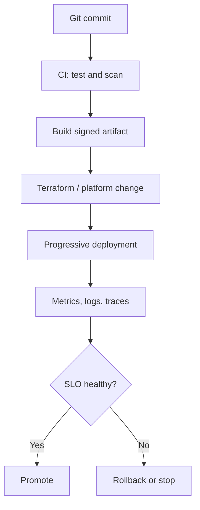

## 2. Kubernetes reconciliation

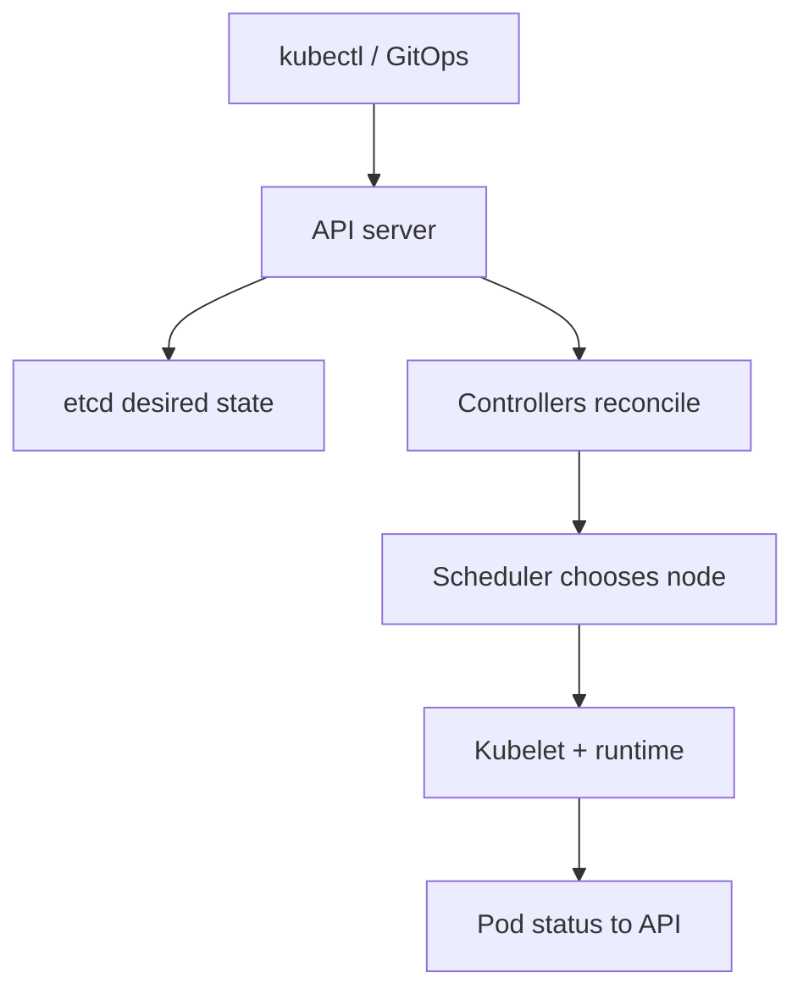

## 3. Network troubleshooting path

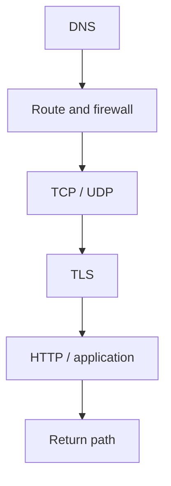

## 4. Docker multi-stage build

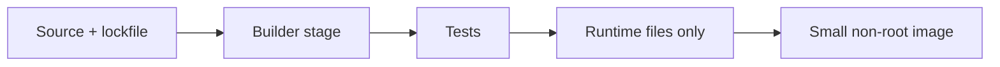

## 5. AWS highly available web service

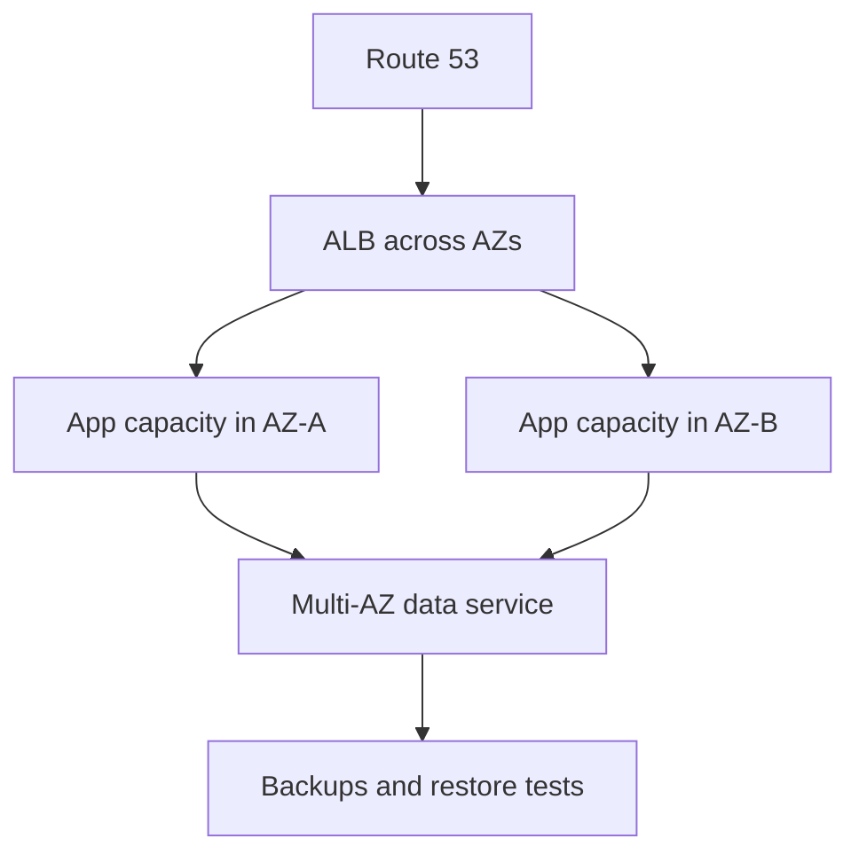

## 6. Terraform controlled change

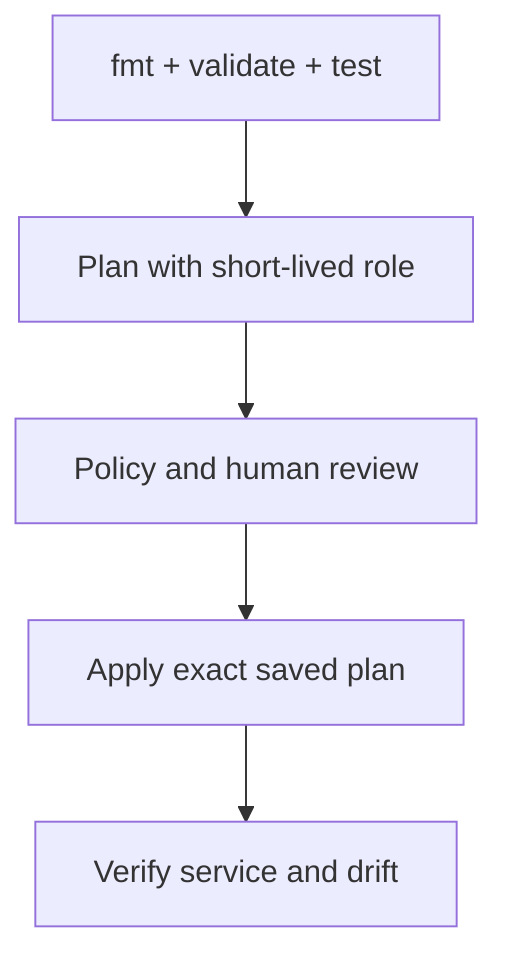

## 7. Airflow task lifecycle

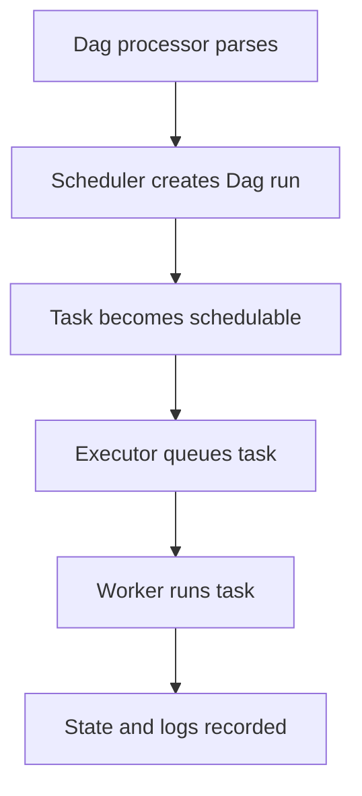

## 8. Observability correlation

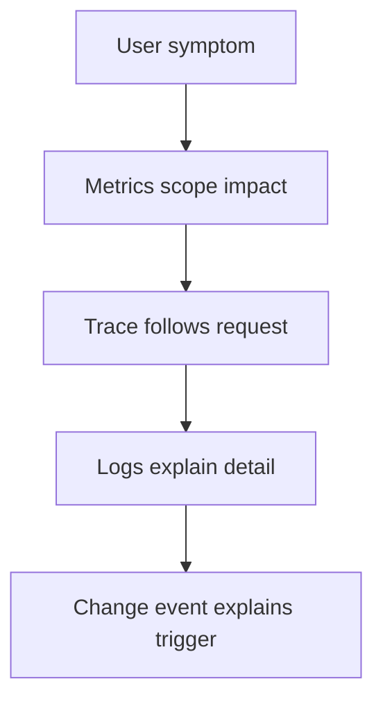

## 9. Incident response

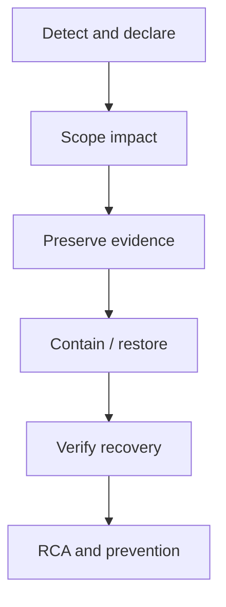

## 10. Event-driven AWS pattern

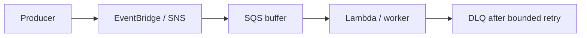

## 11. Secret delivery

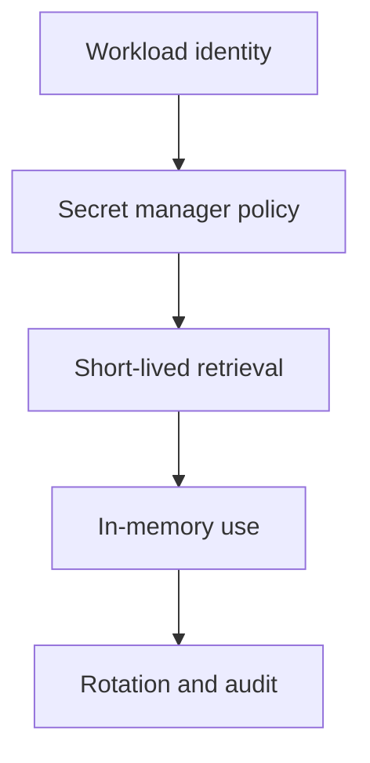

## 12. Progressive deployment decision

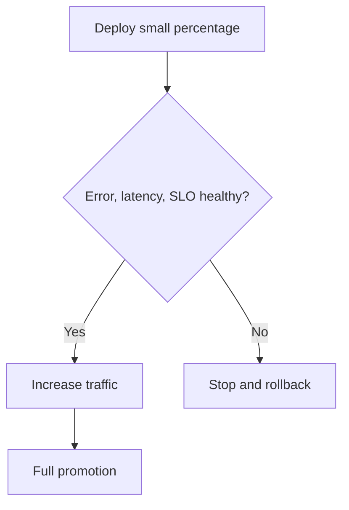


---

# Quick Command and Interview Cheatsheets

## Universal senior troubleshooting pattern

1. State the user or business impact.
2. Narrow scope: one request, Pod, node, AZ, account, or version.
3. Build a UTC timeline and check recent changes.
4. Collect evidence before restarting or deleting.
5. Make the smallest safe reversible change.
6. Verify with the original failing test and service SLO.
7. Record prevention, owner, and due date.

## Essential commands by module

### Linux

- **Linux filesystem and inodes:** `df -hT; df -i; du -xhd1 /var | sort -h`
- **Users, groups, and permissions:** `id appuser; namei -l /srv/app/config.yml; getfacl /srv/app/config.yml`
- **Processes, signals, and file descriptors:** `ps -eo pid,ppid,stat,%cpu,%mem,cmd --sort=-%cpu; lsof -p PID; kill -TERM PID`
- **systemd services and journald:** `systemctl status api.service; journalctl -u api.service -b --since '15 min ago'; systemctl cat api.service`
- **CPU, memory, and load troubleshooting:** `uptime; vmstat 1 10; pidstat -dur 1 10; cat /proc/pressure/{cpu,memory,io}`
- **Storage, mounts, LVM, and RAID:** `lsblk -f; findmnt; pvs; vgs; lvs -a -o +devices`
- **Linux network troubleshooting:** `ip -br a; ip route; ss -lntup; dig +short example.com; tcpdump -nn -i any host 10.0.0.10`
- **Shell automation and scheduling:** `bash -n script.sh; shellcheck script.sh; flock -n /run/report.lock ./report.sh`

### Networking

- **OSI and TCP/IP models:** `ip link; ip route get 10.0.2.10; ss -tn; curl -vk https://service`
- **IPv4 addressing, subnetting, and CIDR:** `ipcalc 10.20.4.0/22`
- **DNS resolution and caching:** `dig +trace api.example.com; dig @1.1.1.1 api.example.com A; resolvectl status`
- **TCP and UDP:** `ss -s; tcpdump -nn 'tcp port 443 or udp port 53'`
- **HTTP, HTTPS, and TLS:** `curl -vkI https://api.example.com; openssl s_client -connect api.example.com:443 -servername api.example.com`
- **Routing and NAT:** `ip route get 8.8.8.8; traceroute -n 8.8.8.8; conntrack -L | head`
- **Firewalls, security groups, and ACLs:** `nft list ruleset; iptables-save; nc -vz service.example.com 443`
- **Load balancers and reverse proxies:** `curl -H 'Host: api.example.com' http://LB_IP/health; openssl s_client -connect LB:443 -servername api.example.com`

### Docker

- **Images, containers, and layers:** `docker image inspect IMAGE; docker history --no-trunc IMAGE; docker inspect CONTAINER`
- **Dockerfile instructions and build context:** `docker build --progress=plain -t app:dev .; docker buildx du`
- **Container lifecycle, logs, and inspection:** `docker ps -a; docker inspect --format '{{json .State}}' CONTAINER; docker logs --since 15m CONTAINER`
- **Docker networking and published ports:** `docker network inspect NETWORK; docker port CONTAINER; docker exec CONTAINER ss -lntp`
- **Volumes, bind mounts, and persistence:** `docker volume ls; docker inspect --format '{{json .Mounts}}' CONTAINER`
- **Docker Compose:** `docker compose config; docker compose up -d; docker compose ps; docker compose logs -f --tail=100`
- **Multi-stage builds and BuildKit:** `DOCKER_BUILDKIT=1 docker build --target runtime -t app:1.0 .; docker buildx build --platform linux/amd64,linux/arm64 .`
- **Registries, tags, and digests:** `docker pull repo/app:1.4; docker image inspect repo/app:1.4 --format '{{index .RepoDigests 0}}'; docker manifest inspect repo/app:1.4`

### Kubernetes

- **Cluster architecture and control plane:** `kubectl get --raw='/readyz?verbose'; kubectl get events -A --sort-by=.lastTimestamp`
- **Pods and multi-container patterns:** `kubectl describe pod POD; kubectl logs POD -c CONTAINER --previous; kubectl debug -it POD --image=busybox`
- **Deployments and ReplicaSets:** `kubectl rollout status deploy/api; kubectl rollout history deploy/api; kubectl rollout undo deploy/api`
- **StatefulSets:** `kubectl get sts,pod,pvc; kubectl rollout status sts/database; kubectl get endpointslice -l kubernetes.io/service-name=db-headless`
- **DaemonSets:** `kubectl get ds -A; kubectl describe ds fluent-bit; kubectl rollout status ds/fluent-bit`
- **Jobs and CronJobs:** `kubectl get cronjob,job,pod; kubectl create job --from=cronjob/nightly nightly-manual`
- **Services and cluster DNS:** `kubectl get svc,endpointslice; kubectl run netshoot --rm -it --image=nicolaka/netshoot -- sh`
- **Ingress and Gateway routing:** `kubectl describe ingress api; curl -vk -H 'Host: api.example.com' https://LB_IP/health`

### AWS

- **IAM users, roles, and policy evaluation:** `aws sts get-caller-identity; aws iam simulate-principal-policy --policy-source-arn ARN --action-names s3:GetObject`
- **EC2, launch templates, and Auto Scaling:** `aws ec2 describe-instance-status --include-all-instances; aws autoscaling describe-scaling-activities --auto-scaling-group-name ASG`
- **VPCs, subnets, routes, internet and NAT gateways:** `aws ec2 describe-route-tables --filters Name=association.subnet-id,Values=SUBNET; aws ec2 describe-flow-logs`
- **Security groups and network ACLs:** `aws ec2 describe-security-groups --group-ids SG_ID; aws ec2 start-network-insights-analysis --network-insights-path-id PATH`
- **Application and Network Load Balancers:** `aws elbv2 describe-target-health --target-group-arn ARN; aws elbv2 describe-rules --listener-arn ARN`
- **Route 53 and CloudFront:** `aws route53 list-resource-record-sets --hosted-zone-id ZONE; aws cloudfront get-distribution --id ID`
- **Amazon S3:** `aws s3api head-object --bucket BUCKET --key KEY; aws s3api get-public-access-block --bucket BUCKET`
- **RDS and Aurora:** `aws rds describe-db-instances --db-instance-identifier DB; aws rds describe-events --source-identifier DB --source-type db-instance`

### Terraform

- **Terraform workflow, providers, and resources:** `terraform fmt -check -recursive; terraform init; terraform validate; terraform plan -out=tfplan; terraform apply tfplan`
- **Variables, locals, outputs, and type constraints:** `terraform console; terraform output -json; terraform validate`
- **References, dependencies, and data sources:** `terraform graph | dot -Tsvg > graph.svg; terraform providers schema -json > schema.json`
- **State, backends, and locking:** `terraform state list; terraform state show ADDRESS; terraform force-unlock LOCK_ID`
- **Modules and reusable design:** `terraform get -update; terraform providers; terraform-docs markdown table ./module`
- **count, for_each, and dynamic blocks:** `terraform console; terraform state list; terraform plan`
- **Lifecycle meta-arguments and replacement:** `terraform plan -replace=RESOURCE.ADDRESS; terraform apply -replace=RESOURCE.ADDRESS`
- **Import, moved, and removed resources:** `terraform plan -generate-config-out=generated.tf; terraform import ADDRESS ID; terraform state show ADDRESS`

### Python

- **Types, control flow, and truthiness:** `python -m compileall src; python -c 'print(bool([]), bool([0]))'`
- **Functions, scope, and arguments:** `python -m inspect module:function`
- **Collections, comprehensions, iterators, and generators:** `python -c 'print(sum(x*x for x in range(1000000)))'`
- **Classes, dataclasses, and composition:** `python -m pydoc dataclasses`
- **Exceptions and context managers:** `python -c 'from contextlib import closing'`
- **Files, JSON, HTTP APIs, and automation:** `python -m json.tool input.json; curl -sS -D- https://api.example.com/health`
- **Logging, CLI design, and configuration:** `python -m yourtool --help; python -m yourtool --log-level INFO`
- **Testing, packaging, and virtual environments:** `python -m venv .venv; python -m pip install -e .; python -m unittest; python -m build`

### Apache Airflow and DAGs

- **Airflow architecture and DAG model:** `airflow dags list; airflow jobs check --job-type SchedulerJob; airflow config list`
- **Tasks, operators, TaskFlow, hooks, and providers:** `airflow tasks test DAG_ID TASK_ID 2026-08-01; airflow providers list`
- **Scheduling, data intervals, catchup, and timetables:** `airflow dags next-execution DAG_ID; airflow dags list-runs -d DAG_ID`
- **XCom, Params, Variables, and Connections:** `airflow connections get CONN_ID; airflow variables get KEY`
- **Retries, trigger rules, sensors, and deferrable tasks:** `airflow tasks states-for-dag-run DAG_ID RUN_ID; airflow jobs check --job-type TriggererJob`
- **Executors and worker scaling:** `airflow config get-value core executor; airflow celery status`
- **Pools, concurrency, priority, and backpressure:** `airflow pools list; airflow dags details DAG_ID`
- **Production deployment, security, and secrets:** `airflow db check; airflow config get-value secrets backend; airflow version`

### CI/CD and Git

- **Git commits, branches, merge, rebase, and recovery:** `git log --oneline --graph --decorate --all; git reflog; git bisect start`
- **Pipeline stages, jobs, dependencies, and rules:** `gitlab-ci-lint .gitlab-ci.yml; echo $CI_PIPELINE_SOURCE`
- **Jenkins declarative and scripted pipelines:** `jenkinsfile-runner -w JENKINS_HOME -f Jenkinsfile`
- **GitLab CI runners and reusable configuration:** `gitlab-runner verify; gitlab-runner list`
- **Artifacts, caches, packages, and container registries:** `sha256sum artifact.tar.gz; docker inspect --format '{{index .RepoDigests 0}}' IMAGE`
- **Secrets, OIDC, and deployment identity:** `aws sts get-caller-identity; env | sed 's/=.*$/=<redacted>/'`
- **Testing, quality gates, and security scanning:** `pytest -q; terraform validate; trivy image IMAGE; semgrep --config auto`
- **Deployment strategies and environment promotion:** `kubectl rollout status deploy/api; kubectl rollout undo deploy/api`

### Monitoring and Observability

- **Metrics, logs, traces, and events:** `curl -s localhost:9090/metrics; journalctl --since '10 min ago'; traceparent='00-...';`
- **Prometheus data model and scraping:** `curl -s http://prometheus:9090/api/v1/targets; promtool check config prometheus.yml`
- **Metric types and PromQL:** `promtool query instant http://prometheus:9090 'sum(rate(http_requests_total[5m]))'`
- **Alerting and Alertmanager:** `promtool check rules alerts.yml; amtool alert query; amtool silence query`
- **Grafana dashboards and operational views:** `curl -s -H 'Authorization: Bearer TOKEN' https://grafana.example.com/api/health`
- **OpenTelemetry instrumentation and Collector:** `otelcol --config config.yaml --dry-run; curl -s localhost:13133/`
- **SLIs, SLOs, SLAs, and error budgets:** `good=99900; total=100000; awk -v g=$good -v t=$total 'BEGIN{print 100*g/t}'`
- **Golden signals, RED, and USE methods:** `kubectl top pods; curl -s localhost:9090/api/v1/query?query='rate(http_requests_total%5B5m%5D)'`

### DevSecOps and Security

- **Least privilege, identity, and Zero Trust:** `aws sts get-caller-identity; kubectl auth can-i --list --as=IDENTITY`
- **Secrets management, encryption, and rotation:** `git grep -nE '(password|secret|token)'; aws secretsmanager describe-secret --secret-id SECRET`
- **SAST and secure code review:** `semgrep --config auto --sarif --output sast.sarif .`
- **DAST and runtime security testing:** `zap-baseline.py -t https://staging.example.com -r zap.html`
- **SCA, SBOMs, licenses, and dependency risk:** `syft IMAGE -o cyclonedx-json > sbom.json; grype sbom:sbom.json`
- **Container image and runtime security:** `docker scout cves IMAGE; docker inspect IMAGE; cosign verify IMAGE@DIGEST`
- **Kubernetes security controls:** `kubectl auth can-i --list --as=system:serviceaccount:ns:app; kubectl get pods -A -o json | jq '..|.privileged? // empty'`
- **CI/CD and software supply-chain security:** `cosign sign IMAGE@DIGEST; cosign verify IMAGE@DIGEST; sha256sum ARTIFACT`

## Interview answer structures

### Concept question

**Definition → why it matters → small example → limitation or trade-off.**

### Troubleshooting question

**Impact → scope → evidence → hypothesis → safe action → verification → prevention.**

### Architecture question

**Requirements → components → data/traffic flow → failure modes → security → observability → cost → recovery.**


---

# Official References

The questions and explanations are original summaries based on official or primary documentation. They are not copied question banks. Links were verified on 2026-08-04. Always check the version used by the target employer.

1. https://airflow.apache.org/docs/apache-airflow/stable/administration-and-deployment/pools.html
2. https://airflow.apache.org/docs/apache-airflow/stable/administration-and-deployment/scheduler.html
3. https://airflow.apache.org/docs/apache-airflow/stable/best-practices.html
4. https://airflow.apache.org/docs/apache-airflow/stable/core-concepts/executor/index.html
5. https://airflow.apache.org/docs/apache-airflow/stable/core-concepts/index.html
6. https://airflow.apache.org/docs/apache-airflow/stable/core-concepts/overview.html
7. https://airflow.apache.org/docs/apache-airflow/stable/security/security_model.html
8. https://cheatsheetseries.owasp.org/cheatsheets/CI_CD_Security_Cheat_Sheet.html
9. https://cheatsheetseries.owasp.org/cheatsheets/Secrets_Management_Cheat_Sheet.html
10. https://cheatsheetseries.owasp.org/cheatsheets/Secure_Code_Review_Cheat_Sheet.html
11. https://cheatsheetseries.owasp.org/cheatsheets/Software_Supply_Chain_Security_Cheat_Sheet.html
12. https://developer.hashicorp.com/terraform/cli
13. https://developer.hashicorp.com/terraform/language
14. https://developer.hashicorp.com/terraform/language/import
15. https://developer.hashicorp.com/terraform/language/modules
16. https://developer.hashicorp.com/terraform/language/state
17. https://developer.hashicorp.com/terraform/language/state/locking
18. https://developer.hashicorp.com/terraform/language/tests
19. https://docs.aws.amazon.com/AWSEC2/latest/UserGuide/concepts.html
20. https://docs.aws.amazon.com/AmazonCloudWatch/latest/monitoring/WhatIsCloudWatch.html
21. https://docs.aws.amazon.com/AmazonECS/latest/developerguide/Welcome.html
22. https://docs.aws.amazon.com/AmazonRDS/latest/UserGuide/Welcome.html
23. https://docs.aws.amazon.com/AmazonS3/latest/userguide/Welcome.html
24. https://docs.aws.amazon.com/IAM/latest/UserGuide/best-practices.html
25. https://docs.aws.amazon.com/Route53/latest/DeveloperGuide/Welcome.html
26. https://docs.aws.amazon.com/amazondynamodb/latest/developerguide/Introduction.html
27. https://docs.aws.amazon.com/decision-guides/latest/sns-or-sqs-or-eventbridge/sns-or-sqs-or-eventbridge.html
28. https://docs.aws.amazon.com/eks/latest/userguide/what-is-eks.html
29. https://docs.aws.amazon.com/elasticloadbalancing/latest/userguide/what-is-load-balancing.html
30. https://docs.aws.amazon.com/kms/latest/developerguide/overview.html
31. https://docs.aws.amazon.com/lambda/latest/dg/welcome.html
32. https://docs.aws.amazon.com/organizations/latest/userguide/orgs_introduction.html
33. https://docs.aws.amazon.com/vpc/latest/userguide/what-is-amazon-vpc.html
34. https://docs.aws.amazon.com/wellarchitected/latest/framework/welcome.html
35. https://docs.docker.com/build/building/best-practices/
36. https://docs.docker.com/compose/
37. https://docs.docker.com/engine/network/
38. https://docs.docker.com/engine/security/
39. https://docs.docker.com/engine/storage/
40. https://docs.docker.com/get-started/docker-overview/
41. https://docs.gitlab.com/ci/
42. https://docs.python.org/3/howto/logging.html
43. https://docs.python.org/3/library/
44. https://docs.python.org/3/library/asyncio.html
45. https://docs.python.org/3/library/unittest.html
46. https://docs.python.org/3/tutorial/
47. https://git-scm.com/docs
48. https://grafana.com/docs/grafana/latest/
49. https://kubernetes.io/docs/concepts/
50. https://kubernetes.io/docs/concepts/security/
51. https://kubernetes.io/docs/concepts/services-networking/
52. https://kubernetes.io/docs/concepts/storage/
53. https://kubernetes.io/docs/concepts/workloads/
54. https://kubernetes.io/docs/tasks/administer-cluster/
55. https://kubernetes.io/docs/tasks/debug/
56. https://man7.org/linux/man-pages/
57. https://man7.org/linux/man-pages/man7/cgroups.7.html
58. https://man7.org/linux/man-pages/man7/namespaces.7.html
59. https://opentelemetry.io/docs/what-is-opentelemetry/
60. https://owasp.org/www-project-web-security-testing-guide/
61. https://prometheus.io/docs/alerting/latest/overview/
62. https://prometheus.io/docs/introduction/overview/
63. https://prometheus.io/docs/practices/naming/
64. https://www.freedesktop.org/software/systemd/man/systemd.html
65. https://www.jenkins.io/doc/book/pipeline/
66. https://www.rfc-editor.org/rfc/rfc1035.html
67. https://www.rfc-editor.org/rfc/rfc2663.html
68. https://www.rfc-editor.org/rfc/rfc4632.html
69. https://www.rfc-editor.org/rfc/rfc8446.html
70. https://www.rfc-editor.org/rfc/rfc9110.html
71. https://www.rfc-editor.org/rfc/rfc9293.html

## Version notes

- Kubernetes documentation changes with each release; confirm API removals and version skew for the interview environment.
- Apache Airflow stable documentation was at the 3.x generation when this guide was created; Airflow 2 deployments can differ in Dag processing, API, and execution architecture.
- AWS services and quotas evolve; use the current account and Region documentation for production decisions.
- Terraform behavior also depends on provider versions recorded in the dependency lock file.
